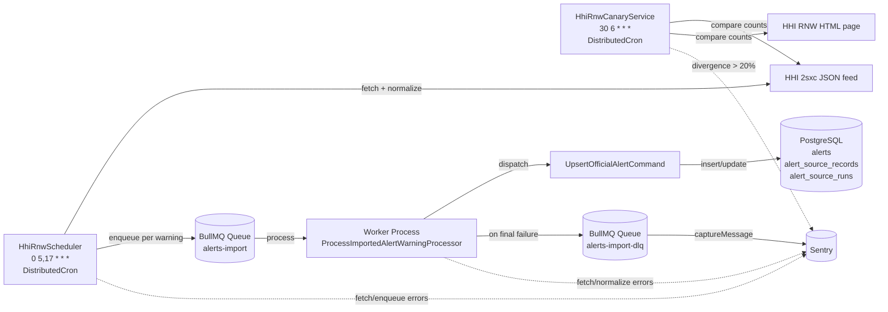

# Alerts (Navigation Alerts)

## Overview

The Alerts module lets any authenticated user file a navigation-relevant
alert — an obstruction, regatta, diving area, military exercise, etc. — and
exposes them as map-renderable items through the unified `/v1/map/items`
endpoint.

The module also ingests official Croatian HHI Radio Navigational Warnings
twice per day through a dedicated import worker, with full source
attribution and cancellation linkage. See
[Official-Source Imports (HHI RNW)](#official-source-imports-hhi-rnw).

Admin permissions are enforced inline on the standard CRUD endpoints — see
[Authorization](#authorization).

## Endpoints

| Method   | Path                   | Description                                          |
| -------- | ---------------------- | ---------------------------------------------------- |
| `GET`    | `/v1/alerts`           | List non-deleted alerts (optionally viewport-bound). |
| `GET`    | `/v1/alerts/{alertId}` | Get one alert by id.                                 |
| `POST`   | `/v1/alerts`           | Create an alert as the authenticated user.           |
| `PUT`    | `/v1/alerts/{alertId}` | Replace editable fields of an alert.                 |
| `DELETE` | `/v1/alerts/{alertId}` | Soft-delete an alert.                                |

Full schemas: [`openapi.yaml`](../openapi.yaml) (paths `/alerts` and
`/alerts/{alertId}`).

## Authorization

All endpoints require the same JWT authentication used by the rest of the
API. The role guard is enforced inline by the handlers — there are no separate
`/admin/alerts` endpoints.

- Any authenticated user can `POST /v1/alerts`.
- On create the server stamps `source = 'user'` and
  `sourceId = <authenticated user id>`.
- **`PUT` / `DELETE` ownership rules**
  - A user with the `admin` role may update or delete **any** alert through
    the standard `PUT /v1/alerts/{alertId}` and `DELETE /v1/alerts/{alertId}`
    endpoints.
  - A non-admin user may only update or delete an alert where
    `source = 'user'` and `source_id = <authenticated user id>`.
  - A non-admin user attempting to update or delete somebody else's alert
    receives `403 application/problem+json`
    (`type: /errors/alert-forbidden`).
- Official-import alerts (`source != 'user'`) have `source_id = null` and
  can only be modified by admins. The import worker writes them through a
  dedicated official-import command — never through the user CRUD path.

## Localization

### Write requests (`POST`, `PUT`)

- If the `Content-Language` header is present, its primary tag is stored on
  `alerts.language` (e.g. `pl`).
- If the header is missing, the language is stored as `en`. This applies to
  **both** `POST` and `PUT` — `PUT` does **not** inherit the previously stored
  value.
- The request body `content` is stored as-is in `alerts.content`. There is no
  translation step.

### Read requests (`GET /v1/alerts`, `GET /v1/alerts/{alertId}`)

- The stored `content` and `language` are returned as-is. There are no
  per-alert translations.
- The `attributes` object is returned as-is and is never localized. See
  [Author attribute (`attributes.user`)](#author-attribute-attributesuser).

### Read requests (`GET /v1/map/items`)

- `attributes.content` and `attributes.language` follow the same as-is rule.
- The map item `name` field is a short label derived from the alert category
  and **is** localized via `nestjs-i18n` against the request `Accept-Language`
  header. Translation keys live under `src/i18n/<lang>/alerts.json`
  (`CATEGORY_LABEL_<CATEGORY>`). English and Polish translations are bundled
  for every category.

## Geometry and Anchor

Alerts support optional GeoJSON geometry — `Point`, `MultiPoint`, `Polygon`,
or `MultiPolygon`. Coordinates use the GeoJSON `[lng, lat]` order; rings must
be closed; rings must contain at least four positions (including the closing
position); WGS84 ranges are required.

`MultiPoint` is supported across the alerts surface (database constraint,
validator, mapper, REST responses, and map responses). HHI imports use it
when a warning lists several disjoint **point** locations (with no `AREA
BOUNDED BY` phrasing); user-created alerts may use it freely.

When `geometry` is set, the server also computes an `anchor` Point used for
marker placement, radius filtering, distance display, and clustering:

- For `Point` geometries the anchor equals the geometry.
- For `MultiPoint`, `Polygon`, and `MultiPolygon` the anchor is
  `ST_PointOnSurface(geometry)` — guaranteed to lie on or inside the
  geometry.
- When `geometry` is omitted or `null`, the anchor is `null` too. The alert
  is then non-geolocated and **never** appears in `/v1/map/items`. It is
  still returned by `/v1/alerts` (when no spatial filter is requested).

### Coordinate format duality (important!)

Within a single response, two coordinate conventions coexist intentionally:

| Field      | Shape                                  | Why                                                                                      |
| ---------- | -------------------------------------- | ---------------------------------------------------------------------------------------- |
| `geometry` | GeoJSON `[lng, lat]` array convention. | Stays a valid GeoJSON object — drop-in usable by any map library.                        |
| `anchor`   | `{ lat, lng }` object convention.      | Matches the established `coordinates` shape used by `/map/items` and `/spots`, `/posts`. |

Clients **must** read each field according to its own convention — do not
swap `lat` and `lng` defensively.

## Author Attribute (`attributes.user`)

Every alert response carries an `attributes` object that exposes
source-derived, ready-to-render metadata. Today it holds a single optional
key, `user`, so clients can draw the author of a user-filed alert without a
second request to `/v1/users/{id}`.

- The `attributes` object is **always present** on every alert read
  (`GET /v1/alerts`, `GET /v1/alerts/{alertId}`), on the create/replace
  responses (`POST` / `PUT`), and on each `navigation_alert` map item
  (`GET /v1/map/items`).
- When `source = 'user'`, `attributes.user` is the author projection:

  | Field       | Type             | Notes                                          |
  | ----------- | ---------------- | ---------------------------------------------- |
  | `id`        | `uuid`           | The author's user id (equals `sourceId`).      |
  | `name`      | `string`         | The author's display name.                     |
  | `avatarUrl` | `string \| null` | Absolute avatar URL, or `null` when no avatar. |

- When `source` is anything other than `user` (e.g. `hhi_rnw` official
  imports), the `user` key is **omitted entirely** — `attributes` is simply
  `{}`. Official-source attribution continues to live under
  `sourceAttributes`, not `attributes.user`.
- If a user-owned alert's author can no longer be resolved (e.g. the account
  was hard-deleted) the `user` key is likewise omitted rather than returned
  with empty fields.

Example `attributes` for a user-filed alert:

```json
{
  "user": {
    "id": "019dfd19-ddd8-7d23-a1f4-06b96c16a36e",
    "name": "Jan K.",
    "avatarUrl": "https://cdn.example/avatars/abc.jpg"
  }
}
```

## Validity Window

Every alert carries an optional validity window expressed by two
nullable `timestamptz` columns, surfaced as ISO8601 `validFrom` /
`validTo` on every read:

- Both fields are **optional** on `POST` and `PUT`.
- When `validFrom` is omitted, the server stamps the **current time**.
- When `validTo` is omitted, the server derives it from `validFrom`
  plus a **hard-coded per-category duration** (no environment
  configuration). The first matching rule wins:

  | Category                                                     | Default duration |
  | ------------------------------------------------------------ | ---------------- |
  | `weather`                                                    | 24 hours         |
  | `navtex`, `regatta`, `diving`, `military_exercise`           | 7 days           |
  | `navigation_warning`, `notice_to_mariners`, `works`, `other` | 30 days          |
  | `obstruction`                                                | 90 days          |

  Durations live in
  `src/modules/alerts/services/alert-validity.service.ts`
  (`ALERT_VALIDITY_DURATION_MS`).

- `PUT` is a full replacement: the window is **recomputed** from the
  request (applying the same defaulting), not inherited from the stored
  row.
- For official imports the worker seeds the window from the source data
  when present — the warning's publish date becomes `validFrom` and its
  expiry date becomes `validTo`. Missing source values fall back to the
  same defaulting rules above.

The window drives two read paths:

- `GET /v1/alerts` accepts optional `validFrom` / `validTo` **overlap**
  filters (see [Query Conventions](#query-conventions)).
- `GET /v1/map/items` shows **only alerts that are valid right now**
  (`valid_from <= now()` and `valid_to >= now()`); a `null` bound counts
  as open-ended. Expired or not-yet-started alerts are hidden from the map
  but remain retrievable through `GET /v1/alerts`.

## Viewport Filtering

`GET /v1/alerts` accepts an optional viewport filter via the `north`,
`south`, `east`, `west` query parameters. All four must be provided together
(`422 application/problem+json`,
`type: /errors/invalid-alert-viewport`, otherwise).

- `north > south` is required.
- When `west > east`, the viewport is treated as crossing the antimeridian
  and is split into two envelopes — `[west, 180]` and `[-180, east]` — that
  are union-queried. This mirrors the existing splitting logic used by
  `/v1/map/items`.
- When a viewport filter is present, only alerts whose `geometry`
  intersects it are returned. Non-geolocated alerts are excluded.
- When no viewport filter is present, both geolocated and non-geolocated
  alerts are returned.

## Query Conventions

- **Repeated multi-value filters.** `category` accepts the repeated-parameter
  form, matching the established `/posts` convention:
  - `?category=weather&category=obstruction`
  - Comma-separated values are **not** supported.
- **Validity-window overlap filters.** `validFrom` and `validTo` (both
  optional ISO8601) filter by **overlap**: a row is returned when its
  stored `[validFrom, validTo]` window overlaps the requested
  `[validFrom, validTo]` window.
  - `?validFrom=2026-06-01T00:00:00Z` keeps alerts whose
    `valid_to >= 2026-06-01` (i.e. not already ended).
  - `?validTo=2026-06-30T00:00:00Z` keeps alerts whose
    `valid_from <= 2026-06-30` (i.e. already started).
  - Supplying both returns alerts active at any point inside that window.
  - A `null` stored bound is treated as open-ended on that side.
- **Offset pagination.** Like the rest of the API, `/v1/alerts` is offset-
  paged. Response shape:

  ```json
  {
    "data": [
      /* AlertResponse[] */
    ],
    "meta": { "total": 123, "limit": 50, "offset": 0, "hasMore": true }
  }
  ```

  `limit` defaults to `50` and is bounded to `[1, 100]`. `offset` defaults to
  `0`.

There is no `source` query filter today. User-created alerts have
`source = 'user'`; official imports (e.g. `source = 'hhi_rnw'`) carry their
public attribution under `sourceAttributes` and `sourceId` is `null` for
those rows.

## Sample Payloads

### `POST /v1/alerts`

```http
POST /v1/alerts
Authorization: Bearer …
Content-Type: application/json
Content-Language: en

{
  "category": "weather",
  "content": "Strong bora expected near Velebit channel.",
  "geometry": {
    "type": "Point",
    "coordinates": [15.12, 44.71]
  }
}
```

Successful response (`201 Created`):

```json
{
  "id": "019dfd19-ddd8-7d23-a1f4-06b96c16a36d",
  "category": "weather",
  "content": "Strong bora expected near Velebit channel.",
  "language": "en",
  "source": "user",
  "sourceId": "019dfd19-ddd8-7d23-a1f4-06b96c16a36e",
  "sourceAttributes": null,
  "attributes": {
    "user": {
      "id": "019dfd19-ddd8-7d23-a1f4-06b96c16a36e",
      "name": "Jan K.",
      "avatarUrl": "https://cdn.example/avatars/abc.jpg"
    }
  },
  "geometry": {
    "type": "Point",
    "coordinates": [15.12, 44.71]
  },
  "anchor": { "lat": 44.71, "lng": 15.12 },
  "validFrom": "2030-01-01T12:00:00Z",
  "validTo": "2030-01-02T12:00:00Z",
  "createdAt": "2030-01-01T12:00:00Z",
  "updatedAt": "2030-01-01T12:00:00Z"
}
```

### `PUT /v1/alerts/{alertId}`

`PUT` is a full replacement of editable fields (`category`, `content`,
`geometry`):

- A missing `geometry` clears `geometry` and `anchor` (the alert becomes
  non-geolocated).
- A new `geometry` triggers anchor recomputation
  (`ST_PointOnSurface` for polygons/multipoints; identity for `Point`).
- `Content-Language` follows the same default-to-`en` rule as `POST`.

### `DELETE /v1/alerts/{alertId}`

Soft-deletes the alert (`deleted_at` timestamp). Returns `204 No Content`.
Deleted alerts are excluded from `/v1/alerts`, `/v1/alerts/{alertId}`, and
`/v1/map/items`.

## Error Types

| Type                             | HTTP | When                                                                                      |
| -------------------------------- | ---: | ----------------------------------------------------------------------------------------- |
| `/errors/alert-not-found`        |  404 | Alert id does not exist or has been soft-deleted.                                         |
| `/errors/alert-forbidden`        |  403 | A non-admin non-owner tried to `PUT`/`DELETE` somebody else's alert.                      |
| `/errors/invalid-alert-geometry` |  422 | Geometry type is unsupported, coordinates are out of range, or polygon rings are invalid. |
| `/errors/invalid-alert-viewport` |  422 | Only some viewport edges were supplied, or `north <= south`.                              |
| `/errors/validation`             |  422 | DTO-level validation rejection (missing `category`, empty `content`, etc.).               |

Errors are returned as `application/problem+json` (RFC 7807) with the
`Content-Language` header set to the resolved request language.

## Map Integration

When `GET /v1/map/items` is called with `types=navigation_alert` (or
without an explicit `types` parameter — `navigation_alert` is in the default
set), the response includes alert map items shaped like every other map
entry: `kind`, `type=navigation_alert`, `id`, `name`, `coordinates`,
`geometry`, and an `attributes` object containing `category`, `content`,
`language`, `source`, nullable `sourceId`, nullable `sourceAttributes`, and —
for `source='user'` alerts only — the author projection `user`
(`{ id, name, avatarUrl }`). See
[Author attribute (`attributes.user`)](#author-attribute-attributesuser).

Only alerts that are **valid at request time** appear on the map
(`valid_from <= now()` and `valid_to >= now()`, treating a null bound as
open-ended). Expired or not-yet-started alerts are excluded from
`/v1/map/items` but stay retrievable through `GET /v1/alerts`. This is in
addition to the existing `deletedAt IS NULL`, `geometry IS NOT NULL`, and
`anchor IS NOT NULL` requirements.

See [Map](../map/index.md) for clustering, density, detail levels, and the
default-types change announcement.

## Official-Source Imports (HHI RNW)

The Croatian Hydrographic Institute (HHI) publishes Radio Navigational
Warnings for `LOCAL` and `COASTAL - NAVTEX` categories. A dedicated
background importer pulls this feed twice per day, normalizes each warning,
writes it through a single official-import command, and surfaces it on the
public alerts and map endpoints with full source attribution.

For Croatian NAVTEX consumers the relevant live broadcast is Split Radio on
518 kHz (channel Q, English) and 490 kHz (channel F, Croatian); the
backend does not expose those frequencies in responses, but they remain the
authoritative live channel for `category = 'navtex'` warnings. Imported
alerts are informational only and **never** replace official MSI, NAVTEX,
VHF, Notices to Mariners, or voyage planning sources. User-facing safety
disclaimer copy is owned by API consumers, not the backend.

### Architecture



The scheduler runs inside the API process; the worker runs in its own
standalone Nest application (`worker-alerts-import`) like the email,
sailing-brief, and push workers.

### Data Source

| Purpose            | Endpoint                                                                |
| ------------------ | ----------------------------------------------------------------------- |
| Warnings feed      | `https://www.hhi.hr/en/api/2sxc/app/auto/query/RadioNews/SortDesc`      |
| Publish-date probe | `https://www.hhi.hr/api/2sxc/app/auto/api/Pwa/GetPublishDate`           |
| HTML list (canary) | `https://www.hhi.hr/en/e-services/radio-navigational-warnings`          |
| Public attribution | `https://www.hhi.hr/en/e-services/radio-navigational-warnings` (alerts) |

Required request headers on every HHI call:

- `tabid: 193`
- `moduleid: 604`
- `User-Agent: SkipperClub/<package.json version> (+<ALERTS_HHI_CONTACT_EMAIL>)`
- `Accept: application/json` (or `text/html` for the canary HTML probe)
- `Accept-Language: en`

The client throws `HhiRnwFetchException` if `ALERTS_HHI_CONTACT_EMAIL` is
not configured — every live request must carry an identifying return
address because the 2sxc endpoint is undocumented.

### Scheduling

Two `DistributedCron` jobs run inside the API process. Both use Redis
locks so multiple API instances cannot run the same job concurrently.

| Job                   | Expression     | Lock key                          | Lock TTL | Notes                                                                                                             |
| --------------------- | -------------- | --------------------------------- | -------- | ----------------------------------------------------------------------------------------------------------------- |
| `HhiRnwScheduler`     | `0 5,17 * * *` | `lock:cron:alerts-hhi-rnw`        | 10 min   | Twice daily, server-local timezone. Fetches the feed, filters, and enqueues per-warning jobs.                     |
| `HhiRnwCanaryService` | `30 6 * * *`   | `lock:cron:alerts-hhi-rnw-canary` | 10 min   | Compares filtered JSON-feed record count against rendered HTML page count. Emits a Sentry warning on > 20% drift. |

Both jobs honor `ALERTS_HHI_ENABLED`. When disabled (or `NODE_ENV=test`
with the variable unset), both jobs short-circuit before any live HTTP
call.

### Filtering and Windowing

The scheduler applies these rules in order before considering a record
for enqueue:

1. `Published == true`.
2. `Category[].Title` contains one of `LOCAL` or `COASTAL - NAVTEX`.
3. **Year window.** The record's `Year` is the current calendar year **or**
   the record's `Modified` timestamp falls inside a 14-day lookback. The
   lookback exists so previous-year cancellations and late edits still
   reach the importer; the current-year filter prevents the first run
   from importing thousands of historical records.
4. The normalizer accepts the body (non-empty sanitized text, valid
   `Number`/`Year`, etc.).
5. For previous-year cancellation records, the referenced warning must
   already exist in `alert_source_records` — otherwise the cancellation
   is dropped to avoid creating stand-alone alerts for warnings the
   importer never knew about.
6. The scheduler skips records whose `(source_key, external_id |
external_number)` row in `alert_source_records` already has
   `status = processed` with the same `source_hash` as the new payload.
   This guards against re-enqueueing unchanged warnings every cron tick
   once BullMQ's `removeOnComplete: true` has purged the previous job
   id.

### Category Mapping

Matching is case-insensitive and runs against the **uppercased sanitized
plain-text body** combined with `Category[].Title`. The first matching
row wins.

| Order | Trigger                                                                                                 | Alert category       |
| ----- | ------------------------------------------------------------------------------------------------------- | -------------------- |
| 1     | `Category[].Title` matches `COASTAL - NAVTEX` exactly                                                   | `navtex`             |
| 2     | `\b(MILITARY EXERCISE\|FIRING (PRACTICE\|EXERCISE)\|GUNNERY)\b`                                         | `military_exercise`  |
| 3     | `\b(SAILING REGATTA\|REGATTA\|YACHT RACE\|FISHING (COMPETITION\|TOURNAMENT))\b`                         | `regatta`            |
| 4     | `\b(DIVING\|UNDERWATER (ACTIVITIES\|WORKS))\b`                                                          | `diving`             |
| 5     | `\b(WORKS\|MAINTENANCE\|CONSTRUCTION\|CONSTRUCTED\|CABLE LAYING\|DREDG(E\|ING)\|HYDROGRAPHIC SURVEY)\b` | `works`              |
| 6     | `\b(LIGHT UNLIT\|UNLIT\|BUOY (MISSING\|OFF STATION\|UNLIT)\|OBSTRUCTION\|WRECK)\b`                      | `obstruction`        |
| 7     | otherwise                                                                                               | `navigation_warning` |

HHI is not used as a weather source — `weather` is never mapped here.

### Geometry Extraction

The normalizer parses coordinates directly from the warning body:

- Supported coordinate formats:
  - `44-24,364N 014-49,083E`
  - `44-24,364 N 014-49,083 E`
  - `43-31,35 N 016-24,92E`
  - `44º15’24”`
- Output is GeoJSON `[lng, lat]`.
- One pair → `Point`.
- Multiple disjoint pairs with no `AREA BOUNDED BY` phrasing → `MultiPoint`.
- Three or more pairs with exactly one `AREA BOUNDED BY` (or equivalent)
  phrase → `Polygon` after closure and ring validation.
- **Multi-zone bounded records** (two or more `AREA BOUNDED BY` phrases)
  → the alert is stored **without** geometry and the source record
  carries the `multi-zone-not-supported` processing warning. MVP
  intentionally degrades to non-geolocated here rather than risk fusing
  disjoint zones into one misleading polygon; deterministic per-zone
  splitting (and potential `MultiPolygon` output) is deferred to a
  future iteration once a representative multi-zone sample is captured.
- Route language (e.g. `ROUTE SPLIT - SUŠAC ISLAND - SPLIT`),
  `BOUNDED BY` phrasing with fewer than three coordinate pairs, or
  impossible coordinate components (e.g. minutes ≥ 60) → the alert is
  stored **without** geometry with the corresponding processing warning
  (`polygon-too-few-vertices`, `impossible-coordinates`). The alert
  remains discoverable through `GET /alerts` (it is just non-geolocated)
  but does not appear on the map.

### Cancellation Detection

A record is treated as a cancellation when **all** of the following hold:

1. The sanitized body matches `\bCANCEL(LED|LATION)?\b`.
2. The body contains at least one proximity-adjacent
   `(<number>, <2-digit-year>)` reference next to the cancellation verb
   (regex patterns live in
   `src/modules/alerts/sources/hhi-rnw/hhi-rnw-cancellation-parser.ts`)
   that, expanded to `n/20yy`, does **not** equal the record's own
   `Number/Year`.
3. The record is `Published == true`.

The worker:

- Resolves the cancelled alert id by looking up
  `alert_source_records` where
  `(source_key='hhi_rnw', external_number=<cancelledExternalNumber>)`.
- Updates the **referenced** alert's `source_attributes.cancellation`
  (the alert keeps its original source identity; only the cancellation
  block is added). The cancellation record's `alert_id` points at the
  same alert.
- If the referenced warning is unknown, creates a stand-alone non-
  geolocated `navigation_warning` alert so the cancellation notice still
  surfaces publicly.
- Never sets `deleted_at` on imported alerts — cancellation is metadata,
  not deletion.

If the cancellation keyword matches but no proximity number is found
(e.g. "in-force list" broadcasts), the record falls through to a regular
`navigation_warning` import and a Sentry breadcrumb is added.

### Worker (Queues, Retries, DLQ)

The import worker runs as a standalone Nest application
(`AlertsImportWorkerModule`, booted by `src/worker-alerts-import.ts`).
It mirrors the email and sailing-brief worker pattern: own
`ConfigModule`, own `TypeOrmModule.forRootAsync`, own BullMQ
`forRootAsync` connection.

| Queue               | Purpose                                                                                                                |
| ------------------- | ---------------------------------------------------------------------------------------------------------------------- |
| `alerts-import`     | One job per source warning. Job id is `hhi-rnw:<id:<externalId>\|number:<externalNumber>>:<sourceHash>`.               |
| `alerts-import-dlq` | Terminal failures land here after the main queue exhausts retries. `AlertsImportDlqProcessor` logs and reports Sentry. |

Job options on `alerts-import`:

- `attempts: 3`
- exponential backoff starting at 60 s
- `removeOnComplete: true`, `removeOnFail: false`

Worker behavior per job:

1. Re-normalize the payload (stateless — no HHI call needed).
2. Load or create the `alert_source_records` row keyed by
   `(source_key, external_id)` when `external_id` is present, otherwise
   `(source_key, external_number)`. If a previous row exists by number
   without an id and the new payload has one, the id is upgraded in
   place.
3. Short-circuit when the existing row is already `processed` with the
   same `source_hash`.
4. For cancellation records, resolve the referenced alert id.
5. Dispatch `UpsertOfficialAlertCommand` — the single official-import
   write boundary. The user-facing `CreateAlertCommand` is never used.
6. On final retry failure, the job is pushed onto
   `alerts-import-dlq` and the source record is marked `failed`.

### Source Hash and Job-ID Idempotency

`source_hash` is SHA-256 over a normalized payload, **not** raw HTML.
The hash input includes:

- `external_id` (or empty string when absent)
- `external_number`
- `Category[].Title` sorted, `Region[].Title` sorted, `Location`
- HTML body stripped to plain text, whitespace-collapsed,
  Unicode-NFC-normalized (same value stored on `alerts.content`)
- `DatePublished` (ISO8601, UTC)
- `DateExpired` (ISO8601, UTC or empty)

`JSON.stringify` is called with a stable key order so whitespace or
encoding drift in the source never produces a phantom update.

Deterministic BullMQ job id:

```
hhi_rnw__<id__<externalId>|number__<externalNumber>>__<sourceHash>
```

(Separator is `__` because BullMQ rejects `:` in custom job ids — it
collides with Redis key namespacing.)

BullMQ silently drops duplicate enqueues with the same id, so a record
that hasn't changed never runs the worker twice.

### Database Schema

`alerts.source_id` is nullable. User alerts keep
`(source = 'user', source_id = <userId>)`; official imports use
`(source = 'hhi_rnw', source_id = null)` and store public attribution in
`alerts.source_attributes` (JSONB). `alerts.severity` no longer exists.
The geometry constraint on `alerts` accepts `POINT`, `MULTIPOINT`,
`POLYGON`, and `MULTIPOLYGON`. `alerts.valid_from` and `alerts.valid_to`
are nullable `timestamptz` columns holding the
[validity window](#validity-window).

#### `alert_source_runs`

One row per upstream source (currently just `hhi_rnw`). Seeded by the
schema migration so the scheduler always finds a row to update.

| Column                     | Type          | Notes                                          |
| -------------------------- | ------------- | ---------------------------------------------- |
| `id`                       | `uuid`        | UUID v7.                                       |
| `source_key`               | `varchar(50)` | Unique. `hhi_rnw`.                             |
| `country`                  | `char(2)`     | `HR`.                                          |
| `last_started_at`          | `timestamptz` | Last cron start.                               |
| `last_completed_at`        | `timestamptz` | Last cron completion (success or failure).     |
| `last_success_at`          | `timestamptz` | Last successful run.                           |
| `last_source_publish_date` | `timestamptz` | Value from HHI `GetPublishDate`.               |
| `last_source_modified_at`  | `timestamptz` | High-water mark of imported `Modified` values. |
| `last_enqueued_count`      | `integer`     | Counter from last run.                         |
| `last_skipped_count`       | `integer`     | Counter from last run.                         |
| `last_error`               | `text`        | Last failure summary, nullable.                |
| `consecutive_failures`     | `integer`     | Reset to `0` on each successful run.           |
| `created_at`, `updated_at` | `timestamptz` |                                                |

#### `alert_source_records`

One row per upstream warning. Persists `raw_payload` for audit and links
back to the materialized alert through `alert_id`.

| Column                     | Type           | Notes                                              |
| -------------------------- | -------------- | -------------------------------------------------- |
| `id`                       | `uuid`         | UUID v7.                                           |
| `source_key`               | `varchar(50)`  | `hhi_rnw`.                                         |
| `external_id`              | `varchar(100)` | Nullable. HHI internal `Id` when present.          |
| `external_number`          | `varchar(50)`  | `<Number>/<Year>` display value.                   |
| `external_url`             | `text`         | HHI public RNW page URL.                           |
| `source_hash`              | `char(64)`     | SHA-256 of the normalized payload.                 |
| `source_modified_at`       | `timestamptz`  | HHI `Modified`.                                    |
| `source_published_at`      | `timestamptz`  | HHI `DatePublished`.                               |
| `source_expires_at`        | `timestamptz`  | HHI `DateExpired`, nullable.                       |
| `alert_id`                 | `uuid`         | FK to `alerts.id`, `ON DELETE SET NULL`. Nullable. |
| `last_enqueued_at`         | `timestamptz`  | Last enqueue.                                      |
| `last_processed_at`        | `timestamptz`  | Last worker run.                                   |
| `status`                   | `varchar(30)`  | `queued`, `processed`, `skipped`, or `failed`.     |
| `raw_payload`              | `jsonb`        | Original HHI record (full envelope) for audit.     |
| `processing_error`         | `text`         | Last worker error, nullable.                       |
| `created_at`, `updated_at` | `timestamptz`  |                                                    |

Indexes:

- `UQ_alert_source_records_key_number` — `UNIQUE (source_key, external_number)`.
- `UQ_alert_source_records_key_external_id` — partial unique on
  `(source_key, external_id)` where `external_id IS NOT NULL`.
- `idx_alert_source_records_alert_id`,
  `idx_alert_source_records_status`,
  `idx_alert_source_records_modified` for read paths.

### `source_attributes` Shape (HHI)

The **stored** shape on `alerts.source_attributes`:

```ts
interface HhiRnwAlertSourceAttributesStored {
  type: 'hhi_rnw';
  externalSourceName: 'Hydrographic Institute of the Republic of Croatia';
  externalSourceUrl: 'https://www.hhi.hr/en/e-services/radio-navigational-warnings';
  externalId: string | null;
  externalNumber: string;
  externalPublishedAt: string | null;
  externalUpdatedAt: string | null;
  externalExpiresAt: string | null;
  receivedAt: string | null;
  sourceHash: string;
  cancellation?: {
    cancelledExternalNumber: string;
    cancelledAlertId: string | null;
    cancelledByExternalId: string;
  };
}
```

The **public projection** (`AlertSourceAttributesService.project`) drops
internal-only fields (`externalId`, `receivedAt`, `sourceHash`,
`cancelledByExternalId`) and returns:

```ts
interface HhiRnwAlertSourceAttributesPublic {
  type: 'hhi_rnw';
  externalSourceName: 'Hydrographic Institute of the Republic of Croatia';
  externalSourceUrl: 'https://www.hhi.hr/en/e-services/radio-navigational-warnings';
  externalNumber: string;
  externalPublishedAt: string | null;
  externalUpdatedAt: string | null;
  externalExpiresAt: string | null;
  cancellation?: {
    cancelledExternalNumber: string;
    cancelledAlertId: string | null;
  };
}
```

For `source = 'user'`, `source_attributes` is `null` and the public
projection is `null`.

### Sample Imported Alert

```json
{
  "id": "019f12ab-3c12-7a01-b1aa-1234567890ab",
  "category": "military_exercise",
  "content": "MILITARY EXERCISE IN PROGRESS … 44-24,364N 014-49,083E …",
  "language": "en",
  "source": "hhi_rnw",
  "sourceId": null,
  "sourceAttributes": {
    "type": "hhi_rnw",
    "externalSourceName": "Hydrographic Institute of the Republic of Croatia",
    "externalSourceUrl": "https://www.hhi.hr/en/e-services/radio-navigational-warnings",
    "externalNumber": "161/2026",
    "externalPublishedAt": "2026-06-07T10:21:49Z",
    "externalUpdatedAt": "2026-06-07T18:09:21Z",
    "externalExpiresAt": null
  },
  "attributes": {},
  "geometry": {
    "type": "Point",
    "coordinates": [14.81805, 44.40607]
  },
  "anchor": { "lat": 44.40607, "lng": 14.81805 },
  "validFrom": "2026-06-07T10:21:49Z",
  "validTo": "2026-07-07T10:21:49Z",
  "createdAt": "2026-06-07T17:00:00Z",
  "updatedAt": "2026-06-07T17:00:00Z"
}
```

A cancellation broadcast adds the `cancellation` block to
`sourceAttributes`:

```json
{
  "sourceAttributes": {
    "type": "hhi_rnw",
    "externalSourceName": "Hydrographic Institute of the Republic of Croatia",
    "externalSourceUrl": "https://www.hhi.hr/en/e-services/radio-navigational-warnings",
    "externalNumber": "161/2026",
    "externalPublishedAt": "2026-06-07T10:21:49Z",
    "externalUpdatedAt": "2026-06-08T07:00:00Z",
    "externalExpiresAt": null,
    "cancellation": {
      "cancelledExternalNumber": "147/2026",
      "cancelledAlertId": "019f1100-0011-7a01-b1aa-aaaabbbbcccc"
    }
  }
}
```

### Environment Variables

| Variable                   | Required           | Default                               | Notes                                                                                                                                              |
| -------------------------- | ------------------ | ------------------------------------- | -------------------------------------------------------------------------------------------------------------------------------------------------- |
| `ALERTS_HHI_ENABLED`       | No                 | `true` (`false` when `NODE_ENV=test`) | When `false`, both the importer cron and the canary cron short-circuit without any live HTTP call. Set to `false` in CI/E2E so tests stay offline. |
| `ALERTS_HHI_CONTACT_EMAIL` | Yes (when enabled) | —                                     | Embedded in the `User-Agent` string. The HTTP client throws `HhiRnwFetchException` rather than calling HHI without it.                             |
| `REDIS_HOST`               | Yes                | `localhost`                           | BullMQ connection + `DistributedCron` lock store. Shared with the rest of the workers.                                                             |
| `REDIS_PORT`               | Yes                | `6379`                                |                                                                                                                                                    |
| `REDIS_PASSWORD`           | No                 | —                                     |                                                                                                                                                    |

### Running the Import Worker

The worker mirrors the email / push / sailing-brief worker layout. It can
be run standalone or alongside the API server with `start:all`.

```bash
# Development (standalone)
npm run worker:alerts-import:dev

# Production (standalone)
npm run worker:alerts-import

# All workers + API together
npm run start:all:dev   # development
npm run start:all       # production
```

The scheduler and canary crons run in the API process, not the worker —
they emit jobs that the worker consumes. Make sure both processes are
running for end-to-end import.

### Observability and Sentry

Every Sentry capture from the import path carries the tag set
`{ module: 'alerts', source: 'hhi_rnw', operation: <discriminator> }`:

| `operation` | When                                                                                                            |
| ----------- | --------------------------------------------------------------------------------------------------------------- |
| `fetch`     | HTTP, JSON-parse, or envelope-shape failures from `HhiRnwClient`.                                               |
| `cron`      | Unexpected failures inside the scheduler (post-fetch) — `HhiRnwFetchException` is **not** re-captured here.     |
| `normalize` | Per-record normalizer or geometry failure; `extra.externalId` / `extra.externalNumber` are included when known. |
| `enqueue`   | Failure to add a job to BullMQ from inside the scheduler.                                                       |
| `dlq`       | Terminal entry from `AlertsImportDlqProcessor` after a job exhausts retries (Sentry message, not exception).    |
| `canary`    | Canary fetch/parse failures (exception) and divergence > 20% (warning message with `jsonCount`, `htmlCount`).   |

`alert_source_runs` provides the per-run counters
(`last_enqueued_count`, `last_skipped_count`,
`last_source_modified_at`, `consecutive_failures`) for ops dashboards;
there is no public `lastSuccessfulSync` field in the API today.

### Operational Notes

- Imported alerts are **never** auto-deleted. Cancellation records update
  `source_attributes.cancellation` on the referenced alert. Soft-delete
  remains a user-alert capability through `DELETE /v1/alerts/{alertId}` (admin
  override).
- `alerts.deleted_at` exists on the schema and is untouched by the
  importer.
- If a cancellation references a warning that was never imported, the
  worker creates a stand-alone non-geolocated `navigation_warning` alert
  so the cancellation notice still appears publicly.
- The HHI English feed is the only data source for MVP — every imported
  alert has `language = 'en'`.

## Related

- [Alert Categories](../reference/enums/alert-categories.md) — All 10
  category values and the localized marker labels they map to.
- [Alert Ownership Flow](../reference/flows/alert-ownership-flow.md) —
  Owner vs. admin authorization on `PUT`/`DELETE`.
- [Map](../map/index.md) — Unified `/v1/map/items` endpoint that surfaces
  `navigation_alert` items alongside posts, spots, and check-ins.
- [Error Handling](../getting-started/errors.md#alerts-module) — Full
  catalog of alert error slugs.
- [OpenAPI Specification](../openapi.yaml) — Machine-readable schemas for
  `/alerts` and `/alerts/{alertId}`.
