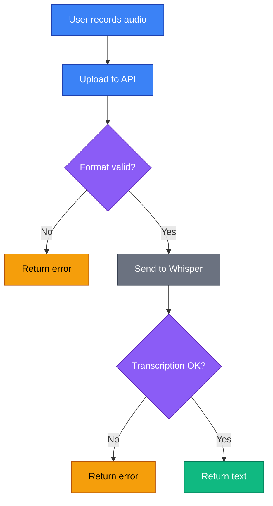
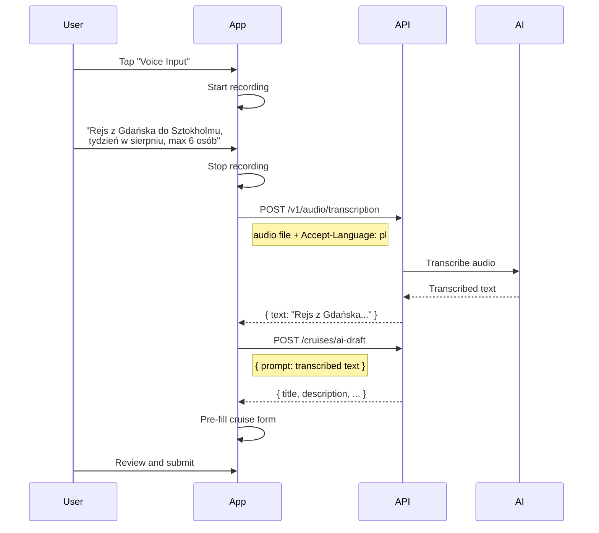

# Audio

The audio API provides speech-to-text transcription for voice input features.

## Overview

SkipperClub's audio transcription enables voice-based content creation:

- **Voice notes** — Record audio instead of typing
- **Quick cruise drafts** — Describe your cruise idea verbally
- **Accessibility** — Support users who prefer voice input

Key features include:

- **Multiple formats** — Support for common audio formats (WebM, MP3, WAV, M4A, OGG)
- **Language detection** — Automatic language detection with hint support
- **Fast processing** — Powered by OpenAI Whisper for accurate transcription
- **Size limit** — Up to 20MB audio files

## Endpoints

| Method | Endpoint                  | Description                   |
| ------ | ------------------------- | ----------------------------- |
| POST   | `/v1/audio/transcription` | Transcribe audio file to text |

---

## Key Concepts

### Supported Audio Formats

| Format | MIME Type                 | Common Use         |
| ------ | ------------------------- | ------------------ |
| WebM   | `audio/webm`              | Browser recordings |
| MP3    | `audio/mpeg`, `audio/mp3` | General audio      |
| WAV    | `audio/wav`               | High quality       |
| M4A    | `audio/mp4`               | Apple devices      |
| OGG    | `audio/ogg`               | Open format        |

### Language Support

The API uses the `Accept-Language` header to hint at the expected language:

| Header                | Language    |
| --------------------- | ----------- |
| `Accept-Language: pl` | Polish      |
| `Accept-Language: en` | English     |
| (none)                | Auto-detect |

While the transcription engine can auto-detect languages, providing a hint improves accuracy, especially for short recordings.

### Size Limits

| Constraint           | Limit           |
| -------------------- | --------------- |
| Maximum file size    | 20 MB           |
| Recommended duration | Up to 5 minutes |

---

## Transcribe Audio

```http
POST /v1/audio/transcription
```

Upload an audio file and receive the transcribed text.

### Request

Content-Type: `multipart/form-data`

| Field   | Type | Required | Description              |
| ------- | ---- | -------- | ------------------------ |
| `audio` | file | Yes      | Audio file to transcribe |

### Headers

| Header            | Value            | Description              |
| ----------------- | ---------------- | ------------------------ |
| `Authorization`   | Bearer token     | Required authentication  |
| `Accept-Language` | `en`, `pl`, etc. | Language hint (optional) |

### Example Request

```http
POST /v1/audio/transcription HTTP/1.1
Host: api.skipperclub.app
Authorization: Bearer <token>
Accept-Language: pl
Content-Type: multipart/form-data; boundary=----FormBoundary

------FormBoundary
Content-Disposition: form-data; name="audio"; filename="recording.webm"
Content-Type: audio/webm

<binary audio data>
------FormBoundary--
```

### Response

```json
{
  "text": "Rejs z Dubrownika do Zadaru w Chorwacji."
}
```

### Response Fields

| Field  | Type   | Description                     |
| ------ | ------ | ------------------------------- |
| `text` | string | Transcribed text from the audio |

---

## Error Handling

All errors follow RFC 7807 Problem Details format:

```json
{
  "type": "/errors/no-audio-provided",
  "title": "No Audio Provided",
  "status": 400,
  "detail": "No audio file was provided in the request"
}
```

### Error Types

| Type                               | Status | Description                                                                                                       |
| ---------------------------------- | ------ | ----------------------------------------------------------------------------------------------------------------- |
| `/errors/no-audio-provided`        | 400    | No audio file in request                                                                                          |
| `/errors/unsupported-audio-format` | 400    | File format not supported                                                                                         |
| `/errors/audio-file-too-large`     | 413    | File exceeds the 20 MB limit; the Go handler reads at most one byte past the cap and returns this RFC 7807 error. |
| `/errors/transcription-failed`     | 502    | Transcription service error                                                                                       |
| `/errors/authentication-required`  | 401    | Missing authentication                                                                                            |

### Example Error Responses

**No audio provided:**

```json
{
  "type": "/errors/no-audio-provided",
  "title": "No Audio Provided",
  "status": 400,
  "detail": "An audio file must be provided for transcription"
}
```

**Unsupported format:**

```json
{
  "type": "/errors/unsupported-audio-format",
  "title": "Unsupported Audio Format",
  "status": 400,
  "detail": "The audio file format is not supported. Please use audio/webm format."
}
```

---

## Transcription Flow



---

## Use Case: Voice Cruise Draft

Users can describe their cruise idea verbally, which is transcribed and used to pre-fill the cruise creation form.



---

## Best Practices

1. **Provide language hint** — Use `Accept-Language` header for better accuracy
2. **Keep recordings short** — Best results with 5 minutes or less
3. **Use appropriate format** — WebM for browsers, M4A (`audio/mp4`) for mobile
4. **Handle errors gracefully** — Show user-friendly messages
5. **Show recording feedback** — Indicate when recording is active
6. **Allow re-recording** — Let users try again if unhappy with result
7. **Review before using** — Show transcribed text for user confirmation

---

## Related

- [Cruises](../cruises/index.md) — Use transcribed text for AI cruise drafts
- [Authentication](../getting-started/authentication.md) — JWT tokens
- [Error Handling](../getting-started/errors.md) — RFC 7807 format
