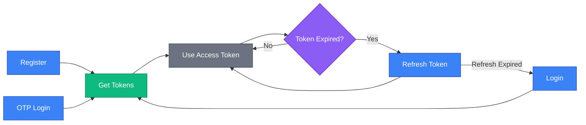
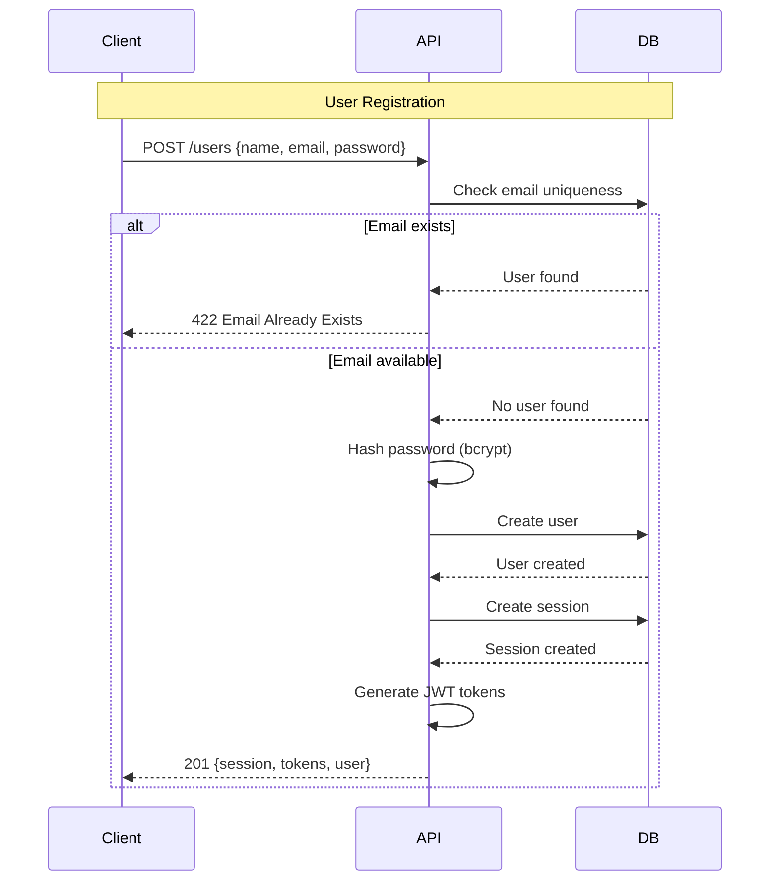
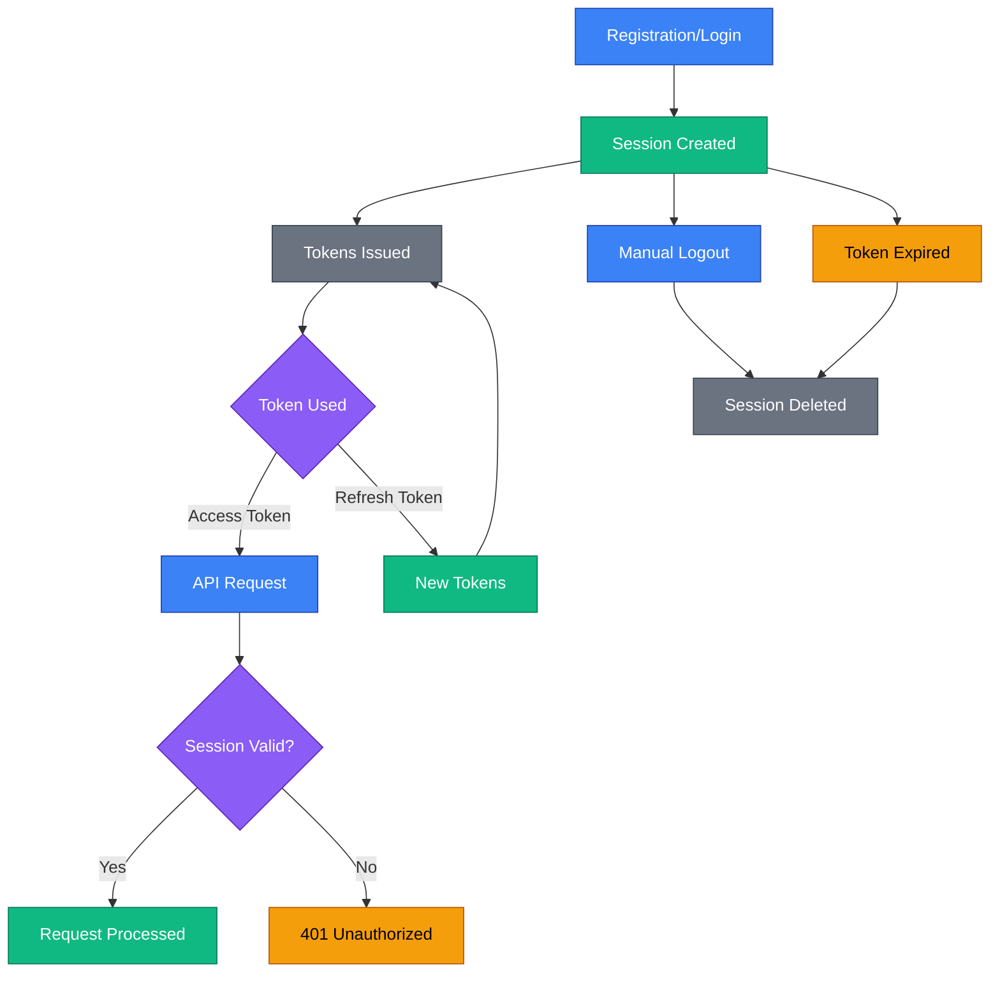
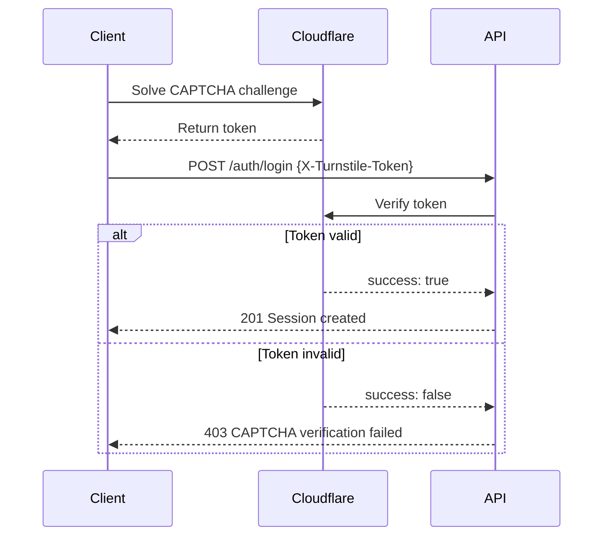

# Authentication

SkipperClub uses JWT (JSON Web Token) authentication with access and refresh tokens. This module covers user registration and advanced session management.

For basic authentication flows (login, token refresh, logout), see [Getting Started: Authentication](../getting-started/authentication.md).

## Overview



## User Registration

Create a new user account and receive authentication tokens in a single request.

### Endpoint

```http
POST /users
```

### Example Request

```http
POST /v1/users HTTP/1.1
Host: api.skipperclub.app
Content-Type: application/json
Accept-Language: en

{
  "name": "Jan Kowalski",
  "email": "jan.kowalski@email.com",
  "password": "SecurePass123!"
}
```

### Parameters

| Field      | Type   | Required | Constraints                                     |
| ---------- | ------ | -------- | ----------------------------------------------- |
| `name`     | string | Yes      | 1-100 characters                                |
| `email`    | string | Yes      | Valid email, max 320 characters, must be unique |
| `password` | string | Yes      | 8-128 characters                                |

### Success Response

**Status:** `201 Created`

**Body:**

```json
{
  "id": "018fa2e4-8e3b-7b2e-8e3b-7b2e8e3b7b2e",
  "accessToken": "eyJhbGciOiJIUzI1NiIsInR5cCI6IkpXVCJ9...",
  "refreshToken": "eyJhbGciOiJIUzI1NiIsInR5cCI6IkpXVCJ9...",
  "expiresIn": 900,
  "user": {
    "id": "018fa2e4-8e3b-7b2e-8e3b-7b2e8e3b7b2e",
    "email": "jan.kowalski@email.com",
    "name": "Jan Kowalski",
    "avatarUrl": null
  }
}
```

> **Note:** User role is included in the JWT payload (access and refresh tokens) but not in the session response body. To retrieve the role, decode the JWT token or use the `GET /profile` endpoint.

| Field          | Description                                         |
| -------------- | --------------------------------------------------- |
| `id`           | Session ID (UUID v7)                                |
| `accessToken`  | JWT for API authorization (15-minute expiry)        |
| `refreshToken` | JWT for obtaining new access tokens (7-day expiry)  |
| `expiresIn`    | Access token lifetime in seconds (900 = 15 minutes) |
| `user`         | Created user information                            |

### Error Responses

**Email Already Exists (422):**

```json
{
  "type": "/errors/email-already-exists",
  "title": "Email Already Exists",
  "status": 422,
  "detail": "A user with this email address already exists"
}
```

**Validation Error (422):**

```json
{
  "type": "/errors/validation",
  "title": "Validation Failed",
  "status": 422,
  "detail": "The request contains invalid data",
  "violations": [
    {
      "propertyPath": "email",
      "message": "email must be a valid email address"
    },
    {
      "propertyPath": "password",
      "message": "password must be longer than or equal to 8 characters"
    }
  ]
}
```

## Registration Flow



## Session Management

### Multiple Device Sessions

Each login or registration creates a new session. Users can have multiple active sessions across devices.

**Session Properties:**

| Property      | Description                        |
| ------------- | ---------------------------------- |
| Session ID    | Unique identifier for the session  |
| User ID       | Owner of the session               |
| Access Token  | Current valid access token         |
| Refresh Token | Current valid refresh token        |
| Expires At    | Refresh token expiration timestamp |
| Created At    | Session creation timestamp         |

### Session Lifecycle



### Token Rotation

When refreshing tokens:

1. Both access and refresh tokens are regenerated
2. Previous tokens are invalidated
3. Session record is updated with new tokens

This prevents token reuse and limits exposure from stolen tokens.

## Authentication Endpoints Summary

| Endpoint                 | Method | Auth Required | Description                    |
| ------------------------ | ------ | ------------- | ------------------------------ |
| `/users`                 | POST   | No            | Register new user              |
| `/auth/login`            | POST   | No            | Login with email and password  |
| `/auth/otp`              | POST   | No            | Request OTP code via email     |
| `/auth/otp/verify`       | POST   | No            | Verify OTP code and get tokens |
| `/sessions/{id}/refresh` | POST   | No            | Refresh tokens                 |
| `/sessions/{id}`         | DELETE | Yes           | Logout (delete session)        |

## Token Specifications

| Token             | Lifetime   | Purpose                  |
| ----------------- | ---------- | ------------------------ |
| **Access Token**  | 15 minutes | Authorize API requests   |
| **Refresh Token** | 7 days     | Obtain new access tokens |

### JWT Payload

**Access Token:**

```json
{
  "sub": "018fa2e4-8e3b-7b2e-8e3b-7b2e8e3b7b2e",
  "email": "jan.kowalski@email.com",
  "sessionId": "018fa2e4-8e3b-7b2e-8e3b-7b2e8e3b7b2e",
  "role": "user",
  "iat": 1700480000,
  "exp": 1700480900
}
```

**Refresh Token:**

```json
{
  "sub": "018fa2e4-8e3b-7b2e-8e3b-7b2e8e3b7b2e",
  "email": "jan.kowalski@email.com",
  "sessionId": "018fa2e4-8e3b-7b2e-8e3b-7b2e8e3b7b2e",
  "role": "user",
  "type": "refresh",
  "iat": 1700480000,
  "exp": 1701084800
}
```

| Claim       | Description                                                     |
| ----------- | --------------------------------------------------------------- |
| `sub`       | User ID                                                         |
| `email`     | User email address                                              |
| `sessionId` | Current session ID                                              |
| `role`      | User role (`user` or `admin`) for authorization                 |
| `type`      | Token type (only present in refresh tokens, value: `"refresh"`) |
| `iat`       | Issued at timestamp                                             |
| `exp`       | Expiration timestamp                                            |

## Security Considerations

### Password Requirements

- Minimum 8 characters
- Maximum 128 characters
- Stored using bcrypt hashing (cost factor 10)

### Email Handling

- Emails are normalized to lowercase
- Each email can only be associated with one account
- Email validation uses RFC 5322 standard

### Best Practices

1. **HTTPS Only** — Never send credentials over unencrypted connections
2. **Secure Storage** — Store tokens in secure storage (Keychain, Keystore)
3. **Token Refresh** — Implement proactive refresh before expiration
4. **Logout on Sensitive Actions** — Invalidate sessions on password change
5. **Handle Token Errors** — Redirect to login on 401 responses

## CAPTCHA Protection

### Overview

All public authentication endpoints are protected by [Cloudflare Turnstile](https://www.cloudflare.com/application-services/products/turnstile/) CAPTCHA to prevent automated attacks, credential stuffing, and brute-force attempts.

### Protected Endpoints

The following endpoints require CAPTCHA verification when enabled:

- `POST /auth/otp` - Request OTP code
- `POST /auth/otp/verify` - Verify OTP code
- `POST /auth/login` - Email and password login

### How It Works

When CAPTCHA is enabled (server has `TURNSTILE_SECRET_KEY` configured), clients must include a Turnstile token in the `X-Turnstile-Token` header:

```http
POST /v1/auth/login HTTP/1.1
Host: api.skipperclub.app
Content-Type: application/json
X-Turnstile-Token: <turnstile-token>

{
  "email": "jan.kowalski@email.com",
  "password": "demo123!"
}
```

### CAPTCHA Lifecycle



### Kill Switch

When `TURNSTILE_SECRET_KEY` is not configured, CAPTCHA verification is completely disabled:

- The `X-Turnstile-Token` header is ignored
- All requests proceed without CAPTCHA checks
- Useful for testing and development environments

### Error Responses

**CAPTCHA Token Missing (403):**

```json
{
  "type": "/errors/captcha-token-missing",
  "title": "CAPTCHA Token Required",
  "status": 403,
  "detail": "A CAPTCHA verification token is required"
}
```

**CAPTCHA Verification Failed (403):**

```json
{
  "type": "/errors/captcha-verification-failed",
  "title": "CAPTCHA Verification Failed",
  "status": 403,
  "detail": "The CAPTCHA verification failed. Please try again."
}
```

**CAPTCHA Service Unavailable (503):**

```json
{
  "type": "/errors/captcha-service-unavailable",
  "title": "CAPTCHA Service Unavailable",
  "status": 503,
  "detail": "The CAPTCHA verification service is temporarily unavailable"
}
```

### Token Constraints

- **Single-use**: Each token can only be validated once
- **Expiration**: Tokens expire after 5 minutes (300 seconds)
- **Maximum length**: 2048 characters

### Client Implementation

1. Load the Turnstile widget on your login/auth page
2. Wait for the user to solve the challenge
3. Extract the token from the widget callback
4. Include the token in the `X-Turnstile-Token` header
5. Handle 403 errors by requesting a new CAPTCHA

### Testing

For testing purposes, Cloudflare provides test keys that always pass or always fail validation. See the [Turnstile testing documentation](https://developers.cloudflare.com/turnstile/troubleshooting/testing/) for details.

## Error Reference

| Error Type                            | Status | Cause                                                   |
| ------------------------------------- | ------ | ------------------------------------------------------- |
| `/errors/email-already-exists`        | 422    | Email address is already registered                     |
| `/errors/validation`                  | 422    | Request body validation failed                          |
| `/errors/invalid-credentials`         | 401    | Wrong email or password (login)                         |
| `/errors/invalid-otp-code`            | 401    | OTP code is invalid or expired                          |
| `/errors/otp-rate-limit`              | 429    | Too many OTP requests or failed attempts                |
| `/errors/invalid-refresh-token`       | 401    | Refresh token is invalid or doesn't match session       |
| `/errors/refresh-token-expired`       | 401    | Refresh token has expired                               |
| `/errors/session-not-found`           | 404    | Session doesn't exist                                   |
| `/errors/authentication-required`     | 401    | Access token is missing, invalid, or expired            |
| `/errors/forbidden-role`              | 403    | User lacks required role for the endpoint               |
| `/errors/captcha-token-missing`       | 403    | CAPTCHA token is missing from request headers           |
| `/errors/captcha-verification-failed` | 403    | CAPTCHA token verification failed                       |
| `/errors/captcha-service-unavailable` | 503    | Cloudflare Turnstile service is temporarily unavailable |

## Related

- [Getting Started: Authentication](../getting-started/authentication.md) — Login, refresh, logout flows
- [Getting Started: Errors](../getting-started/errors.md) — RFC 7807 error format
- [Users Module](../users/index.md) — User profile management
- [OpenAPI Specification](../openapi.yaml) — Full API reference
