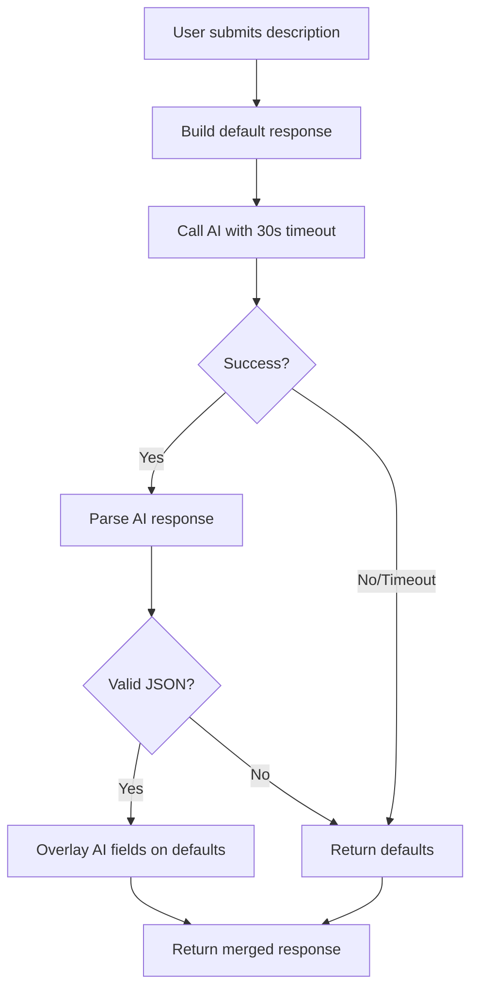

# AI Draft Generation

The AI Draft endpoint helps users quickly create cruise proposals by automatically extracting structured data from natural language descriptions. This feature uses AI to parse free-form text and generate a structured cruise draft with sensible defaults.

## Overview

Instead of manually filling out all cruise fields, users can provide a simple text description of their planned sailing trip. The AI will attempt to extract:

- Cruise title and description
- Departure and arrival dates/ports (with coordinates)
- Route stops (with coordinates)
- Vessel information (type, name, specifications)
- Cost and currency
- Maximum participants
- Cruise type and rules
- Region code

**Key Feature:** The endpoint **always returns a 200 response** with valid data, even if the AI fails or the description is insufficient. Missing or invalid fields will use sensible defaults.

## Endpoint

```http
POST /v1/cruises/ai-draft
```

### Request

**Authentication**: Requires Bearer token in Authorization header.

```json
{
  "description": "string (10-5000 characters)"
}
```

**Example Request:**

```http
POST /v1/cruises/ai-draft HTTP/1.1
Host: api.skipperclub.app
Authorization: Bearer <token>
Content-Type: application/json

{
  "description": "A week-long sailing trip in Croatia starting from Split on July 15th, 2025. We have a Bavaria 46 Cruiser with 4 cabins. Price is 1500 EUR per person."
}
```

### Response

The endpoint returns a `CruiseAiDraftResponse` with the following structure:

```json
{
  "title": "string | null",
  "description": "string",
  "departureDate": "string (ISO date)",
  "departurePort": "{ name: string, coordinates: { lat: number, lng: number } } | null",
  "arrivalDate": "string (ISO date)",
  "arrivalPort": "{ name: string, coordinates: { lat: number, lng: number } } | null",
  "stops": [
    { "name": "string", "coordinates": { "lat": "number", "lng": "number" } }
  ],
  "requiredSkills": "string | null",
  "costPerPerson": "number | null",
  "currency": "string",
  "private": "boolean",
  "vessel": "string | null",
  "vesselBrand": "string | null",
  "vesselCabins": "number | null",
  "vesselLength": "number | null",
  "vesselModel": "string | null",
  "vesselType": "string",
  "vesselYear": "number | null",
  "maxParticipants": "number",
  "regionCode": "string | null",
  "type": "string",
  "smokingAllowed": "boolean | null",
  "alcoholAllowed": "boolean | null",
  "petsAllowed": "boolean | null",
  "childrenAllowed": "boolean | null"
}
```

**Example Response:**

```json
{
  "title": "Week-long Croatian Sailing Adventure",
  "description": "A week-long sailing trip in Croatia starting from Split on July 15th, 2025. We have a Bavaria 46 Cruiser with 4 cabins. Price is 1500 EUR per person.",
  "departureDate": "2025-07-15",
  "departurePort": {
    "name": "Split",
    "coordinates": { "lat": 43.5081, "lng": 16.4402 }
  },
  "arrivalDate": "2025-07-22",
  "arrivalPort": {
    "name": "Split",
    "coordinates": { "lat": 43.5081, "lng": 16.4402 }
  },
  "stops": [
    { "name": "Split", "coordinates": { "lat": 43.5081, "lng": 16.4402 } },
    { "name": "Hvar", "coordinates": { "lat": 43.1729, "lng": 16.4411 } },
    { "name": "Korčula", "coordinates": { "lat": 42.9597, "lng": 17.1364 } },
    { "name": "Split", "coordinates": { "lat": 43.5081, "lng": 16.4402 } }
  ],
  "requiredSkills": null,
  "costPerPerson": 1500,
  "currency": "EUR",
  "private": false,
  "vessel": "Bavaria 46 Cruiser",
  "vesselBrand": "Bavaria",
  "vesselCabins": 4,
  "vesselLength": 46,
  "vesselModel": "Cruiser 46",
  "vesselType": "SAILING_YACHT",
  "vesselYear": null,
  "maxParticipants": 8,
  "regionCode": "ADR-HR-CDAL",
  "type": "RELAX",
  "smokingAllowed": null,
  "alcoholAllowed": null,
  "petsAllowed": null,
  "childrenAllowed": null
}
```

## Default Values

When the AI cannot extract information or the description is insufficient, the following defaults are applied:

| Field             | Default Value                | Note                                          |
| ----------------- | ---------------------------- | --------------------------------------------- |
| `title`           | `null`                       | No default - user should provide              |
| `description`     | Original request description | Always preserved                              |
| `departureDate`   | Today + 7 days               | Always in the future                          |
| `arrivalDate`     | Today + 14 days              | Always after departure                        |
| `departurePort`   | `null`                       | No default (object with name + coordinates)   |
| `arrivalPort`     | `null`                       | No default (object with name + coordinates)   |
| `stops`           | `[]`                         | Empty array (objects with name + coordinates) |
| `requiredSkills`  | `null`                       | No default                                    |
| `costPerPerson`   | `null`                       | No default                                    |
| `currency`        | `EUR`                        | Euro as default currency                      |
| `private`         | `false`                      | Public by default                             |
| `vessel`          | `null`                       | No default                                    |
| `vesselBrand`     | `null`                       | No default                                    |
| `vesselCabins`    | `null`                       | No default                                    |
| `vesselLength`    | `null`                       | No default                                    |
| `vesselModel`     | `null`                       | No default                                    |
| `vesselType`      | `SAILING_YACHT`              | Default vessel type                           |
| `vesselYear`      | `null`                       | No default                                    |
| `maxParticipants` | `8`                          | Common crew size                              |
| `regionCode`      | `null`                       | No default                                    |
| `type`            | `BEGINNER_INTRO`             | Default cruise type                           |
| `smokingAllowed`  | `null`                       | Unspecified                                   |
| `alcoholAllowed`  | `null`                       | Unspecified                                   |
| `petsAllowed`     | `null`                       | Unspecified                                   |
| `childrenAllowed` | `null`                       | Unspecified                                   |

## Behavior

### 1. AI Processing (30-second timeout)

The service attempts to generate a draft using AI with a **30-second timeout**:



### 2. Field Validation & Type Coercion

The service validates and coerces AI-generated fields:

#### Type Coercion

- **Strings to Numbers:** `"1500"` → `1500`
- **Strings to Booleans:** `"true"`, `"yes"`, `"1"` → `true`
- **Numbers to Strings:** `2025` → `"2025"`

#### Enum Validation

Invalid enum values fall back to defaults:

- **vesselType:** Must be one of `SAILING_YACHT`, `CATAMARAN`, `MOTORBOAT`, `TRIMARAN`, `GULET`, `SCHOONER`
- **type:** Must be valid `CruiseType` (see [index](./index.md#cruise-types))
- **currency:** Must be `PLN`, `EUR`, or `USD`

#### No String Length Validation

The AI draft endpoint **does not validate string lengths**. Fields that are too short or too long for cruise creation will be accepted in the draft but may fail during actual cruise creation via `POST /cruises`.

### 3. Always Returns 200

The endpoint **never returns error responses** (422, 503). It always returns a valid structure:

- ✅ AI timeout → returns defaults
- ✅ AI service down → returns defaults
- ✅ Invalid AI response → returns defaults
- ✅ Malformed JSON → returns defaults
- ✅ Insufficient description → returns defaults

The only exception is request validation (422) for the description field itself.

## Usage Workflow

### Step 1: Generate Draft

```http
POST /v1/cruises/ai-draft HTTP/1.1
Authorization: Bearer <token>
Content-Type: application/json

{
  "description": "Weekend sailing trip in Greece, departing from Athens Marina on June 20th. My yacht is a Jeanneau Sun Odyssey 42i. Looking for 6 crew members, cost 400 EUR each."
}
```

### Step 2: Review and Edit

The response contains AI-extracted data merged with defaults. The client application should:

1. Display the draft to the user
2. Allow editing of all fields
3. Highlight fields that are `null` or defaulted
4. Validate before final submission

### Step 3: Create Cruise

Use the edited draft to create the actual cruise:

```http
POST /v1/cruises HTTP/1.1
Authorization: Bearer <token>
Content-Type: application/json

{
  "title": "Weekend Greek Islands Sailing",
  "description": "Weekend sailing trip in Greece...",
  "departureDate": "2025-06-20",
  "departurePort": { "name": "Athens Marina", "coordinates": { "lat": 37.9364, "lng": 23.6475 } },
  "arrivalDate": "2025-06-22",
  "arrivalPort": { "name": "Athens Marina", "coordinates": { "lat": 37.9364, "lng": 23.6475 } },
  "stops": [
    { "name": "Aegina", "coordinates": { "lat": 37.7500, "lng": 23.4269 } },
    { "name": "Poros", "coordinates": { "lat": 37.5008, "lng": 23.4535 } }
  ],
  "costPerPerson": 400,
  "currency": "EUR",
  "maxParticipants": 6,
  "private": false,
  "vessel": "Jeanneau Sun Odyssey 42i",
  "vesselType": "SAILING_YACHT",
  "type": "RELAX"
}
```

## Supported Languages

The AI is trained to detect and preserve the **language of the input description**:

- If description is in **Polish**, generated `title`, `description`, `stops[].name`, `departurePort.name`, and `arrivalPort.name` will be in Polish
- If description is in **English**, generated fields will be in English
- Other languages are supported with varying quality

**Example (Polish):**

```json
{
  "description": "Tygodniowy rejs rekreacyjny w Chorwacji ze Splitu do Dubrownika dla grupy do 10 osób."
}
```

**Response:**

```json
{
  "title": "Tygodniowy rejs rekreacyjny ze Splitu do Dubrownika",
  "description": "Tygodniowy rejs rekreacyjny w Chorwacji ze Splitu do Dubrownika dla grupy do 10 osób.",
  "departurePort": { "name": "Split", "coordinates": { "lat": 43.5081, "lng": 16.4402 } },
  "arrivalPort": { "name": "Dubrownik", "coordinates": { "lat": 42.6507, "lng": 18.0944 } },
  "stops": [
    { "name": "Hvar", "coordinates": { "lat": 43.1729, "lng": 16.4411 } },
    { "name": "Korčula", "coordinates": { "lat": 42.9597, "lng": 17.1364 } }
  ],
  ...
}
```

## Best Practices

### 1. Provide Rich Descriptions

More details lead to better extraction:

❌ **Poor:**

```
"Nice cruise"
```

✅ **Good:**

```
"Week-long sailing adventure in Croatian waters from Split to Dubrovnik,
departing July 15, 2025. Modern Bavaria 46 with 4 cabins. Seeking 8 crew
members for relaxed island hopping. Cost: 1200 EUR per person includes
food and marina fees."
```

### 2. Include Key Information

Help the AI by including:

- **Dates:** "starting June 15th" or "from 2025-06-15"
- **Locations:** "from Split to Dubrovnik" or "in Greek islands"
- **Vessel:** "Bavaria 46", "Catamaran Lagoon 42"
- **Cost:** "1500 EUR per person", "cost 400 EUR each"
- **Group size:** "looking for 6 people", "maximum 8 crew"
- **Type/Style:** "family-friendly", "training cruise", "relaxed sailing"

### 3. Review All Fields

Always review the generated draft:

- ✅ Check dates are correct
- ✅ Verify vessel information
- ✅ Confirm cost and currency
- ✅ Validate region code matches the sailing area
- ✅ Adjust `maxParticipants` if needed

### 4. Handle Null Values

Fields with `null` values should be treated as "not specified":

- Some fields (`title`, `vessel`) may need user input
- Rules (`smokingAllowed`, etc.) can remain `null` if unspecified
- Optional vessel details (`vesselYear`, `vesselCabins`) can be left `null`

## Error Responses

The AI draft endpoint only returns errors for invalid requests:

### 422 Unprocessable Entity

All validation errors return HTTP 422, including missing/empty description or description length validation:

**Missing or empty description:**

```json
{
  "type": "/errors/validation",
  "title": "Validation Failed",
  "status": 422,
  "detail": "The request contains invalid data",
  "violations": [
    {
      "propertyPath": "description",
      "message": "description should not be empty"
    }
  ]
}
```

**Description too short:**

```json
{
  "type": "/errors/validation",
  "title": "Validation Failed",
  "status": 422,
  "detail": "The request contains invalid data",
  "violations": [
    {
      "propertyPath": "description",
      "message": "description must be longer than or equal to 10 characters"
    }
  ]
}
```

**Description too long:**

```json
{
  "type": "/errors/validation",
  "title": "Validation Failed",
  "status": 422,
  "detail": "The request contains invalid data",
  "violations": [
    {
      "propertyPath": "description",
      "message": "description must be shorter than or equal to 5000 characters"
    }
  ]
}
```

## Examples

### Minimal Description

**Request:**

```json
{
  "description": "Weekend sailing trip"
}
```

**Response:**

```json
{
  "title": null,
  "description": "Weekend sailing trip",
  "departureDate": "2025-12-17",
  "departurePort": null,
  "arrivalDate": "2025-12-24",
  "arrivalPort": null,
  "stops": [],
  "requiredSkills": null,
  "costPerPerson": null,
  "currency": "EUR",
  "private": false,
  "vessel": null,
  "vesselBrand": null,
  "vesselCabins": null,
  "vesselLength": null,
  "vesselModel": null,
  "vesselType": "SAILING_YACHT",
  "vesselYear": null,
  "maxParticipants": 8,
  "regionCode": null,
  "type": "BEGINNER_INTRO",
  "smokingAllowed": null,
  "alcoholAllowed": null,
  "petsAllowed": null,
  "childrenAllowed": null
}
```

### Detailed Description

**Request:**

```json
{
  "description": "Two-week advanced sailing course in the Baltic Sea starting from Gdańsk on August 1st, 2025. Training on a Contest 42S racing yacht. Looking for experienced sailors (minimum Yachtmaster certificate). 6 berths available. Cost 2500 EUR per person includes instruction, food, and marina fees. Alcohol allowed, no smoking on board."
}
```

**Response (expected AI extraction):**

```json
{
  "title": "Advanced Sailing Course - Baltic Sea",
  "description": "Two-week advanced sailing course in the Baltic Sea starting from Gdańsk on August 1st, 2025. Training on a Contest 42S racing yacht. Looking for experienced sailors (minimum Yachtmaster certificate). 6 berths available. Cost 2500 EUR per person includes instruction, food, and marina fees. Alcohol allowed, no smoking on board.",
  "departureDate": "2025-08-01",
  "departurePort": {
    "name": "Gdańsk",
    "coordinates": { "lat": 54.352, "lng": 18.6466 }
  },
  "arrivalDate": "2025-08-15",
  "arrivalPort": {
    "name": "Gdańsk",
    "coordinates": { "lat": 54.352, "lng": 18.6466 }
  },
  "stops": [
    { "name": "Hel", "coordinates": { "lat": 54.6082, "lng": 18.8003 } },
    { "name": "Bornholm", "coordinates": { "lat": 55.1246, "lng": 14.9192 } }
  ],
  "requiredSkills": "Minimum Yachtmaster certificate required. Experience with racing yachts preferred.",
  "costPerPerson": 2500,
  "currency": "EUR",
  "private": false,
  "vessel": "Contest 42S",
  "vesselBrand": "Contest",
  "vesselCabins": 3,
  "vesselLength": 42,
  "vesselModel": "42S",
  "vesselType": "SAILING_YACHT",
  "vesselYear": null,
  "maxParticipants": 6,
  "regionCode": "BAL-PL",
  "type": "TRAINING",
  "smokingAllowed": false,
  "alcoholAllowed": true,
  "petsAllowed": null,
  "childrenAllowed": null
}
```

## Related

- [Lifecycle](./lifecycle.md) — Creating cruises after generating drafts
- [OpenAPI Specification](../openapi.yaml) — Full API schema
- [Error Handling](../getting-started/errors.md) — RFC 7807 Problem Details format
