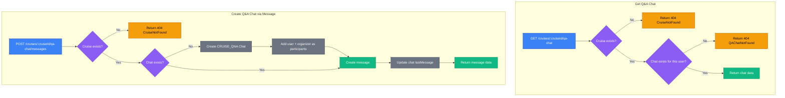
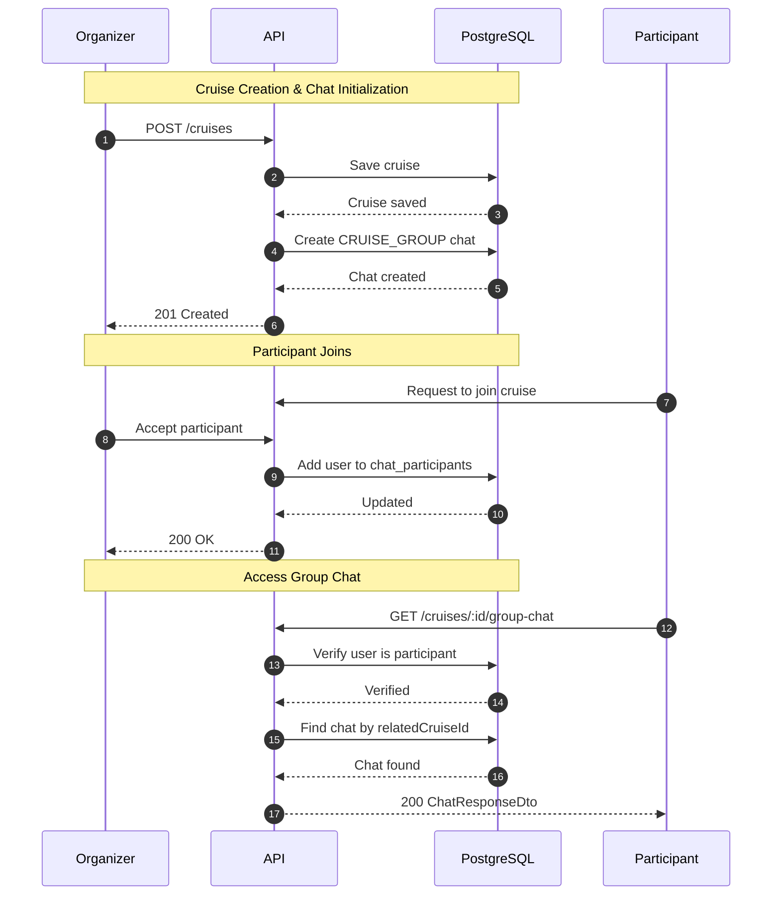
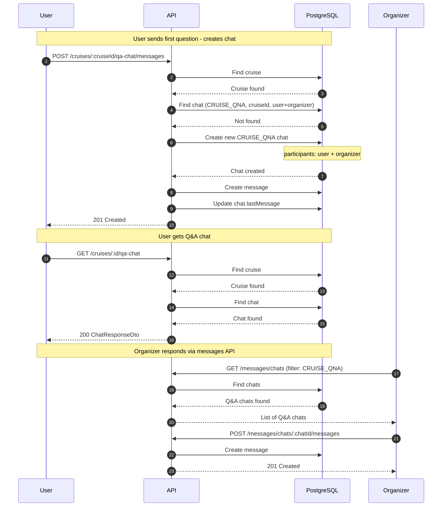

```mermaid
flowchart TD
    subgraph Creation["Chat Creation"]
        A["POST /cruises"]:::trigger --> B[CreateCruiseHandler]:::state
        B --> C[Save Cruise to DB]:::state
        C --> D[Publish CruiseCreatedEvent]:::notify
        D --> E[CruiseChatEventsHandler]:::state
        E --> F["Create CRUISE_GROUP Chat in PostgreSQL"]:::success
        F --> G[Organizer added as participant]:::success
    end

    subgraph ParticipantJoin["Participant Joins"]
        H[Participant state → ACCEPTED]:::trigger --> I[Publish CruiseParticipantJoinedEvent]:::notify
        I --> J[CruiseChatEventsHandler]:::state
        J --> K[Add user to chat participants]:::success
    end

    subgraph ParticipantLeave["Participant Leaves"]
        L["Participant removed/left"]:::trigger --> M[Publish CruiseParticipantLeftEvent]:::notify
        M --> N[CruiseChatEventsHandler]:::state
        N --> O{Is Organizer?}:::decision
        O -->|Yes| P[Do nothing - organizer stays]:::state
        O -->|No| Q[Remove user from chat participants]:::negative
        Q --> R[Messages remain in chat]:::state
    end

    classDef trigger fill:#3B82F6,stroke:#1E40AF,color:#FFFFFF
    classDef state fill:#6B7280,stroke:#374151,color:#FFFFFF
    classDef decision fill:#8B5CF6,stroke:#5B21B6,color:#FFFFFF
    classDef success fill:#10B981,stroke:#047857,color:#FFFFFF
    classDef notify fill:#10B981,stroke:#047857,color:#FFFFFF
    classDef negative fill:#F59E0B,stroke:#B45309,color:#000000
```

# Cruise Chats

This document covers the two types of cruise-related chats: Group Chat and Q&A Chat.

## Overview

Each cruise has two communication channels:

| Chat Type      | Purpose                                            | Participants                      | Created                              |
| -------------- | -------------------------------------------------- | --------------------------------- | ------------------------------------ |
| **Group Chat** | Communication among all cruise members             | Organizer + accepted participants | Automatically when cruise is created |
| **Q&A Chat**   | Questions from potential participants to organizer | User + Organizer (1:1)            | When first message is sent           |

## Chat Types Comparison

| Feature             | Group Chat                               | Q&A Chat                            |
| ------------------- | ---------------------------------------- | ----------------------------------- |
| Type identifier     | `CRUISE_GROUP`                           | `CRUISE_QNA`                        |
| Created             | When cruise is created                   | When first message is sent          |
| Participants        | Organizer + accepted members             | User + Organizer                    |
| Access              | Organizer and accepted participants only | Any authenticated user can initiate |
| Lifecycle           | Persists even after cruise deletion      | Persists even after cruise deletion |
| Multiple per cruise | No (one per cruise)                      | Yes (one per user asking questions) |

---

## Group Chat

The group chat is the main communication channel for cruise participants.

### Lifecycle



### Access Rules

| User Role                   | Can Read | Can Write |
| --------------------------- | -------- | --------- |
| Organizer                   | Yes      | Yes       |
| Accepted participant        | Yes      | Yes       |
| Pending/Invited participant | No       | No        |
| Non-participant             | No       | No        |

### Get Group Chat

```http
GET /cruises/{cruiseId}/group-chat
```

Retrieves the group chat for a cruise.

#### Example Request

```http
GET /v1/cruises/018fa2e4-8e3b-7b2e-8e3b-7b2e8e3b7b2e/group-chat HTTP/1.1
Host: api.skipperclub.app
Authorization: Bearer <token>
```

#### Response

**200 OK**

```json
{
  "id": "018fa2e4-aaaa-7b2e-8e3b-7b2e8e3b7b2e",
  "type": "CRUISE_GROUP",
  "name": "Croatian Coast Adventure - Group Chat",
  "participants": [
    {
      "id": "018fa2e4-1111-7b2e-8e3b-7b2e8e3b7b00",
      "name": "Captain Jack",
      "avatarUrl": "https://cdn.example.com/avatars/jack.jpg"
    },
    {
      "id": "018fa2e4-2222-7b2e-8e3b-7b2e8e3b7b00",
      "name": "John Sailor",
      "avatarUrl": "https://cdn.example.com/avatars/john.jpg"
    }
  ],
  "relatedCruiseId": "018fa2e4-8e3b-7b2e-8e3b-7b2e8e3b7b2e",
  "lastMessage": {
    "id": "018fa2e4-bbbb-7b2e-8e3b-7b2e8e3b7b2e",
    "userId": "018fa2e4-1111-7b2e-8e3b-7b2e8e3b7b00",
    "text": "Looking forward to the trip!",
    "createdAt": "2025-01-15T14:30:00.000Z"
  },
  "lastReadMessageId": "018fa2e4-bbbb-7b2e-8e3b-7b2e8e3b7b2e",
  "unreadCount": 0,
  "updatedAt": "2025-01-15T14:30:00.000Z"
}
```

#### Errors

| Status | Type                                  | Description                               |
| ------ | ------------------------------------- | ----------------------------------------- |
| 403    | `/errors/cruise-access-forbidden`     | User is not authorized to access the chat |
| 404    | `/errors/cruise-not-found`            | Cruise does not exist                     |
| 404    | `/errors/cruise-group-chat-not-found` | Group chat does not exist                 |

### Send Message to Group Chat

```http
POST /cruises/{cruiseId}/group-chat/messages
```

Sends a message to the cruise group chat.

#### Request Body

| Field  | Type   | Required | Description     |
| ------ | ------ | -------- | --------------- |
| `text` | string | Yes      | Message content |

#### Example Request

```http
POST /v1/cruises/018fa2e4-8e3b-7b2e-8e3b-7b2e8e3b7b2e/group-chat/messages HTTP/1.1
Host: api.skipperclub.app
Authorization: Bearer <token>
Content-Type: application/json

{
  "text": "Hi everyone! Excited for the trip!"
}
```

#### Response

**201 Created**

```json
{
  "id": "018fa2e4-cccc-7b2e-8e3b-7b2e8e3b7b2e",
  "chatId": "018fa2e4-aaaa-7b2e-8e3b-7b2e8e3b7b2e",
  "userId": "018fa2e4-2222-7b2e-8e3b-7b2e8e3b7b00",
  "text": "Hi everyone! Excited for the trip!",
  "createdAt": "2025-01-15T15:00:00.000Z",
  "updatedAt": "2025-01-15T15:00:00.000Z"
}
```

The `Location` header contains the URI of the created message.

#### Errors

| Status | Type                                  | Description                             |
| ------ | ------------------------------------- | --------------------------------------- |
| 403    | `/errors/cruise-access-forbidden`     | User is not authorized to send messages |
| 404    | `/errors/cruise-not-found`            | Cruise does not exist                   |
| 404    | `/errors/cruise-group-chat-not-found` | Group chat does not exist               |

---

## Q&A Chat

The Q&A chat allows potential participants to ask questions directly to the cruise organizer before joining.

### Lifecycle



### Access Rules

| User Type        | GET /qa-chat                       | POST /qa-chat/messages                     |
| ---------------- | ---------------------------------- | ------------------------------------------ |
| Regular user     | Returns their Q&A chat (if exists) | Creates chat (if needed) and sends message |
| Cruise organizer | 404 - Always blocked               | 404 - Always blocked                       |

**Why is the organizer blocked?**

1. Q&A chat is for users to ask questions TO the organizer
2. The organizer should use `/messages/chats` to view and respond to Q&A conversations
3. Each user has their own separate Q&A chat with the organizer

### Get Q&A Chat

```http
GET /cruises/{cruiseId}/qa-chat
```

Retrieves the current user's Q&A chat with the cruise organizer.

#### Example Request

```http
GET /v1/cruises/018fa2e4-8e3b-7b2e-8e3b-7b2e8e3b7b2e/qa-chat HTTP/1.1
Host: api.skipperclub.app
Authorization: Bearer <token>
```

#### Response

**200 OK**

```json
{
  "id": "018fa2e4-dddd-7b2e-8e3b-7b2e8e3b7b2e",
  "type": "CRUISE_QNA",
  "name": null,
  "participants": [
    {
      "id": "018fa2e4-1111-7b2e-8e3b-7b2e8e3b7b00",
      "name": "Captain Jack",
      "avatarUrl": "https://cdn.example.com/avatars/jack.jpg"
    },
    {
      "id": "018fa2e4-3333-7b2e-8e3b-7b2e8e3b7b00",
      "name": "Jane Curious",
      "avatarUrl": "https://cdn.example.com/avatars/jane.jpg"
    }
  ],
  "relatedCruiseId": "018fa2e4-8e3b-7b2e-8e3b-7b2e8e3b7b2e",
  "lastMessage": {
    "id": "018fa2e4-eeee-7b2e-8e3b-7b2e8e3b7b2e",
    "userId": "018fa2e4-3333-7b2e-8e3b-7b2e8e3b7b00",
    "text": "What should I bring for the trip?",
    "createdAt": "2025-01-15T16:00:00.000Z"
  },
  "lastReadMessageId": null,
  "unreadCount": 0,
  "updatedAt": "2025-01-15T16:00:00.000Z"
}
```

#### Errors

| Status | Type                               | Description                           |
| ------ | ---------------------------------- | ------------------------------------- |
| 404    | `/errors/cruise-not-found`         | Cruise does not exist                 |
| 404    | `/errors/cruise-qa-chat-not-found` | Q&A chat does not exist for this user |

### Send Message to Q&A Chat

```http
POST /cruises/{cruiseId}/qa-chat/messages
```

Sends a message to the Q&A chat. If no Q&A chat exists for this user, one is created automatically.

#### Request Body

| Field  | Type   | Required | Description     |
| ------ | ------ | -------- | --------------- |
| `text` | string | Yes      | Message content |

#### Example Request

```http
POST /v1/cruises/018fa2e4-8e3b-7b2e-8e3b-7b2e8e3b7b2e/qa-chat/messages HTTP/1.1
Host: api.skipperclub.app
Authorization: Bearer <token>
Content-Type: application/json

{
  "text": "Hi! I have a question about the cruise. What level of experience is required?"
}
```

#### Response

**201 Created**

```json
{
  "id": "018fa2e4-ffff-7b2e-8e3b-7b2e8e3b7b2e",
  "chatId": "018fa2e4-dddd-7b2e-8e3b-7b2e8e3b7b2e",
  "userId": "018fa2e4-3333-7b2e-8e3b-7b2e8e3b7b00",
  "text": "Hi! I have a question about the cruise. What level of experience is required?",
  "createdAt": "2025-01-15T16:30:00.000Z",
  "updatedAt": "2025-01-15T16:30:00.000Z"
}
```

The `Location` header contains the URI of the created message.

#### Errors

| Status | Type                       | Description           |
| ------ | -------------------------- | --------------------- |
| 404    | `/errors/cruise-not-found` | Cruise does not exist |

---

## Sequence Diagrams

### Group Chat Lifecycle



### Q&A Chat Flow



---

## How Organizer Responds to Q&A

The organizer cannot use the `/cruises/{cruiseId}/qa-chat` endpoints. Instead, they should:

1. Use `GET /messages/chats` to list all their chats
2. Filter by `type: CRUISE_QNA` to find Q&A conversations
3. Use `POST /messages/chats/{chatId}/messages` to respond

---

## Chat Persistence

Both chat types persist even after:

- Cruise is deleted
- Participant is removed from cruise
- User leaves the cruise

This ensures historical conversations are preserved for reference.

When a participant is removed from the group chat:

- They lose access to the chat
- Their previous messages remain visible to other participants
- The organizer always retains access

---

## Data Model

Chats are stored in PostgreSQL (TypeORM entities in `src/database/entities/`):

| Table                | Purpose                                                                                   |
| -------------------- | ----------------------------------------------------------------------------------------- |
| `chats`              | Conversation metadata — type, name, related cruise, reference to the last message         |
| `chat_participants`  | Chat membership (`chat_id` + `user_id`)                                                   |
| `chat_messages`      | Messages (text up to 1000 characters, timestamps)                                         |
| `chat_message_reads` | Per-message read receipts (`message_id` + `user_id` + `read_at`)                          |
| `user_chat_states`   | Per-user read state — last read message, unread count, hidden flag, joined date, settings |

```typescript
interface Chat {
  id: string; // UUID v7
  type: 'CRUISE_GROUP' | 'CRUISE_QNA' | 'ONE_TO_ONE' | 'GROUP';
  name: string | null; // e.g., "Cruise Title - Group Chat"
  relatedCruiseId: string | null; // Links chat to cruise
  lastMessageId: string | null; // References chat_messages
  participants: ChatParticipant[]; // Rows in chat_participants
  createdAt: Date;
  updatedAt: Date;
}
```

---

## Related

- [Participants](./participants.md) — Participant states affect chat access
- [Messages](../messages/index.md) — General messaging API
- [WebSocket](../messages/websocket.md) — Real-time message delivery
- [Lifecycle](./lifecycle.md) — Cruise creation triggers group chat creation
