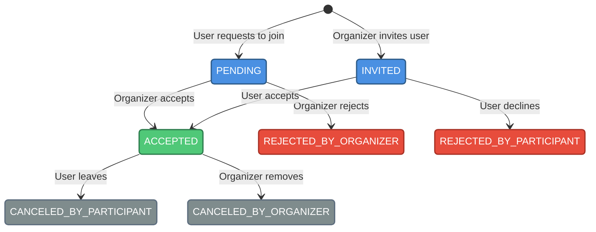

# Cruises

The cruises module is the core of the SkipperClub platform, enabling skippers to organize sailing voyages and users to discover and join trips that match their interests.

## Overview

A **cruise** represents a sailing voyage with defined dates, route, vessel details, and participation rules. Each cruise has an **organizer** (the skipper who creates it) and can have multiple **participants** who join through invitations or requests.

The module handles:

- Cruise creation and management
- Participant enrollment and state transitions
- Real-time communication via group and Q&A chats
- Cruise discovery through search and filtering

## Documentation Sections

- [Lifecycle](./lifecycle.md) — Creating, updating, and deleting cruises
- [AI Draft](./ai-draft.md) — Generate cruise drafts from natural language descriptions
- [Participants](./participants.md) — Participant roles, states, and management
- [Chats](./chats.md) — Group chat and Q&A communication
- [Invitations](./invitations.md) — Join requests and invitation flows

## Key Concepts

### Organizer

The user who creates the cruise. The organizer:

- Defines cruise details (route, dates, vessel, cost)
- Manages participant enrollment (accept/reject requests, send invitations)
- Can update or delete the cruise
- Is automatically added to the cruise group chat

### Participants

Users who join a cruise go through a state machine:



See [Participants](./participants.md) for the complete state machine.

### Cruise Types

Cruises can be categorized by type to help users find trips matching their interests:

| Category         | Types                                                                                         |
| ---------------- | --------------------------------------------------------------------------------------------- |
| **Skill Level**  | `BEGINNER_INTRO`, `TRAINING`, `MILEBUILDING`, `ADVANCED`, `SPORT_REGATTA`                     |
| **Demographics** | `FAMILY`, `SINGLES`, `COUPLES`, `SENIORS`, `WOMEN_ONLY`, `MEN_ONLY`                           |
| **Activity**     | `PARTY`, `RELAX`, `SURVIVAL`, `PHOTOGRAPHY`, `CULINARY`, `CULTURAL_HISTORICAL`, `EXPLORATION` |

### Vessel Types

Supported vessel types for cruises:

| Type            | Description                        |
| --------------- | ---------------------------------- |
| `SAILING_YACHT` | Traditional monohull sailing yacht |
| `CATAMARAN`     | Twin-hull sailing vessel           |
| `MOTORBOAT`     | Motor-powered vessel               |
| `TRIMARAN`      | Three-hull sailing vessel          |
| `GULET`         | Traditional wooden sailing vessel  |
| `SCHOONER`      | Multi-masted sailing vessel        |

### Visibility

Cruises can be **public** or **private**:

- **Public cruises** (`private: false`) — Visible to all users, appear in search results
- **Private cruises** (`private: true`) — Only visible to organizer and participants

### Cruise Rules

Organizers can set rules for their cruise:

| Rule              | Description                              |
| ----------------- | ---------------------------------------- |
| `smokingAllowed`  | Whether smoking is permitted on board    |
| `alcoholAllowed`  | Whether alcohol consumption is permitted |
| `petsAllowed`     | Whether pets are allowed                 |
| `childrenAllowed` | Whether children can participate         |

## Endpoints Overview

| Method | Endpoint                                           | Description                            |
| ------ | -------------------------------------------------- | -------------------------------------- |
| GET    | `/cruises`                                         | List cruises with filtering            |
| POST   | `/cruises`                                         | Create a new cruise                    |
| POST   | `/cruises/ai-draft`                                | Generate cruise draft from description |
| GET    | `/cruises/{cruiseId}`                              | Get cruise details                     |
| PUT    | `/cruises/{cruiseId}`                              | Update cruise (full)                   |
| PATCH  | `/cruises/{cruiseId}`                              | Update cruise (partial)                |
| DELETE | `/cruises/{cruiseId}`                              | Delete cruise                          |
| GET    | `/cruises/{cruiseId}/participants`                 | List participants                      |
| POST   | `/cruises/{cruiseId}/participants`                 | Create participant (invite/request)    |
| PATCH  | `/cruises/{cruiseId}/participants/{participantId}` | Update participant state               |
| GET    | `/cruises/{cruiseId}/group-chat`                   | Get group chat                         |
| POST   | `/cruises/{cruiseId}/group-chat/messages`          | Send message to group chat             |
| GET    | `/cruises/{cruiseId}/qa-chat`                      | Get Q&A chat                           |
| POST   | `/cruises/{cruiseId}/qa-chat/messages`             | Send message to Q&A chat               |

## Quick Example

### Generate Cruise Draft with AI

Use AI to quickly create a cruise proposal from a text description:

```http
POST /v1/cruises/ai-draft HTTP/1.1
Host: api.skipperclub.app
Authorization: Bearer <token>
Content-Type: application/json

{
  "description": "Week-long sailing trip in Croatia from Split to Dubrovnik, departing July 15th 2025. Bavaria 46 Cruiser, 850 EUR per person, max 6 people."
}
```

The response includes AI-extracted data with sensible defaults. See [AI Draft](./ai-draft.md) for details.

### Create a Cruise

```http
POST /v1/cruises HTTP/1.1
Host: api.skipperclub.app
Authorization: Bearer <token>
Content-Type: application/json

{
  "title": "Mediterranean Summer Sailing",
  "description": "Week-long sailing adventure along the Croatian coast",
  "departureDate": "2025-07-15",
  "departurePort": { "name": "Split, Croatia", "coordinates": { "lat": 43.5081, "lng": 16.4402 } },
  "arrivalDate": "2025-07-22",
  "arrivalPort": { "name": "Dubrovnik, Croatia", "coordinates": { "lat": 42.6507, "lng": 18.0944 } },
  "costPerPerson": 850,
  "currency": "EUR",
  "maxParticipants": 6,
  "private": false,
  "vessel": "Bavaria Cruiser 46",
  "vesselType": "SAILING_YACHT",
  "type": "RELAX"
}
```

### Search for Cruises

```http
GET /v1/cruises?type=FAMILY&fromDate=2025-06-01&regionCode=MED HTTP/1.1
Host: api.skipperclub.app
Authorization: Bearer <token>
```

## Error Handling

All cruise-related errors follow RFC 7807 format:

| Error Type                           | Status | Description                             |
| ------------------------------------ | ------ | --------------------------------------- |
| `/errors/cruise-not-found`           | 404    | Cruise does not exist                   |
| `/errors/cruise-forbidden`           | 403    | User lacks permission for this action   |
| `/errors/cruise-full`                | 409    | Cruise has reached maximum participants |
| `/errors/cruise-region-not-found`    | 422    | Provided region code does not exist     |
| `/errors/participant-already-exists` | 409    | User already has a participant record   |
| `/errors/invalid-state-transition`   | 422    | Invalid participant state change        |

### Example Error Response

```json
{
  "type": "/errors/cruise-not-found",
  "title": "Cruise Not Found",
  "status": 404,
  "detail": "The requested cruise could not be found"
}
```

## Related

- [Authentication](../getting-started/authentication.md) — How to authenticate API requests
- [Error Handling](../getting-started/errors.md) — RFC 7807 Problem Details format
- [Notifications](../notifications/index.md) — Cruise-related notifications
- [Reviews](../reviews/index.md) — Post-cruise review system
