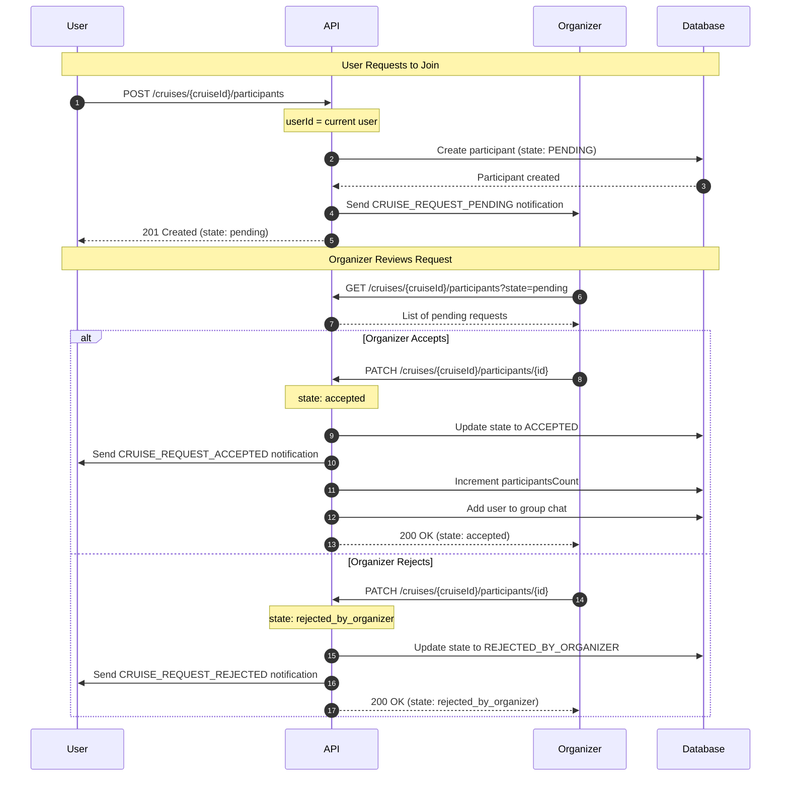
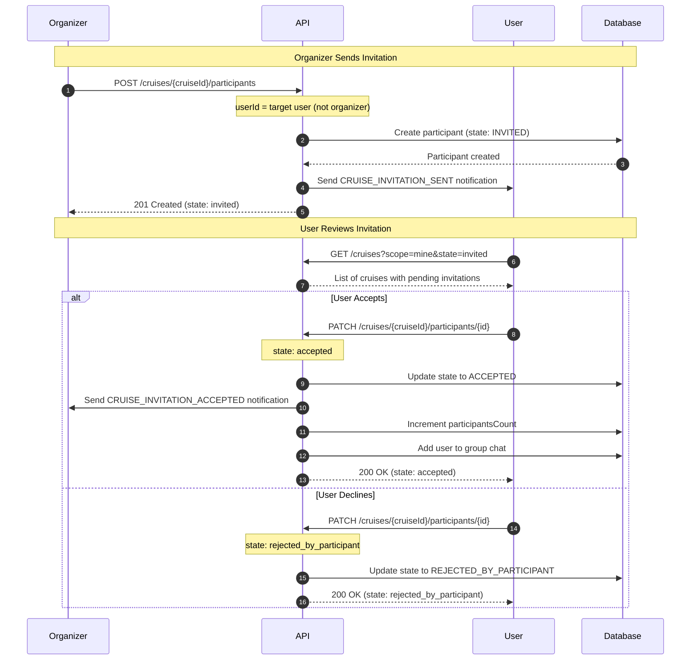

# Invitations and Join Requests

This document covers the two ways users can join a cruise: requesting to join or being invited by the organizer.

## Overview

There are two paths to cruise participation:

| Flow             | Initiated By | Initial State | Decision Maker            |
| ---------------- | ------------ | ------------- | ------------------------- |
| **Join Request** | User         | `pending`     | Organizer accepts/rejects |
| **Invitation**   | Organizer    | `invited`     | User accepts/declines     |

Both flows result in the `accepted` state when successful.

## Join Request Flow

A user finds a cruise they want to join and sends a request to the organizer.

### Flow Diagram



### Step 1: User Sends Request

```http
POST /v1/cruises/018fa2e4-8e3b-7b2e-8e3b-7b2e8e3b7b2e/participants HTTP/1.1
Host: api.skipperclub.app
Authorization: Bearer <user_token>
Content-Type: application/json

{
  "userId": "018fa2e4-3333-7b2e-8e3b-7b2e8e3b7b00"
}
```

**Note**: The `userId` must match the authenticated user. Users can only request to join for themselves.

**Response (201 Created)**:

```json
{
  "id": "018fa2e4-9999-7b2e-8e3b-7b2e8e3b7b2e",
  "cruiseId": "018fa2e4-8e3b-7b2e-8e3b-7b2e8e3b7b2e",
  "userId": "018fa2e4-3333-7b2e-8e3b-7b2e8e3b7b00",
  "role": "participant",
  "state": "pending",
  "createdAt": "2025-01-15T10:00:00.000Z",
  "updatedAt": "2025-01-15T10:00:00.000Z",
  "user": {
    "id": "018fa2e4-3333-7b2e-8e3b-7b2e8e3b7b00",
    "name": "John Sailor",
    "avatarUrl": "https://cdn.example.com/avatars/john.jpg"
  }
}
```

**Side Effects**:

- Organizer receives `CRUISE_REQUEST_PENDING` notification

### Step 2: Organizer Reviews Requests

```http
GET /v1/cruises/018fa2e4-8e3b-7b2e-8e3b-7b2e8e3b7b2e/participants?state=pending HTTP/1.1
Host: api.skipperclub.app
Authorization: Bearer <organizer_token>
```

### Step 3a: Organizer Accepts

```http
PATCH /v1/cruises/018fa2e4-8e3b-7b2e-8e3b-7b2e8e3b7b2e/participants/018fa2e4-9999-7b2e-8e3b-7b2e8e3b7b2e HTTP/1.1
Host: api.skipperclub.app
Authorization: Bearer <organizer_token>
Content-Type: application/json

{
  "state": "accepted"
}
```

**Side Effects**:

- User receives `CRUISE_REQUEST_ACCEPTED` notification
- Other accepted participants receive `CRUISE_PARTICIPANT_JOINED` notification
- `participantsCount` is incremented
- User is added to the group chat

### Step 3b: Organizer Rejects

```http
PATCH /v1/cruises/018fa2e4-8e3b-7b2e-8e3b-7b2e8e3b7b2e/participants/018fa2e4-9999-7b2e-8e3b-7b2e8e3b7b2e HTTP/1.1
Host: api.skipperclub.app
Authorization: Bearer <organizer_token>
Content-Type: application/json

{
  "state": "rejected_by_organizer"
}
```

**Side Effects**:

- User receives `CRUISE_REQUEST_REJECTED` notification

### User Withdraws Request

Before the organizer decides, the user can withdraw their request:

```http
PATCH /v1/cruises/018fa2e4-8e3b-7b2e-8e3b-7b2e8e3b7b2e/participants/018fa2e4-9999-7b2e-8e3b-7b2e8e3b7b2e HTTP/1.1
Host: api.skipperclub.app
Authorization: Bearer <user_token>
Content-Type: application/json

{
  "state": "withdrawn_by_participant"
}
```

---

## Invitation Flow

The organizer invites a specific user to join their cruise.

### Flow Diagram



### Step 1: Organizer Sends Invitation

```http
POST /v1/cruises/018fa2e4-8e3b-7b2e-8e3b-7b2e8e3b7b2e/participants HTTP/1.1
Host: api.skipperclub.app
Authorization: Bearer <organizer_token>
Content-Type: application/json

{
  "userId": "018fa2e4-4444-7b2e-8e3b-7b2e8e3b7b00"
}
```

**Note**: The `userId` is the user being invited, not the organizer.

**Response (201 Created)**:

```json
{
  "id": "018fa2e4-aaaa-7b2e-8e3b-7b2e8e3b7b2e",
  "cruiseId": "018fa2e4-8e3b-7b2e-8e3b-7b2e8e3b7b2e",
  "userId": "018fa2e4-4444-7b2e-8e3b-7b2e8e3b7b00",
  "role": "participant",
  "state": "invited",
  "createdAt": "2025-01-15T11:00:00.000Z",
  "updatedAt": "2025-01-15T11:00:00.000Z",
  "user": {
    "id": "018fa2e4-4444-7b2e-8e3b-7b2e8e3b7b00",
    "name": "Jane Sailor",
    "avatarUrl": "https://cdn.example.com/avatars/jane.jpg"
  }
}
```

**Side Effects**:

- User receives `CRUISE_INVITATION_SENT` notification

### Step 2: User Reviews Invitations

```http
GET /v1/cruises?scope=mine&state=invited HTTP/1.1
Host: api.skipperclub.app
Authorization: Bearer <user_token>
```

### Step 3a: User Accepts Invitation

```http
PATCH /v1/cruises/018fa2e4-8e3b-7b2e-8e3b-7b2e8e3b7b2e/participants/018fa2e4-aaaa-7b2e-8e3b-7b2e8e3b7b2e HTTP/1.1
Host: api.skipperclub.app
Authorization: Bearer <user_token>
Content-Type: application/json

{
  "state": "accepted"
}
```

**Side Effects**:

- Organizer receives `CRUISE_INVITATION_ACCEPTED` notification
- Other accepted participants receive `CRUISE_PARTICIPANT_JOINED` notification
- `participantsCount` is incremented
- User is added to the group chat

### Step 3b: User Declines Invitation

```http
PATCH /v1/cruises/018fa2e4-8e3b-7b2e-8e3b-7b2e8e3b7b2e/participants/018fa2e4-aaaa-7b2e-8e3b-7b2e8e3b7b2e HTTP/1.1
Host: api.skipperclub.app
Authorization: Bearer <user_token>
Content-Type: application/json

{
  "state": "rejected_by_participant"
}
```

### Organizer Withdraws Invitation

Before the user decides, the organizer can withdraw their invitation:

```http
PATCH /v1/cruises/018fa2e4-8e3b-7b2e-8e3b-7b2e8e3b7b2e/participants/018fa2e4-aaaa-7b2e-8e3b-7b2e8e3b7b2e HTTP/1.1
Host: api.skipperclub.app
Authorization: Bearer <organizer_token>
Content-Type: application/json

{
  "state": "withdrawn_by_organizer"
}
```

---

## State Determination Logic

When `POST /cruises/{cruiseId}/participants` is called, the initial state is determined by:

| Condition                                                 | Initial State                          |
| --------------------------------------------------------- | -------------------------------------- |
| `userId` = current user                                   | `pending` (user is requesting to join) |
| `userId` ≠ current user AND current user is organizer     | `invited` (organizer is inviting)      |
| `userId` ≠ current user AND current user is not organizer | Error: Not authorized                  |

> **Known gap**: `CreateCruiseParticipantHandler` does not currently enforce
> the last row above — a non-organizer can create a `pending` participant
> record for an arbitrary `userId`. This is tracked as a bug to fix in code,
> not a documentation error; the table describes the intended behavior.

---

## Error Handling

### Common Errors

| Status | Type                                          | Scenario                                    |
| ------ | --------------------------------------------- | ------------------------------------------- |
| 404    | `/errors/cruise-not-found`                    | Cruise does not exist                       |
| 422    | `/errors/user-not-found`                      | Target user does not exist                  |
| 404    | `/errors/participant-not-found`               | Participant record not found                |
| 409    | `/errors/participant-already-exists`          | User already has a participant record       |
| 409    | `/errors/cruise-full`                         | Cruise has reached `maxParticipants`        |
| 422    | `/errors/cannot-add-organizer-as-participant` | Cannot invite organizer to their own cruise |
| 422    | `/errors/invalid-state-transition`            | Invalid state transition                    |
| 403    | `/errors/participant-access-forbidden`        | User cannot perform this action             |

### Example Error Response

```json
{
  "type": "/errors/cruise-full",
  "title": "Cruise Full",
  "status": 409,
  "detail": "The cruise has reached its maximum number of participants"
}
```

---

## Notifications Summary

| Event                                | Recipient          | Notification Type            |
| ------------------------------------ | ------------------ | ---------------------------- |
| User requests to join                | Organizer          | `CRUISE_REQUEST_PENDING`     |
| Organizer accepts join request       | Requesting user    | `CRUISE_REQUEST_ACCEPTED`    |
| Organizer invites user               | User               | `CRUISE_INVITATION_SENT`     |
| User accepts invitation              | Organizer          | `CRUISE_INVITATION_ACCEPTED` |
| User joins cruise (after acceptance) | Other participants | `CRUISE_PARTICIPANT_JOINED`  |
| Request rejected                     | User               | `CRUISE_REQUEST_REJECTED`    |
| Invitation declined                  | —                  | No notification              |
| Request withdrawn                    | —                  | No notification              |
| Invitation withdrawn                 | —                  | No notification              |

---

## Related

- [Participants](./participants.md) — Complete state machine documentation
- [Notifications](../notifications/index.md) — Notification details
- [Lifecycle](./lifecycle.md) — Cruise creation and management
- [Chats](./chats.md) — Group chat access after acceptance
