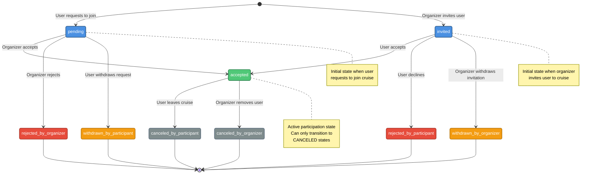

# Cruise Participants

This document covers participant management in cruises, including roles, states, and state transitions.

## Overview

Every cruise has an **organizer** (the creator) and can have multiple **participants**. Participants go through a state machine that tracks their enrollment status from initial request or invitation to final acceptance or rejection.

## Roles

Each participant has a role that defines their permissions:

| Role          | Description                                                                                    |
| ------------- | ---------------------------------------------------------------------------------------------- |
| `organizer`   | The user who created the cruise. Has full control over the cruise and can manage participants. |
| `participant` | A user who has joined or is in the process of joining the cruise.                              |

**Note**: The organizer is not stored as a participant record. They are identified by the `organizerId` field on the cruise.

## Participant States

Participants can be in one of nine states:

### Initial States

| State     | Description                        | Created By |
| --------- | ---------------------------------- | ---------- |
| `pending` | User requested to join the cruise  | User       |
| `invited` | Organizer invited the user to join | Organizer  |

### Active State

| State      | Description                             |
| ---------- | --------------------------------------- |
| `accepted` | Participant is confirmed for the cruise |

### Terminal States

These states are final — no further transitions are allowed:

| State                      | Description                                | Triggered By |
| -------------------------- | ------------------------------------------ | ------------ |
| `rejected_by_participant`  | User declined the organizer's invitation   | User         |
| `rejected_by_organizer`    | Organizer rejected the user's join request | Organizer    |
| `withdrawn_by_participant` | User withdrew their pending join request   | User         |
| `withdrawn_by_organizer`   | Organizer withdrew their invitation        | Organizer    |
| `canceled_by_participant`  | User left the cruise after being accepted  | User         |
| `canceled_by_organizer`    | Organizer removed the user from the cruise | Organizer    |

## State Machine



## State Transition Rules

### From `pending` (User Request)

| Transition                 | Who Can Perform | Result                     |
| -------------------------- | --------------- | -------------------------- |
| `accepted`                 | Organizer only  | User joins the cruise      |
| `rejected_by_organizer`    | Organizer only  | Request is rejected        |
| `withdrawn_by_participant` | User only       | User cancels their request |

### From `invited` (Organizer Invitation)

| Transition                | Who Can Perform | Result                       |
| ------------------------- | --------------- | ---------------------------- |
| `accepted`                | User only       | User joins the cruise        |
| `rejected_by_participant` | User only       | User declines invitation     |
| `withdrawn_by_organizer`  | Organizer only  | Organizer cancels invitation |

### From `accepted` (Active Participation)

| Transition                | Who Can Perform | Result                      |
| ------------------------- | --------------- | --------------------------- |
| `canceled_by_participant` | User only       | User leaves the cruise      |
| `canceled_by_organizer`   | Organizer only  | User is removed from cruise |

### Terminal States

No transitions are allowed from terminal states. Any attempt will result in an `InvalidStateTransitionException`.

---

## Endpoints

### List Participants

```http
GET /cruises/{cruiseId}/participants
```

Returns a paginated list of participants for a cruise.

#### Query Parameters

| Parameter | Type    | Default     | Description                                    |
| --------- | ------- | ----------- | ---------------------------------------------- |
| `limit`   | integer | 20          | Results per page (1-100)                       |
| `offset`  | integer | 0           | Results to skip                                |
| `order`   | string  | `asc`       | Sort order (`asc`, `desc`)                     |
| `sort`    | string  | `createdAt` | Sort field (`createdAt`, `updatedAt`, `state`) |
| `state`   | enum    | —           | Filter by participant state                    |

#### Example Request

```http
GET /v1/cruises/018fa2e4-8e3b-7b2e-8e3b-7b2e8e3b7b2e/participants HTTP/1.1
Host: api.skipperclub.app
Authorization: Bearer <token>
```

```http
GET /v1/cruises/018fa2e4-8e3b-7b2e-8e3b-7b2e8e3b7b2e/participants?state=accepted HTTP/1.1
Host: api.skipperclub.app
Authorization: Bearer <token>
```

```http
GET /v1/cruises/018fa2e4-8e3b-7b2e-8e3b-7b2e8e3b7b2e/participants?state=pending HTTP/1.1
Host: api.skipperclub.app
Authorization: Bearer <token>
```

#### Response

**200 OK**

```json
{
  "participants": [
    {
      "id": "018fa2e4-9999-7b2e-8e3b-7b2e8e3b7b2e",
      "cruiseId": "018fa2e4-8e3b-7b2e-8e3b-7b2e8e3b7b2e",
      "userId": "018fa2e4-1111-7b2e-8e3b-7b2e8e3b7b00",
      "role": "participant",
      "state": "accepted",
      "createdAt": "2025-01-15T10:30:00.000Z",
      "updatedAt": "2025-01-15T11:00:00.000Z",
      "user": {
        "id": "018fa2e4-1111-7b2e-8e3b-7b2e8e3b7b00",
        "name": "John Sailor",
        "avatarUrl": "https://cdn.example.com/avatars/john.jpg"
      }
    }
  ],
  "total": 5,
  "limit": 20,
  "offset": 0
}
```

---

### Create Participant

```http
POST /cruises/{cruiseId}/participants
```

Creates a new participant record. The resulting state depends on who makes the request:

| Requester | Target User                    | Initial State            |
| --------- | ------------------------------ | ------------------------ |
| User      | Self (`userId` = current user) | `pending` (join request) |
| Organizer | Another user                   | `invited` (invitation)   |

See [Invitations](./invitations.md) for detailed flows.

#### Request Body

| Field    | Type | Required | Description                |
| -------- | ---- | -------- | -------------------------- |
| `userId` | uuid | Yes      | UUID v7 of the user to add |

#### Example: User Requests to Join

```http
POST /v1/cruises/018fa2e4-8e3b-7b2e-8e3b-7b2e8e3b7b2e/participants HTTP/1.1
Host: api.skipperclub.app
Authorization: Bearer <token>
Content-Type: application/json

{
  "userId": "018fa2e4-1111-7b2e-8e3b-7b2e8e3b7b00"
}
```

#### Example: Organizer Invites User

```http
POST /v1/cruises/018fa2e4-8e3b-7b2e-8e3b-7b2e8e3b7b2e/participants HTTP/1.1
Host: api.skipperclub.app
Authorization: Bearer <token>
Content-Type: application/json

{
  "userId": "018fa2e4-2222-7b2e-8e3b-7b2e8e3b7b00"
}
```

#### Response

**201 Created**

```json
{
  "id": "018fa2e4-9999-7b2e-8e3b-7b2e8e3b7b2e",
  "cruiseId": "018fa2e4-8e3b-7b2e-8e3b-7b2e8e3b7b2e",
  "userId": "018fa2e4-1111-7b2e-8e3b-7b2e8e3b7b00",
  "role": "participant",
  "state": "pending",
  "createdAt": "2025-01-15T10:30:00.000Z",
  "updatedAt": "2025-01-15T10:30:00.000Z",
  "user": {
    "id": "018fa2e4-1111-7b2e-8e3b-7b2e8e3b7b00",
    "name": "John Sailor",
    "avatarUrl": "https://cdn.example.com/avatars/john.jpg"
  }
}
```

The `Location` header contains the URI of the created participant.

#### Errors

| Status | Type                                          | Description                             |
| ------ | --------------------------------------------- | --------------------------------------- |
| 404    | `/errors/cruise-not-found`                    | Cruise does not exist                   |
| 422    | `/errors/user-not-found`                      | Target user does not exist              |
| 409    | `/errors/participant-already-exists`          | User already has a participant record   |
| 409    | `/errors/cruise-full`                         | Cruise has reached maximum participants |
| 422    | `/errors/cannot-add-organizer-as-participant` | Cannot add organizer as participant     |

---

### Update Participant State

```http
PATCH /cruises/{cruiseId}/participants/{participantId}
```

Updates a participant's state. The allowed transitions depend on the current state and who is making the request.

#### Request Body

| Field   | Type | Required | Description           |
| ------- | ---- | -------- | --------------------- |
| `state` | enum | Yes      | New participant state |

**Valid state values for update**:

- `accepted`
- `rejected_by_participant`
- `rejected_by_organizer`
- `withdrawn_by_participant`
- `withdrawn_by_organizer`
- `canceled_by_participant`
- `canceled_by_organizer`

**Note**: `pending` and `invited` are initial states and cannot be set via update.

#### Example: Organizer Accepts Join Request

```http
PATCH /v1/cruises/018fa2e4-8e3b-7b2e-8e3b-7b2e8e3b7b2e/participants/018fa2e4-9999-7b2e-8e3b-7b2e8e3b7b2e HTTP/1.1
Host: api.skipperclub.app
Authorization: Bearer <token>
Content-Type: application/json

{
  "state": "accepted"
}
```

#### Example: User Accepts Invitation

```http
PATCH /v1/cruises/018fa2e4-8e3b-7b2e-8e3b-7b2e8e3b7b2e/participants/018fa2e4-9999-7b2e-8e3b-7b2e8e3b7b2e HTTP/1.1
Host: api.skipperclub.app
Authorization: Bearer <token>
Content-Type: application/json

{
  "state": "accepted"
}
```

#### Example: User Leaves Cruise

```http
PATCH /v1/cruises/018fa2e4-8e3b-7b2e-8e3b-7b2e8e3b7b2e/participants/018fa2e4-9999-7b2e-8e3b-7b2e8e3b7b2e HTTP/1.1
Host: api.skipperclub.app
Authorization: Bearer <token>
Content-Type: application/json

{
  "state": "canceled_by_participant"
}
```

#### Example: Organizer Removes Participant

```http
PATCH /v1/cruises/018fa2e4-8e3b-7b2e-8e3b-7b2e8e3b7b2e/participants/018fa2e4-9999-7b2e-8e3b-7b2e8e3b7b2e HTTP/1.1
Host: api.skipperclub.app
Authorization: Bearer <token>
Content-Type: application/json

{
  "state": "canceled_by_organizer"
}
```

#### Response

**200 OK**

Returns the updated participant object.

#### Errors

| Status | Type                                   | Description                     |
| ------ | -------------------------------------- | ------------------------------- |
| 422    | `/errors/invalid-state-transition`     | Invalid state transition        |
| 403    | `/errors/participant-access-forbidden` | User cannot perform this action |
| 404    | `/errors/cruise-not-found`             | Cruise does not exist           |
| 404    | `/errors/participant-not-found`        | Participant does not exist      |
| 409    | `/errors/cruise-full`                  | Cannot accept — cruise is full  |

---

## Notifications

State transitions trigger notifications to relevant users:

| Transition                  | Recipients                        | Notification                 |
| --------------------------- | --------------------------------- | ---------------------------- |
| → `pending`                 | Organizer                         | `CRUISE_REQUEST_PENDING`     |
| → `invited`                 | User                              | `CRUISE_INVITATION_SENT`     |
| `pending` → `accepted`      | Requesting user                   | `CRUISE_REQUEST_ACCEPTED`    |
| `invited` → `accepted`      | Organizer                         | `CRUISE_INVITATION_ACCEPTED` |
| → `accepted`                | Other participants                | `CRUISE_PARTICIPANT_JOINED`  |
| → `rejected_by_organizer`   | User                              | `CRUISE_REQUEST_REJECTED`    |
| → `canceled_by_organizer`   | User, remaining participants      | `CRUISE_PARTICIPANT_REMOVED` |
| → `canceled_by_participant` | Organizer, remaining participants | `CRUISE_PARTICIPANT_LEFT`    |

See [Notifications](../notifications/index.md) for details.

---

## Group Chat Access

Participant state affects group chat access:

| State        | Group Chat Access            |
| ------------ | ---------------------------- |
| `accepted`   | Full access (read and write) |
| Other states | No access (403 Forbidden)    |

When a participant is removed or leaves:

- They lose access to the group chat
- Their previous messages remain in the chat
- The organizer always retains access

See [Chats](./chats.md) for details.

---

## Related

- [Invitations](./invitations.md) — Detailed invitation and request flows
- [Chats](./chats.md) — Group chat access rules
- [Notifications](../notifications/index.md) — Participant-related notifications
- [Lifecycle](./lifecycle.md) — Cruise creation and management
