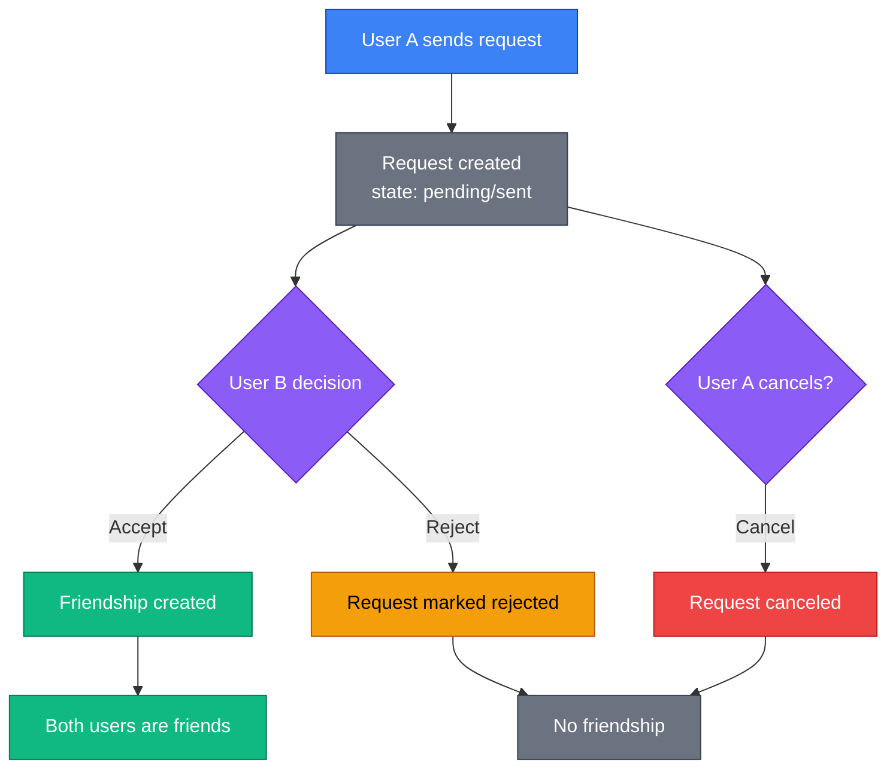
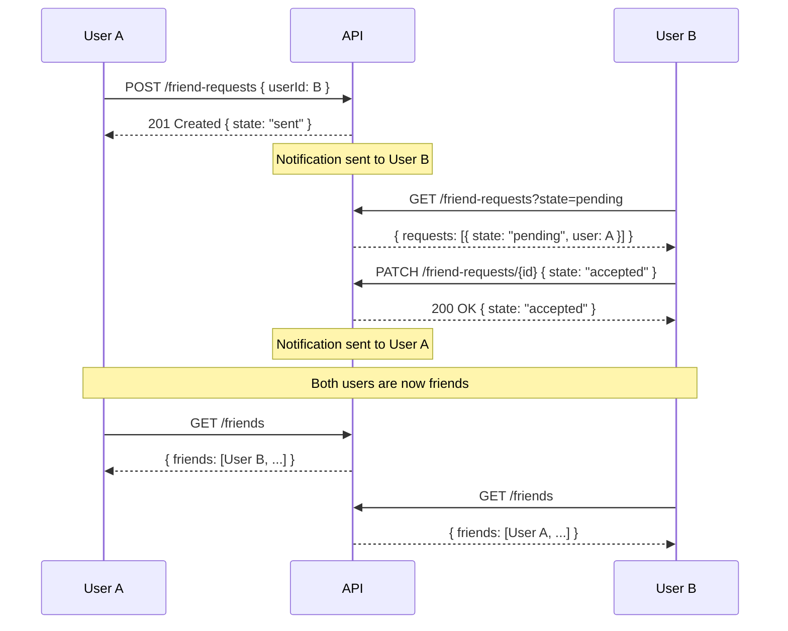
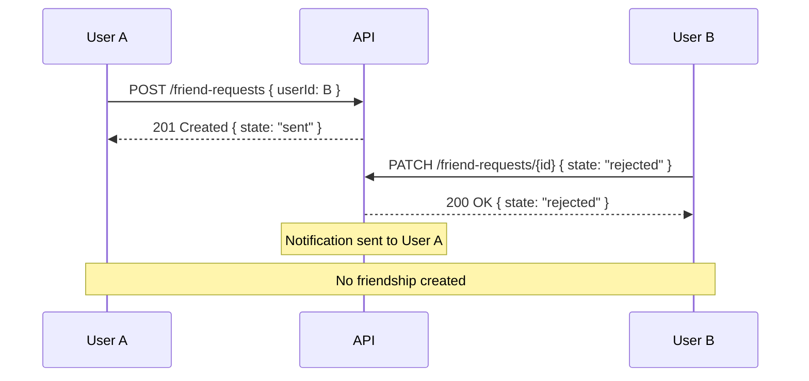

# Friends

The friends API enables users to build connections through friend requests and manage their friend list.

## Overview

SkipperClub's friend system allows users to connect with each other. The flow is straightforward:

1. User A sends a friend request to User B
2. User B accepts or rejects the request
3. If accepted, both users become friends

Friends can:

- View each other's profiles with more details
- Start private chats
- See each other in cruise participant recommendations

## Endpoints

| Method | Endpoint                | Description                              |
| ------ | ----------------------- | ---------------------------------------- |
| GET    | `/friend-requests`      | List friend requests (sent and received) |
| POST   | `/friend-requests`      | Send a friend request                    |
| DELETE | `/friend-requests/{id}` | Cancel/withdraw a friend request         |
| PATCH  | `/friend-requests/{id}` | Accept or reject a friend request        |
| GET    | `/friends`              | List friends                             |
| DELETE | `/friends/{friendId}`   | Remove a friend                          |

---

## Friend Request States

From the sender's perspective:

| State  | Description                                    |
| ------ | ---------------------------------------------- |
| `sent` | Request sent, waiting for recipient's response |

From the recipient's perspective:

| State     | Description                                 |
| --------- | ------------------------------------------- |
| `pending` | Request received, waiting for your response |

After action:

| State      | Description                                 |
| ---------- | ------------------------------------------- |
| `accepted` | Request was accepted, users are now friends |
| `rejected` | Request was declined                        |
| `canceled` | Request was canceled by sender              |

---

## Friend Request Flow



---

## List Friend Requests

```http
GET /friend-requests
```

Retrieve friend requests for the current user. Returns both sent requests and received requests.

### Query Parameters

| Parameter  | Type    | Default     | Description                                                             |
| ---------- | ------- | ----------- | ----------------------------------------------------------------------- |
| `state`    | enum    | —           | Filter by state (`pending`, `sent`, `accepted`, `rejected`, `canceled`) |
| `fromDate` | date    | —           | Requests from this date (inclusive)                                     |
| `toDate`   | date    | —           | Requests until this date (inclusive)                                    |
| `limit`    | integer | 20          | Results per page (1-100)                                                |
| `offset`   | integer | 0           | Results to skip (max 10000)                                             |
| `sort`     | string  | `createdAt` | Sort field (`createdAt`, `updatedAt`, `state`)                          |
| `order`    | string  | `desc`      | Sort order (`asc`, `desc`)                                              |

### Example Requests

```http
GET /v1/friend-requests HTTP/1.1
Host: api.skipperclub.app
Authorization: Bearer <token>
```

```http
GET /v1/friend-requests?state=pending HTTP/1.1
Host: api.skipperclub.app
Authorization: Bearer <token>
```

```http
GET /v1/friend-requests?state=sent HTTP/1.1
Host: api.skipperclub.app
Authorization: Bearer <token>
```

### Response

**200 OK**

```json
{
  "requests": [
    {
      "id": "018fa2e4-8e3b-7b2e-8e3b-7b2e8e3b7b99",
      "user": {
        "id": "018fa2e4-8e3b-7b2e-8e3b-7b2e8e3b7b00",
        "name": "Jan Kowalski",
        "avatarUrl": "https://cdn.example.com/avatars/jan.jpg"
      },
      "state": "pending",
      "createdAt": "2025-11-23T10:00:00Z",
      "updatedAt": "2025-11-23T10:00:00Z"
    },
    {
      "id": "018fa2e4-8e3b-7b2e-8e3b-7b2e8e3b7b98",
      "user": {
        "id": "018fa2e4-8e3b-7b2e-8e3b-7b2e8e3b7b02",
        "name": "Anna Nowak",
        "avatarUrl": null
      },
      "state": "sent",
      "createdAt": "2025-11-22T14:30:00Z",
      "updatedAt": "2025-11-22T14:30:00Z"
    }
  ],
  "total": 2,
  "limit": 20,
  "offset": 0
}
```

### Understanding the Response

- **`state: pending`** — Request was sent TO you (you need to accept/reject)
- **`state: sent`** — Request was sent BY you (waiting for their response)
- **`user`** — The other user in the request (sender if pending, recipient if sent)

---

## Send Friend Request

```http
POST /friend-requests
```

Send a friend request to another user.

### Request Body

| Field    | Type | Required | Description           |
| -------- | ---- | -------- | --------------------- |
| `userId` | uuid | Yes      | Target user's UUID v7 |

### Example Request

```http
POST /v1/friend-requests HTTP/1.1
Host: api.skipperclub.app
Authorization: Bearer <token>
Content-Type: application/json

{
  "userId": "018fa2e4-8e3b-7b2e-8e3b-7b2e8e3b7b02"
}
```

### Response

**201 Created**

```
Location: /v1/friend-requests/018fa2e4-8e3b-7b2e-8e3b-7b2e8e3b7b99
```

```json
{
  "id": "018fa2e4-8e3b-7b2e-8e3b-7b2e8e3b7b99",
  "user": {
    "id": "018fa2e4-8e3b-7b2e-8e3b-7b2e8e3b7b02",
    "name": "Anna Nowak",
    "avatarUrl": null
  },
  "state": "sent",
  "createdAt": "2025-11-23T12:00:00Z",
  "updatedAt": "2025-11-23T12:00:00Z"
}
```

### Notifications

When a friend request is sent, the recipient receives a notification:

- Event type: `FRIEND_REQUEST_SENT`
- See [Notifications](../notifications/index.md) for details

### Errors

| Status | Type                                    | Description                                                                    |
| ------ | --------------------------------------- | ------------------------------------------------------------------------------ |
| 404    | `/errors/target-user-not-found`         | Target user doesn't exist, or is the reserved "SkipperClub Alerts" system user |
| 422    | `/errors/cannot-friend-yourself`        | Cannot send request to yourself                                                |
| 422    | `/errors/users-already-friends`         | Already friends with this user                                                 |
| 422    | `/errors/friend-request-already-exists` | Request already exists (in either direction)                                   |

---

## Cancel Friend Request

```http
DELETE /friend-requests/{id}
```

Cancel a friend request you sent. Only the sender can cancel a pending request.

> **Note:** Recipients cannot use DELETE to decline requests. Use `PATCH` with `state: "rejected"` instead.

### Path Parameters

| Parameter | Type | Description            |
| --------- | ---- | ---------------------- |
| `id`      | uuid | Friend request UUID v7 |

### Example Request

```http
DELETE /v1/friend-requests/018fa2e4-8e3b-7b2e-8e3b-7b2e8e3b7b99 HTTP/1.1
Host: api.skipperclub.app
Authorization: Bearer <token>
```

### Response

**204 No Content**

The request state changes to `canceled`.

### When to Use

- **Cancel sent request** — You changed your mind before the recipient responded

### Errors

| Status | Type                                      | Description                                                 |
| ------ | ----------------------------------------- | ----------------------------------------------------------- |
| 403    | `/errors/friend-request-access-forbidden` | Only the sender can cancel the request                      |
| 404    | `/errors/friend-request-not-found`        | Request doesn't exist                                       |
| 422    | `/errors/invalid-friend-request-state`    | Request already processed (accepted, rejected, or canceled) |

---

## Update Friend Request State

```http
PATCH /friend-requests/{id}
```

Accept or reject a friend request. Only the recipient can update the state.

### Path Parameters

| Parameter | Type | Description            |
| --------- | ---- | ---------------------- |
| `id`      | uuid | Friend request UUID v7 |

### Request Body

| Field   | Type | Required | Description                         |
| ------- | ---- | -------- | ----------------------------------- |
| `state` | enum | Yes      | New state: `accepted` or `rejected` |

### Example Requests

```http
PATCH /v1/friend-requests/018fa2e4-8e3b-7b2e-8e3b-7b2e8e3b7b99 HTTP/1.1
Host: api.skipperclub.app
Authorization: Bearer <token>
Content-Type: application/json

{
  "state": "accepted"
}
```

```http
PATCH /v1/friend-requests/018fa2e4-8e3b-7b2e-8e3b-7b2e8e3b7b99 HTTP/1.1
Host: api.skipperclub.app
Authorization: Bearer <token>
Content-Type: application/json

{
  "state": "rejected"
}
```

### Response

**200 OK**

```json
{
  "id": "018fa2e4-8e3b-7b2e-8e3b-7b2e8e3b7b99",
  "user": {
    "id": "018fa2e4-8e3b-7b2e-8e3b-7b2e8e3b7b00",
    "name": "Jan Kowalski",
    "avatarUrl": null
  },
  "state": "accepted",
  "createdAt": "2025-11-23T10:00:00Z",
  "updatedAt": "2025-11-23T12:30:00Z"
}
```

### Side Effects

When accepted:

- Friendship is created between both users
- Both users appear in each other's friend list
- Sender receives `FRIEND_REQUEST_ACCEPTED` notification

When rejected:

- Sender receives `FRIEND_REQUEST_REJECTED` notification
- No friendship is created

### Errors

| Status | Type                                      | Description                                |
| ------ | ----------------------------------------- | ------------------------------------------ |
| 403    | `/errors/friend-request-access-forbidden` | Only recipient can update state            |
| 404    | `/errors/friend-request-not-found`        | Request doesn't exist                      |
| 422    | `/errors/invalid-friend-request-state`    | Request already processed or invalid state |

---

## List Friends

```http
GET /friends
```

Retrieve the current user's friend list.

### Query Parameters

| Parameter | Type    | Default | Description                      |
| --------- | ------- | ------- | -------------------------------- |
| `search`  | string  | —       | Search by friend's name          |
| `limit`   | integer | 20      | Results per page (1-100)         |
| `offset`  | integer | 0       | Results to skip                  |
| `sort`    | string  | `name`  | Sort field (`name`, `createdAt`) |
| `order`   | string  | `desc`  | Sort order (`asc`, `desc`)       |

### Example Requests

```http
GET /v1/friends HTTP/1.1
Host: api.skipperclub.app
Authorization: Bearer <token>
```

```http
GET /v1/friends?search=jan HTTP/1.1
Host: api.skipperclub.app
Authorization: Bearer <token>
```

```http
GET /v1/friends?limit=20&offset=20 HTTP/1.1
Host: api.skipperclub.app
Authorization: Bearer <token>
```

### Response

**200 OK**

```json
{
  "friends": [
    {
      "id": "018fa2e4-8e3b-7b2e-8e3b-7b2e8e3b7b00",
      "name": "Jan Kowalski",
      "avatarUrl": "https://cdn.example.com/avatars/jan.jpg"
    },
    {
      "id": "018fa2e4-8e3b-7b2e-8e3b-7b2e8e3b7b02",
      "name": "Anna Nowak",
      "avatarUrl": null
    },
    {
      "id": "018fa2e4-8e3b-7b2e-8e3b-7b2e8e3b7b03",
      "name": "Piotr Wiśniewski",
      "avatarUrl": null
    }
  ],
  "total": 3,
  "limit": 20,
  "offset": 0
}
```

---

## Remove Friend

```http
DELETE /friends/{friendId}
```

Remove a user from your friend list. This action is mutual — both users will no longer be friends.

### Path Parameters

| Parameter  | Type | Description           |
| ---------- | ---- | --------------------- |
| `friendId` | uuid | Friend's user UUID v7 |

### Example Request

```http
DELETE /v1/friends/018fa2e4-8e3b-7b2e-8e3b-7b2e8e3b7b02 HTTP/1.1
Host: api.skipperclub.app
Authorization: Bearer <token>
```

### Response

**204 No Content**

### Behavior

- Friendship is removed for both users
- The removed friend does not receive a notification
- To become friends again, a new friend request must be sent

### Errors

| Status | Type                           | Description                |
| ------ | ------------------------------ | -------------------------- |
| 404    | `/errors/friendship-not-found` | Not friends with this user |

---

## Error Handling

All errors follow RFC 7807 Problem Details format:

```json
{
  "type": "/errors/friend-request-not-found",
  "title": "Friend Request Not Found",
  "status": 404,
  "detail": "The requested friend request could not be found"
}
```

### Error Types

| Type                                      | Status | Description                     |
| ----------------------------------------- | ------ | ------------------------------- |
| `/errors/target-user-not-found`           | 404    | Target user doesn't exist       |
| `/errors/friend-request-not-found`        | 404    | Friend request doesn't exist    |
| `/errors/friendship-not-found`            | 404    | Not friends with this user      |
| `/errors/friend-request-access-forbidden` | 403    | Cannot access this request      |
| `/errors/cannot-friend-yourself`          | 422    | Cannot send request to yourself |
| `/errors/users-already-friends`           | 422    | Already friends                 |
| `/errors/friend-request-already-exists`   | 422    | Request already exists          |
| `/errors/invalid-friend-request-state`    | 422    | Invalid state transition        |
| `/errors/authentication-required`         | 401    | Missing authentication          |

---

## Sequence Diagrams

### Successful Friend Request Flow



### Rejected Friend Request Flow



---

## Best Practices

1. **Check existing relationship** — Before showing "Add Friend" button, check if already friends or request pending
2. **Handle race conditions** — Multiple users might send requests simultaneously; handle `friend-request-already-exists` gracefully
3. **Update UI optimistically** — Show changes immediately, roll back on error
4. **Refresh after actions** — Reload friend list after accepting requests
5. **Handle errors gracefully** — Show user-friendly messages for common errors

---

## Related

- [Notifications](../notifications/index.md) — Friend request notifications
- [Messages](../messages/index.md) — Start chats with friends
- [Authentication](../getting-started/authentication.md) — JWT tokens
- [Error Handling](../getting-started/errors.md) — RFC 7807 format
