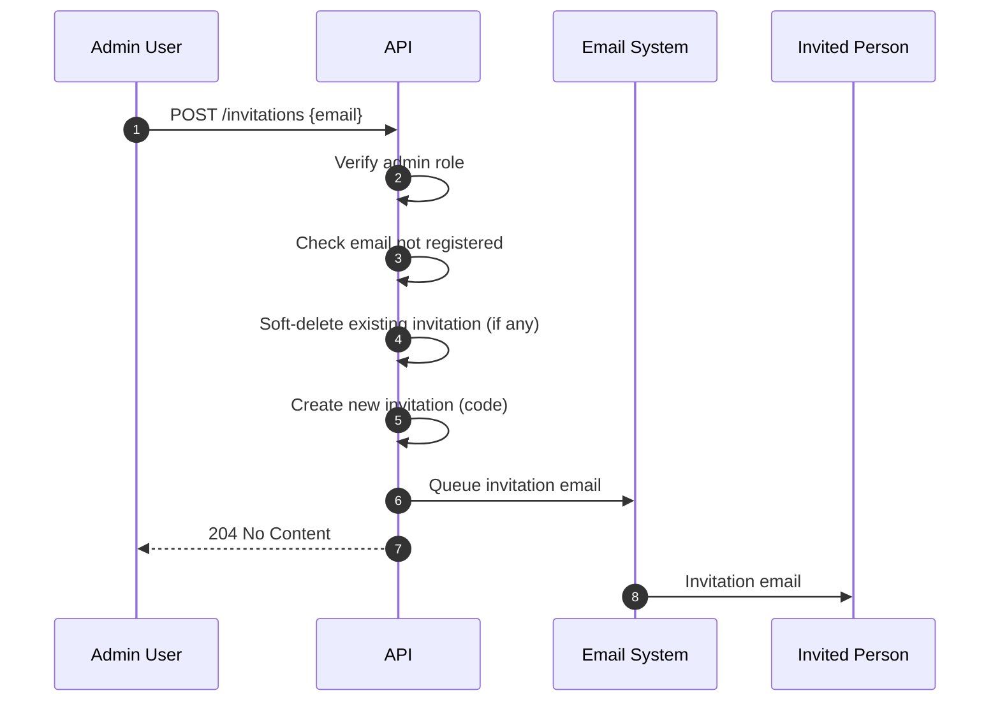
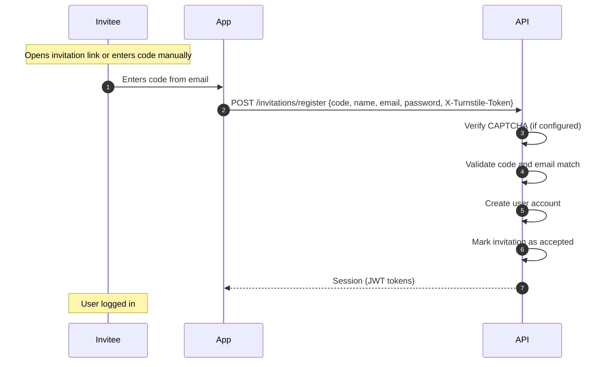
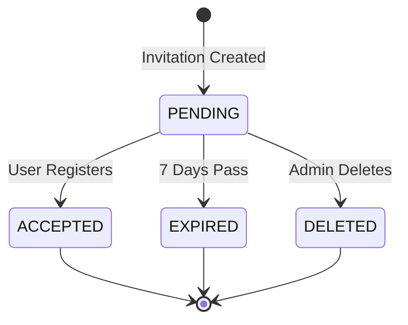

# Invitations

The invitation system allows administrators to invite new people to SkipperClub via email. Invited users receive a message with an invitation link and a fallback code to create an account.

**Business Goal:** Controlled user base growth through admin-managed invitations. Prepares infrastructure for invite-only mode where registration requires an invitation.

## Overview


## User Flows

### 1. Sending an Invitation (Admin Only)



### 2. Registration via Code



## API Endpoints

### List Invitations (Admin Only)

Get a paginated list of all invitations.

```http
GET /invitations
Authorization: Bearer <admin_access_token>
```

**Query Parameters:**

| Parameter | Type    | Default | Description                                        |
| --------- | ------- | ------- | -------------------------------------------------- |
| `status`  | string  | -       | Filter by status: `pending`, `accepted`, `expired` |
| `limit`   | integer | 20      | Max results (1-100)                                |
| `offset`  | integer | 0       | Results to skip                                    |

**Success Response:** `200 OK`

```json
{
  "invitations": [
    {
      "id": "019471a2-8e3b-7b2e-8e3b-7b2e8e3b7b2e",
      "email": "friend@example.com",
      "status": "pending",
      "expiresAt": "2024-01-24T12:00:00Z",
      "createdAt": "2024-01-17T12:00:00Z",
      "inviter": {
        "id": "019471a2-8e3b-7b2e-8e3b-7b2e8e3b7b2e",
        "name": "Admin User"
      }
    }
  ],
  "total": 42,
  "limit": 20,
  "offset": 0
}
```

**Error Responses:**

| Status | Type | Description                   |
| ------ | ---- | ----------------------------- |
| 401    | -    | Unauthorized (no valid token) |
| 403    | -    | Forbidden (not an admin)      |

---

### Send Invitation (Admin Only)

Create and send an invitation to a new user.

```http
POST /invitations
Authorization: Bearer <admin_access_token>
```

**Request Body:**

```json
{
  "email": "friend@example.com"
}
```

| Field   | Type   | Required | Constraints                     |
| ------- | ------ | -------- | ------------------------------- |
| `email` | string | Yes      | Valid email, max 320 characters |

**Success Response:** `204 No Content`

**Behavior:**

- If an active invitation already exists for the email, it is soft-deleted
- A new invitation with a fresh code is created
- A new invitation email is sent

**Error Responses:**

| Status | Type                                          | Description                   |
| ------ | --------------------------------------------- | ----------------------------- |
| 401    | -                                             | Unauthorized (no valid token) |
| 403    | -                                             | Forbidden (not an admin)      |
| 409    | `/errors/invitation-email-already-registered` | Email already has an account  |

---

### Delete Invitation (Admin Only)

Soft-delete an invitation. The invitation can no longer be used for registration.

```http
DELETE /invitations/{id}
Authorization: Bearer <admin_access_token>
```

| Parameter | Type | Description   |
| --------- | ---- | ------------- |
| `id`      | UUID | Invitation ID |

**Success Response:** `204 No Content`

**Error Responses:**

| Status | Type                           | Description                             |
| ------ | ------------------------------ | --------------------------------------- |
| 401    | -                              | Unauthorized (no valid token)           |
| 403    | -                              | Forbidden (not an admin)                |
| 404    | `/errors/invitation-not-found` | Invitation not found or already deleted |

---

### Register via Code

Complete registration using an invitation code.

```http
POST /invitations/register
X-Turnstile-Token: <turnstile_response_token>
```

**Headers:**

| Header              | Required    | Description                                                                                                    |
| ------------------- | ----------- | -------------------------------------------------------------------------------------------------------------- |
| `X-Turnstile-Token` | Conditional | Cloudflare Turnstile CAPTCHA response token. Required when `TURNSTILE_SECRET_KEY` is configured on the server. |

**Request Body:**

```json
{
  "code": "ABC12345",
  "name": "Anna Nowak",
  "email": "friend@example.com",
  "password": "SecurePass123!"
}
```

| Field      | Type   | Required | Constraints                           |
| ---------- | ------ | -------- | ------------------------------------- |
| `code`     | string | Yes      | 8 alphanumeric characters (uppercase) |
| `name`     | string | Yes      | 1-100 characters                      |
| `email`    | string | Yes      | Must match invitation email           |
| `password` | string | Yes      | 8-128 characters                      |

**Success Response:** `200 OK`

```json
{
  "id": "019471a2-8e3b-7b2e-8e3b-7b2e8e3b7b2e",
  "accessToken": "eyJhbGciOiJIUzI1NiIsInR5cCI6IkpXVCJ9...",
  "refreshToken": "eyJhbGciOiJIUzI1NiIsInR5cCI6IkpXVCJ9...",
  "expiresIn": 900,
  "user": {
    "id": "019471a2-8e3b-7b2e-8e3b-7b2e8e3b7b2e",
    "email": "friend@example.com",
    "name": "Anna Nowak",
    "avatarUrl": null,
    "role": "user"
  }
}
```

**Error Responses:**

| Status | Type                                          | Description                                          |
| ------ | --------------------------------------------- | ---------------------------------------------------- |
| 400    | `/errors/invalid-invitation`                  | Code is invalid, expired, or already used            |
| 400    | `/errors/invitation-email-mismatch`           | Email doesn't match invitation                       |
| 403    | `/errors/captcha-token-missing`               | CAPTCHA token required but not provided              |
| 403    | `/errors/captcha-verification-failed`         | CAPTCHA verification failed                          |
| 409    | `/errors/invitation-email-already-registered` | Email already has an account                         |
| 422    | `/errors/validation`                          | Validation errors in request body                    |
| 503    | `/errors/captcha-service-unavailable`         | CAPTCHA verification service temporarily unavailable |

## Invitation URL

The invitation email contains a language-specific URL linking to the registration page:

```
{WEBAPP_BASE_URL}/{lang}/register
```

**Examples:**

- English: `https://skipperclub.app/en/register`
- Polish: `https://skipperclub.app/pl/register`

The base URL is configured via `WEBAPP_BASE_URL` environment variable (default: `https://skipperclub.app`). The `/{lang}/register` path is appended automatically based on the invitation language.

### Platform Behavior

| Platform    | Technology      | Behavior                                  |
| ----------- | --------------- | ----------------------------------------- |
| **iOS**     | Universal Links | Opens app if installed, otherwise browser |
| **Android** | App Links       | Same as iOS                               |
| **Browser** | Standard URL    | Opens web registration page               |

## Email Content

The invitation email includes:

1. **CTA Button** - Link to registration page (`?invitation={code}`)
2. **Invitation Code** - 8-character fallback code
3. **Expiration Info** - Days until invitation expires
4. **Inviter Info** - Name of the admin sending the invitation

Available in: **English** and **Polish**

## Security

### Code Storage

| Aspect           | Details                                                                                                                                     |
| ---------------- | ------------------------------------------------------------------------------------------------------------------------------------------- |
| **Format**       | 8 uppercase alphanumeric characters (excluding `0`, `1`, `I`, `O`, `L` to avoid visual ambiguity; validation accepts full `[A-Z0-9]` range) |
| **Storage**      | SHA-256 hash                                                                                                                                |
| **Validity**     | 7 days (configurable)                                                                                                                       |
| **One-time use** | Yes                                                                                                                                         |

### Email Match Requirement

Registration requires the **exact email address** from the invitation. This prevents:

- Forwarding or selling invitations
- Registration by unauthorized persons

### Rate Limiting

| Layer  | Limit             | Purpose             |
| ------ | ----------------- | ------------------- |
| Per IP | 5 requests/minute | Prevent enumeration |

### CAPTCHA Protection

The registration endpoint (`POST /invitations/register`) is protected by [Cloudflare Turnstile](https://developers.cloudflare.com/turnstile/) CAPTCHA verification to prevent automated abuse.

| Aspect                 | Details                                                             |
| ---------------------- | ------------------------------------------------------------------- |
| **Provider**           | Cloudflare Turnstile                                                |
| **Protected endpoint** | `POST /invitations/register`                                        |
| **Token header**       | `X-Turnstile-Token`                                                 |
| **Verification**       | Server-side only, via Cloudflare `siteverify` API                   |
| **Kill switch**        | CAPTCHA is disabled when `TURNSTILE_SECRET_KEY` is not set or empty |

### Timing Attack Mitigation

Code verification is performed via SHA-256 hash lookup in the database, which provides consistent-time behavior regardless of input. Additionally, the send invitation endpoint applies a configurable response delay (`INVITATION_RESPONSE_DELAY_MS`) and rate limiting to further mitigate timing-based attacks.

### Attempt Counter (Brute-Force Protection)

Each invitation tracks failed verification attempts. After reaching the maximum attempt limit, the invitation is blocked:

| Trigger                            | Action                |
| ---------------------------------- | --------------------- |
| Email mismatch during registration | Increment attempts    |
| Max attempts reached               | Registration rejected |

**Configuration:**

- `INVITATION_MAX_ATTEMPTS`: Maximum failed attempts (default: 5)

> **Note:** Invalid codes do not increment the attempts counter because lookup is performed by code hash — an invalid code results in no invitation record being found. Protection against brute-force code guessing relies on rate limiting and the entropy of the invitation code (8 characters from a 30-character alphabet, ~39 bits of entropy).

> **Security:** Blocked invitations return the same generic error response as invalid invitations to prevent information leakage.

## Data Model

### Invitation Entity

| Field        | Type                 | Description                      |
| ------------ | -------------------- | -------------------------------- |
| `id`         | UUID v7              | Primary key                      |
| `inviterId`  | UUID                 | Admin who sent the invitation    |
| `inviteeId`  | UUID (nullable)      | User created from invitation     |
| `email`      | string               | Recipient email address          |
| `codeHash`   | string               | SHA-256 hash of invitation code  |
| `status`     | enum                 | `pending`, `accepted`, `expired` |
| `attempts`   | integer              | Failed verification attempts     |
| `expiresAt`  | timestamp            | Invitation expiration            |
| `acceptedAt` | timestamp (nullable) | When user registered             |
| `createdAt`  | timestamp            | Creation timestamp               |
| `deletedAt`  | timestamp (nullable) | Soft delete timestamp            |

### Invitation Status Flow



## Configuration

| Environment Variable                   | Default                   | Description                                                                              |
| -------------------------------------- | ------------------------- | ---------------------------------------------------------------------------------------- |
| `WEBAPP_BASE_URL`                      | `https://skipperclub.app` | Base domain URL for invitation links (path `/{lang}/register` is appended automatically) |
| `INVITATION_EXPIRATION_DAYS`           | 7                         | Days until invitation expires                                                            |
| `INVITATION_MAX_ATTEMPTS`              | 5                         | Maximum failed verification attempts before blocking                                     |
| `INVITATION_RESPONSE_DELAY_MS`         | 500                       | Response delay (ms) on the send invitation endpoint to mitigate timing attacks           |
| `INVITATION_CLEANUP_ENABLED`           | true                      | Enable daily cleanup of expired invitations                                              |
| `INVITATION_CLEANUP_DAYS_AFTER_EXPIRY` | 30                        | Days after expiration before deletion                                                    |
| `INVITATION_CLEANUP_BATCH_SIZE`        | 100                       | Batch size for cleanup job                                                               |
| `TURNSTILE_SECRET_KEY`                 | -                         | Cloudflare Turnstile secret key. Empty or unset disables CAPTCHA (kill switch).          |

### Fixed Values

| Parameter   | Value        | Description                              |
| ----------- | ------------ | ---------------------------------------- |
| Code length | 8 characters | Invitation code (alphanumeric uppercase) |

## Invite-Only Mode (Future)

When invite-only mode is enabled:

1. Standard registration (`POST /users`) returns error requiring invitation
2. Only code registration method works
3. Only admins can send invitations

## Error Handling

| Situation                     | Response                                    |
| ----------------------------- | ------------------------------------------- |
| Email already registered      | 409 with error message                      |
| Code invalid                  | Generic "invalid invitation" (no info leak) |
| Code expired                  | Same as invalid                             |
| Code already used             | Same as invalid                             |
| Code soft-deleted             | Same as invalid                             |
| Email doesn't match           | 400 "email doesn't match invitation"        |
| Rate limit exceeded           | 429 Too Many Requests                       |
| Invitation not found (delete) | 404                                         |
| Not admin                     | 403 Forbidden                               |

> **Security:** Code errors use generic messages to prevent information disclosure.

## Data Cleanup

A daily cron job (`InvitationsScheduler`) automatically deletes old expired invitations:

| Aspect       | Details                                                                   |
| ------------ | ------------------------------------------------------------------------- |
| **Schedule** | Daily at 3:00 AM                                                          |
| **Target**   | Invitations expired for > 30 days (configurable)                          |
| **Excluded** | Accepted invitations (preserved for inviter-invitee relationship)         |
| **Method**   | Batch deletion (100 records per batch) to avoid long-running transactions |
| **Toggle**   | Can be disabled via `INVITATION_CLEANUP_ENABLED=false`                    |

The cleanup job logs the number of deleted invitations for monitoring.

## Related

- [Authentication](../authentication/index.md) - JWT tokens and session management
- [Email](../email/index.md) - Queue-based email delivery
- [Getting Started: Errors](../getting-started/errors.md) - RFC 7807 error format
- [OpenAPI Specification](../openapi.yaml) - Full API reference
