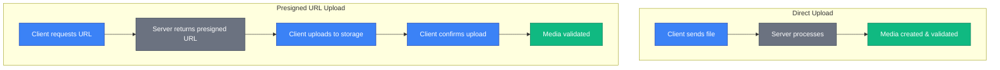
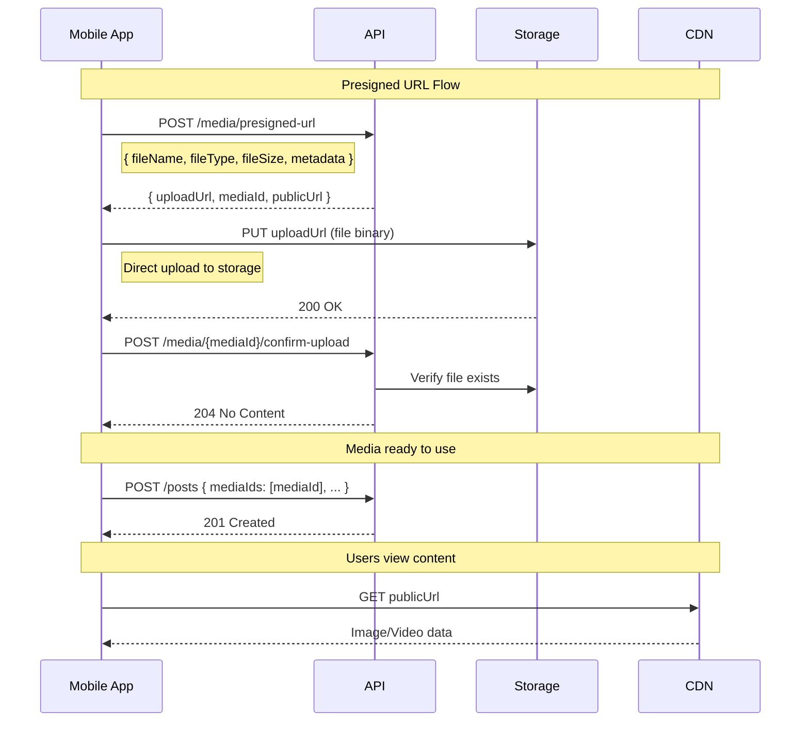

# Media

The media API enables file uploads for posts, avatars, and other user-generated content.

## Overview

SkipperClub supports two upload patterns optimized for different use cases:

1. **Direct upload** — Server processes the file (simpler, good for small files)
2. **Presigned URL** — Client uploads directly to storage (better for mobile apps, large files)

Key features include:

- **Image support** — JPEG, PNG, HEIC formats
- **Video support** — MP4 format
- **Size limits** — 10MB for images, 50MB for videos
- **Metadata extraction** — Dimensions, location, camera info
- **Status tracking** — Media lifecycle (pending → validated)

## Endpoints

| Method | Endpoint                     | Description                              |
| ------ | ---------------------------- | ---------------------------------------- |
| POST   | `/media`                     | Upload file directly                     |
| POST   | `/media/presigned-url`       | Generate presigned URL for client upload |
| POST   | `/media/{id}/confirm-upload` | Confirm presigned URL upload             |

---

## Key Concepts

### Upload Patterns



### Supported Formats

| Type  | MIME Types                              | Max Size |
| ----- | --------------------------------------- | -------- |
| Image | `image/jpeg`, `image/png`, `image/heic` | 10 MB    |
| Video | `video/mp4`                             | 50 MB    |

### Media Status

| Status      | Description                                     |
| ----------- | ----------------------------------------------- |
| `pending`   | Upload requested but not confirmed              |
| `uploaded`  | File uploaded to storage, awaiting validation   |
| `validated` | File successfully uploaded and verified         |
| `rejected`  | File rejected (invalid format, corrupted, etc.) |
| `expired`   | Upload URL expired before file was uploaded     |

### When to Use Each Pattern

| Pattern           | Best For                                                            |
| ----------------- | ------------------------------------------------------------------- |
| **Direct upload** | Web apps, small files, simple integration                           |
| **Presigned URL** | Mobile apps, large files, unreliable connections, progress tracking |

---

## Direct Upload

```http
POST /media
```

Upload a file directly to the server via multipart form data.

### Request

Content-Type: `multipart/form-data`

| Field  | Type | Required | Description                                               |
| ------ | ---- | -------- | --------------------------------------------------------- |
| `file` | file | Yes      | The file to upload                                        |
| `type` | enum | No       | Media type hint: `image` or `video` (defaults to `image`) |

### Example Request

```http
POST /v1/media HTTP/1.1
Host: api.skipperclub.app
Authorization: Bearer <token>
Content-Type: multipart/form-data; boundary=----FormBoundary

------FormBoundary
Content-Disposition: form-data; name="file"; filename="sailing-photo.jpg"
Content-Type: image/jpeg

<binary file data>
------FormBoundary--
```

### Response

**201 Created**

```json
{
  "id": "018fa2e4-8e3b-7b2e-8e3b-7b2e8e3b7b99",
  "url": "https://cdn.example.com/media/018fa2e4-8e3b-7b2e-8e3b-7b2e8e3b7b99.jpg",
  "type": "image",
  "mimetype": "image/jpeg",
  "width": 1920,
  "height": 1080
}
```

### Response Fields

| Field      | Type            | Description                     |
| ---------- | --------------- | ------------------------------- |
| `id`       | uuid            | Media UUID v7                   |
| `type`     | enum            | `image` or `video`              |
| `url`      | string          | Public URL to access the file   |
| `width`    | integer or null | Width in pixels (if available)  |
| `height`   | integer or null | Height in pixels (if available) |
| `mimetype` | string          | MIME type of the file           |

### Errors

| Status | Type                             | Description               |
| ------ | -------------------------------- | ------------------------- |
| 400    | `/errors/no-file-provided`       | No file uploaded          |
| 422    | `/errors/unsupported-media-type` | File type not allowed     |
| 422    | `/errors/validation`             | File too large or invalid |

---

## Presigned URL Upload

For better control over uploads, especially in mobile apps, use the presigned URL pattern.

### Step 1: Generate Presigned URL

```http
POST /media/presigned-url
```

Request a presigned URL for uploading directly to cloud storage.

### Request Body

| Field         | Type    | Required | Description                 |
| ------------- | ------- | -------- | --------------------------- |
| `fileName`    | string  | Yes      | Original filename           |
| `fileType`    | string  | Yes      | MIME type                   |
| `fileSize`    | integer | Yes      | File size in bytes          |
| `width`       | integer | No       | Image/video width           |
| `height`      | integer | No       | Image/video height          |
| `duration`    | number  | No       | Video duration in seconds   |
| `camera`      | string  | No       | Camera model                |
| `frameRate`   | number  | No       | Video frame rate            |
| `lat`         | number  | No       | GPS latitude (-90 to 90)    |
| `lon`         | number  | No       | GPS longitude (-180 to 180) |
| `orientation` | integer | No       | EXIF orientation (1-8)      |
| `dateTaken`   | string  | No       | ISO 8601 date when captured |
| `metadata`    | object  | No       | Additional custom metadata  |

### Example Request

```http
POST /v1/media/presigned-url HTTP/1.1
Host: api.skipperclub.app
Authorization: Bearer <token>
Content-Type: application/json

{
  "fileName": "sailing-trip.jpg",
  "fileType": "image/jpeg",
  "fileSize": 2097152,
  "width": 1920,
  "height": 1080,
  "camera": "iPhone 15 Pro",
  "lat": 54.352,
  "lon": 18.6466,
  "dateTaken": "2025-07-28T15:30:00Z"
}
```

### Response

**201 Created**

```json
{
  "uploadUrl": "https://storage.example.com/media/018fa2e4...?X-Amz-Signature=...",
  "mediaId": "018fa2e4-8e3b-7b2e-8e3b-7b2e8e3b7b99",
  "publicUrl": "https://cdn.example.com/media/018fa2e4-8e3b-7b2e-8e3b-7b2e8e3b7b99.jpg"
}
```

### Response Fields

| Field       | Type   | Description                                      |
| ----------- | ------ | ------------------------------------------------ |
| `uploadUrl` | string | Presigned URL for uploading (expires in ~15 min) |
| `mediaId`   | uuid   | Media UUID v7 to use for confirmation            |
| `publicUrl` | string | Public URL where file will be accessible         |

### Validation Errors

| Status | Type                 | When                    |
| ------ | -------------------- | ----------------------- |
| 422    | `/errors/validation` | Invalid file type       |
| 422    | `/errors/validation` | File size exceeds limit |
| 422    | `/errors/validation` | Invalid metadata values |

#### Common Validation Messages

```json
{
  "type": "/errors/validation",
  "title": "Validation Failed",
  "status": 422,
  "detail": "The request contains invalid data",
  "violations": [
    {
      "propertyPath": "fileType",
      "message": "must be one of the following types: image/jpeg, image/png, image/heic, video/mp4"
    }
  ]
}
```

```json
{
  "type": "/errors/validation",
  "title": "Validation Failed",
  "status": 422,
  "detail": "The request contains invalid data",
  "violations": [
    {
      "propertyPath": "fileSize",
      "message": "File size exceeds maximum allowed size of 10MB for image files"
    }
  ]
}
```

---

### Step 2: Upload to Storage

Upload the file directly to the presigned URL using a PUT request:

```http
PUT <uploadUrl> HTTP/1.1
Content-Type: image/jpeg

<binary file data>
```

**Important**: Use the exact `Content-Type` that was specified in the presigned URL request.

### JavaScript Example

```javascript
async function uploadToPresignedUrl(uploadUrl, file) {
  const response = await fetch(uploadUrl, {
    method: 'PUT',
    headers: {
      'Content-Type': file.type,
    },
    body: file,
  });

  if (!response.ok) {
    throw new Error('Upload failed');
  }

  return true;
}
```

---

### Step 3: Confirm Upload

```http
POST /media/{id}/confirm-upload
```

After successfully uploading to storage, confirm the upload to validate the media.

### Path Parameters

| Parameter | Type | Description                          |
| --------- | ---- | ------------------------------------ |
| `id`      | uuid | Media ID from presigned URL response |

### Example Request

```http
POST /v1/media/018fa2e4-8e3b-7b2e-8e3b-7b2e8e3b7b99/confirm-upload HTTP/1.1
Host: api.skipperclub.app
Authorization: Bearer <token>
```

### Response

**204 No Content**

### Errors

| Status | Type                             | Description                 |
| ------ | -------------------------------- | --------------------------- |
| 400    | `/errors/media-incorrect-status` | Media not in pending status |
| 404    | `/errors/media-not-found`        | Media ID doesn't exist      |

---

## Complete Upload Flow



---

## Video Upload Example

```http
POST /v1/media/presigned-url HTTP/1.1
Host: api.skipperclub.app
Authorization: Bearer <token>
Content-Type: application/json

{
  "fileName": "sailing-video.mp4",
  "fileType": "video/mp4",
  "fileSize": 52428800,
  "width": 1920,
  "height": 1080,
  "duration": 120.5,
  "frameRate": 30.0,
  "camera": "GoPro Hero 11",
  "lat": 54.352,
  "lon": 18.6466,
  "dateTaken": "2025-07-28T15:30:00Z",
  "metadata": {
    "codec": "H.264",
    "bitrate": "5000kbps"
  }
}
```

---

## Error Handling

All errors follow RFC 7807 Problem Details format:

```json
{
  "type": "/errors/media-not-found",
  "title": "Media Not Found",
  "status": 404,
  "detail": "The requested media could not be found"
}
```

### Error Types

| Type                              | Status | Description               |
| --------------------------------- | ------ | ------------------------- |
| `/errors/no-file-provided`        | 400    | No file in request        |
| `/errors/media-incorrect-status`  | 400    | Invalid status transition |
| `/errors/authentication-required` | 401    | Missing authentication    |
| `/errors/media-not-found`         | 404    | Media ID doesn't exist    |
| `/errors/unsupported-media-type`  | 422    | File type not allowed     |
| `/errors/validation`              | 422    | Request validation failed |

---

## Best Practices

1. **Use presigned URLs for mobile** — Better handling of network issues and progress
2. **Include metadata when available** — Improves content organization and search
3. **Validate file size client-side** — Avoid wasting bandwidth on oversized files
4. **Handle upload failures** — Implement retry logic for network errors
5. **Show upload progress** — Use presigned URL pattern for progress tracking
6. **Compress before upload** — Reduce file size while maintaining quality
7. **Respect size limits** — 10MB for images, 50MB for videos

---

## Related

- [Posts](../posts/index.md) — Create posts with media
- [Users](../users/index.md) — Avatar upload endpoints
- [Error Handling](../getting-started/errors.md) — RFC 7807 format
