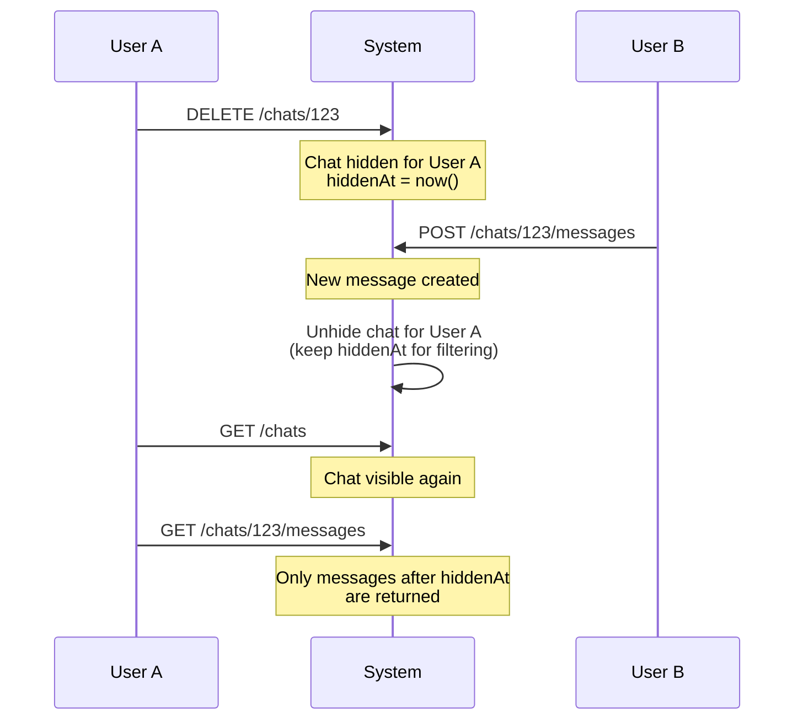

# Chats REST API

This document covers all REST API endpoints for chat and message management.

## Endpoints

| Method | Endpoint                               | Description                          |
| ------ | -------------------------------------- | ------------------------------------ |
| GET    | `/chats`                               | List user's chats                    |
| POST   | `/chats`                               | Create new chat                      |
| GET    | `/chats/{chatId}`                      | Get chat metadata                    |
| DELETE | `/chats/{chatId}`                      | Hide chat from list                  |
| GET    | `/chats/{chatId}/messages`             | List chat messages                   |
| POST   | `/chats/{chatId}/messages`             | Send message                         |
| PATCH  | `/chats/{chatId}/messages/{messageId}` | Update message (mark as read)        |
| GET    | `/chats/unread-count`                  | Get total unread count               |
| GET    | `/chats/presence`                      | Presence snapshot of co-participants |
| POST   | `/chats/actions`                       | Perform bulk actions on chats        |

---

## List Chats

```http
GET /chats
```

Retrieve a paginated list of chats for the current user. Returns chats of all types (1:1, group, cruise-related).

### Query Parameters

| Parameter | Type    | Default     | Description                                                                    |
| --------- | ------- | ----------- | ------------------------------------------------------------------------------ |
| `type`    | enum    | —           | Filter by chat type (`ONE_TO_ONE`, `GROUP`, `CRUISE_QNA`, `CRUISE_GROUP`)      |
| `search`  | string  | —           | Search by chat name only (participant names are not searched)                  |
| `limit`   | integer | 20          | Results per page (1-100)                                                       |
| `cursor`  | string  | —           | Keyset cursor: only chats older than it in `(updatedAt, id)` ordering          |
| `offset`  | integer | 0           | Results to skip — **deprecated**, use `cursor` (mutually exclusive with it)    |
| `sort`    | string  | `updatedAt` | Sort field (`createdAt`, `updatedAt`, `name`); a `cursor` requires the default |
| `order`   | string  | `desc`      | Sort order (`asc`, `desc`); a `cursor` requires the default `desc`             |

### Paging modes

The endpoint supports two paging modes; a request must pick one.

- **Offset paging** (`offset`) — deprecated. The list is ordered by
  `updatedAt` and reorders whenever a chat receives a message, so every
  reorder between two page fetches makes offset paging repeat or skip a chat.
  Kept for backward compatibility only.
- **Keyset paging** (`cursor`) — anchored to a `(updatedAt, id)` position
  instead of a count, so reordering cannot move it. `nextCursor` in the
  response is the opaque cursor of the page's last chat; pass it back
  verbatim as `cursor` for the next page. It is `null` exactly when the page
  is the last one — and always `null` for a non-default `sort`/`order`,
  which the cursor cannot describe. Ties on `updatedAt` are broken by `id`
  (descending), so page boundaries are deterministic.

Combining `cursor` with `offset` (including `offset=0`), with a `sort` other
than `updatedAt`, or with `order=asc` returns `400 /errors/bad-request`, as
does a cursor that does not decode. Treat the value as opaque — never
construct one client-side.

A chat that receives a message while you are paging moves to the head of the
list, above the cursor: it will not appear again in the remaining pages (no
duplicates), and you pick it up from the `message:received` /
`message:new` realtime events or the next reload of page one. With a
`cursor`, `total` counts only the chats remaining past the cursor's position.

### Example Requests

```http
GET /v1/chats HTTP/1.1
Host: api.skipperclub.app
Authorization: Bearer <token>
```

```http
GET /v1/chats?type=ONE_TO_ONE HTTP/1.1
Host: api.skipperclub.app
Authorization: Bearer <token>
```

```http
GET /v1/chats?search=crew HTTP/1.1
Host: api.skipperclub.app
Authorization: Bearer <token>
```

```http
GET /v1/chats?limit=20&cursor=MjAyNi0wNy0yMlQxMDoxNToxMi4zNDU2N1p8MDE5MWZhMmUtOGUzYi03YjJlLThlM2ItN2IyZThlM2I3YzAy HTTP/1.1
Host: api.skipperclub.app
Authorization: Bearer <token>
```

### Response

**200 OK**

```json
{
  "chats": [
    {
      "id": "018fa2e4-8e3b-7b2e-8e3b-7b2e8e3b7b99",
      "type": "ONE_TO_ONE",
      "name": null,
      "participants": [
        {
          "id": "018fa2e4-8e3b-7b2e-8e3b-7b2e8e3b7b00",
          "name": "Jan Kowalski",
          "avatarUrl": "https://cdn.example.com/avatars/jan.jpg"
        },
        {
          "id": "018fa2e4-8e3b-7b2e-8e3b-7b2e8e3b7b01",
          "name": "Anna Nowak",
          "avatarUrl": null
        }
      ],
      "lastMessage": {
        "id": "018fa2e4-8e3b-7b2e-8e3b-7b2e8e3b7c01",
        "chatId": "018fa2e4-8e3b-7b2e-8e3b-7b2e8e3b7b99",
        "text": "See you at the marina!",
        "read": true,
        "createdAt": "2025-11-23T14:30:00Z",
        "updatedAt": "2025-11-23T14:30:00Z",
        "user": {
          "id": "018fa2e4-8e3b-7b2e-8e3b-7b2e8e3b7b00",
          "name": "Jan Kowalski",
          "avatarUrl": "https://cdn.example.com/avatars/jan.jpg"
        }
      },
      "lastReadMessageId": "018fa2e4-8e3b-7b2e-8e3b-7b2e8e3b7c01",
      "relatedCruiseId": null,
      "unreadCount": 0,
      "updatedAt": "2025-11-23T14:30:00Z"
    },
    {
      "id": "018fa2e4-8e3b-7b2e-8e3b-7b2e8e3b7b98",
      "type": "GROUP",
      "name": "Summer Sailing Crew",
      "participants": [
        {
          "id": "018fa2e4-8e3b-7b2e-8e3b-7b2e8e3b7b00",
          "name": "Jan Kowalski",
          "avatarUrl": "https://cdn.example.com/avatars/jan.jpg"
        },
        {
          "id": "018fa2e4-8e3b-7b2e-8e3b-7b2e8e3b7b02",
          "name": "Piotr Wiśniewski",
          "avatarUrl": null
        },
        {
          "id": "018fa2e4-8e3b-7b2e-8e3b-7b2e8e3b7b03",
          "name": "Maria Lewandowska",
          "avatarUrl": null
        }
      ],
      "lastMessage": null,
      "lastReadMessageId": null,
      "relatedCruiseId": null,
      "unreadCount": 3,
      "updatedAt": "2025-11-23T10:00:00Z"
    }
  ],
  "total": 5,
  "limit": 20,
  "offset": 0,
  "nextCursor": null
}
```

`nextCursor` is `null` here because the page is the last one; a page with more
chats behind it carries the opaque cursor of its last chat.

---

## Create Chat

```http
POST /chats
```

Create a new chat. Friendship between participants is not required. For 1:1 chats, returns the existing chat if one already exists between the participants.

### Request Body

| Field            | Type   | Required    | Description                                                        |
| ---------------- | ------ | ----------- | ------------------------------------------------------------------ |
| `participantIds` | uuid[] | Yes         | User IDs to include in the chat (1-50 IDs, not including yourself) |
| `name`           | string | Conditional | Chat name (required for group chats, max 100 chars)                |

### Chat Type Determination

The current user is automatically added to the participant list. Chat type is determined by the **total** number of participants:

- **2 total participants** (1 in request + you): Creates `ONE_TO_ONE` chat
- **3+ total participants** (2+ in request + you): Creates `GROUP` chat (requires `name`)

> **Note**: When creating a 1:1 chat, do not include your own user ID in `participantIds`. The server adds you automatically.

### Example Requests

```http
POST /v1/chats HTTP/1.1
Host: api.skipperclub.app
Authorization: Bearer <token>
Content-Type: application/json

{
  "participantIds": ["018fa2e4-8e3b-7b2e-8e3b-7b2e8e3b7b02"]
}
```

```http
POST /v1/chats HTTP/1.1
Host: api.skipperclub.app
Authorization: Bearer <token>
Content-Type: application/json

{
  "participantIds": [
    "018fa2e4-8e3b-7b2e-8e3b-7b2e8e3b7b02",
    "018fa2e4-8e3b-7b2e-8e3b-7b2e8e3b7b03"
  ],
  "name": "Summer Sailing Crew"
}
```

### Response

**201 Created**

```
Location: /v1/chats/018fa2e4-8e3b-7b2e-8e3b-7b2e8e3b7b99
```

```json
{
  "id": "018fa2e4-8e3b-7b2e-8e3b-7b2e8e3b7b99",
  "type": "ONE_TO_ONE",
  "name": null,
  "participants": [
    {
      "id": "018fa2e4-8e3b-7b2e-8e3b-7b2e8e3b7b00",
      "name": "Jan Kowalski",
      "avatarUrl": null
    },
    {
      "id": "018fa2e4-8e3b-7b2e-8e3b-7b2e8e3b7b02",
      "name": "Piotr Wiśniewski",
      "avatarUrl": null
    }
  ],
  "lastMessage": null,
  "lastReadMessageId": null,
  "relatedCruiseId": null,
  "unreadCount": 0,
  "updatedAt": "2025-11-23T12:00:00Z"
}
```

### 1:1 Chat Deduplication

When creating a 1:1 chat with an existing conversation partner, the system returns the existing chat:

```http
POST /v1/chats HTTP/1.1
Host: api.skipperclub.app
Authorization: Bearer <token>
Content-Type: application/json

{
  "participantIds": ["018fa2e4-8e3b-7b2e-8e3b-7b2e8e3b7b02"]
}
```

Returns: `{ "id": "abc123", "type": "ONE_TO_ONE", ... }`

Second request returns same chat with ID `abc123`.

### Errors

| Status | Type                               | Description                                             |
| ------ | ---------------------------------- | ------------------------------------------------------- |
| 422    | `/errors/validation`               | Invalid request (missing fields, too many participants) |
| 422    | `/errors/group-chat-name-required` | Group chat requires a name                              |
| 422    | `/errors/invalid-participants`     | One or more participant IDs don't exist                 |

---

## Get Chat

```http
GET /chats/{chatId}
```

Retrieve metadata for a specific chat.

### Path Parameters

| Parameter | Type | Description  |
| --------- | ---- | ------------ |
| `chatId`  | uuid | Chat UUID v7 |

### Example Request

```http
GET /v1/chats/018fa2e4-8e3b-7b2e-8e3b-7b2e8e3b7b99 HTTP/1.1
Host: api.skipperclub.app
Authorization: Bearer <token>
```

### Response

**200 OK**

```json
{
  "id": "018fa2e4-8e3b-7b2e-8e3b-7b2e8e3b7b99",
  "type": "ONE_TO_ONE",
  "name": null,
  "participants": [
    {
      "id": "018fa2e4-8e3b-7b2e-8e3b-7b2e8e3b7b00",
      "name": "Jan Kowalski",
      "avatarUrl": null
    },
    {
      "id": "018fa2e4-8e3b-7b2e-8e3b-7b2e8e3b7b02",
      "name": "Piotr Wiśniewski",
      "avatarUrl": null
    }
  ],
  "lastMessage": {
    "id": "018fa2e4-8e3b-7b2e-8e3b-7b2e8e3b7c01",
    "chatId": "018fa2e4-8e3b-7b2e-8e3b-7b2e8e3b7b99",
    "text": "See you at the marina!",
    "read": true,
    "createdAt": "2025-11-23T14:30:00Z",
    "updatedAt": "2025-11-23T14:30:00Z",
    "user": {
      "id": "018fa2e4-8e3b-7b2e-8e3b-7b2e8e3b7b00",
      "name": "Jan Kowalski",
      "avatarUrl": null
    }
  },
  "lastReadMessageId": "018fa2e4-8e3b-7b2e-8e3b-7b2e8e3b7c01",
  "relatedCruiseId": null,
  "unreadCount": 0,
  "updatedAt": "2025-11-23T14:30:00Z"
}
```

### Errors

| Status | Type                     | Description                                     |
| ------ | ------------------------ | ----------------------------------------------- |
| 404    | `/errors/chat-not-found` | Chat doesn't exist or user is not a participant |

---

## Hide Chat

```http
DELETE /chats/{chatId}
```

Hide a chat from the current user's chat list. This implements Messenger-like "delete conversation" behavior — the chat is hidden, not permanently deleted.

### Path Parameters

| Parameter | Type | Description  |
| --------- | ---- | ------------ |
| `chatId`  | uuid | Chat UUID v7 |

### Example Request

```http
DELETE /v1/chats/018fa2e4-8e3b-7b2e-8e3b-7b2e8e3b7b99 HTTP/1.1
Host: api.skipperclub.app
Authorization: Bearer <token>
```

### Response

**204 No Content**

### Chat Hiding Behavior

When a user hides a chat:

1. **Chat disappears** from the user's chat list
2. **Old messages are hidden** — the user cannot see messages sent before hiding
3. **New messages restore visibility** — when someone sends a new message, the chat reappears
4. **Only new messages are visible** — the user sees only messages sent after they hid the chat



This allows users to "clean up" their chat list without affecting other participants, while ensuring they receive new messages.

### Errors

| Status | Type                            | Description                              |
| ------ | ------------------------------- | ---------------------------------------- |
| 404    | `/errors/chat-not-found`        | Chat doesn't exist                       |
| 403    | `/errors/chat-access-forbidden` | Chat exists but user isn't a participant |

---

## List Messages

```http
GET /chats/{chatId}/messages
```

Retrieve messages from a chat with pagination and filtering options.

### Path Parameters

| Parameter | Type | Description  |
| --------- | ---- | ------------ |
| `chatId`  | uuid | Chat UUID v7 |

### Query Parameters

| Parameter  | Type    | Default     | Description                                |
| ---------- | ------- | ----------- | ------------------------------------------ |
| `fromDate` | date    | —           | Messages from this date (inclusive)        |
| `toDate`   | date    | —           | Messages until this date (inclusive)       |
| `read`     | boolean | —           | Filter by read status                      |
| `limit`    | integer | 20          | Results per page (1-100)                   |
| `offset`   | integer | 0           | Results to skip                            |
| `before`   | string  | —           | Keyset cursor: only messages older than it |
| `after`    | string  | —           | Keyset cursor: only messages newer than it |
| `sort`     | string  | `createdAt` | Sort field                                 |
| `order`    | string  | `desc`      | Sort order (`asc`, `desc`)                 |

### Paging modes

The endpoint supports two paging modes; a request must pick one.

- **Offset paging** (`offset`) — simple, but not stable while the chat grows.
  The list is ordered by `createdAt` and grows at the head, so every message
  that arrives between two page fetches shifts the window by one and one older
  message is silently skipped.
- **Keyset paging** (`before` / `after`) — anchored to a position instead of a
  count, so concurrent arrivals cannot move it. Recommended for history
  scrolling and for catch-up after a WebSocket reconnect.

Mixing them is rejected rather than silently resolved: `before` together with
`after`, either of them together with `offset` (including `offset=0`), and
either of them together with `sort=updatedAt` all return `400`
`/errors/bad-request`, as does a cursor that does not decode. The cursor name
must also agree with the sort direction — `before` promises strictly older
messages and requires `order=desc` (the default), `after` promises strictly
newer ones and requires an explicit `order=asc`; the mismatched combinations
(`before`+`asc`, `after`+`desc`) are a `400` too, never pages silently served
from the wrong side of the cursor.

### Cursors

`nextCursor` in the response is an opaque string built from the last message of
the page. Pass it back verbatim as `before` (in the default `order=desc`) or as
`after` (in `order=asc`) to get the next page. It is `null` exactly when the
page is the last one — and always `null` for `sort=updatedAt` pages, which the
cursor cannot describe.

Treat the value as opaque: its contents are an implementation detail and may
change. Do not construct one client-side; start the first page without a cursor
and follow `nextCursor` from there.

All other filters (`fromDate`, `toDate`, `read`, `limit`) keep working
alongside a cursor — repeat them unchanged on every page of a walk (`order` is
fixed by the cursor name: `desc` for `before`, `asc` for `after`). Note that
with a cursor, `total` counts the messages remaining on the cursor's side of
the history, not the whole chat.

### Catch-up loop

To reconcile after a reconnect, page backwards until a message the client
already holds appears:

```
GET /v1/chats/{chatId}/messages?limit=50
  → render page, remember nextCursor
GET /v1/chats/{chatId}/messages?limit=50&before={nextCursor}
  → stop when a known message id shows up, or when nextCursor is null
```

Walking forward works the same way with `order=asc` and `after`. Cursors cannot
be derived from a message id, so a forward walk needs a starting position: keep
the `nextCursor` of an earlier page, or fetch `?limit=1` in the default
descending order and use that response's `nextCursor`, which points at the
newest message (it is `null` when that message is the only one in the chat —
there is then nothing to walk forward to).

### Example Requests

```http
GET /v1/chats/018fa2e4-8e3b-7b2e-8e3b-7b2e8e3b7b99/messages HTTP/1.1
Host: api.skipperclub.app
Authorization: Bearer <token>
```

```http
GET /v1/chats/018fa2e4-8e3b-7b2e-8e3b-7b2e8e3b7b99/messages?read=false HTTP/1.1
Host: api.skipperclub.app
Authorization: Bearer <token>
```

```http
GET /v1/chats/018fa2e4-8e3b-7b2e-8e3b-7b2e8e3b7b99/messages?fromDate=2025-11-01&toDate=2025-11-30 HTTP/1.1
Host: api.skipperclub.app
Authorization: Bearer <token>
```

```http
GET /v1/chats/018fa2e4-8e3b-7b2e-8e3b-7b2e8e3b7b99/messages?order=asc&limit=50 HTTP/1.1
Host: api.skipperclub.app
Authorization: Bearer <token>
```

### Response

**200 OK**

```json
{
  "messages": [
    {
      "id": "018fa2e4-8e3b-7b2e-8e3b-7b2e8e3b7c02",
      "chatId": "018fa2e4-8e3b-7b2e-8e3b-7b2e8e3b7b99",
      "text": "See you at the marina!",
      "read": true,
      "createdAt": "2025-11-23T14:30:00Z",
      "updatedAt": "2025-11-23T14:30:00Z",
      "user": {
        "id": "018fa2e4-8e3b-7b2e-8e3b-7b2e8e3b7b00",
        "name": "Jan Kowalski",
        "avatarUrl": "https://cdn.example.com/avatars/jan.jpg"
      }
    },
    {
      "id": "018fa2e4-8e3b-7b2e-8e3b-7b2e8e3b7c01",
      "chatId": "018fa2e4-8e3b-7b2e-8e3b-7b2e8e3b7b99",
      "text": "What time should I arrive?",
      "read": true,
      "createdAt": "2025-11-23T14:25:00Z",
      "updatedAt": "2025-11-23T14:25:00Z",
      "user": {
        "id": "018fa2e4-8e3b-7b2e-8e3b-7b2e8e3b7b02",
        "name": "Piotr Wiśniewski",
        "avatarUrl": null
      }
    }
  ],
  "total": 42,
  "limit": 20,
  "offset": 0,
  "nextCursor": "MjAyNS0xMS0yM1QxNDoyNTowMFp8MDE4ZmEyZTQtOGUzYi03YjJlLThlM2ItN2IyZThlM2I3YzAx"
}
```

### Hidden Messages

If the user previously hid the chat (via `DELETE /chats/{chatId}`), only messages created after the hiding timestamp are returned. This ensures a "fresh start" experience.

### Errors

| Status | Type                            | Description                                                  |
| ------ | ------------------------------- | ------------------------------------------------------------ |
| 400    | `/errors/bad-request`           | Malformed cursor, or a rejected paging-parameter combination |
| 404    | `/errors/chat-not-found`        | Chat doesn't exist                                           |
| 403    | `/errors/chat-access-forbidden` | Chat exists but user isn't a participant                     |

---

## Send Message

```http
POST /chats/{chatId}/messages
```

Send a new message to a chat.

### Path Parameters

| Parameter | Type | Description  |
| --------- | ---- | ------------ |
| `chatId`  | uuid | Chat UUID v7 |

### Request Body

| Field             | Type   | Required | Description                                                                                                                                    |
| ----------------- | ------ | -------- | ---------------------------------------------------------------------------------------------------------------------------------------------- |
| `text`            | string | Yes      | Message content (max 1000 characters)                                                                                                          |
| `clientMessageId` | uuid   | No       | Client-generated idempotency key, unique per (chat, sender). Any UUID version is accepted — it is a client identifier, not a server entity id. |

### Idempotent sends

When `clientMessageId` is provided, retrying the same send (same chat, same
sender, same key) returns `201 Created` with the **already-created** message
object instead of creating a duplicate, and emits no second round of
WebSocket events. Use it to retry safely after a network failure. Without
`clientMessageId`, every request creates a new message (previous behavior,
unchanged). The same key space is shared with the WS `message:send`
operation.

### Example Request

```http
POST /v1/chats/018fa2e4-8e3b-7b2e-8e3b-7b2e8e3b7b99/messages HTTP/1.1
Host: api.skipperclub.app
Authorization: Bearer <token>
Content-Type: application/json

{
  "text": "Looking forward to the trip!",
  "clientMessageId": "6f1e0c2a-9b1d-4a7e-8c3f-2d5b8a91c0de"
}
```

### Response

**201 Created**

```
Location: /v1/chats/018fa2e4-8e3b-7b2e-8e3b-7b2e8e3b7b99/messages/018fa2e4-8e3b-7b2e-8e3b-7b2e8e3b7c03
```

```json
{
  "id": "018fa2e4-8e3b-7b2e-8e3b-7b2e8e3b7c03",
  "chatId": "018fa2e4-8e3b-7b2e-8e3b-7b2e8e3b7b99",
  "text": "Looking forward to the trip!",
  "read": true,
  "createdAt": "2025-11-23T15:00:00Z",
  "updatedAt": "2025-11-23T15:00:00Z",
  "clientMessageId": "6f1e0c2a-9b1d-4a7e-8c3f-2d5b8a91c0de",
  "user": {
    "id": "018fa2e4-8e3b-7b2e-8e3b-7b2e8e3b7b00",
    "name": "Jan Kowalski",
    "avatarUrl": null
  }
}
```

The response echoes the `clientMessageId` the sender supplied (on the original
send and on an idempotent replay), so the sender can match the `201` to its
optimistic entry by key — the same reconciliation the WebSocket events allow.
It is omitted when the send carried no key, and on the list and read paths.

### Side Effects

When a message is sent:

1. **Chat is updated** — `lastMessage` and `updatedAt` are refreshed
2. **Hidden chats reappear** — Users who hid the chat will see it again
3. **Unread counts increase** — For all participants except the sender
4. **WebSocket events** — `message:new` is broadcast to the chat room and
   `message:received` to every other participant's personal room — exactly
   the same events as a WS `message:send` (see
   [Transport parity](./websocket.md#transport-parity-rest--websocket))

An idempotent replay (repeated `clientMessageId`) has none of these side
effects — it only returns the existing message.

### Errors

| Status | Type                            | Description                              |
| ------ | ------------------------------- | ---------------------------------------- |
| 404    | `/errors/chat-not-found`        | Chat doesn't exist                       |
| 403    | `/errors/chat-access-forbidden` | Chat exists but user isn't a participant |
| 422    | `/errors/validation`            | Invalid message (empty or too long)      |

---

## Update Message (Mark as Read/Unread)

```http
PATCH /chats/{chatId}/messages/{messageId}
```

Update a specific message read status.

### Path Parameters

| Parameter   | Type | Description     |
| ----------- | ---- | --------------- |
| `chatId`    | uuid | Chat UUID v7    |
| `messageId` | uuid | Message UUID v7 |

### Request Body

| Field  | Type    | Required | Description                                   |
| ------ | ------- | -------- | --------------------------------------------- |
| `read` | boolean | Yes      | Mark message as read (true) or unread (false) |

### Example Request - Mark as Read

```http
PATCH /v1/chats/018fa2e4-8e3b-7b2e-8e3b-7b2e8e3b7b99/messages/018fa2e4-8e3b-7b2e-8e3b-7b2e8e3b7c02 HTTP/1.1
Host: api.skipperclub.app
Authorization: Bearer <token>
Content-Type: application/json

{
  "read": true
}
```

### Example Request - Mark as Unread

```http
PATCH /v1/chats/018fa2e4-8e3b-7b2e-8e3b-7b2e8e3b7b99/messages/018fa2e4-8e3b-7b2e-8e3b-7b2e8e3b7c02 HTTP/1.1
Host: api.skipperclub.app
Authorization: Bearer <token>
Content-Type: application/json

{
  "read": false
}
```

### Response

**204 No Content**

### Side Effects

Marking as read (`"read": true`) broadcasts a `message:read` receipt
(`{messageId, userId, readAt}`) to the chat room — the same event the WS
`message:read` operation produces. Receipts are cascading: a receipt for
message M means the reader has read M and every earlier message in the chat
(see [Read receipts are cascading](./websocket.md#read-receipts-are-cascading)).
Marking as unread (`"read": false`) emits no WebSocket event.

The caller's `lastReadMessageId` pointer only advances: marking an older
message read records its per-message receipt but leaves the pointer (and so
`unreadCount` and the chat list's `lastMessage.read`) untouched.

### Errors

| Status | Type                            | Description                              |
| ------ | ------------------------------- | ---------------------------------------- |
| 404    | `/errors/chat-not-found`        | Chat doesn't exist                       |
| 403    | `/errors/chat-access-forbidden` | Chat exists but user isn't a participant |
| 404    | `/errors/message-not-found`     | Message doesn't exist in this chat       |

---

## Bulk Chat Actions

```http
POST /chats/actions
```

Perform bulk operations on multiple chats.

### Request Body

| Field     | Type   | Required | Description                                                                |
| --------- | ------ | -------- | -------------------------------------------------------------------------- |
| `action`  | enum   | Yes      | Action to perform: `mark-read` or `delete`                                 |
| `chatIds` | uuid[] | Yes      | Non-empty array of chat IDs to perform action on (no upper bound enforced) |

### Actions

| Action      | Description                                  |
| ----------- | -------------------------------------------- |
| `mark-read` | Mark all messages in specified chats as read |
| `delete`    | Hide specified chats from chat list          |

### Example Requests

**Mark multiple chats as read**

```http
POST /v1/chats/actions HTTP/1.1
Host: api.skipperclub.app
Authorization: Bearer <token>
Content-Type: application/json

{
  "action": "mark-read",
  "chatIds": [
    "018fa2e4-8e3b-7b2e-8e3b-7b2e8e3b7b99",
    "018fa2e4-8e3b-7b2e-8e3b-7b2e8e3b7b98"
  ]
}
```

**Hide multiple chats**

```http
POST /v1/chats/actions HTTP/1.1
Host: api.skipperclub.app
Authorization: Bearer <token>
Content-Type: application/json

{
  "action": "delete",
  "chatIds": [
    "018fa2e4-8e3b-7b2e-8e3b-7b2e8e3b7b99"
  ]
}
```

### Response

**204 No Content**

### Behavior

**mark-read action**:

- Marks all messages in the specified chats as read for the current user
- Updates `lastReadMessageId` to the most recent message in each chat
- Updates unread counts
- Broadcasts one WebSocket `message:read` receipt per chat where at least
  one message actually transitioned from unread to read, carrying the newest
  such message (`{messageId, userId, readAt}`) to that chat's room. Receipts
  are cascading — the one receipt covers every earlier message — so chats
  with nothing newly marked emit no event (see
  [Read receipts are cascading](./websocket.md#read-receipts-are-cascading))

**delete action**:

- Hides the specified chats from the user's chat list
- Old messages become invisible
- Chat reappears when someone sends a new message
- Only new messages (after hiding) are visible

See [Chat Hiding Behavior](#chat-hiding-behavior) for details.

### Errors

| Status | Type                               | Description                                                    |
| ------ | ---------------------------------- | -------------------------------------------------------------- |
| 400    | `/errors/invalid-chat-bulk-action` | Invalid action or empty chatIds array                          |
| 404    | `/errors/chat-not-found`           | One or more chats don't exist                                  |
| 403    | `/errors/chat-access-forbidden`    | One or more chats exist but user isn't a participant           |
| 422    | `/errors/validation`               | Request contains validation errors (e.g., invalid UUID format) |

---

## Get Unread Count

```http
GET /chats/unread-count
```

Get the total number of unread messages across all chats for the current user.

### Example Request

```http
GET /v1/chats/unread-count HTTP/1.1
Host: api.skipperclub.app
Authorization: Bearer <token>
```

### Response

**200 OK**

```json
{
  "totalUnread": 23
}
```

This endpoint is useful for displaying a badge or indicator showing the total number of unread messages.

---

## Get Presence Snapshot

```http
GET /chats/presence
```

Returns the current online state of the caller's **chat co-participants** — the
same audience the `presence:update` WebSocket event is delivered to (users who
share at least one chat with the caller), never arbitrary users. There are no
query parameters: the scope is fixed to "all my chat co-participants".

Clients use this to **seed** presence right after every WebSocket (re)connect,
then apply live `presence:update` events on top — see the presence lifecycle
and the mandatory snapshot-vs-live race rule in
[websocket.md](./websocket.md#seeding-presence-after-reconnect).

### Example Request

```http
GET /v1/chats/presence HTTP/1.1
Host: api.skipperclub.app
Authorization: Bearer <token>
```

### Response

**200 OK**

```json
{
  "items": [
    {
      "userId": "018fa2e4-8e3b-7b2e-8e3b-7b2e8e3b7b2e",
      "isOnline": true,
      "lastSeen": null
    },
    {
      "userId": "018fa2e4-8e3b-7b2e-8e3b-7b2e8e3b7b2f",
      "isOnline": false,
      "lastSeen": "2026-07-18T09:41:12Z"
    }
  ]
}
```

| Field      | Type              | Description                                                                  |
| ---------- | ----------------- | ---------------------------------------------------------------------------- |
| `userId`   | uuid              | A chat co-participant of the caller                                          |
| `isOnline` | boolean           | Whether the user currently holds at least one live WebSocket connection      |
| `lastSeen` | date-time \| null | Persisted moment the user's last connection closed; ignored while `isOnline` |

`lastSeen` is `null` when the user has never cleanly disconnected since the
field was introduced. When `isOnline` is `true`, clients should display
"online" and ignore `lastSeen`. A user whose API instance was crash-killed may
read as online until presence self-heals, and their `lastSeen` stays null or
stale until their next clean disconnect.

The result is an empty array (`{"items": []}`, **not** a 404) when the caller
shares no chat with anyone. The only error is `401` — the caller always exists.

---

## Error Handling

All errors follow RFC 7807 Problem Details format:

```json
{
  "type": "/errors/chat-not-found",
  "title": "Chat Not Found",
  "status": 404,
  "detail": "The requested chat could not be found"
}
```

### Error Types

| Type                               | Status | Description                                |
| ---------------------------------- | ------ | ------------------------------------------ |
| `/errors/chat-not-found`           | 404    | Chat doesn't exist                         |
| `/errors/chat-access-forbidden`    | 403    | Chat exists but user isn't a participant   |
| `/errors/message-not-found`        | 404    | Message doesn't exist in this chat         |
| `/errors/invalid-chat-bulk-action` | 400    | Invalid bulk action or empty chatIds array |
| `/errors/validation`               | 422    | Request validation failed                  |
| `/errors/group-chat-name-required` | 422    | Group chats must have a name               |
| `/errors/invalid-participants`     | 422    | One or more participant IDs are invalid    |
| `/errors/authentication-required`  | 401    | Missing or invalid authentication          |

---

## Common Patterns

### Chat List UI

```javascript
// Load chat list
const response = await fetch("/v1/chats?limit=20", {
  headers: { Authorization: `Bearer ${token}` },
});
const { chats, total } = await response.json();

// Display chats with unread indicators
chats.forEach((chat) => {
  const badge = chat.unreadCount > 0 ? `(${chat.unreadCount})` : "";
  const name = chat.name || getOtherParticipant(chat).name;
  console.log(`${name} ${badge}`);
});
```

### Infinite Scroll Messages

Page backwards with the `before` keyset cursor (see [Paging modes](#paging-modes)) —
never with `offset`, which skips one older message for every message that
arrives between two page fetches:

```javascript
let nextCursor = null; // opaque; always the previous response's nextCursor
let exhausted = false;
const limit = 20;

async function loadMoreMessages(chatId) {
  if (exhausted) return { messages: [], hasMore: false };
  const cursorParam = nextCursor
    ? `&before=${encodeURIComponent(nextCursor)}`
    : "";
  const response = await fetch(
    `/v1/chats/${chatId}/messages?limit=${limit}&order=desc${cursorParam}`,
    { headers: { Authorization: `Bearer ${token}` } },
  );
  const { messages, nextCursor: cursor } = await response.json();

  nextCursor = cursor; // null on the last page
  exhausted = cursor === null;
  return { messages, hasMore: !exhausted };
}
```

The chat list itself paginates the same way: follow `nextCursor` from
`GET /v1/chats` and pass it back as `cursor`.

### Real-time + REST Hybrid

```javascript
// Initial load via REST
const response = await fetch(`/v1/chats/${chatId}/messages`, {
  headers: { Authorization: `Bearer ${token}` },
});
const { messages } = await response.json();
displayMessages(messages);

// Real-time updates via WebSocket ({event, data} JSON frames — see websocket.md)
socket.addEventListener("message", ({ data }) => {
  const frame = JSON.parse(data);
  if (frame.event !== "message:new") return;
  const newMessage = frame.data;
  if (newMessage.chatId === chatId) {
    appendMessage(newMessage);

    // Mark as read if chat is open
    fetch(`/v1/chats/${chatId}/messages/${newMessage.id}`, {
      method: "PATCH",
      headers: {
        Authorization: `Bearer ${token}`,
        "Content-Type": "application/json",
      },
      body: JSON.stringify({ read: true }),
    });
  }
});
```

---

## Related

- [Messages Overview](./index.md) — Chat types and concepts
- [WebSocket Events](./websocket.md) — Real-time messaging
- [Cruises](../cruises/index.md) — Cruise chats
- [Authentication](../getting-started/authentication.md) — JWT tokens
- [Error Handling](../getting-started/errors.md) — RFC 7807 format
