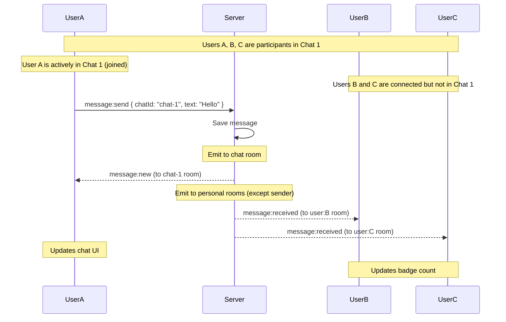
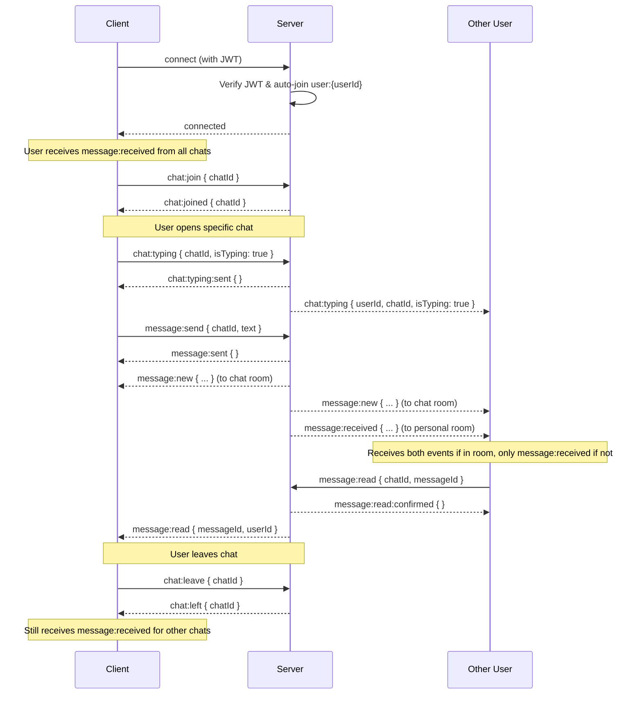

# WebSocket Events

This document covers real-time messaging via WebSocket, including connection setup, events, and presence tracking.

## Overview

SkipperClub uses Socket.IO for real-time communication. The WebSocket connection enables:

- Live message delivery
- Message notifications across all chats
- Typing indicators
- Read receipts
- User presence (online/offline status)

**Automatic Personal Room**: Upon connection, users automatically join their personal room (`user:{userId}`), enabling real-time notifications from all chats they participate in.

## Connection Setup

### Endpoint

```
wss://api.skipperclub.app/chat
```

The WebSocket namespace is `/chat`.

### Authentication

Provide JWT token in the connection options using one of these methods:

**Method 1: Auth object (recommended)**

```javascript
const socket = io('https://api.skipperclub.app/chat', {
  auth: {
    token: 'your-jwt-token',
  },
});
```

**Method 2: Authorization header**

```javascript
const socket = io('https://api.skipperclub.app/chat', {
  extraHeaders: {
    Authorization: 'Bearer your-jwt-token',
  },
});
```

**Method 3: Query parameter**

```javascript
const socket = io('https://api.skipperclub.app/chat', {
  query: {
    token: 'your-jwt-token',
  },
});
```

> **Note**: You can combine multiple methods for maximum compatibility. The server checks all methods in order: auth object, authorization header, then query parameter.

### Connection Example

```javascript
import { io } from 'socket.io-client';

const socket = io('https://api.skipperclub.app/chat', {
  transports: ['websocket', 'polling'],
  auth: { token: accessToken },
});

socket.on('connect', () => {
  console.log('Connected to chat server');
  // User automatically joined personal room: user:{userId}
});

socket.on('connect_error', (error) => {
  console.error('Connection failed:', error.message);
});

socket.on('disconnect', (reason) => {
  console.log('Disconnected:', reason);
});
```

**Important**: Upon successful connection and JWT verification, the user is automatically subscribed to their personal room (`user:{userId}`). This enables receiving `message:received` events from all chats without explicitly joining each chat room.

---

## Events Overview

### Client → Server (Outgoing)

| Event          | Description               |
| -------------- | ------------------------- |
| `chat:join`    | Subscribe to chat updates |
| `chat:leave`   | Unsubscribe from chat     |
| `message:send` | Send a message            |
| `message:read` | Mark message as read      |
| `chat:typing`  | Send typing indicator     |

### Server → Client (Incoming)

| Event                    | Description                         |
| ------------------------ | ----------------------------------- |
| `chat:joined`            | Join confirmation                   |
| `chat:left`              | Leave confirmation                  |
| `message:sent`           | Message send confirmation           |
| `message:new`            | New message in active chat room     |
| `message:received`       | New message notification (any chat) |
| `message:read`           | Read receipt from another user      |
| `message:read:confirmed` | Read action confirmation            |
| `chat:typing`            | Typing indicator from another user  |
| `chat:typing:sent`       | Typing indicator send confirmation  |
| `presence:update`        | User online/offline status          |
| `error`                  | Error notification                  |

---

## Client → Server Events

### chat:join

Subscribe to real-time updates for a specific chat.

**Payload**

| Field    | Type | Required | Description  |
| -------- | ---- | -------- | ------------ |
| `chatId` | uuid | Yes      | Chat to join |

**Example**

```javascript
socket.emit('chat:join', {
  chatId: '018fa2e4-8e3b-7b2e-8e3b-7b2e8e3b7b99',
});
```

**Response Events**

- `chat:joined` — Success confirmation
- `error` — Access denied or chat not found

---

### chat:leave

Unsubscribe from chat updates.

**Payload**

| Field    | Type | Required | Description   |
| -------- | ---- | -------- | ------------- |
| `chatId` | uuid | Yes      | Chat to leave |

**Example**

```javascript
socket.emit('chat:leave', {
  chatId: '018fa2e4-8e3b-7b2e-8e3b-7b2e8e3b7b99',
});
```

**Response Events**

- `chat:left` — Success confirmation
- `error` — Access denied or chat not found

---

### message:send

Send a message to a chat. The message is persisted and broadcast to all participants.

**Payload**

| Field    | Type   | Required | Description                      |
| -------- | ------ | -------- | -------------------------------- |
| `chatId` | uuid   | Yes      | Target chat                      |
| `text`   | string | Yes      | Message content (max 1000 chars) |

**Example**

```javascript
socket.emit('message:send', {
  chatId: '018fa2e4-8e3b-7b2e-8e3b-7b2e8e3b7b99',
  text: 'Hello everyone! 👋',
});
```

**Response Events**

- `message:sent` — Success confirmation (empty payload)
- `error` — Access denied or chat not found

**Behavior**

1. `message:sent` confirmation is sent to the sender
2. Message is saved to database
3. `message:new` is broadcast to all participants in the chat room
4. Hidden chats are restored for recipients
5. Unread counts are updated

---

### message:read

Mark a specific message as read.

**Payload**

| Field       | Type | Required | Description                 |
| ----------- | ---- | -------- | --------------------------- |
| `chatId`    | uuid | Yes      | Chat containing the message |
| `messageId` | uuid | Yes      | Message to mark as read     |

**Example**

```javascript
socket.emit('message:read', {
  chatId: '018fa2e4-8e3b-7b2e-8e3b-7b2e8e3b7b99',
  messageId: '018fa2e4-8e3b-7b2e-8e3b-7b2e8e3b7c01',
});
```

**Response Events**

- `message:read:confirmed` — Success confirmation (empty payload)
- `error` — Access denied, chat not found, or message not found

**Behavior**

1. `message:read:confirmed` confirmation is sent to the sender
2. Read receipt is broadcast to all participants via `message:read` event

---

### chat:typing

Broadcast typing status to other chat participants.

**Payload**

| Field      | Type    | Required | Description               |
| ---------- | ------- | -------- | ------------------------- |
| `chatId`   | uuid    | Yes      | Chat where user is typing |
| `isTyping` | boolean | Yes      | Current typing status     |

**Example**

```javascript
// User starts typing
socket.emit('chat:typing', {
  chatId: '018fa2e4-8e3b-7b2e-8e3b-7b2e8e3b7b99',
  isTyping: true,
});

// User stops typing (or after timeout)
socket.emit('chat:typing', {
  chatId: '018fa2e4-8e3b-7b2e-8e3b-7b2e8e3b7b99',
  isTyping: false,
});
```

**Response Events**

- `chat:typing:sent` — Success confirmation (empty payload)
- `error` — Access denied or chat not found

**Behavior**

1. `chat:typing:sent` confirmation is sent to the sender
2. Typing indicator is broadcast to other participants in the chat room (sender excluded)

**Best Practice**

Implement a debounce mechanism to avoid flooding:

```javascript
let typingTimeout;

function handleInput(chatId) {
  // Send typing: true on first keystroke
  if (!typingTimeout) {
    socket.emit('chat:typing', { chatId, isTyping: true });
  }

  // Reset timeout
  clearTimeout(typingTimeout);
  typingTimeout = setTimeout(() => {
    socket.emit('chat:typing', { chatId, isTyping: false });
    typingTimeout = null;
  }, 2000);
}
```

---

## Server → Client Events

### chat:joined

Confirmation that the user successfully joined a chat room.

**Payload**

| Field    | Type | Description          |
| -------- | ---- | -------------------- |
| `chatId` | uuid | Chat that was joined |

**Example**

```javascript
socket.on('chat:joined', (data) => {
  console.log(`Joined chat: ${data.chatId}`);
});
```

---

### chat:left

Confirmation that the user left a chat room.

**Payload**

| Field    | Type | Description        |
| -------- | ---- | ------------------ |
| `chatId` | uuid | Chat that was left |

**Example**

```javascript
socket.on('chat:left', (data) => {
  console.log(`Left chat: ${data.chatId}`);
});
```

---

### message:sent

Confirmation that a message was successfully sent.

**Payload**

Empty object `{}`.

**Example**

```javascript
socket.on('message:sent', (data) => {
  console.log('Message sent successfully');
});
```

---

### message:new

A new message was sent to a chat the user has joined.

**Payload**

| Field            | Type        | Description                  |
| ---------------- | ----------- | ---------------------------- |
| `id`             | uuid        | Message ID                   |
| `chatId`         | uuid        | Chat ID                      |
| `text`           | string      | Message content              |
| `read`           | boolean     | Read status for current user |
| `createdAt`      | datetime    | Creation timestamp           |
| `updatedAt`      | datetime    | Last update timestamp        |
| `user.id`        | uuid        | Sender's user ID             |
| `user.name`      | string      | Sender's display name        |
| `user.avatarUrl` | string/null | Sender's avatar URL          |

**Example**

```javascript
socket.on('message:new', (message) => {
  console.log(`New message from ${message.user.name}: ${message.text}`);

  // Add to UI
  appendMessage(message);

  // Update unread count if not the current chat
  if (message.chatId !== currentChatId) {
    incrementUnreadBadge(message.chatId);
  }
});
```

**Example Payload**

```json
{
  "id": "018fa2e4-8e3b-7b2e-8e3b-7b2e8e3b7c01",
  "chatId": "018fa2e4-8e3b-7b2e-8e3b-7b2e8e3b7b99",
  "text": "Hello everyone! 👋",
  "read": false,
  "createdAt": "2025-11-23T14:30:00.000Z",
  "updatedAt": "2025-11-23T14:30:00.000Z",
  "user": {
    "id": "018fa2e4-8e3b-7b2e-8e3b-7b2e8e3b7b00",
    "name": "Jan Kowalski",
    "avatarUrl": "https://cdn.example.com/avatars/jan.jpg"
  }
}
```

---

### message:received

New message notification from any chat the user participates in. This event is emitted to the user's personal room (`user:{userId}`) regardless of whether they have actively joined the chat room.

**When emitted**: Automatically sent when any message is posted to a chat where the user is a participant (except messages sent by the user themselves).

**Use case**: Badge counts, notification bells, global message notifications, and chat list updates.

**Key difference from `message:new`**:

- `message:new` — only received if actively in chat room (via `chat:join`)
- `message:received` — received for all participating chats automatically

**Payload**

Identical to `message:new`:

| Field            | Type        | Description                  |
| ---------------- | ----------- | ---------------------------- |
| `id`             | uuid        | Message ID                   |
| `chatId`         | uuid        | Chat ID                      |
| `text`           | string      | Message content              |
| `read`           | boolean     | Read status for current user |
| `createdAt`      | datetime    | Creation timestamp           |
| `updatedAt`      | datetime    | Last update timestamp        |
| `user.id`        | uuid        | Sender's user ID             |
| `user.name`      | string      | Sender's display name        |
| `user.avatarUrl` | string/null | Sender's avatar URL          |

**Example**

```javascript
// Listen for message notifications from all chats
socket.on('message:received', (message) => {
  console.log(
    `New message in chat ${message.chatId} from ${message.user.name}`,
  );

  // Update unread badge count
  incrementUnreadBadge(message.chatId);

  // Show notification
  showNotification(`${message.user.name}: ${message.text}`);

  // Update chat list
  updateChatListPreview(message.chatId, message);
});
```

**Example Payload**

```json
{
  "id": "018fa2e4-8e3b-7b2e-8e3b-7b2e8e3b7c01",
  "chatId": "018fa2e4-8e3b-7b2e-8e3b-7b2e8e3b7b99",
  "text": "Hello everyone! 👋",
  "read": false,
  "createdAt": "2025-11-23T14:30:00.000Z",
  "updatedAt": "2025-11-23T14:30:00.000Z",
  "user": {
    "id": "018fa2e4-8e3b-7b2e-8e3b-7b2e8e3b7b00",
    "name": "Jan Kowalski",
    "avatarUrl": "https://cdn.example.com/avatars/jan.jpg"
  }
}
```

---

### message:read

A read receipt — another user has read a message.

**Payload**

| Field       | Type     | Description               |
| ----------- | -------- | ------------------------- |
| `messageId` | uuid     | Message that was read     |
| `userId`    | uuid     | User who read the message |
| `readAt`    | datetime | When the message was read |

**Example**

```javascript
socket.on('message:read', (data) => {
  console.log(`User ${data.userId} read message ${data.messageId}`);

  // Update read indicator in UI
  markMessageAsRead(data.messageId, data.userId);
});
```

---

### message:read:confirmed

Confirmation that a message was successfully marked as read.

**Payload**

Empty object `{}`.

**Example**

```javascript
socket.on('message:read:confirmed', (data) => {
  console.log('Message marked as read successfully');
});
```

---

### chat:typing

Another user is typing in a chat.

**Payload**

| Field      | Type    | Description               |
| ---------- | ------- | ------------------------- |
| `chatId`   | uuid    | Chat where user is typing |
| `userId`   | uuid    | User who is typing        |
| `isTyping` | boolean | Current typing status     |

**Example**

```javascript
const typingUsers = new Map();

socket.on('chat:typing', (data) => {
  if (data.isTyping) {
    typingUsers.set(data.userId, Date.now());
    showTypingIndicator(data.chatId, data.userId);
  } else {
    typingUsers.delete(data.userId);
    hideTypingIndicator(data.chatId, data.userId);
  }
});
```

---

### chat:typing:sent

Confirmation that a typing indicator was successfully sent.

**Payload**

Empty object `{}`.

**Example**

```javascript
socket.on('chat:typing:sent', (data) => {
  console.log('Typing indicator sent successfully');
});
```

---

### presence:update

User online/offline status changed.

**When emitted**:

- **Online**: When a user joins their first chat (via `chat:join`) after connecting
- **Offline**: When a user's last WebSocket connection disconnects

**Note**: Presence is tracked per user across all their connections. A user is considered online if they have at least one active WebSocket connection.

**Payload**

| Field      | Type     | Description               |
| ---------- | -------- | ------------------------- |
| `userId`   | uuid     | User whose status changed |
| `isOnline` | boolean  | Current online status     |
| `lastSeen` | datetime | Last activity timestamp   |

**Example**

```javascript
socket.on('presence:update', (data) => {
  console.log(
    `User ${data.userId} is now ${data.isOnline ? 'online' : 'offline'}`,
  );

  // Update user's online indicator in UI
  updateUserStatus(data.userId, data.isOnline, data.lastSeen);
});
```

---

### error

An error occurred during a WebSocket operation.

**Payload**

| Field       | Type     | Description                  |
| ----------- | -------- | ---------------------------- |
| `type`      | string   | Error type identifier        |
| `message`   | string   | Human-readable error message |
| `timestamp` | datetime | When the error occurred      |

**Example**

```javascript
socket.on('error', (error) => {
  console.error('WebSocket error:', error.message);

  switch (error.type) {
    case 'websocket_error':
      showToast('Connection error. Retrying...');
      break;
    default:
      showToast(error.message);
  }
});
```

**Common Errors**

| Message                              | Cause                                       |
| ------------------------------------ | ------------------------------------------- |
| "Chat not found or access denied"    | Invalid chatId or user is not a participant |
| "Message not found or access denied" | Invalid messageId                           |
| "Internal server error"              | Unexpected server error                     |

---

## Message Event Comparison

Understanding the difference between `message:new` and `message:received`:

| Aspect              | `message:new`              | `message:received`              |
| ------------------- | -------------------------- | ------------------------------- |
| **Room**            | Chat room (specific chat)  | Personal room (`user:{userId}`) |
| **Subscription**    | Manual via `chat:join`     | Automatic on connection         |
| **When received**   | Only when actively in chat | From all participating chats    |
| **Use case**        | Real-time chat UI updates  | Badge counts, notifications     |
| **Sender receives** | Yes (if in room)           | No (not sent to sender)         |
| **Payload**         | Full message details       | Identical to `message:new`      |

### Event Flow Example



### Implementation Recommendation

**Listen to both events for complete functionality**:

```javascript
// Real-time updates for active chat
socket.on('message:new', (message) => {
  if (message.chatId === currentActiveChatId) {
    appendMessageToUI(message);
    markAsRead(message.id);
  }
});

// Global notifications for all chats
socket.on('message:received', (message) => {
  // Update unread count
  incrementUnreadBadge(message.chatId);

  // Update chat list preview
  updateChatPreview(message.chatId, message);

  // Show system notification if not in chat
  if (message.chatId !== currentActiveChatId) {
    showNotification(message.user.name, message.text);
  }
});
```

---

## Typical Chat Session



---

## Complete Implementation Example

### React Hook

```typescript
import { useEffect, useState, useCallback, useRef } from 'react';
import { io, Socket } from 'socket.io-client';

interface Message {
  id: string;
  chatId: string;
  text: string;
  read: boolean;
  createdAt: string;
  user: {
    id: string;
    name: string;
    avatarUrl: string | null;
  };
}

interface TypingUser {
  userId: string;
  isTyping: boolean;
}

export function useChat(token: string, chatId: string) {
  const [messages, setMessages] = useState<Message[]>([]);
  const [typingUsers, setTypingUsers] = useState<Map<string, boolean>>(
    new Map(),
  );
  const [isConnected, setIsConnected] = useState(false);
  const socketRef = useRef<Socket | null>(null);
  const typingTimeoutRef = useRef<NodeJS.Timeout | null>(null);

  useEffect(() => {
    const socket = io('https://api.skipperclub.app/chat', {
      auth: { token },
      transports: ['websocket', 'polling'],
    });
    socketRef.current = socket;

    socket.on('connect', () => {
      setIsConnected(true);
      socket.emit('chat:join', { chatId });
    });

    socket.on('disconnect', () => {
      setIsConnected(false);
    });

    socket.on('message:new', (message: Message) => {
      setMessages((prev) => [...prev, message]);
    });

    socket.on('chat:typing', (data: TypingUser & { chatId: string }) => {
      if (data.chatId === chatId) {
        setTypingUsers((prev) => {
          const next = new Map(prev);
          if (data.isTyping) {
            next.set(data.userId, true);
          } else {
            next.delete(data.userId);
          }
          return next;
        });
      }
    });

    socket.on('error', (error) => {
      console.error('Chat error:', error);
    });

    return () => {
      socket.emit('chat:leave', { chatId });
      socket.disconnect();
    };
  }, [token, chatId]);

  const sendMessage = useCallback(
    (text: string) => {
      if (socketRef.current && text.trim()) {
        socketRef.current.emit('message:send', { chatId, text });
      }
    },
    [chatId],
  );

  const sendTyping = useCallback(
    (isTyping: boolean) => {
      if (socketRef.current) {
        socketRef.current.emit('chat:typing', { chatId, isTyping });
      }
    },
    [chatId],
  );

  const handleTypingInput = useCallback(() => {
    if (!typingTimeoutRef.current) {
      sendTyping(true);
    }

    if (typingTimeoutRef.current) {
      clearTimeout(typingTimeoutRef.current);
    }

    typingTimeoutRef.current = setTimeout(() => {
      sendTyping(false);
      typingTimeoutRef.current = null;
    }, 2000);
  }, [sendTyping]);

  const markAsRead = useCallback(
    (messageId: string) => {
      if (socketRef.current) {
        socketRef.current.emit('message:read', { chatId, messageId });
      }
    },
    [chatId],
  );

  return {
    messages,
    typingUsers: Array.from(typingUsers.keys()),
    isConnected,
    sendMessage,
    handleTypingInput,
    markAsRead,
  };
}
```

### Vanilla JavaScript

```html
<!DOCTYPE html>
<html>
  <head>
    <script src="https://cdn.socket.io/4.7.2/socket.io.min.js"></script>
  </head>
  <body>
    <div id="chat">
      <div id="messages"></div>
      <div id="typing-indicator"></div>
      <input type="text" id="message-input" placeholder="Type a message..." />
      <button id="send-btn">Send</button>
    </div>

    <script>
      const TOKEN = 'your-jwt-token';
      const CHAT_ID = '018fa2e4-8e3b-7b2e-8e3b-7b2e8e3b7b99';

      const socket = io('https://api.skipperclub.app/chat', {
        auth: { token: TOKEN },
        transports: ['websocket', 'polling'],
      });

      const messagesDiv = document.getElementById('messages');
      const typingDiv = document.getElementById('typing-indicator');
      const input = document.getElementById('message-input');
      const sendBtn = document.getElementById('send-btn');

      let typingTimeout = null;

      // Connection handling
      socket.on('connect', () => {
        console.log('Connected');
        socket.emit('chat:join', { chatId: CHAT_ID });
      });

      socket.on('chat:joined', (data) => {
        console.log('Joined chat:', data.chatId);
      });

      // Receive messages
      socket.on('message:new', (message) => {
        const div = document.createElement('div');
        div.className = 'message';
        div.innerHTML = `<strong>${message.user.name}:</strong> ${message.text}`;
        messagesDiv.appendChild(div);
        messagesDiv.scrollTop = messagesDiv.scrollHeight;
      });

      // Typing indicators
      socket.on('chat:typing', (data) => {
        if (data.isTyping) {
          typingDiv.textContent = 'Someone is typing...';
        } else {
          typingDiv.textContent = '';
        }
      });

      // Send message
      sendBtn.onclick = () => {
        const text = input.value.trim();
        if (text) {
          socket.emit('message:send', { chatId: CHAT_ID, text });
          input.value = '';
        }
      };

      // Typing notification
      input.oninput = () => {
        if (!typingTimeout) {
          socket.emit('chat:typing', { chatId: CHAT_ID, isTyping: true });
        }
        clearTimeout(typingTimeout);
        typingTimeout = setTimeout(() => {
          socket.emit('chat:typing', { chatId: CHAT_ID, isTyping: false });
          typingTimeout = null;
        }, 2000);
      };

      // Enter to send
      input.onkeypress = (e) => {
        if (e.key === 'Enter') sendBtn.click();
      };
    </script>
  </body>
</html>
```

---

## Reconnection Handling

Socket.IO handles reconnection automatically, but you should manage chat room subscriptions:

```javascript
socket.on('connect', () => {
  // Re-join chats after reconnection
  if (currentChatId) {
    socket.emit('chat:join', { chatId: currentChatId });
  }
});

socket.on('reconnect', (attemptNumber) => {
  console.log(`Reconnected after ${attemptNumber} attempts`);
});

socket.on('reconnect_attempt', (attemptNumber) => {
  console.log(`Reconnection attempt ${attemptNumber}`);
});

socket.on('reconnect_error', (error) => {
  console.error('Reconnection failed:', error);
});
```

---

## Best Practices

1. **Join chats explicitly** — Always emit `chat:join` before expecting messages
2. **Leave when done** — Emit `chat:leave` when user navigates away
3. **Handle reconnection** — Re-join chats after connection is restored
4. **Debounce typing** — Avoid flooding the server with typing events
5. **Update UI optimistically** — Show sent messages immediately, handle errors gracefully
6. **Combine with REST** — Use REST for initial data load, WebSocket for updates

---

## Related

- [Messages Overview](./index.md) — Chat types and concepts
- [Chats REST API](./chats.md) — REST endpoints
- [AsyncAPI Specification](../asyncapi.yaml) — Full WebSocket contract
- [Authentication](../getting-started/authentication.md) — JWT tokens
