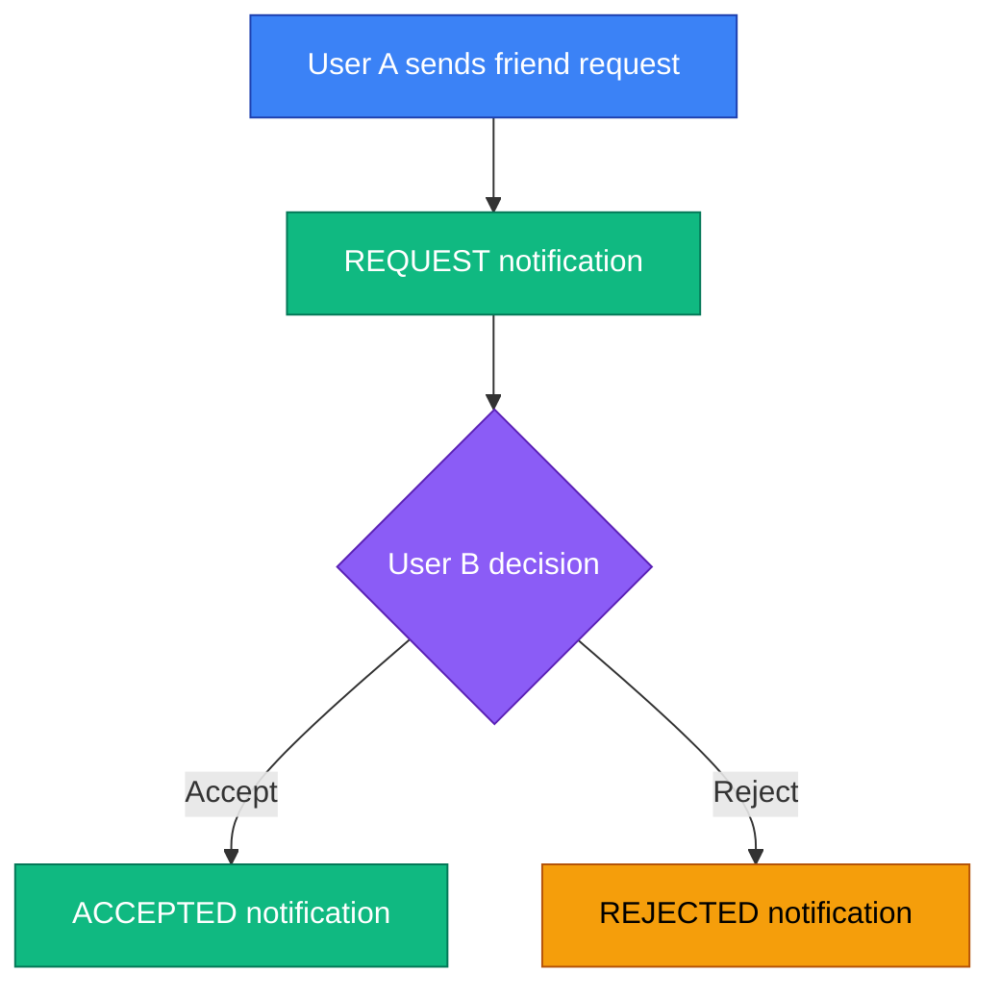
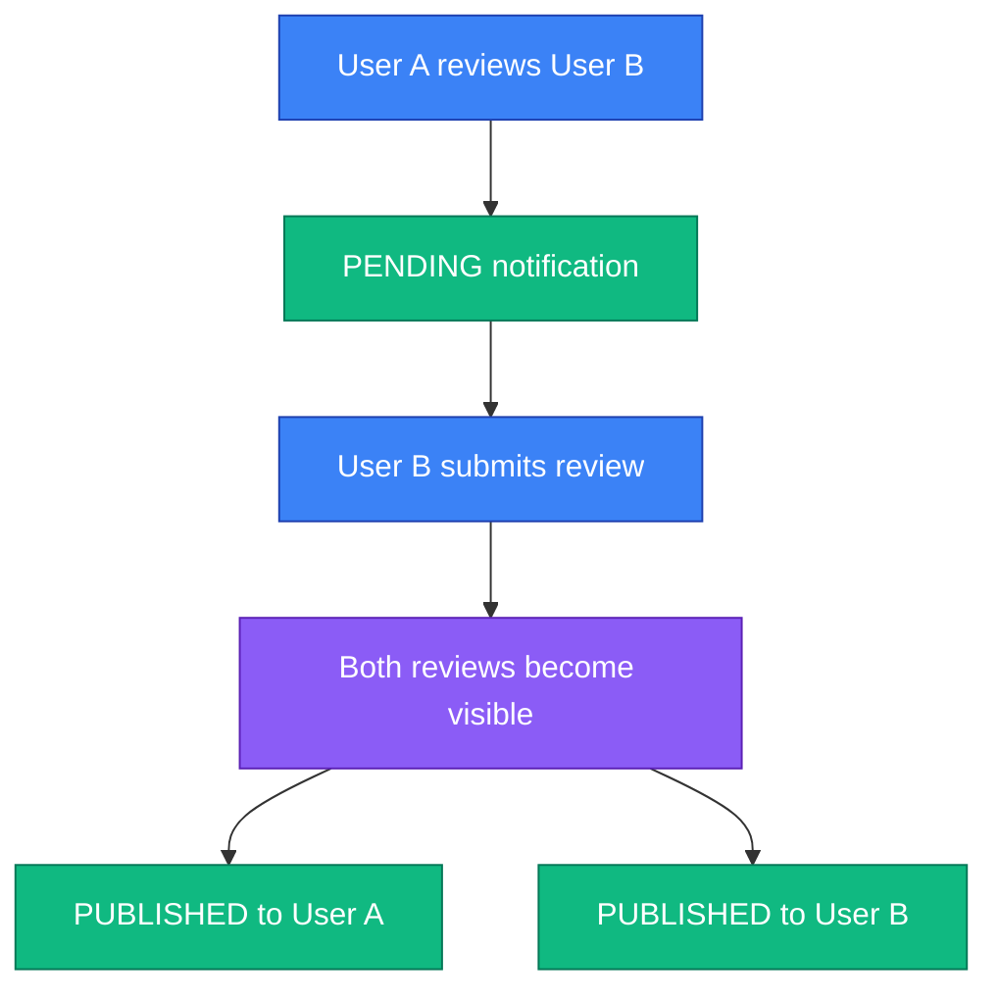

# Notifications

The notifications API provides endpoints for managing user notifications, including listing, updating status, and bulk operations.

## Overview

Notifications inform users about relevant activities across the platform. They are automatically created by the system when specific events occur, such as:

- Cruise invitations and join requests
- Post reactions and comments
- Friend requests
- Review publications

Self-directed social events are filtered at their feature source (for example,
reacting to or commenting on your own post does not notify you). Exact recipient
rules for cruise lifecycle events are event-specific.

For mobile push implementation details (APNs/FCM setup, queue/worker flow, token lifecycle, endpoint usage), see:

- [Push Notifications (iOS/Android)](./push-notifications.md)
- [Notification Settings](./notification-settings.md)

## Endpoints

| Method | Endpoint                          | Description                                                 |
| ------ | --------------------------------- | ----------------------------------------------------------- |
| GET    | `/notifications`                  | List notifications for current user                         |
| GET    | `/notifications/unread-count`     | Get count of unread notifications                           |
| PATCH  | `/notifications/{notificationId}` | Update notification status                                  |
| DELETE | `/notifications/{notificationId}` | Delete single notification                                  |
| POST   | `/notifications/actions`          | Perform bulk actions                                        |
| GET    | `/profile/notification-settings`  | Get current user's notification delivery preferences        |
| PUT    | `/profile/notification-settings`  | Update current user's email/push delivery preferences       |
| POST   | `/push/tokens`                    | Register or refresh mobile push token                       |
| DELETE | `/push/tokens/{deviceId}`         | Unregister token by device ID (idempotent)                  |
| POST   | `/push/tokens/unregister`         | Unregister token by `{platform, token}` (ownership-checked) |

## WebSocket Events

| Endpoint      | Event              | Direction       | Description                                          |
| ------------- | ------------------ | --------------- | ---------------------------------------------------- |
| `/v1/ws/chat` | `notification:new` | Server → Client | New notification created in an `{event,data}` frame. |

---

## Notification Settings (Profile)

Notification delivery preferences are managed as account settings on profile endpoints:

- `GET /v1/profile/notification-settings`
- `PUT /v1/profile/notification-settings`

In-app/WebSocket notifications are always delivered. The push flag is enforced
by the push worker. The e-mail flag is persisted but notification e-mail
delivery is not currently wired; see the [implementation status](../technical/notification-settings.md).

For full business behavior and endpoint examples, see [Notification Settings](./notification-settings.md).

---

## List Notifications

```http
GET /notifications
```

Retrieve a paginated list of notifications for the current user.

### Query Parameters

| Parameter    | Type    | Default     | Description                                |
| ------------ | ------- | ----------- | ------------------------------------------ |
| `status`     | enum    | —           | Filter by status (`UNREAD`, `READ`)        |
| `sourceType` | enum    | —           | Filter by source module                    |
| `sort`       | string  | `createdAt` | Sort field (only `createdAt` is supported) |
| `limit`      | integer | 20          | Results per page (1-100)                   |
| `offset`     | integer | 0           | Results to skip                            |
| `order`      | string  | `desc`      | Sort order (`asc`, `desc`)                 |

### Example Requests

```http
GET /v1/notifications?status=UNREAD HTTP/1.1
Host: api.skipperclub.app
Authorization: Bearer <token>
```

```http
GET /v1/notifications?sourceType=CRUISE&limit=10 HTTP/1.1
Host: api.skipperclub.app
Authorization: Bearer <token>
```

```http
GET /v1/notifications?limit=20&offset=20 HTTP/1.1
Host: api.skipperclub.app
Authorization: Bearer <token>
```

### Response

**200 OK**

```json
{
  "notifications": [
    {
      "id": "018fa2e4-8e3b-7b2e-8e3b-7b2e8e3b7b99",
      "recipientId": "018fa2e4-8e3b-7b2e-8e3b-7b2e8e3b7b00",
      "eventType": "CRUISE_INVITATION_SENT",
      "sourceType": "CRUISE",
      "sourceId": "018fa2e4-8e3b-7b2e-8e3b-7b2e8e3b7b98",
      "relationId": "018fa2e4-8e3b-7b2e-8e3b-7b2e8e3b7b97",
      "status": "UNREAD",
      "metadata": {
        "cruiseTitle": "Summer Sailing"
      },
      "createdAt": "2025-11-23T12:00:00Z",
      "readAt": null
    }
  ],
  "total": 15,
  "limit": 20,
  "offset": 0
}
```

---

## Get Unread Count

```http
GET /notifications/unread-count
```

Get the number of unread notifications for the current user.

### Example Request

```http
GET /v1/notifications/unread-count HTTP/1.1
Host: api.skipperclub.app
Authorization: Bearer <token>
```

### Response

**200 OK**

```json
{
  "count": 5
}
```

---

## Update Notification

```http
PATCH /notifications/{notificationId}
```

Update a notification's status (e.g., mark as read).

### Path Parameters

| Parameter        | Type | Description          |
| ---------------- | ---- | -------------------- |
| `notificationId` | uuid | Notification UUID v7 |

### Request Body

| Field    | Type | Required | Description                   |
| -------- | ---- | -------- | ----------------------------- |
| `status` | enum | Yes      | New status (`READ`, `UNREAD`) |

### Example Request

```http
PATCH /v1/notifications/018fa2e4-8e3b-7b2e-8e3b-7b2e8e3b7b99 HTTP/1.1
Host: api.skipperclub.app
Authorization: Bearer <token>
Content-Type: application/json

{
  "status": "READ"
}
```

### Response

**204 No Content**

### Errors

| Status | Type                              | Description                                                    |
| ------ | --------------------------------- | -------------------------------------------------------------- |
| 401    | `/errors/authentication-required` | Missing or invalid authentication                              |
| 404    | `/errors/notification-not-found`  | Notification not found or not owned by user                    |
| 422    | `/errors/validation`              | Request contains validation errors (e.g., invalid UUID format) |

---

## Delete Notification

```http
DELETE /notifications/{notificationId}
```

Soft delete a notification. Deleted notifications are not returned by the API.

### Example Request

```http
DELETE /v1/notifications/018fa2e4-8e3b-7b2e-8e3b-7b2e8e3b7b99 HTTP/1.1
Host: api.skipperclub.app
Authorization: Bearer <token>
```

### Response

**204 No Content**

### Errors

| Status | Type                              | Description                                                    |
| ------ | --------------------------------- | -------------------------------------------------------------- |
| 401    | `/errors/authentication-required` | Missing or invalid authentication                              |
| 404    | `/errors/notification-not-found`  | Notification not found or not owned by user                    |
| 422    | `/errors/validation`              | Request contains validation errors (e.g., invalid UUID format) |

---

## Bulk Actions

```http
POST /notifications/actions
```

Perform bulk operations on multiple notifications.

### Request Body

| Field             | Type    | Required    | Description                                     |
| ----------------- | ------- | ----------- | ----------------------------------------------- |
| `action`          | enum    | Yes         | Action to perform: `mark-read` or `delete`      |
| `notificationIds` | uuid[]  | Conditional | Notification IDs (required if `all` is `false`) |
| `all`             | boolean | No          | Apply to all notifications (default: `false`)   |

**Validation rules**:

- Either `notificationIds` must be provided OR `all` must be `true`
- Cannot have empty `notificationIds` with `all: false`

### Actions

| Action      | Description                                        |
| ----------- | -------------------------------------------------- |
| `mark-read` | Mark notifications as read, set `readAt` timestamp |
| `delete`    | Soft delete notifications                          |

### Example Requests

```http
POST /v1/notifications/actions HTTP/1.1
Host: api.skipperclub.app
Authorization: Bearer <token>
Content-Type: application/json

{
  "action": "mark-read",
  "notificationIds": [
    "018fa2e4-8e3b-7b2e-8e3b-7b2e8e3b7b99",
    "018fa2e4-8e3b-7b2e-8e3b-7b2e8e3b7b98"
  ]
}
```

```http
POST /v1/notifications/actions HTTP/1.1
Host: api.skipperclub.app
Authorization: Bearer <token>
Content-Type: application/json

{
  "action": "mark-read",
  "all": true
}
```

```http
POST /v1/notifications/actions HTTP/1.1
Host: api.skipperclub.app
Authorization: Bearer <token>
Content-Type: application/json

{
  "action": "delete",
  "all": true
}
```

### Response

**204 No Content**

### Errors

| Status | Type                                       | Description                                                    |
| ------ | ------------------------------------------ | -------------------------------------------------------------- |
| 400    | `/errors/invalid-notification-bulk-action` | Invalid action or parameters                                   |
| 404    | `/errors/notification-not-found`           | No notifications found                                         |
| 401    | `/errors/authentication-required`          | Missing or invalid authentication                              |
| 422    | `/errors/validation`                       | Request contains validation errors (e.g., invalid UUID format) |

---

## Notification Types

### Source Types

| Type      | Description               |
| --------- | ------------------------- |
| `CRUISE`  | Cruise-related events     |
| `POST`    | Social post events        |
| `MESSAGE` | Messaging events (future) |
| `REVIEW`  | Review system events      |
| `MEDIA`   | Media events (future)     |
| `FRIEND`  | Friend request events     |

### Event Types

The system supports 17 notification event types across 4 modules:

#### Cruise Events (10 types)

| Event                        | Recipient               | Description                     |
| ---------------------------- | ----------------------- | ------------------------------- |
| `CRUISE_INVITATION_SENT`     | Invited user            | Organizer sent an invitation    |
| `CRUISE_REQUEST_PENDING`     | Organizer               | User requested to join          |
| `CRUISE_REQUEST_ACCEPTED`    | User who requested      | Organizer accepted join request |
| `CRUISE_INVITATION_ACCEPTED` | Organizer               | User accepted invitation        |
| `CRUISE_PARTICIPANT_JOINED`  | Other participants      | User joined the cruise          |
| `CRUISE_REQUEST_REJECTED`    | User                    | Join request was rejected       |
| `CRUISE_PARTICIPANT_LEFT`    | Organizer, participants | User left voluntarily           |
| `CRUISE_PARTICIPANT_REMOVED` | Removed user            | User was removed by organizer   |
| `CRUISE_DETAILS_CHANGED`     | Accepted participants   | Cruise details were updated     |
| `CRUISE_REVIEW_REMINDER`     | Each participant        | Post-cruise review reminder     |

#### Post Events (2 types)

| Event            | Recipient   | Description                   |
| ---------------- | ----------- | ----------------------------- |
| `POST_REACTED`   | Post author | Someone reacted to the post   |
| `POST_COMMENTED` | Post author | Someone commented on the post |

**Note**: No notification if user reacts to/comments on their own post.

#### Friend Events (3 types)

| Event                     | Recipient | Description                 |
| ------------------------- | --------- | --------------------------- |
| `FRIEND_REQUEST_SENT`     | Receiver  | Received a friend request   |
| `FRIEND_REQUEST_ACCEPTED` | Sender    | Friend request was accepted |
| `FRIEND_REQUEST_REJECTED` | Sender    | Friend request was rejected |

#### Review Events (2 types)

| Event                     | Recipient     | Description                     |
| ------------------------- | ------------- | ------------------------------- |
| `REVIEW_PENDING_RECEIVED` | Reviewed user | Someone reviewed them (pending) |
| `REVIEW_PUBLISHED`        | Both users    | Review is now visible           |

---

## Notification Flow Diagrams

### Cruise Notifications

```mermaid
flowchart TB
    subgraph invitationFlow [Invitation Flow]
        A1[Organizer invites User]:::trigger --> N1[INVITATION notification]:::notify
        N1 --> A2{User decision}:::decision
        A2 -->|Accept| N2[INVITATION_ACCEPTED to organizer]:::notify
        A2 -->|Accept| N3[PARTICIPANT_JOINED to others]:::notify
    end

    subgraph joinRequestFlow [Join Request Flow]
        B1[User requests to join]:::trigger --> N4[REQUEST notification]:::notify
        N4 --> B2{Organizer decision}:::decision
        B2 -->|Accept| N5[REQUEST_ACCEPTED to user]:::notify
        B2 -->|Accept| N6[PARTICIPANT_JOINED to others]:::notify
        B2 -->|Reject| N7[REJECTED notification]:::negative
    end

    subgraph leaveFlow [Leave Flow]
        C1[User leaves voluntarily]:::trigger --> N8[LEFT notification]:::notify
        C1 --> N9[LEFT to participants]:::notify
    end

    subgraph removalFlow [Removal Flow]
        D1[Organizer removes User]:::trigger --> N10[REMOVED notification]:::negative
        D1 --> N11[LEFT to participants]:::notify
    end

    subgraph updateFlow [Update Flow]
        E1[Organizer updates cruise]:::trigger --> N12[DETAILS_CHANGED to participants]:::notify
    end

    classDef trigger fill:#3B82F6,stroke:#1E40AF,color:#FFFFFF
    classDef notify fill:#10B981,stroke:#047857,color:#FFFFFF
    classDef decision fill:#8B5CF6,stroke:#5B21B6,color:#FFFFFF
    classDef negative fill:#F59E0B,stroke:#B45309,color:#000000
```



### Friend Notifications



### Blind Review Flow



---

## Notification Data Model

```typescript
interface Notification {
  id: string; // UUID v7
  recipientId: string; // UUID v7 of the recipient
  eventType: NotificationEventType; // Event that triggered notification
  sourceType: NotificationSourceType; // Source module
  sourceId: string; // ID of source object (e.g., cruise ID)
  relationId: string | null; // ID of related user (e.g., actor)
  status: NotificationStatus; // UNREAD or READ
  metadata: object | null; // Context data for rendering
  createdAt: string; // ISO 8601 timestamp
  readAt: string | null; // When marked as read
}
```

### Understanding sourceId and relationId

| Event Type                   | sourceId          | relationId                     |
| ---------------------------- | ----------------- | ------------------------------ |
| `CRUISE_INVITATION_SENT`     | Cruise ID         | Inviter (organizer)            |
| `CRUISE_REQUEST_PENDING`     | Cruise ID         | Requester                      |
| `CRUISE_REQUEST_ACCEPTED`    | Cruise ID         | Actor (organizer who accepted) |
| `CRUISE_INVITATION_ACCEPTED` | Cruise ID         | User who accepted invitation   |
| `CRUISE_PARTICIPANT_JOINED`  | Cruise ID         | User who joined                |
| `CRUISE_REQUEST_REJECTED`    | Cruise ID         | Rejecter (organizer)           |
| `CRUISE_PARTICIPANT_LEFT`    | Cruise ID         | User who left                  |
| `CRUISE_PARTICIPANT_REMOVED` | Cruise ID         | Remover (organizer)            |
| `CRUISE_REVIEW_REMINDER`     | Cruise ID         | `null` (system-generated)      |
| `POST_REACTED`               | Post ID           | User who reacted               |
| `POST_COMMENTED`             | Post ID           | User who commented             |
| `FRIEND_REQUEST_*`           | Friend request ID | Other user                     |
| `REVIEW_*`                   | Review ID         | Reviewer                       |

---

## Notification Metadata

Most notifications include `actorName` — the display name of the user who triggered the notification. The exception is `CRUISE_REVIEW_REMINDER`, which is system-generated.

### Cruise Events

```json
{
  "cruiseTitle": "Mediterranean Adventure",
  "actorName": "John Smith"
}
```

### Post Events

```json
// POST_REACTED - includes reaction type
{
  "actorName": "Jane Doe",
  "reactionType": "heart"
}

// POST_COMMENTED
{
  "commentText": "Great sailing trip! I'd love to join...",
  "actorName": "Jane Doe"
}
```

### Friend Events

```json
{
  "actorName": "Jane Doe"
}
```

### Review Events

```json
{
  "cruiseTitle": "Mediterranean Adventure",
  "actorName": "John Smith"
}
```

---

## Example Notifications

### Cruise Invitation

```json
{
  "id": "018fa2e4-8e3b-7b2e-8e3b-7b2e8e3b7b99",
  "recipientId": "018fa2e4-0000-7b2e-8e3b-7b2e8e3b7b00",
  "eventType": "CRUISE_INVITATION_SENT",
  "sourceType": "CRUISE",
  "sourceId": "018fa2e4-1111-7b2e-8e3b-7b2e8e3b7b98",
  "relationId": "018fa2e4-2222-7b2e-8e3b-7b2e8e3b7b97",
  "status": "UNREAD",
  "metadata": {
    "cruiseTitle": "Mediterranean Adventure",
    "actorName": "John Smith"
  },
  "createdAt": "2025-11-23T10:30:00Z",
  "readAt": null
}
```

**UI Display**: "John Smith invited you to join 'Mediterranean Adventure'"

### Post Comment

```json
{
  "id": "018fa2e4-8e3b-7b2e-8e3b-7b2e8e3b7c05",
  "recipientId": "018fa2e4-0000-7b2e-8e3b-7b2e8e3b7b07",
  "eventType": "POST_COMMENTED",
  "sourceType": "POST",
  "sourceId": "018fa2e4-1111-7b2e-8e3b-7b2e8e3b7b98",
  "relationId": "018fa2e4-3333-7b2e-8e3b-7b2e8e3b7b96",
  "status": "UNREAD",
  "metadata": {
    "commentText": "Great sailing trip! I'd love to join next time...",
    "actorName": "Jane Doe"
  },
  "createdAt": "2025-11-23T16:00:00Z",
  "readAt": null
}
```

**UI Display**: "Jane Doe commented on your post: 'Great sailing trip! I'd love to join...'"

### Pending Review

```json
{
  "id": "018fa2e4-8e3b-7b2e-8e3b-7b2e8e3b7c09",
  "recipientId": "018fa2e4-0000-7b2e-8e3b-7b2e8e3b7b11",
  "eventType": "REVIEW_PENDING_RECEIVED",
  "sourceType": "REVIEW",
  "sourceId": "018fa2e4-1111-7b2e-8e3b-7b2e8e3b7b99",
  "relationId": "018fa2e4-5555-7b2e-8e3b-7b2e8e3b7b94",
  "status": "UNREAD",
  "metadata": {
    "cruiseTitle": "Mediterranean Adventure",
    "actorName": "John Smith"
  },
  "createdAt": "2025-11-23T20:00:00Z",
  "readAt": null
}
```

**UI Display**: "User X reviewed you after 'Mediterranean Adventure' - leave a review to see it"

---

## Common Usage Patterns

### Rendering Notifications

```javascript
function renderNotification(notification) {
  const { eventType, relationId, metadata } = notification;

  switch (eventType) {
    case "CRUISE_INVITATION_SENT":
      return `${getUsername(relationId)} invited you to "${metadata.cruiseTitle}"`;

    case "CRUISE_REQUEST_PENDING":
      return `${getUsername(relationId)} requested to join "${metadata.cruiseTitle}"`;

    case "CRUISE_REQUEST_ACCEPTED":
      return `Your request to join "${metadata.cruiseTitle}" was accepted`;

    case "CRUISE_INVITATION_ACCEPTED":
      return `${getUsername(relationId)} accepted your invitation to "${metadata.cruiseTitle}"`;

    case "CRUISE_PARTICIPANT_JOINED":
      return `${getUsername(relationId)} joined "${metadata.cruiseTitle}"`;

    case "CRUISE_REQUEST_REJECTED":
      return `Your request to join "${metadata.cruiseTitle}" was declined`;

    case "CRUISE_PARTICIPANT_LEFT":
      return `${getUsername(relationId)} left "${metadata.cruiseTitle}"`;

    case "CRUISE_PARTICIPANT_REMOVED":
      return `You've been removed from "${metadata.cruiseTitle}"`;

    case "CRUISE_REVIEW_REMINDER":
      return `Your cruise "${metadata.cruiseTitle}" has ended. Review your crew!`;

    case "POST_REACTED":
      return `${getUsername(relationId)} reacted ${metadata.reactionType} to your post`;

    case "POST_COMMENTED":
      const excerpt = metadata.commentText?.substring(0, 50);
      return `${getUsername(relationId)} commented: "${excerpt}..."`;

    case "FRIEND_REQUEST_SENT":
      return `${getUsername(relationId)} sent you a friend request`;

    case "FRIEND_REQUEST_ACCEPTED":
      return `${getUsername(relationId)} accepted your friend request`;

    case "REVIEW_PENDING_RECEIVED":
      return `${getUsername(relationId)} reviewed you - leave a review to see it`;

    case "REVIEW_PUBLISHED":
      return `Your review from "${metadata.cruiseTitle}" is now published`;

    default:
      return "New notification";
  }
}
```

### Filter by Source Type

```javascript
// Get only cruise-related notifications
const cruiseNotifications = await fetch(
  "/v1/notifications?sourceType=CRUISE&limit=10",
  { headers: { Authorization: `Bearer ${token}` } },
).then((r) => r.json());

// Get pending cruise invitations
const invitations = cruiseNotifications.notifications.filter(
  (n) => n.eventType === "CRUISE_INVITATION_SENT" && n.status === "UNREAD",
);
```

---

## Real-time Notifications (WebSocket)

The notification system supports real-time delivery via WebSocket. When a notification is created, it is immediately pushed to the recipient's WebSocket connection.

### Connection

Notifications share the same plain WebSocket endpoint as chat. No subscription
event is needed because authentication automatically joins the personal room:

```javascript
const socket = new WebSocket(
  `wss://api.skipperclub.app/v1/ws/chat?token=${encodeURIComponent(token)}`,
);
```

### Authentication

JWT can be provided in the HTTP upgrade `Authorization: Bearer ...` header or
as the `token` query parameter. Browser-native `WebSocket` requires the query
form; mobile/native clients should prefer the header when supported.

Upon successful connection, the user automatically joins their personal room (`user:{userId}`).

### notification:new Event

The server emits `notification:new` to the user's room when a new notification is created.

**Payload Structure** (matches REST API notification object):

```json
{
  "id": "018fa2e4-8e3b-7b2e-8e3b-7b2e8e3b7b99",
  "recipientId": "018fa2e4-8e3b-7b2e-8e3b-7b2e8e3b7b00",
  "eventType": "CRUISE_INVITATION_SENT",
  "sourceType": "CRUISE",
  "sourceId": "018fa2e4-8e3b-7b2e-8e3b-7b2e8e3b7b98",
  "relationId": "018fa2e4-8e3b-7b2e-8e3b-7b2e8e3b7b97",
  "status": "UNREAD",
  "metadata": {
    "cruiseTitle": "Mediterranean Adventure",
    "actorName": "John Smith"
  },
  "createdAt": "2025-11-23T12:00:00Z",
  "readAt": null
}
```

### Example Usage

```javascript
// Listen for new notifications
socket.addEventListener("message", ({ data }) => {
  const frame = JSON.parse(data);
  if (frame.event !== "notification:new") return;
  const notification = frame.data;
  console.log("New notification:", notification);

  // Update unread count
  updateUnreadBadge();

  // Show toast notification
  showToast(renderNotification(notification));
});

socket.addEventListener("error", (error) => {
  console.error("Connection failed:", error);
});
```

---

## Push Notifications (iOS/Android)

Push delivery is asynchronous and best-effort. Existing notification semantics are unchanged:

1. A domain event is mapped to a notification draft.
2. The `notifications` row and River `push` job are committed in one PostgreSQL transaction.
3. `notification:new` is broadcast after commit to the recipient's personal WebSocket room.
4. The River worker sends through APNs or FCM only when global push and the provider are enabled.

### Token Endpoints

#### Register / refresh token

```http
POST /v1/push/tokens
```

```json
{
  "deviceId": "ios-installation-123",
  "platform": "IOS",
  "token": "native-token-12345678901234567890",
  "language": "pl"
}
```

- Upsert key: `(userId, deviceId)`
- If token already belongs to another user, ownership is rebound to current user
- Endpoint is rate-limited

#### Unregister by device

```http
DELETE /v1/push/tokens/{deviceId}
```

- Deactivates token for current user/device
- Idempotent (safe to repeat)

#### Optional unregister by token

```http
POST /v1/push/tokens/unregister
```

```json
{
  "platform": "IOS",
  "token": "native-token-12345678901234567890"
}
```

- Useful when `deviceId` is unavailable
- Returns `403 /errors/push-token-ownership-forbidden` for non-owner token

### Payload Contract

Push payload includes visible alert and routing data:

- `title`, `body`
- `notificationId`, `eventType`, `sourceType`, `sourceId`, `relationId`
- `deepLink = /notifications/{notificationId}`

### Localization Rules

Language selection order:

1. Token language (`push_device_tokens.language`)
2. User preferred language (`users.preferred_language`)
3. Fallback: `en`

### Delivery and Token Deactivation

- Provider success/failure is stored per token in `push_delivery_logs`
- Permanent token errors (e.g. unregistered/invalid token) deactivate token
- Transient provider failures are retried with exponential backoff
- Disabled/misconfigured APNs or FCM deliveries are marked `SKIPPED` and removed from queue (no delayed mass-send after later enable)
- Exhausted retries are moved to `push-dlq`

---

## Error Handling

All errors follow RFC 7807 format:

```json
{
  "type": "/errors/notification-not-found",
  "title": "Notification Not Found",
  "status": 404,
  "detail": "Requested notification could not be found"
}
```

### Error Types

| Type                                       | Status | Description                                                    |
| ------------------------------------------ | ------ | -------------------------------------------------------------- |
| `/errors/notification-not-found`           | 404    | Notification doesn't exist or not owned by user                |
| `/errors/invalid-notification-bulk-action` | 400    | Invalid bulk action parameters                                 |
| `/errors/validation`                       | 422    | Request contains validation errors (e.g., invalid UUID format) |
| `/errors/authentication-required`          | 401    | Missing or invalid authentication                              |

---

## Best Practices

1. **Efficient Loading** — Use pagination and filter by status to reduce data transfer
2. **Real-time Updates** — Use WebSocket `/v1/ws/chat` for instant notification delivery
3. **Unread Count** — Use `GET /notifications/unread-count` for badge displays instead of fetching all notifications
4. **Bulk Operations** — Use `all: true` sparingly; it processes all user notifications
5. **Error Handling** — Handle 404 gracefully; notification may have been deleted
6. **UI Updates** — Update local state after successful API calls and WebSocket events

---

## Related

- [Cruises](../cruises/index.md) — Cruise-related notifications
- [Notification Settings](./notification-settings.md) — User-facing channel preferences (email/push)
- [Push Notifications](./push-notifications.md) — Mobile push configuration and flow
- [Authentication](../getting-started/authentication.md) — API authentication
- [Error Handling](../getting-started/errors.md) — RFC 7807 format
