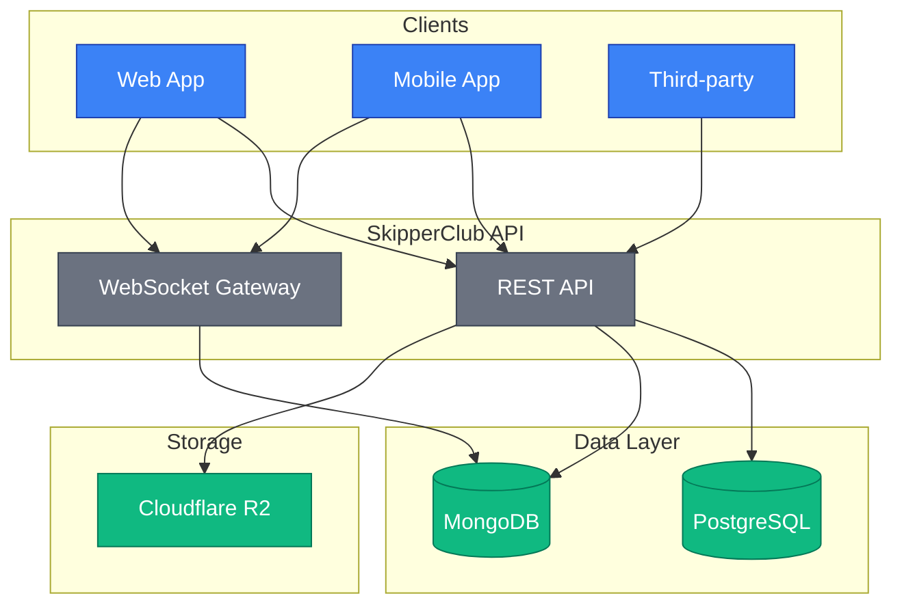
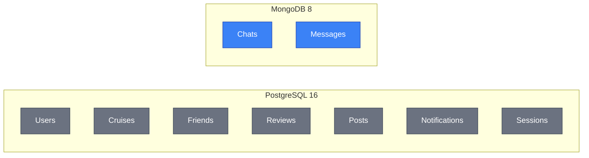
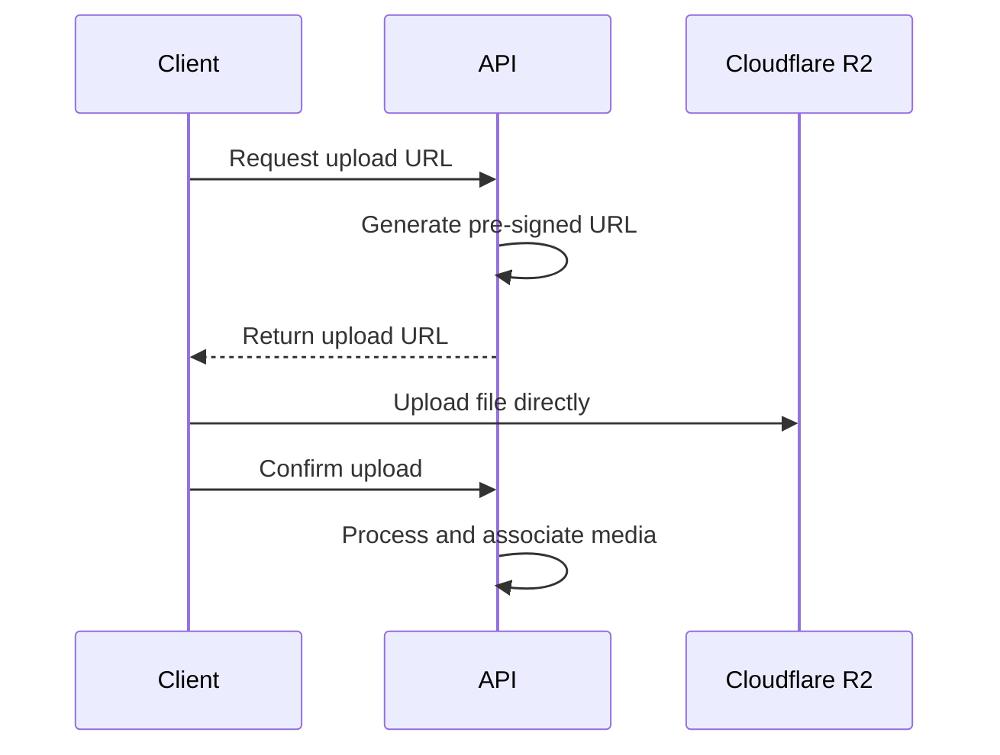
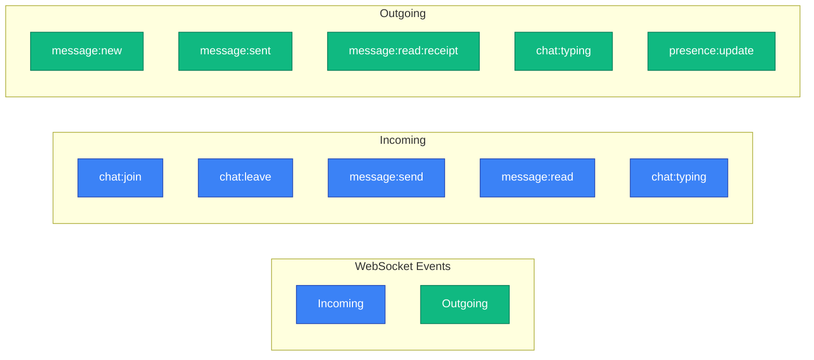
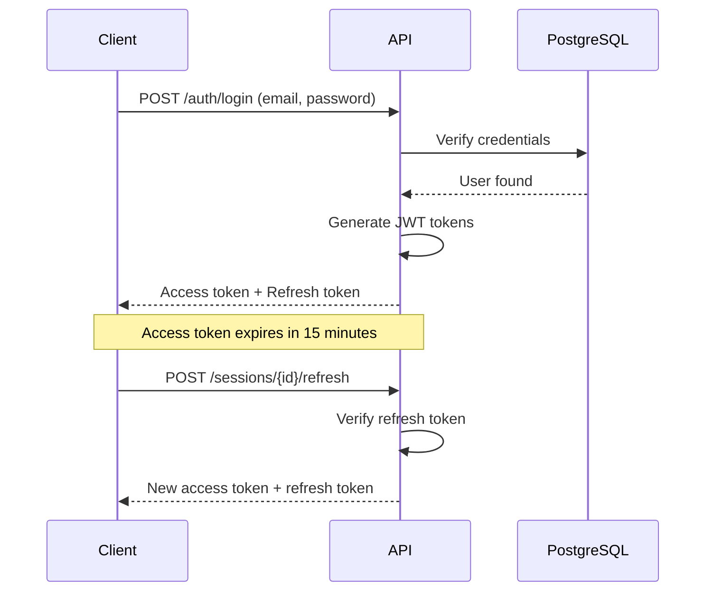
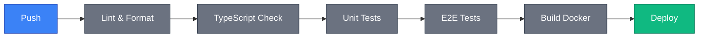

# Architecture

This document provides a high-level overview of the SkipperClub API architecture, its components, and data flow.

## System Overview



## Technology Stack

### Backend Platform

| Technology     | Version | Purpose               |
| -------------- | ------- | --------------------- |
| **Node.js**    | 22      | JavaScript runtime    |
| **NestJS**     | 11      | Application framework |
| **TypeScript** | 5       | Type-safe development |

The backend follows these architectural patterns:

- **CQRS** — Commands for writes, Queries for reads via `@nestjs/cqrs`
- **Event-driven** — Domain events for decoupled communication
- **Repository pattern** — Abstracted data access layer
- **Domain-driven design** — Module boundaries aligned with business domains

### Databases



| Database       | Purpose                                                                                    |
| -------------- | ------------------------------------------------------------------------------------------ |
| **PostgreSQL** | Primary relational data — users, cruises, friends, reviews, posts, notifications, sessions |
| **MongoDB**    | Chat and messaging — optimized for real-time conversation workloads                        |

> **Note:** Redis backs the BullMQ job queues used for email and push notification delivery (including dead-letter queues). It is not yet used for caching or session storage.

### File Storage

| Service           | Purpose                               |
| ----------------- | ------------------------------------- |
| **Cloudflare R2** | Durable media storage (S3-compatible) |

Media uploads use pre-signed URLs for secure, direct client uploads:



## API Architecture

### REST API

The REST API follows OpenAPI 3.1 specification defined in `docs/openapi.yaml`.

Key characteristics:

- **Versioned** — URL path versioning (`/v1/...`)
- **Resource-oriented** — RESTful endpoint design
- **JSON** — Request and response bodies in JSON format
- **RFC 7807** — Error responses in Problem Details format

### WebSocket API

Real-time features use WebSocket connections defined in `docs/asyncapi.yaml`.

Key features:

- **Socket.io** — Transport layer with fallback support
- **JWT authentication** — Token-based connection authorization
- **Namespaces** — Logical separation of event types
- **Rooms** — Chat-specific message broadcasting



## Module Structure

The application is organized by domain modules:

```
src/modules/
├── ai/             # Audio transcription & AI features
├── alerts/         # Navigational alerts & warnings
├── auth/           # JWT authentication & sessions
├── check-ins/      # User location check-ins
├── cruises/        # Cruise organization
├── debug/          # Sentry debug endpoints (non-production only)
├── email/          # Email queue & templates
├── filestorage/    # File storage management
├── friends/        # Friend system
├── geocoder/       # Reverse geocoding with caching
├── invitations/    # App invitations (codes & links)
├── map/            # Unified map items endpoint
├── media/          # Media sharing
├── messages/       # Chat system
├── notifications/  # Notification center
├── posts/          # Social posts
├── push/           # Push notifications (APNs/FCM)
├── redis/          # Redis connection module
├── regions/        # Sailing regions
├── reviews/        # Rating system
├── sailing-brief/  # AI-generated sailing briefs
├── spots/          # Sailing spots & validity voting
└── users/          # User profiles
```

Each module follows CQRS pattern:

```
src/modules/{module}/
├── commands/
│   ├── handlers/       # Command handlers (writes)
│   └── impl/           # Command definitions
├── queries/
│   ├── handlers/       # Query handlers (reads)
│   └── impl/           # Query definitions
├── dto/                # Data transfer objects
├── exceptions/         # Module-specific exceptions
├── {module}.controller.ts
├── {module}.module.ts
└── {module}.service.ts
```

## Security Architecture

### Authentication Flow



### Token Specifications

| Token             | Lifetime   | Purpose                   |
| ----------------- | ---------- | ------------------------- |
| **Access Token**  | 15 minutes | API request authorization |
| **Refresh Token** | 7 days     | Obtain new access tokens  |

### Authorization

- Bearer token required for most endpoints
- Token contains user ID and session ID
- Resource access validated against ownership and permissions

## Error Handling

All errors follow RFC 7807 Problem Details format:

```json
{
  "type": "/errors/not-found",
  "title": "Not Found",
  "status": 404,
  "detail": "The requested resource was not found"
}
```

Key aspects:

- **Consistent format** across all modules
- **i18n support** — Error messages in EN/PL
- **Validation errors** include field-level violations

## Scalability Considerations

### Current Design

- Single-instance deployment
- Vertical scaling approach
- Local session management

### Future Considerations

- Horizontal scaling with Redis session store
- Database read replicas
- CDN for static assets
- Message queue for async processing

## Development & Deployment

### Environments

| Environment     | Purpose                                   |
| --------------- | ----------------------------------------- |
| **Development** | Local development with hot reload         |
| **Test**        | Automated testing with isolated databases |
| **Staging**     | Pre-production verification               |
| **Production**  | Live environment                          |

### CI/CD Pipeline



### Infrastructure

| Component            | Technology                      |
| -------------------- | ------------------------------- |
| **Reverse Proxy**    | Traefik v3 with automatic HTTPS |
| **Containerization** | Docker & Docker Compose         |
| **CI/CD**            | GitHub Actions / GitLab CI      |

## Next Steps

- [Quick Start](../getting-started/index.md) — Make your first API call
- [Authentication](../getting-started/authentication.md) — Learn about JWT tokens
- [Tech Stack](../technical/tech-stack.md) — Detailed technology information
