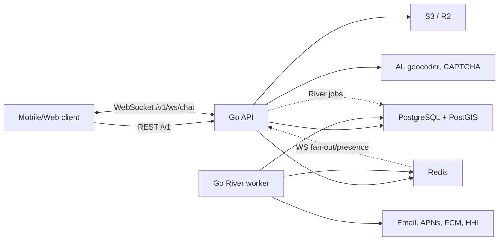

# Architecture

SkipperClub API is a Go modular monolith with separate API, worker, and
administrative CLI processes. The complete design decision and migration
context are in [ADR-0001](../adr/0001-architecture.md).

## Runtime view



The API owns synchronous REST/WS work and inserts durable jobs. The worker
consumes River queues and registers periodic maintenance. PostgreSQL is both
the application datastore and River job store. Redis is used for WebSocket
fan-out/presence and HTTP rate limiting; it is not the job queue.

## Processes

| Binary       | Responsibility                                                                    |
| ------------ | --------------------------------------------------------------------------------- |
| `cmd/api`    | configuration, dependencies, REST routes, WebSocket hub, domain-event subscribers |
| `cmd/worker` | River queues: email, push, sailing brief, alert import, maintenance               |
| `cmd/cli`    | schema/River migration, user administration, manual alert import/reconciliation   |

Both long-running processes support graceful shutdown. The API drains HTTP for
up to 15 seconds; the worker drains jobs for up to 30 seconds.

## Module boundaries

Feature packages live directly under `internal`, for example `auth`, `users`,
`cruises`, `posts`, `messages`, `notifications`, and `alerts`. A typical feature
contains:

```text
service.go             dependencies and construction
service_commands.go    writes and business rules
service_queries.go     reads
repo.go                 consumer-side persistence interface
repo_pg.go              pgx/PostgreSQL adapter
http.go                 generated REST interface implementation
errors.go               domain errors mapped to RFC 7807
*_test.go               unit tests
```

Features do not import each other's concrete services. A consumer declares the
narrow interface it needs and `cmd/api` or `cmd/worker` supplies an adapter.
Cross-feature notifications use an in-process domain event dispatcher. Durable
email and push work is inserted into River, normally in the same PostgreSQL
transaction as its audit/domain row.

## HTTP contract

[`api/openapi.yaml`](../../api/openapi.yaml) is the REST source of truth. The
project generates chi server interfaces and DTOs into `api/gen/gen.go`.
`internal/server` mounts the 107 specified operations below `/v1` and applies:

- request IDs and structured request logging;
- panic recovery;
- CORS;
- `Accept-Language` negotiation;
- Sentry HTTP context;
- JWT authentication on protected operations;
- Redis-backed throttling.

Expected failures use localized `application/problem+json` responses. English
and Polish catalogs are embedded in the binary.

## WebSocket contract

The Go implementation uses plain RFC 6455 WebSocket through `coder/websocket`.
There are no Socket.IO namespaces or polling fallback. Clients connect to the
single `/v1/ws/chat` endpoint with a bearer token in `Authorization` or the
`token` query parameter and exchange JSON `{event,data}` envelopes.

Chat events and `notification:new` share the same connection. Every connection
joins its personal `user:{userId}` room automatically; explicit `chat:join`
controls chat-room broadcasts. Redis forwards broadcasts and presence between
API instances.

See [WebSocket Events](../messages/websocket.md).

## Storage and integrations

- `pgx/v5` executes hand-written SQL; there is no ORM.
- Goose applies the embedded initial schema; River owns its tables.
- S3-compatible storage handles media and avatars.
- Email providers are SES, SendGrid, Mailgun, SMTP, and console.
- Push providers are APNs and FCM.
- AI presets route to OpenAI-compatible OpenAI/OpenRouter endpoints.
- Google Maps backs geocoding when configured.
- Sentry captures unexpected HTTP and worker failures.

## Scheduling

The `maintenance` River worker registers daily cleanup/deletion/review jobs,
minute-based post expiration, hourly sailing-brief scheduling, and a 12-hour
alert import interval. River leader election prevents duplicate periodic job
insertion. These schedules are intervals from worker leadership/startup rather
than wall-clock cron expressions.

## Test architecture

Unit tests cover services and adapters with fakes. Integration tests use
testcontainers PostgreSQL/PostGIS and Redis. E2E builds the three binaries and
drives real HTTP and WebSocket traffic with PostgreSQL, Redis, and S3Mock.
Details are in [Testing Strategy](../technical/testing-strategy.md).
