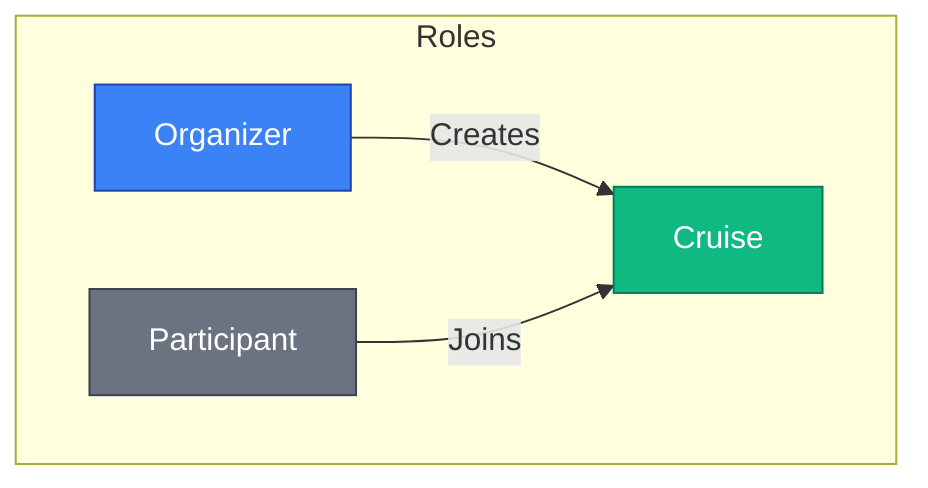
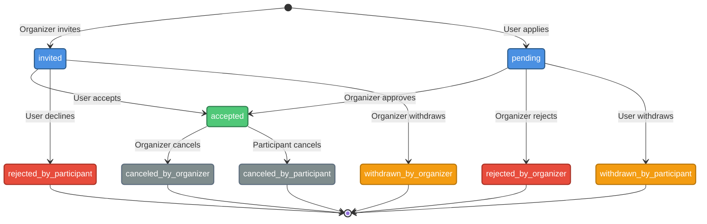
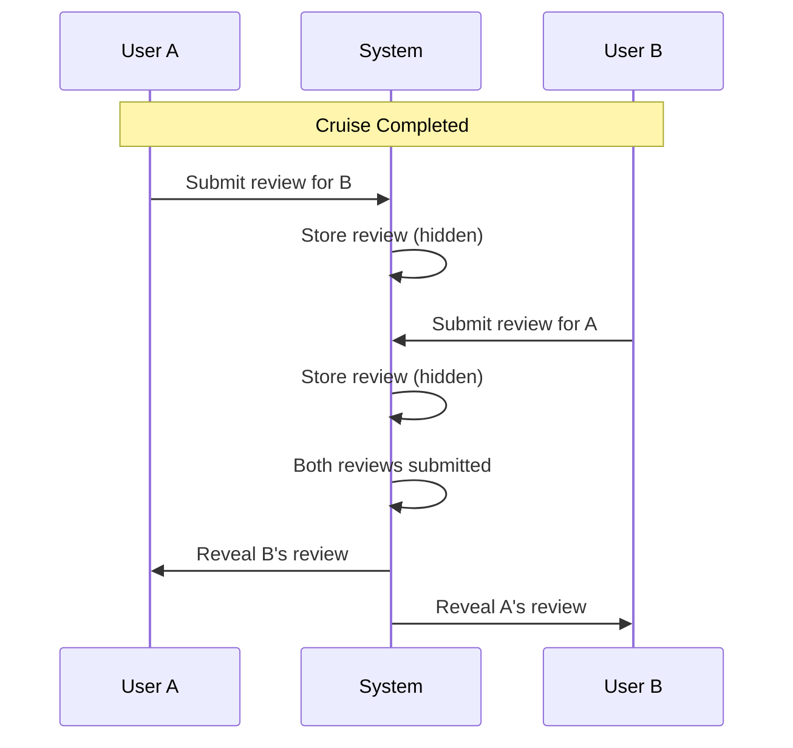
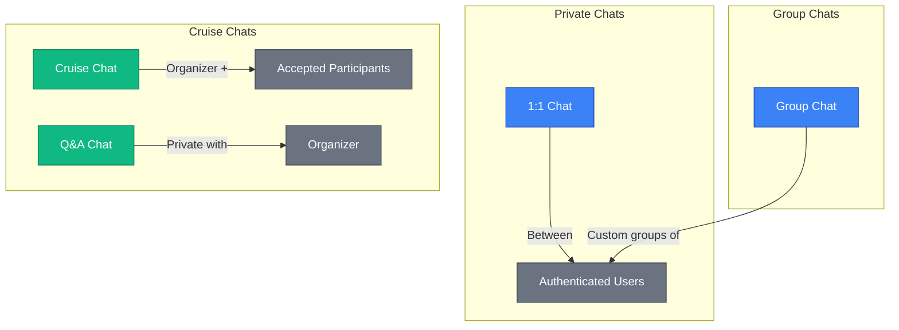
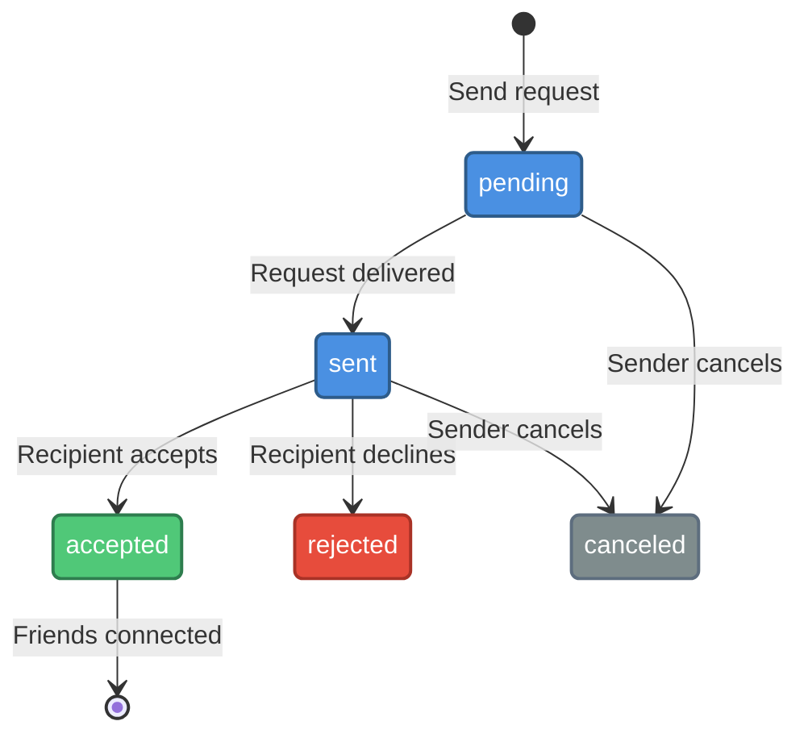

# Key Concepts

This document explains the core concepts and terminology used throughout the SkipperClub platform.

## Cruises

A **cruise** (also called a voyage) is the central entity in SkipperClub. It represents a sailing trip organized by a skipper looking for crew members.

### Cruise Visibility

| Visibility  | Description                            |
| ----------- | -------------------------------------- |
| **Public**  | Visible to all users, anyone can apply |
| **Private** | Only visible to invited users          |

### Cruise Types

Cruises are categorized by type to help users find trips matching their interests:

#### Skill Level & Training Based

| Type             | Description                                              |
| ---------------- | -------------------------------------------------------- |
| `BEGINNER_INTRO` | For people with little to no sailing experience          |
| `TRAINING`       | Structured educational cruises for skill development     |
| `MILEBUILDING`   | Designed to accumulate nautical miles for certifications |
| `ADVANCED`       | For experienced sailors seeking challenging conditions   |
| `SPORT_REGATTA`  | Competitive sailing, racing, and regattas                |

#### Demographic & Social Based

| Type         | Description                                  |
| ------------ | -------------------------------------------- |
| `FAMILY`     | Family-friendly with child-safe environments |
| `SINGLES`    | For solo sailors looking to meet others      |
| `COUPLES`    | Romantic cruises for couples                 |
| `SENIORS`    | Tailored for older adults with relaxed pace  |
| `WOMEN_ONLY` | Exclusively for women                        |
| `MEN_ONLY`   | Exclusively for men                          |

#### Activity & Theme Based

| Type                  | Description                             |
| --------------------- | --------------------------------------- |
| `PARTY`               | Social cruises with entertainment focus |
| `RELAX`               | Peaceful, stress-free cruises           |
| `SURVIVAL`            | Survival skills and emergency training  |
| `PHOTOGRAPHY`         | For photography enthusiasts             |
| `CULINARY`            | Gastronomy and cooking experiences      |
| `CULTURAL_HISTORICAL` | Cultural and historical exploration     |
| `EXPLORATION`         | Adventure and discovery focused         |

### Cruise Restrictions

Organizers can set restrictions to define the cruise atmosphere:

| Restriction        | Description                              |
| ------------------ | ---------------------------------------- |
| `smoking_allowed`  | Whether smoking is permitted             |
| `alcohol_allowed`  | Whether alcohol consumption is permitted |
| `pets_allowed`     | Whether pets are allowed on board        |
| `children_allowed` | Whether children can participate         |

## Participants

Users can participate in cruises in different roles with different states.

### Participant Roles

| Role            | Description                                                                              |
| --------------- | ---------------------------------------------------------------------------------------- |
| **Organizer**   | The user who created the cruise. Has full control over participants and cruise settings. |
| **Participant** | A user who has been accepted to join the cruise.                                         |

### Participant States

The lifecycle of a cruise participant follows this state machine:

| State                      | Description                                             |
| -------------------------- | ------------------------------------------------------- |
| `pending`                  | User applied to join, awaiting organizer decision       |
| `invited`                  | User was invited by the organizer, awaiting response    |
| `accepted`                 | User is confirmed as a crew member                      |
| `rejected_by_participant`  | User declined the organizer's invitation                |
| `rejected_by_organizer`    | Organizer rejected the user's application               |
| `withdrawn_by_participant` | User withdrew their pending application                 |
| `withdrawn_by_organizer`   | Organizer withdrew the invitation before user responded |
| `canceled_by_participant`  | Accepted participant canceled their participation       |
| `canceled_by_organizer`    | Organizer canceled an accepted participant              |

### State Transitions

| Current State | Action               | New State                  | Actor     |
| ------------- | -------------------- | -------------------------- | --------- |
| —             | Invite user          | `invited`                  | Organizer |
| —             | Apply to cruise      | `pending`                  | User      |
| `invited`     | Accept invitation    | `accepted`                 | User      |
| `invited`     | Decline invitation   | `rejected_by_participant`  | User      |
| `invited`     | Withdraw invitation  | `withdrawn_by_organizer`   | Organizer |
| `pending`     | Approve application  | `accepted`                 | Organizer |
| `pending`     | Reject application   | `rejected_by_organizer`    | Organizer |
| `pending`     | Withdraw application | `withdrawn_by_participant` | User      |
| `accepted`    | Cancel participation | `canceled_by_participant`  | User      |
| `accepted`    | Cancel participant   | `canceled_by_organizer`    | Organizer |

## Reviews

SkipperClub uses a **blind review system** to ensure honest feedback after voyages.

### Review Categories

Each review rates the participant across four categories on a 1-5 scale:

| Category          | Description                                       |
| ----------------- | ------------------------------------------------- |
| **Communication** | How well did the person communicate?              |
| **Behavior**      | Was the person pleasant to be around?             |
| **Skills**        | Did they demonstrate adequate sailing skills?     |
| **Duties**        | Did they fulfill their responsibilities on board? |

### Blind Review Process

Key aspects:

1. Reviews can only be submitted after the cruise ends
2. Reviews remain hidden until both parties submit
3. Minimum 100 characters required for the comment
4. Once revealed, reviews cannot be modified

## Chats

SkipperClub provides four types of real-time chat channels powered by WebSocket.

### Chat Types

| Chat Type       | Access                             | Purpose                          |
| --------------- | ---------------------------------- | -------------------------------- |
| **1:1 Chat**    | Two authenticated users            | Private conversations            |
| **Group Chat**  | Creator and invited users          | Group discussions                |
| **Cruise Chat** | Organizer + accepted participants  | Coordinate voyage preparations   |
| **Q&A Chat**    | Individual user + cruise organizer | Private questions about a cruise |

### Cruise Chat Access

- Only the organizer and accepted participants can access the cruise chat
- New participants automatically join when accepted
- Removed participants lose access but chat history is preserved
- The organizer always has access

### Q&A Chat Access

- Each user has a private Q&A chat with the cruise organizer
- Messages are only visible to the user and organizer
- Useful for asking questions before applying

## User Profiles

User profiles contain detailed information to help with crew matching.

### Profile Elements

| Section          | Fields                                                             |
| ---------------- | ------------------------------------------------------------------ |
| **Basic Info**   | Name, email, city, country, languages spoken, bio                  |
| **Experience**   | Years of experience, sailing experience level                      |
| **Certificates** | Sailing licenses and certifications                                |
| **Social**       | Facebook URL, Instagram username, TikTok username, WhatsApp number |
| **Avatar**       | Profile photo                                                      |
| **Preferences**  | Preferred voyage styles                                            |

### Experience Levels

Users self-report their sailing experience:

| Level          | Description                        |
| -------------- | ---------------------------------- |
| `beginner`     | New to sailing                     |
| `intermediate` | Some sailing experience            |
| `advanced`     | Experienced sailor                 |
| `professional` | Professional skipper or instructor |

## Friends

Users can connect as friends to build social relationships.

### Friend Request Flow

| State      | Description                        |
| ---------- | ---------------------------------- |
| `pending`  | Request created, not yet delivered |
| `sent`     | Request delivered to recipient     |
| `accepted` | Recipient accepted the request     |
| `rejected` | Recipient declined the request     |
| `canceled` | Sender canceled the request        |

Once connected as friends:

- Users can view social relationship context in profiles
- Users can manage friend requests and friendship lifecycle
- Organizers can invite friends to private cruises

## Navigation Alerts

Alerts are no longer a standalone product surface with their own public CRUD.
`GET/POST/PUT/DELETE /v1/alerts` are removed (404). Two related but distinct
things share the "alert" name:

- **Ingested source alerts** (`alerts` table) — official navigation warnings,
  NAVTEX/Notice-to-Mariners feeds, etc., imported by the HHI RNW pipeline.
  Each import is synced into a system-authored post
  (`posts.source_type = 'alert'`, `posts.user_id` = the seeded system user
  "SkipperClub Alerts"). Nobody, including admins, can edit or delete these
  posts through the regular endpoints.
- **User-created alert posts** — any signed-in user creates one via
  `POST /v1/posts` with `content.alert` (`category` and optional
  `severity`), the same way as any other post. There is no separate alert
  ownership model: standard post permission rules (author-only edit/delete)
  apply.

Both kinds render identically everywhere alerts are visible — feed,
`GET /v1/posts/{id}`, and `/v1/map/items` (as post items with
`contentKeys` containing `alert`) — since they are the same underlying
object (a post), not two parallel resources.

See [Alerts](../alerts/index.md) for the full ingestion model, geometry
handling (`location.point`/`location.area`), and sync lifecycle, and
[Regions (removed)](../regions/index.md) for why region-based resolution no
longer applies to alerts, cruises, or the map.

## Notifications

The platform sends notifications for important events.

### Notification Types

| Category                | Events                                                                                                        |
| ----------------------- | ------------------------------------------------------------------------------------------------------------- |
| **Friend Requests**     | Request sent, accepted, rejected                                                                              |
| **Cruise Participants** | Invitation sent, participant joined, request pending, request rejected, participant left, participant removed |
| **Cruise Updates**      | Cruise details changed                                                                                        |
| **Posts**               | Post reacted, post commented                                                                                  |
| **Reviews**             | Review pending received, review published                                                                     |

Notifications are delivered via the in-app notification center.

## Next Steps

- [Architecture](./architecture.md) — Understand the system components
- [Quick Start](../getting-started/index.md) — Make your first API call
- [Authentication](../getting-started/authentication.md) — Learn about JWT tokens
