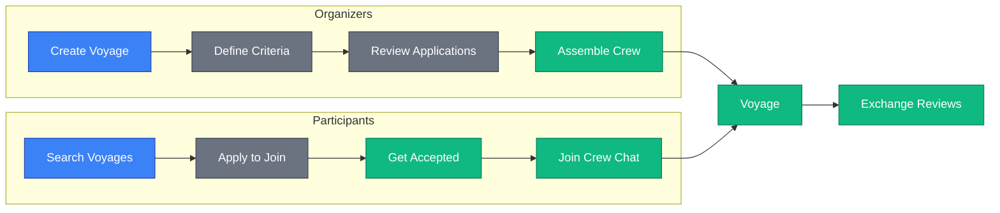

# Platform Introduction

SkipperClub is a social platform connecting **skippers** organizing sea voyages with **crew seekers** looking for spots on board. The platform streamlines the traditionally chaotic process of assembling sailing crews.

## The Problem

Currently, crew assembly happens chaotically in Facebook groups, requiring numerous messages, compromises, and manual verification of expectations. There is no centralized tool that enables:

- **Precise filtering** of voyages by sailing style, experience, budget, and exclusions (smoking, alcohol, children, pets)
- **Transparent profiles** showing participant skills and preferences
- **A rating system** that increases trust between strangers
- **Safe, centralized communication** (1:1, group, Q&A) in one place

This results in long recruitment times, risk of conflicts on the yacht, and untapped potential for sailing meetups.

## The Solution

SkipperClub provides a complete platform for voyage organization:

## Target Users

### Skippers (Organizers)

Experienced sailors who own or charter vessels and want to:

- Find reliable crew members for their voyages
- Verify participant experience and sailing skills
- Communicate voyage details and requirements clearly
- Build a reputation through positive reviews

### Crew Seekers (Participants)

People looking for sailing opportunities who want to:

- Find voyages matching their experience level
- Filter by date, location, vessel type, and preferences
- Verify organizer reputation before committing
- Connect with like-minded sailors

## Core Value Proposition

| For Organizers                     | For Participants                  |
| ---------------------------------- | --------------------------------- |
| Post voyages with precise criteria | Search and filter voyages easily  |
| Review applicants before accepting | See organizer ratings and reviews |
| Manage crew through dedicated chat | Ask questions via Q&A chat        |
| Rate participants after voyage     | Rate organizers and crew          |

## Platform Features

### User Profiles

Detailed profiles containing:

- Sailing experience and tenure
- Certificates and licenses held
- Languages spoken
- Personal bio and photos
- Social media links
- Voyage preferences (style, budget)
- Personal restrictions (smoking, alcohol)

### Voyage Listings

Comprehensive voyage information:

- Title, description, and photos
- Date range and duration
- Body of water and route (port to port)
- Vessel details (type, model, year)
- Voyage type (family, sport, party, training, etc.)
- Required experience and skills
- Budget per person
- Available spots
- Exclusions (smoking, alcohol, children, pets)
- Public or private visibility

### Communication

Four WebSocket-powered chat channels:

1. **1:1 Chat** — Private messaging between authenticated users
2. **Group Chat** — Custom groups of authenticated users
3. **Voyage Chat** — Organizer and accepted participants
4. **Q&A Chat** — Private questions to voyage organizer

### Rating System

Post-voyage blind reviews across four categories:

- Communication
- Behavior
- Skills
- Duties fulfillment

Reviews are only published after both parties submit their ratings, ensuring honest feedback.

## Success Metrics

The platform targets these key performance indicators:

| Metric                                         | Target |
| ---------------------------------------------- | ------ |
| Voyages assembling crew within 60 days         | 70%    |
| Average post-voyage matching rating            | > 3.0  |
| User retention (publish/join within 12 months) | 50%    |

## MVP Boundaries

The current MVP focuses on core functionality. The following features are planned for future releases:

- Online payment processing
- Charter company integrations
- AI-based crew matching
- Transport organization tools
- License verification system
- Platform monetization

## Next Steps

- [Key Concepts](./concepts.md) — Learn about cruises, participants, and reviews
- [Architecture](./architecture.md) — Understand the system components
- [Quick Start](../getting-started/index.md) — Make your first API call
