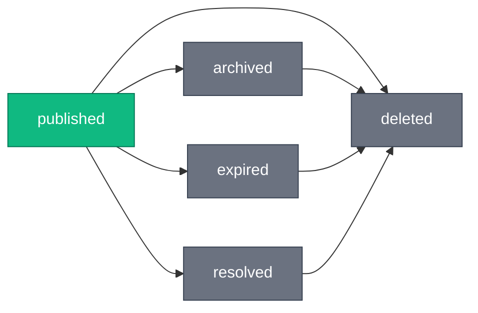

# Posts

The posts API enables users to share sailing experiences through categorized, media-rich posts with region-specific content, lifecycle management, and social interactions.

## Overview

SkipperClub's social feed allows users to share their sailing adventures. Posts support:

- **Post Types** — 10 specialized content types (photo, place, tips, marina, weather, etc.)
- **Region Association** — Geographic context for location-relevant content
- **Lifecycle Management** — Published, archived, expired, resolved, and deleted states
- **Media Attachments** — Images and videos from sailing trips
- **Hashtags** — Automatic extraction from description text
- **User Tagging** — Tag friends who participated in the trip
- **Reactions** — Express emotions with emoji reactions (20 curated types)
- **Bookmarks** — Save posts for later reference
- **Comments** — Engage with the community
- **Validity Voting** — Community verification of time-sensitive information

## Post Types

Posts are categorized into specialized types, each with specific field requirements:

| Type                 | Category       | Description                | Expiration |
| -------------------- | -------------- | -------------------------- | ---------- |
| `photo`              | Evergreen      | General sailing photos     | Never      |
| `place`              | Evergreen      | Interesting locations      | Never      |
| `food`               | Evergreen      | Restaurant recommendations | Never      |
| `marina`             | Evergreen      | Marina reviews             | Never      |
| `tips`               | Evergreen      | Sailing advice             | Never      |
| `route`              | Evergreen      | Sailing route with stops   | Never      |
| `berth`              | Time-sensitive | Available berth offers     | 6 hours    |
| `weather`            | Time-sensitive | Weather alerts             | 7 days     |
| `navigation_warning` | Time-sensitive | Navigation hazards         | 7 days     |
| `help`               | Time-sensitive | Requests for assistance    | 72 hours   |

### Type-Specific Field Requirements

| Type                 | Media Required | Description Required | Location Required | Coordinates Required |
| -------------------- | -------------- | -------------------- | ----------------- | -------------------- |
| `photo`              | ✅             | ❌                   | ❌                | ❌                   |
| `place`              | ❌             | ✅                   | ✅                | ✅                   |
| `food`               | ❌             | ✅                   | ✅                | ✅                   |
| `marina`             | ❌             | ✅                   | ✅                | ✅                   |
| `tips`               | ❌             | ✅                   | ❌                | ❌                   |
| `route`              | ❌             | ✅                   | ✅                | ✅                   |
| `berth`              | ❌             | ✅                   | ✅                | ✅                   |
| `weather`            | ❌             | ✅                   | ✅                | ✅                   |
| `navigation_warning` | ❌             | ✅                   | ✅                | ✅                   |
| `help`               | ❌             | ✅                   | ✅                | ✅                   |

## Post Lifecycle

Posts transition through the following statuses:



| Status      | Description                          | Visibility  | Editable |
| ----------- | ------------------------------------ | ----------- | -------- |
| `published` | Active post                          | Everyone    | ✅       |
| `archived`  | Manually archived by author          | Author only | ❌       |
| `expired`   | Auto-expired (time-sensitive types)  | Author only | ❌       |
| `resolved`  | Issue resolved (time-sensitive only) | Author only | ❌       |
| `deleted`   | Soft-deleted                         | No one      | ❌       |

### Automatic Expiration

Time-sensitive posts automatically transition to `expired` status:

- `berth`: 6 hours after creation
- `weather`: 7 days
- `navigation_warning`: 7 days
- `help`: 72 hours (3 days)

### Effectively Expired Posts

A post is "effectively expired" when:

- Status is `published`
- `expiresAt` is in the past

**Visibility:** Non-authors see 404 for effectively expired posts. Authors can still view them but cannot edit.

**Interactions:** Per the D4 design decision, all interactions (reactions, bookmarks, reports, validity-vote, comments) require truly `published` posts that are NOT effectively expired. Even the post author cannot interact with their own effectively expired posts.

## Endpoints

| Method | Endpoint                                   | Description           |
| ------ | ------------------------------------------ | --------------------- |
| GET    | `/posts`                                   | List post feed        |
| POST   | `/posts`                                   | Create a new post     |
| GET    | `/posts/{postId}`                          | Get post details      |
| PUT    | `/posts/{postId}`                          | Update post (full)    |
| PATCH  | `/posts/{postId}`                          | Update post (partial) |
| DELETE | `/posts/{postId}`                          | Delete post           |
| GET    | `/posts/{postId}/comments`                 | List comments         |
| POST   | `/posts/{postId}/comments`                 | Add comment           |
| PUT    | `/posts/{postId}/comments/{commentId}`     | Update comment        |
| DELETE | `/posts/{postId}/comments/{commentId}`     | Delete comment        |
| PUT    | `/posts/{postId}/reactions/{reactionType}` | Add reaction          |
| DELETE | `/posts/{postId}/reactions/{reactionType}` | Remove reaction       |
| PUT    | `/posts/{postId}/bookmark`                 | Add bookmark          |
| DELETE | `/posts/{postId}/bookmark`                 | Remove bookmark       |
| PUT    | `/posts/{postId}/validity-vote`            | Cast validity vote    |
| POST   | `/posts/{postId}/reports`                  | Report a post         |
| GET    | `/profile/bookmarks/posts`                 | List bookmarked posts |

---

## Key Concepts

### Region Association

Posts are associated with a region code from the regions hierarchy. Region codes use ISO 3166-1 alpha-2 format (e.g., `HR` for Croatia, `GR` for Greece). The region is optional and may be `null` when a post has no resolvable location (see [Region Resolution](#region-resolution) under Create Post).

When filtering by region, the API includes all posts from descendant regions:

- Query `regionCode=IT` includes posts from `IT-SAR` (Sardinia), `IT-SIC` (Sicily), etc.

### Cross-Region Types

The `crossRegionTypes` parameter allows certain post types to bypass the `regionCode` filter and appear from all regions.

**Only evergreen types are allowed:**

- `photo`, `place`, `food`, `marina`, `tips`, `route`

**Time-sensitive types cannot be cross-region:**

- `berth`, `weather`, `navigation_warning`, `help` are always filtered by `regionCode`

If `crossRegionTypes` contains any time-sensitive type, the API returns 422 validation error.

**Example:**

```http
GET /v1/posts?regionCode=HR&crossRegionTypes=photo&crossRegionTypes=tips
```

Returns photos and tips from ALL regions, while other types are filtered to `HR` (Croatia) and descendants.

### Permissions

Each post response includes a `permissions` object indicating what actions the current user can perform:

```json
{
  "permissions": {
    "edit": true,
    "delete": true,
    "archive": true,
    "resolve": false,
    "comment": true,
    "react": true,
    "bookmark": true,
    "report": false,
    "validityVote": true
  }
}
```

| Permission     | Description                                                              |
| -------------- | ------------------------------------------------------------------------ |
| `edit`         | Can modify post content (author only, published status)                  |
| `delete`       | Can delete post (author only)                                            |
| `archive`      | Can archive post (author only, published status)                         |
| `resolve`      | Can mark as resolved (author only, time-sensitive types)                 |
| `comment`      | Can add comments (published, not effectively expired)                    |
| `react`        | Can add reactions (published, not effectively expired)                   |
| `bookmark`     | Can bookmark post (published, not effectively expired)                   |
| `report`       | Can report post (published, not effectively expired)                     |
| `validityVote` | Can vote on validity (votable types: berth, weather, navigation_warning) |

### Reactions Summary

Each post includes a `reactions` object with aggregated reaction data:

```json
{
  "reactions": {
    "total": 15,
    "byType": {
      "heart": 10,
      "anchor": 3,
      "sailboat": 2
    },
    "userReactions": ["heart"]
  }
}
```

| Field           | Description                                         |
| --------------- | --------------------------------------------------- |
| `total`         | Total count of all reactions                        |
| `byType`        | Count per reaction type (only types with count > 0) |
| `userReactions` | Current user's reaction types                       |

### Hashtag Extraction

Hashtags are automatically extracted from the description text:

- `"Amazing sunset! #sailing #baltic"` → `["sailing", "baltic"]`
- Stored lowercase without the `#` prefix
- Duplicate hashtags are removed

---

## List Posts

```http
GET /posts
```

Retrieve a paginated feed of posts.

### Query Parameters

| Parameter          | Type     | Default         | Description                                                                 |
| ------------------ | -------- | --------------- | --------------------------------------------------------------------------- |
| `type`             | string[] | —               | Filter by post type(s)                                                      |
| `regionCode`       | string   | —               | Filter by region (includes descendants)                                     |
| `status`           | string[] | `["published"]` | Filter by status(es)                                                        |
| `userId`           | uuid     | —               | Filter by author (required for non-published statuses)                      |
| `crossRegionTypes` | string[] | —               | Evergreen types to include across regions                                   |
| `locationName`     | string   | —               | Filter by location name (case-insensitive substring match)                  |
| `lat`              | number   | —               | Latitude for location search (-90 to 90). Requires `lng` and `distance`.    |
| `lng`              | number   | —               | Longitude for location search (-180 to 180). Requires `lat` and `distance`. |
| `distance`         | integer  | —               | Search radius in km (1-100). Requires `lat` and `lng`.                      |
| `fromDate`         | date     | —               | Filter posts from this date (ISO 8601 with timezone)                        |
| `toDate`           | date     | —               | Filter posts until this date (ISO 8601 with timezone)                       |
| `hashtag`          | string   | —               | Filter by hashtag (without #)                                               |
| `limit`            | integer  | 20              | Results per page (1-100)                                                    |
| `offset`           | integer  | 0               | Results to skip                                                             |
| `sort`             | string   | `createdAt`     | Sort field (`createdAt`, `updatedAt`, `distance`)                           |
| `order`            | string   | `desc`          | Sort order (`asc`, `desc`)                                                  |

### Status Filter Rules

**Valid status values:** `published`, `archived`, `expired`, `resolved`

**Invalid status values:** `deleted` and any non-existent status (e.g., `paused`, `draft`) return 422 validation error.

- **Without `userId`:** Only `published` status allowed. Non-published statuses return 422.
- **With `userId=currentUser`:** Full status filtering supported (`published`, `archived`, `expired`, `resolved`).
- **With `userId=otherUser`:** Only `published` status allowed. Non-published statuses return 422.

### Response

**200 OK**

```json
{
  "data": [
    {
      "id": "018fa2e4-8e3b-7b2e-8e3b-7b2e8e3b7b99",
      "type": "photo",
      "status": "published",
      "regionCode": "HR",
      "user": {
        "id": "018fa2e4-8e3b-7b2e-8e3b-7b2e8e3b7b00",
        "name": "Jan Kowalski",
        "avatarUrl": "https://cdn.example.com/avatars/jan.jpg"
      },
      "description": "Beautiful sunset over the Adriatic! #sailing #sunset",
      "locationName": "Split",
      "coordinates": {
        "lat": 43.508133,
        "lng": 16.440193
      },
      "hashtags": ["sailing", "sunset"],
      "media": [
        {
          "id": "018fa2e4-8e3b-7b2e-8e3b-7b2e8e3b7b01",
          "url": "https://cdn.example.com/posts/sunset.jpg",
          "type": "image",
          "width": 1920,
          "height": 1080,
          "status": "validated"
        }
      ],
      "taggedUsers": [],
      "commentsCount": 5,
      "reactions": {
        "total": 15,
        "byType": {
          "heart": 10,
          "anchor": 5
        },
        "userReactions": ["heart"]
      },
      "permissions": {
        "edit": false,
        "delete": false,
        "archive": false,
        "resolve": false,
        "comment": true,
        "react": true,
        "bookmark": true,
        "report": true,
        "validityVote": false
      },
      "bookmarked": false,
      "expiresAt": null,
      "createdAt": "2025-11-23T18:30:00Z",
      "updatedAt": "2025-11-23T18:30:00Z"
    }
  ],
  "meta": {
    "total": 150,
    "limit": 20,
    "offset": 0,
    "hasMore": true
  }
}
```

---

## Create Post

```http
POST /posts
```

Create a new post. The request body structure varies by post type (polymorphic validation).

### Common Fields

| Field           | Type   | Description                                                              |
| --------------- | ------ | ------------------------------------------------------------------------ |
| `type`          | string | **Required.** Post type                                                  |
| `regionCode`    | string | Region code (max 50 chars). Optional — auto-resolved from `coordinates`. |
| `description`   | string | Post text (1-2200 characters)                                            |
| `locationName`  | string | Location name (max 255 characters)                                       |
| `coordinates`   | object | `{ lat, lng }` coordinates                                               |
| `mediaIds`      | uuid[] | Media UUIDs (1-10 items)                                                 |
| `taggedUserIds` | uuid[] | Tagged user UUIDs (max 20)                                               |

### Region Resolution

`regionCode` is optional when creating a post:

- **Provided explicitly** — used as-is; must reference an existing region (otherwise `422`).
- **Omitted with `coordinates`** — the region is resolved automatically from the coordinates via point-in-polygon against the region geometry (`regions.geom`). The most specific region containing the point wins (e.g. `IT-SAR` over `IT`).
- **Omitted, coordinates match no region** — the post is stored with `regionCode: null`.
- **Omitted with no `coordinates`** — the post is stored with `regionCode: null`.

This lets clients submit a location (e.g. from GPS or the geocoder) without making the user pick a region from a list.

### Route-Specific Fields

| Field          | Type     | Description                                                           |
| -------------- | -------- | --------------------------------------------------------------------- |
| `stops`        | object[] | **Required for route.** Array of `{ name, coordinates }` (1-30 stops) |
| `durationDays` | integer  | Route duration in days (min 1)                                        |
| `lengthNm`     | number   | Route length in nautical miles (min 0)                                |

### Example: Photo Post

```http
POST /v1/posts HTTP/1.1
Content-Type: application/json

{
  "type": "photo",
  "regionCode": "HR",
  "description": "Amazing sailing trip! #sailing #adriatic",
  "locationName": "Split",
  "mediaIds": ["018fa2e4-8e3b-7b2e-8e3b-7b2e8e3b7b01"]
}
```

### Example: Route Post

```http
POST /v1/posts HTTP/1.1
Content-Type: application/json

{
  "type": "route",
  "regionCode": "HR",
  "description": "Week-long Croatian island hopping route",
  "locationName": "Split to Dubrovnik",
  "coordinates": { "lat": 43.508133, "lng": 16.440193 },
  "stops": [
    { "name": "Split", "coordinates": { "lat": 43.508133, "lng": 16.440193 } },
    { "name": "Hvar", "coordinates": { "lat": 43.172389, "lng": 16.441111 } },
    { "name": "Dubrovnik", "coordinates": { "lat": 42.650661, "lng": 18.094424 } }
  ],
  "durationDays": 7,
  "lengthNm": 120
}
```

### Response

**201 Created**

Returns the created post object.

### Errors

| Status | Type                             | Description                           |
| ------ | -------------------------------- | ------------------------------------- |
| 404    | `/errors/media-not-found`        | One or more media IDs not found       |
| 404    | `/errors/tagged-users-not-found` | One or more tagged user IDs not found |
| 422    | `/errors/validation`             | Validation failed                     |

---

## Update Post Status

Use PATCH to update post status:

### Archive Post

```http
PATCH /v1/posts/{postId} HTTP/1.1
Content-Type: application/json

{
  "status": "archived"
}
```

### Resolve Post (time-sensitive types only)

```http
PATCH /v1/posts/{postId} HTTP/1.1
Content-Type: application/json

{
  "status": "resolved"
}
```

### Errors

| Status | Type                                   | Description                                  |
| ------ | -------------------------------------- | -------------------------------------------- |
| 400    | `/errors/post-in-non-editable-state`   | Cannot modify archived/expired/resolved post |
| 400    | `/errors/invalid-status-transition`    | Invalid status transition                    |
| 400    | `/errors/invalid-post-type-for-status` | Status not valid for this post type          |

---

## Delete Post

```http
DELETE /posts/{postId}
```

Soft-delete a post (sets status to `deleted`). Only the author can delete their post. Deletion is allowed from any non-deleted status (`published`, `archived`, `expired`, `resolved`).

### Response

**204 No Content**

### Errors

| Status | Type                         | Description         |
| ------ | ---------------------------- | ------------------- |
| 403    | `/errors/cannot-delete-post` | Not the post author |
| 404    | `/errors/post-not-found`     | Post doesn't exist  |

---

## Bookmarks

Users can save posts to a personal bookmark list for later reference.

### Add Bookmark

```http
PUT /posts/{postId}/bookmark
```

Bookmark a post. Idempotent - returns 200 if already bookmarked.

**Restrictions (D4 Decision):** Bookmarks are only allowed on `published` posts that are not effectively expired. All other statuses return 404.

#### Response

**200 OK**

```json
{
  "bookmarked": true,
  "postId": "018fa2e4-8e3b-7b2e-8e3b-7b2e8e3b7b99"
}
```

### Remove Bookmark

```http
DELETE /posts/{postId}/bookmark
```

Remove a bookmark. Idempotent - returns 204 even if not bookmarked.

#### Response

**204 No Content**

### List Bookmarked Posts

```http
GET /profile/bookmarks/posts
```

Retrieve the current user's bookmarked posts.

#### Query Parameters

| Parameter | Type    | Default     | Description                           |
| --------- | ------- | ----------- | ------------------------------------- |
| `limit`   | integer | 20          | Results per page (1-100)              |
| `offset`  | integer | 0           | Results to skip                       |
| `sort`    | string  | `createdAt` | Sort field (`createdAt`, `updatedAt`) |
| `order`   | string  | `desc`      | Sort order (`asc`, `desc`)            |

#### Response

**200 OK**

```json
{
  "data": [
    {
      "id": "018fa2e4-8e3b-7b2e-8e3b-7b2e8e3b7b99",
      "type": "photo",
      "status": "published",
      ...
    }
  ],
  "meta": {
    "total": 42,
    "limit": 20,
    "offset": 0,
    "hasMore": true
  }
}
```

**Note:** Bookmarks only show `published` posts that are not effectively expired. Posts that became inaccessible (archived, expired, resolved by author) are excluded from results.

### Errors

| Status | Type                     | Description                             |
| ------ | ------------------------ | --------------------------------------- |
| 404    | `/errors/post-not-found` | Post doesn't exist or is not accessible |

---

## Reactions

Users can express their feelings about posts with emoji reactions.

### Add Reaction

```http
PUT /posts/{postId}/reactions/{reactionType}
```

Add an emoji reaction to a post. Idempotent - returns 200 if already exists. Users can add multiple different reaction types to the same post.

**Restrictions (D4 Decision):** Reactions are only allowed on `published` posts that are not effectively expired. All other statuses return 404 for everyone, including the author.

#### Response

**200 OK**

```json
{
  "total": 15,
  "byType": {
    "heart": 10,
    "anchor": 3,
    "sailboat": 2
  },
  "userReactions": ["heart", "anchor"]
}
```

### Remove Reaction

```http
DELETE /posts/{postId}/reactions/{reactionType}
```

Remove an emoji reaction from a post. Idempotent - returns 204 even if reaction doesn't exist.

#### Response

**204 No Content**

### Reaction Types

See [Reaction Type Enum](../reference/enums/reaction-type.md) for the complete list of 20 available reaction types.

### Errors

| Status | Type                     | Description                             |
| ------ | ------------------------ | --------------------------------------- |
| 404    | `/errors/post-not-found` | Post doesn't exist or is not accessible |
| 422    | `/errors/validation`     | Invalid reaction type                   |

---

## Validity Voting

Community validity voting allows users to confirm or report time-sensitive posts as invalid. This helps maintain accurate, up-to-date information.

### Votable Post Types

Only the following time-sensitive types support validity voting:

- `berth` — Available berth offers
- `weather` — Weather alerts
- `navigation_warning` — Navigation hazards

**Note:** The `help` type does NOT support community voting. Help requests can only be resolved by the author.

### Cast Validity Vote

```http
PUT /posts/{postId}/validity-vote
Content-Type: application/json

{
  "voteType": "confirm"
}
```

**Vote Types:**

- `confirm` — Information is still accurate
- `report_invalid` — Information is no longer accurate

**Restrictions (D4 Decision):** Votes are only allowed on `published` posts that are not effectively expired. All other statuses return 404.

#### Response

**200 OK**

```json
{
  "postId": "018fa2e4-8e3b-7b2e-8e3b-7b2e8e3b7b99",
  "voteType": "confirm",
  "confirmCount": 5,
  "invalidCount": 2
}
```

### Vote Summary in Post Response

For votable post types, the post response includes a `validityVotes` object:

```json
{
  "validityVotes": {
    "confirmCount": 5,
    "invalidCount": 2,
    "userVote": "confirm"
  }
}
```

- `userVote` is `null` if the user hasn't voted yet
- Non-votable post types don't include this field

### Auto-Resolution

When a post receives **3 or more `report_invalid` votes**, it is automatically transitioned to `resolved` status.

### Vote Immutability

Votes cannot be changed once cast:

- Same vote type: Returns 200 (idempotent)
- Different vote type: Returns 409 Conflict

### Errors

| Status | Type                                   | Description                               |
| ------ | -------------------------------------- | ----------------------------------------- |
| 400    | `/errors/invalid-post-type-for-voting` | Post type doesn't support validity voting |
| 404    | `/errors/post-not-found`               | Post doesn't exist or is not accessible   |
| 409    | `/errors/vote-already-cast`            | Cannot change an existing vote            |
| 422    | `/errors/validation`                   | Invalid vote type                         |

---

## Reporting Posts

Users can report posts that violate community guidelines or contain harmful content. Reports are stored for moderation review.

### Create a Report

```http
POST /posts/{postId}/reports
Content-Type: application/json

{
  "reason": "spam",
  "details": "This post is advertising unrelated products"
}
```

**Response (201 Created):**

```json
{
  "id": "018fa2e4-8e3b-7b2e-8e3b-7b2e8e3b7c99",
  "postId": "018fa2e4-8e3b-7b2e-8e3b-7b2e8e3b7b99",
  "reason": "spam",
  "details": "This post is advertising unrelated products",
  "status": "pending",
  "createdAt": "2025-12-26T12:00:00Z"
}
```

### Report Reasons

| Reason           | Description                         |
| ---------------- | ----------------------------------- |
| `spam`           | Spam or irrelevant content          |
| `scam`           | Scam or fraudulent content          |
| `offensive`      | Offensive or inappropriate content  |
| `misinformation` | False or misleading information     |
| `danger`         | Dangerous or harmful content/advice |
| `other`          | Other policy violation              |

### Report Status

Reports are reviewed by moderators and can have the following statuses:

| Status      | Description                               |
| ----------- | ----------------------------------------- |
| `pending`   | Report submitted, awaiting review         |
| `reviewed`  | Report has been reviewed and action taken |
| `dismissed` | Report was reviewed and dismissed         |

### Rules (D4 Decision)

- Users can report the same post **multiple times**. Each report creates a new record for moderation review.
- Per D4 decision, reports are allowed ONLY on `published` posts that are not effectively expired:
  - `published` posts (not effectively expired) can be reported by any authenticated user
  - All other statuses (`archived`, `expired`, `resolved`, `deleted`, or effectively expired) return 404 for everyone, including the author
- Self-reporting is allowed, but only on `published` posts per D4.
- The optional `details` field can provide additional context (max 500 characters).

### Errors

| Status | Type                     | Description                                            |
| ------ | ------------------------ | ------------------------------------------------------ |
| 404    | `/errors/post-not-found` | Post does not exist or is not accessible               |
| 422    | `/errors/validation`     | Validation failed (invalid reason or details too long) |

---

## Comments

Comments allow users to engage with posts.

### List Comments

```http
GET /posts/{postId}/comments
```

**Restrictions:** Comments are only accessible on `published` posts that are not effectively expired.

#### Query Parameters

| Parameter | Type    | Default | Description      |
| --------- | ------- | ------- | ---------------- |
| `limit`   | integer | 20      | Results per page |
| `offset`  | integer | 0       | Results to skip  |

#### Response

**200 OK**

```json
{
  "comments": [
    {
      "id": "018fa2e4-8e3b-7b2e-8e3b-7b2e8e3b7c01",
      "user": {
        "id": "018fa2e4-8e3b-7b2e-8e3b-7b2e8e3b7b00",
        "name": "Jan Kowalski",
        "avatarUrl": "https://cdn.example.com/avatars/jan.jpg"
      },
      "text": "Great photo!",
      "createdAt": "2025-11-23T19:00:00Z",
      "updatedAt": "2025-11-23T19:00:00Z"
    }
  ],
  "total": 5,
  "limit": 20,
  "offset": 0
}
```

### Add Comment

```http
POST /posts/{postId}/comments
Content-Type: application/json

{
  "text": "Great photo!"
}
```

### Update Comment

```http
PUT /posts/{postId}/comments/{commentId}
Content-Type: application/json

{
  "text": "Updated comment text"
}
```

### Delete Comment

```http
DELETE /posts/{postId}/comments/{commentId}
```

**Response:** 204 No Content

### Errors

| Status | Type                        | Description                             |
| ------ | --------------------------- | --------------------------------------- |
| 403    | `/errors/comment-forbidden` | Not authorized to modify comment        |
| 404    | `/errors/post-not-found`    | Post doesn't exist or is not accessible |
| 404    | `/errors/comment-not-found` | Comment doesn't exist                   |
| 422    | `/errors/validation`        | Validation failed                       |

---

## Error Handling

All errors follow RFC 7807 Problem Details format:

```json
{
  "type": "/errors/post-not-found",
  "title": "Post Not Found",
  "status": 404,
  "detail": "The requested post could not be found"
}
```

### Error Types

| Type                                   | Status | Description                               |
| -------------------------------------- | ------ | ----------------------------------------- |
| `/errors/post-not-found`               | 404    | Post doesn't exist or inaccessible        |
| `/errors/post-forbidden`               | 403    | Not authorized to modify post             |
| `/errors/post-in-non-editable-state`   | 400    | Cannot modify non-editable post           |
| `/errors/invalid-status-transition`    | 400    | Invalid status transition                 |
| `/errors/invalid-post-type-for-status` | 400    | Status not valid for post type            |
| `/errors/cannot-delete-post`           | 403    | Only author can delete                    |
| `/errors/comment-not-found`            | 404    | Comment doesn't exist                     |
| `/errors/comment-forbidden`            | 403    | Not authorized for comment                |
| `/errors/media-not-found`              | 404    | Media ID doesn't exist                    |
| `/errors/tagged-users-not-found`       | 404    | Tagged user not found                     |
| `/errors/validation`                   | 422    | Request validation failed                 |
| `/errors/vote-already-cast`            | 409    | Cannot change existing validity vote      |
| `/errors/invalid-post-type-for-voting` | 400    | Post type doesn't support validity voting |

---

## Access Control

### Error Precedence

When checking access to a post, errors are returned in this order:

1. **404** — Post not found, deleted, or inaccessible
2. **403** — User lacks permission
3. **400** — Business rule violation (non-editable state)
4. **422** — Validation error

### Visibility Rules

| Viewer | Published | Effectively Expired | Archived/Expired/Resolved | Deleted  |
| ------ | --------- | ------------------- | ------------------------- | -------- |
| Author | ✅        | ✅ (view only)      | ✅                        | ❌       |
| Others | ✅        | ❌ (404)            | ❌ (404)                  | ❌ (404) |

### Endpoint Access Matrix

| Endpoint           |  published  | effectively expired | archived/expired/resolved | deleted |
| ------------------ | :---------: | :-----------------: | :-----------------------: | :-----: |
| GET /posts/{id}    |  All users  |     Author only     |        Author only        | 404 all |
| PATCH /posts/{id}  | Author only |         400         |            400            | 404 all |
| DELETE /posts/{id} | Author only |     Author only     |        Author only        | 404 all |
| Comments (all)     |  All users  |       404 all       |          404 all          | 404 all |
| Reactions          |  All users  |       404 all       |          404 all          | 404 all |
| Bookmark           |  All users  |       404 all       |          404 all          | 404 all |
| Validity-vote      |  All users  |       404 all       |          404 all          | 404 all |
| Reports            |  All users  |       404 all       |          404 all          | 404 all |

---

## Related

- [Post Types](../reference/enums/post-types.md) — Post type enum reference
- [Post Statuses](../reference/enums/post-statuses.md) — Post status lifecycle
- [Reaction Types](../reference/enums/reaction-type.md) — Available reactions
- [Validity Vote Types](../reference/enums/validity-vote-type.md) — Vote options
- [Media](../media/index.md) — File uploads for posts
- [Regions](../regions/index.md) — Region hierarchy
- [Geocoder](../geocoder/index.md) — Location search, autocomplete, and place details for populating `locationName` and `coordinates` fields
- [Map](../map/index.md) — Unified `/v1/map/items` endpoint that renders posts with coordinates alongside spots and check-ins
- [Notifications](../notifications/index.md) — Post notifications
- [Error Handling](../getting-started/errors.md) — RFC 7807 format
