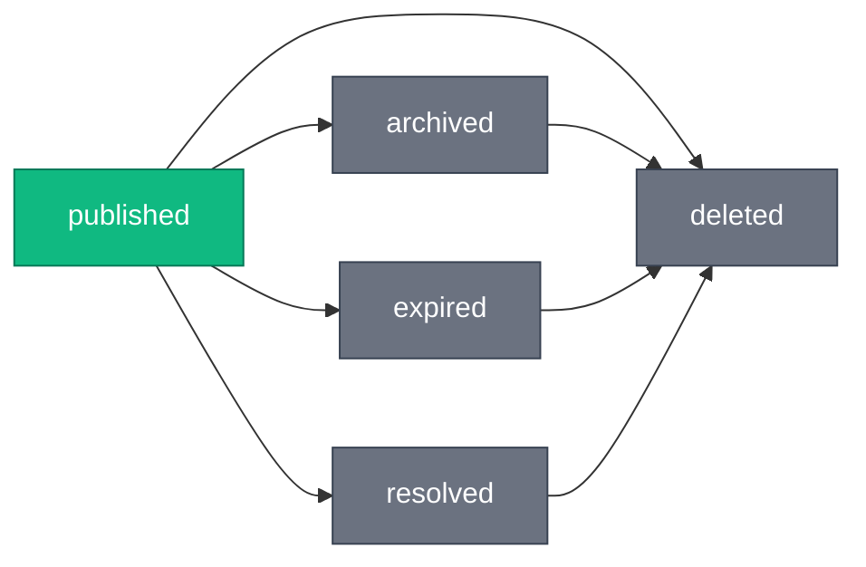

# Post Statuses

The `PostStatus` enum represents the lifecycle state of a post.

## Values

| Value       | Description                          | Visible To  |
| ----------- | ------------------------------------ | ----------- |
| `published` | Active, publicly visible post        | Everyone    |
| `archived`  | Manually archived by author          | Author only |
| `expired`   | Auto-expired (time-sensitive types)  | Author only |
| `resolved`  | Issue resolved (time-sensitive only) | Author only |
| `deleted`   | Soft-deleted post                    | No one      |

## Lifecycle Diagram



## Status Categories

### Editable Status

Only `published` posts can be edited:

```typescript
const NON_EDITABLE_STATUSES = ['archived', 'expired', 'resolved', 'deleted'];
```

### Inaccessible Statuses

Deleted posts are inaccessible to everyone:

```typescript
const INACCESSIBLE_STATUSES = ['deleted'];
```

### Author-Only Statuses

These statuses are only visible to the post author:

```typescript
const AUTHOR_ONLY_STATUSES = ['archived', 'expired', 'resolved'];
```

## Allowed Transitions

Users can only perform certain status transitions:

| From        | Allowed To             |
| ----------- | ---------------------- |
| `published` | `archived`, `resolved` |
| `archived`  | (none - terminal)      |
| `expired`   | (none - terminal)      |
| `resolved`  | (none - terminal)      |
| `deleted`   | (none - terminal)      |

### System-Only Transitions

- `published` → `expired`: Automatic via cron job
- Any → `deleted`: Via DELETE endpoint

### User-Initiated Transitions

- `published` → `archived`: Any author-managed post (via PATCH)
- `published` → `resolved`: Time-sensitive types only (via PATCH)

## Usage

### Archive a Post

```http
PATCH /v1/posts/{postId}
Content-Type: application/json

{
  "status": "archived"
}
```

### Resolve a Post

Only valid for time-sensitive types (`berth`, `weather`, `navigation_warning`, `help`):

```http
PATCH /v1/posts/{postId}
Content-Type: application/json

{
  "status": "resolved"
}
```

### Filter by Status

Filtering by non-published statuses requires `userId` parameter matching the current user:

```http
GET /v1/posts?userId=018fa2e4-...&status=archived&status=expired
```

## Errors

| Error                                  | Status | Description                       |
| -------------------------------------- | ------ | --------------------------------- |
| `/errors/invalid-status-transition`    | 400    | Invalid transition attempted      |
| `/errors/invalid-post-type-for-status` | 400    | `resolved` used on evergreen type |
| `/errors/post-in-non-editable-state`   | 400    | Trying to edit non-published post |

## Related

- [Post Types](./post-types.md)
- [Posts API](../../posts/index.md)
