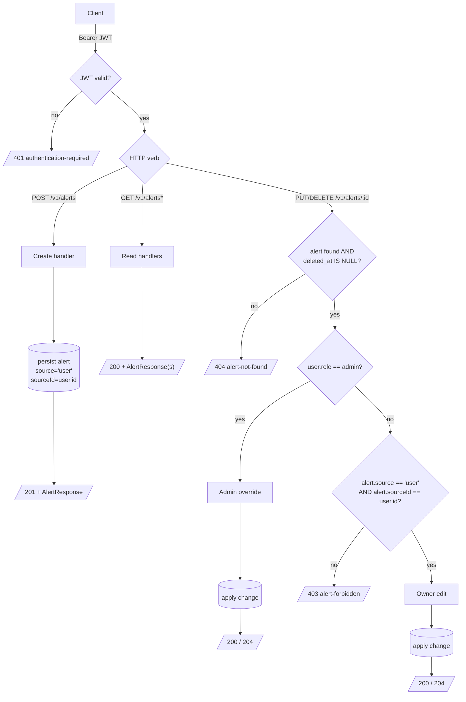

# Alert Ownership and Authorization Flow

Navigation alerts are user-submitted. Authorization is enforced inline on
the standard CRUD endpoints by the alert handlers — there is no separate
admin-only endpoint tree.

## Rules

- **Create.** Any authenticated user can create an alert. The server
  always stamps `source = 'user'` and `sourceId = <authenticated user id>`
  — the client cannot override either.
- **Read.** Both `GET /v1/alerts` and `GET /v1/alerts/{id}` are open to
  any authenticated user. Soft-deleted alerts (`deleted_at IS NOT NULL`)
  are excluded from all read endpoints, including `/v1/map/items`.
- **Update / Delete.** Two distinct paths:
  - **Admin** (`user.role === 'admin'`). May modify or soft-delete any
    alert through the standard endpoints. No separate admin route.
  - **Owner** (`alert.source === 'user' && alert.sourceId === user.id`).
    May modify or soft-delete their own alerts. Anybody else attempting
    to modify or delete somebody else's alert receives `403` with
    `type: /errors/alert-forbidden`.
- **Soft Delete.** `DELETE` sets `deleted_at` and the alert disappears
  from every read endpoint (including `/v1/map/items`). Subsequent
  `GET /v1/alerts/{id}` returns `404 alert-not-found`. There is no
  "undelete" or trash view.

## Why No Admin Endpoint Tree

A parallel `/v1/admin/alerts` tree would force every PUT/DELETE consumer
to know which endpoint to call based on the caller's role. The inline
override keeps the public API surface flat: admin clients call the same
endpoints as any other authenticated client, the handler just checks
`user.role` before the ownership check.

## Related

- [Alerts API](../../alerts/index.md)
- [Alert Categories](../enums/alert-categories.md)
- [Map API](../../map/index.md)
- [User Roles](../enums/user-roles.md)
