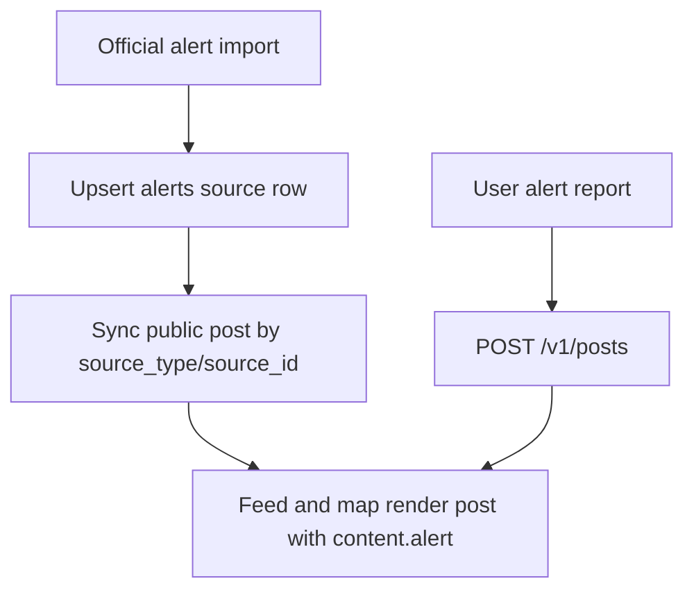

# Alert Ownership Flow

Public alert ownership through `/v1/alerts` has been removed.

Current model:

- Users create alert posts through `POST /v1/posts` with `content.alert`.
- Official imports write source rows in `alerts` and then create/update a
  system-generated public post with no author.
- System-generated alert posts cannot be edited, deleted, archived, or resolved
  through regular user endpoints.
- Public interactions happen on the generated post: comments, reactions,
  bookmarks, reports, and validity votes.

See [Alerts](../../alerts/index.md) and
[Posts](../../posts/index.md).
