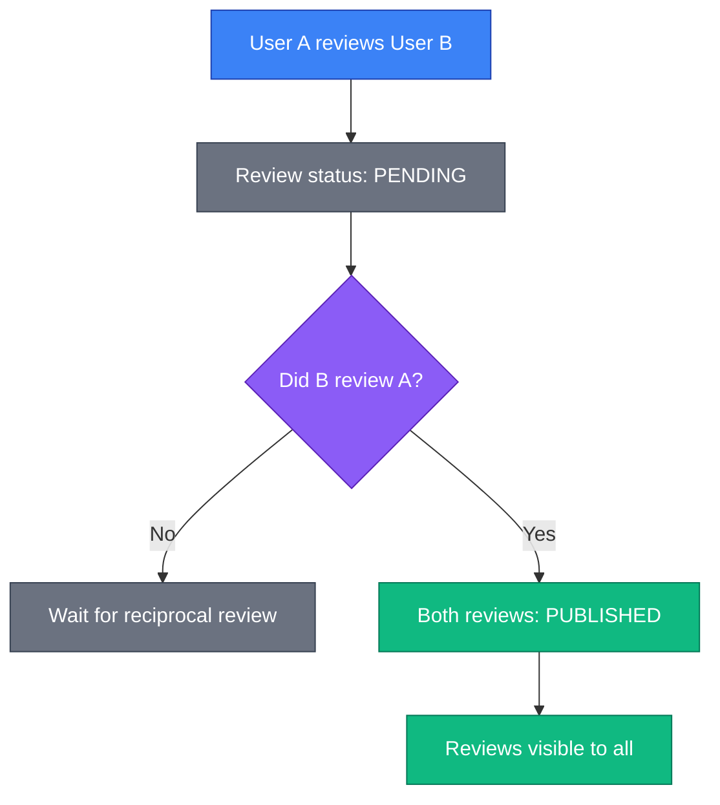
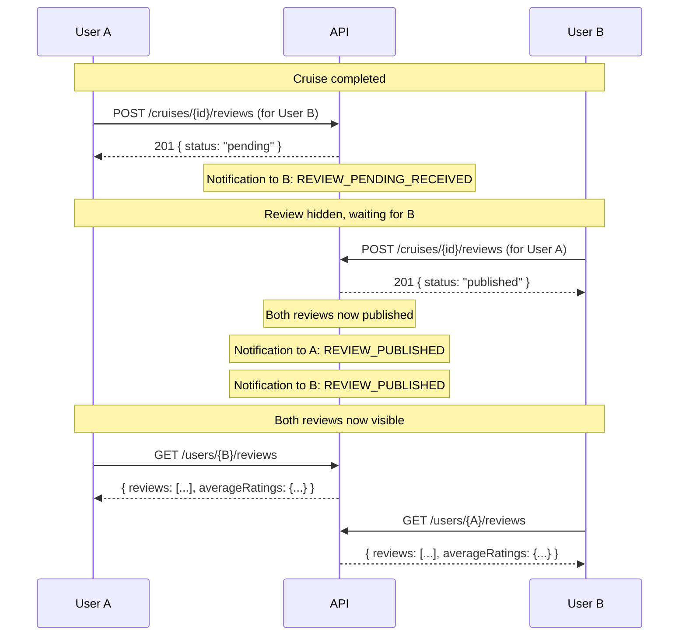
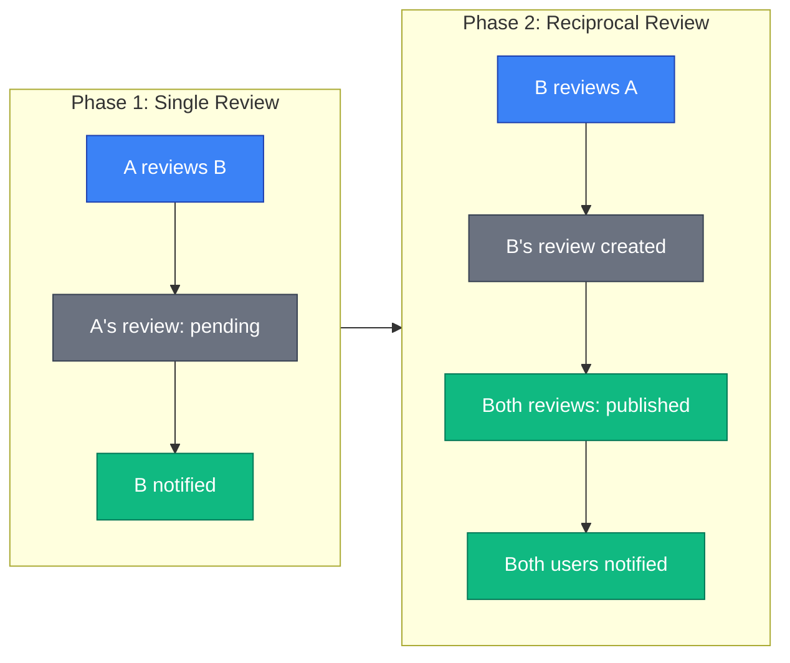

# Blind Review Flow

This document describes the blind review system in the SkipperClub platform.

## Overview

SkipperClub uses a **blind review system** to ensure honest and unbiased feedback between cruise participants. Reviews remain hidden until both parties have submitted their reviews for each other.

**Key principles:**

- Reviews can only be submitted after a cruise is completed
- Only accepted cruise participants can submit reviews
- Users cannot review themselves
- Reviews are **blind** — hidden until reciprocal review is submitted
- Each review has 4 rating categories (1-5 stars)

## Review Status

| Status      | Description                                     |
| ----------- | ----------------------------------------------- |
| `pending`   | Review submitted, waiting for reciprocal review |
| `published` | Both parties submitted reviews, now visible     |

## Rating Categories

Each review includes 4 rating categories, scored 1-5:

| Category        | Description                              |
| --------------- | ---------------------------------------- |
| `communication` | How well the person communicates         |
| `behavior`      | Attitude and cooperation on board        |
| `skills`        | Sailing and nautical competence          |
| `duties`        | Fulfillment of assigned responsibilities |

An **average** rating is calculated automatically from these 4 categories.

## Flow Diagram



## Sequence Diagram



## Review Status Timeline



## Eligibility Requirements

To submit a review:

| Requirement          | Description                                          |
| -------------------- | ---------------------------------------------------- |
| Cruise completed     | The arrival date must have passed                    |
| Accepted participant | Only organizer and accepted participants can review  |
| Not self-review      | Users cannot review themselves                       |
| One review per pair  | You can only review each participant once per cruise |

## Notifications

| Event                             | Recipient        | Notification                                                                  |
| --------------------------------- | ---------------- | ----------------------------------------------------------------------------- |
| Cruise arrival + 1 day (cron job) | Each participant | `CRUISE_REVIEW_REMINDER` — "Review your fellow crew members"                  |
| User A reviews User B             | User B           | `REVIEW_PENDING_RECEIVED` — "Someone reviewed you - leave a review to see it" |
| Both reviews submitted            | User A           | `REVIEW_PUBLISHED` — "Your review is now published"                           |
| Both reviews submitted            | User B           | `REVIEW_PUBLISHED` — "Your review is now published"                           |

## Error Scenarios

| Error                            | Status | Description                                |
| -------------------------------- | ------ | ------------------------------------------ |
| `/errors/cruise-not-found`       | 404    | Cruise doesn't exist                       |
| `/errors/user-not-found`         | 404    | Reviewed user doesn't exist                |
| `/errors/not-cruise-participant` | 403    | Reviewer is not an accepted participant    |
| `/errors/cruise-not-completed`   | 422    | Cruise has not completed yet               |
| `/errors/review-already-exists`  | 422    | Already reviewed this user for this cruise |
| `/errors/cannot-review-self`     | 422    | Cannot submit a self-review                |

## Why Blind Reviews?

The blind system prevents:

1. **Retaliation reviews** — Can't see negative feedback before submitting your own
2. **One-sided influence** — Your rating isn't affected by seeing theirs first
3. **Social pressure** — No pressure to give positive reviews to avoid conflict

## Access Control

| Cruise Type | Who Can View Published Reviews           |
| ----------- | ---------------------------------------- |
| Public      | Anyone                                   |
| Private     | Only organizer and accepted participants |

## Data Model (API Response)

The following interface represents the **API response** format. The database stores ratings as individual columns, and the `average` is calculated at runtime.

```typescript
interface ReviewResponse {
  id: string; // UUID v7
  cruiseId: string; // Cruise UUID
  reviewerId: string; // Reviewer user ID
  reviewedUserId: string; // Reviewed user ID
  ratings: {
    communication: number; // 1-5
    behavior: number; // 1-5
    skills: number; // 1-5
    duties: number; // 1-5
    average: number; // Calculated at runtime, not stored
  };
  comment: string; // 100-1000 characters
  status: 'pending' | 'published';
  createdAt: string;
  updatedAt: string;
}
```

**Note:** In the database, the `Review` entity stores `communication`, `behavior`, `skills`, and `duties` as separate integer columns. The `ratings` object and `average` field are constructed in the API response layer.

## Related

- [Reviews API](../../reviews/index.md) — Full reviews documentation
- [Notification Flows](./notification-flows.md) — When notifications are triggered
- [Cruise Participant State Flow](./cruise-participant-state-flow.md) — Participant eligibility
