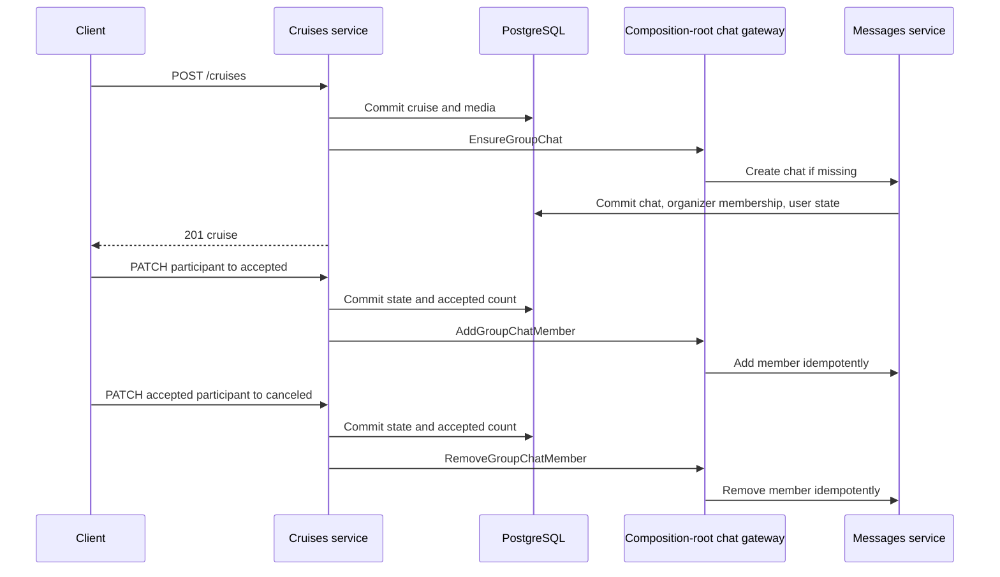
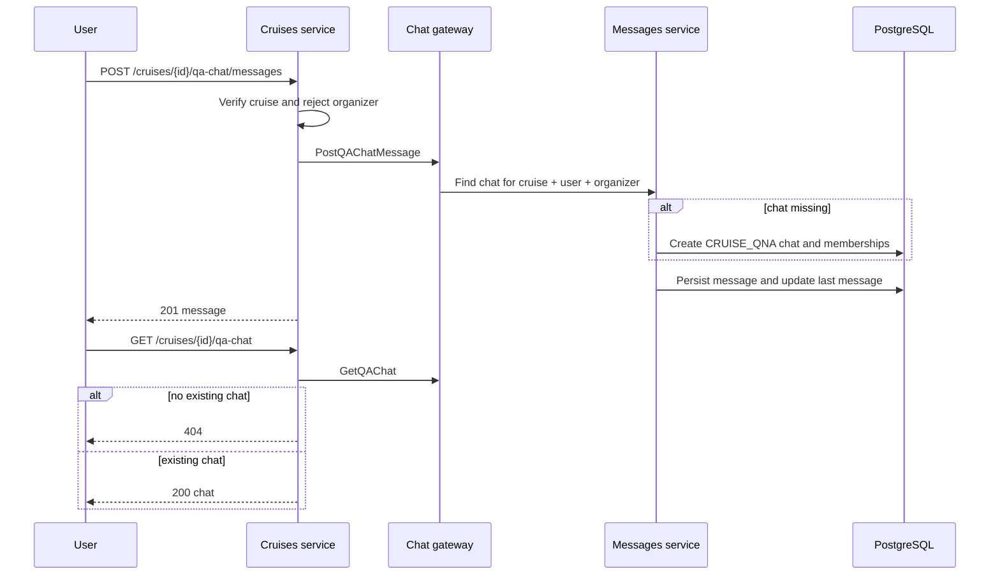

# Cruise Chat Flows

This reference describes the current Go service flow for cruise group and Q&A
chats. REST details and schemas are in [Cruise Chats](../../cruises/chats.md).

## Chat types

| Type           | Cardinality                           | Members                           | Creation                                      |
| -------------- | ------------------------------------- | --------------------------------- | --------------------------------------------- |
| `CRUISE_GROUP` | one per cruise                        | organizer + accepted participants | best-effort immediately after cruise creation |
| `CRUISE_QNA`   | one per cruise and non-organizer user | that user + organizer             | lazily on the user's first message            |

## Group chat lifecycle

The three gateway calls run after the cruise-side commit and are best-effort.
An error is logged but does not roll back the already committed cruise or
participant state. Previous messages remain stored when a member is removed.

Group chat REST access is independently checked on every request: only the
organizer or an accepted participant can read the chat or post a message.

## Q&A lifecycle

The cruise organizer cannot open a Q&A chat through the cruise-specific Q&A
endpoints. A different authenticated user can:

The organizer responds through the general messages API:

1. `GET /v1/chats?type=CRUISE_QNA`;
2. select the conversation by `relatedCruiseId` and participants;
3. `POST /v1/chats/{chatId}/messages`.

## Persistence

Chats and messages are not cascade-deleted with the cruise. Removing a member
removes chat access but keeps history for remaining members. Group membership
operations are idempotent; Q&A lookup requires both expected participants so
each user gets a separate conversation with the organizer.

## Related

- [Cruise Chats](../../cruises/chats.md)
- [Chat Types](../enums/chat-types.md)
- [Participant State Flow](./cruise-participant-state-flow.md)
- [Messages WebSocket](../../messages/websocket.md)
