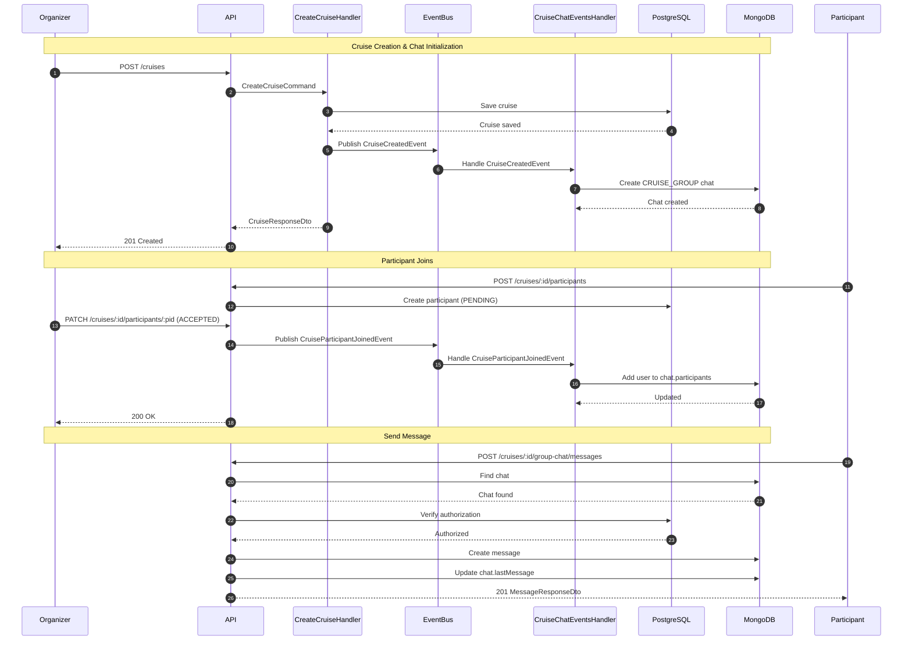
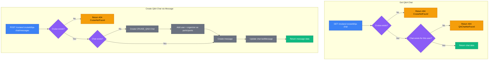
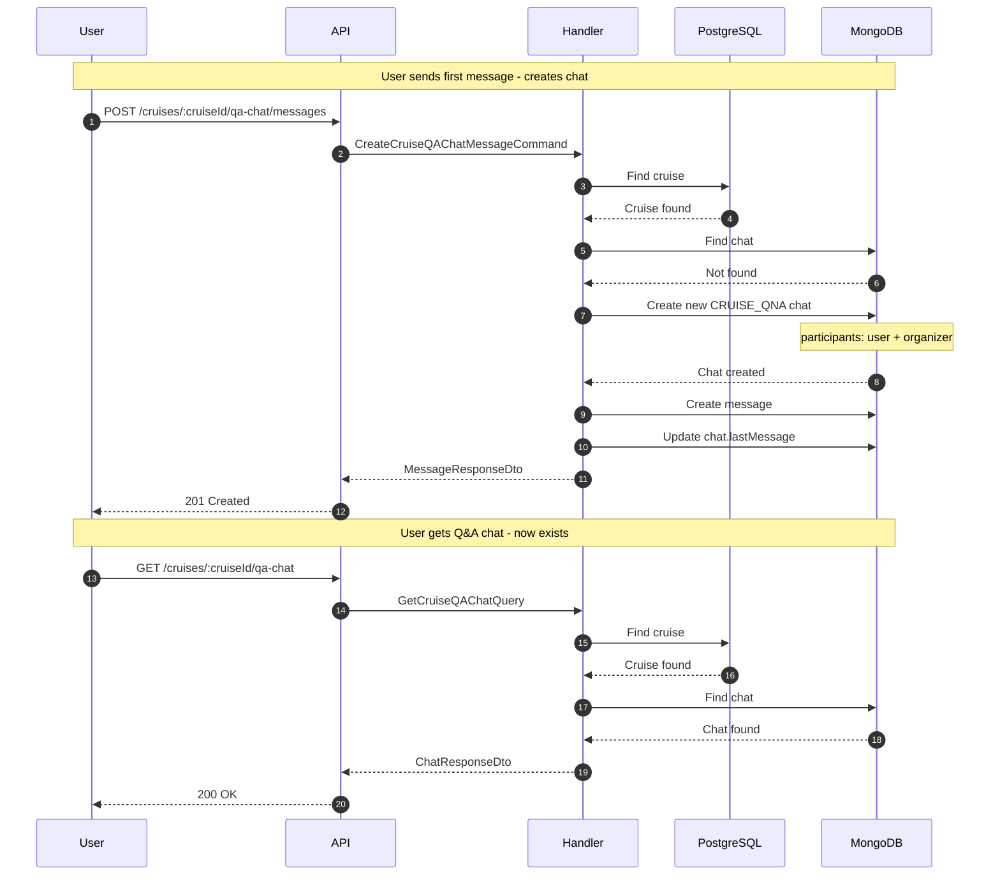
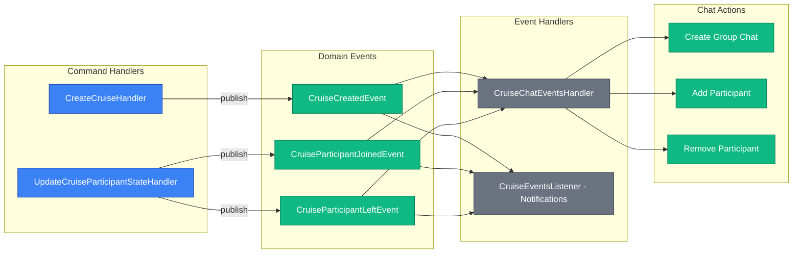

# Cruise Chat Flows

This document describes the architecture and flows for cruise-related chats in the SkipperClub API.

## Overview

There are two types of cruise chats:

1. **Cruise Group Chat** (`CRUISE_GROUP`) — A group chat for all cruise participants (organizer + accepted members)
2. **Cruise Q&A Chat** (`CRUISE_QNA`) — A 1:1 chat between a user and the cruise organizer for questions

## Chat Types Comparison

| Feature      | Group Chat                               | Q&A Chat                            |
| ------------ | ---------------------------------------- | ----------------------------------- |
| Type         | `CRUISE_GROUP`                           | `CRUISE_QNA`                        |
| Created      | When cruise is created                   | When first message is sent          |
| Participants | Organizer + accepted members             | User + Organizer                    |
| Access       | Organizer and accepted participants only | Any authenticated user can initiate |
| Lifecycle    | Persists even after cruise deletion      | Persists even after cruise deletion |

---

## Cruise Group Chat

### Data Flow

```mermaid
flowchart TD
    subgraph Creation["Chat Creation"]
        A["POST /cruises"]:::trigger --> B[CreateCruiseHandler]:::state
        B --> C[Save Cruise to DB]:::state
        C --> D[Publish CruiseCreatedEvent]:::notify
        D --> E[CruiseChatEventsHandler]:::state
        E --> F["Create CRUISE_GROUP Chat in MongoDB"]:::success
        F --> G[Organizer added as participant]:::success
    end

    subgraph ParticipantJoin["Participant Joins"]
        H[Participant Accepted]:::trigger --> I[Publish CruiseParticipantJoinedEvent]:::notify
        I --> J[CruiseChatEventsHandler]:::state
        J --> K[Add user to chat participants]:::success
    end

    subgraph ParticipantLeave["Participant Leaves"]
        L["Participant Removed/Left"]:::trigger --> M[Publish CruiseParticipantLeftEvent]:::notify
        M --> N[CruiseChatEventsHandler]:::state
        N --> O{Is Organizer?}:::decision
        O -->|Yes| P[Do nothing - organizer stays]:::state
        O -->|No| Q[Remove user from chat participants]:::state
        Q --> R[Messages remain in chat]:::state
    end

    subgraph Access["Chat Access"]
        S["GET /cruises/:cruiseId/group-chat"]:::trigger --> T{Chat exists?}:::decision
        T -->|No| U[Return 404]:::negative
        T -->|Yes| V{User authorized?}:::decision
        V -->|No| W[Return 403]:::negative
        V -->|Yes| X[Return chat data]:::success
    end

    classDef trigger fill:#3B82F6,stroke:#1E40AF,color:#FFFFFF
    classDef state fill:#6B7280,stroke:#374151,color:#FFFFFF
    classDef decision fill:#8B5CF6,stroke:#5B21B6,color:#FFFFFF
    classDef success fill:#10B981,stroke:#047857,color:#FFFFFF
    classDef notify fill:#10B981,stroke:#047857,color:#FFFFFF
    classDef negative fill:#F59E0B,stroke:#B45309,color:#000000
```

### Sequence Diagram - Group Chat Lifecycle

---

## Cruise Q&A Chat

### Data Flow

### Sequence Diagram - Q&A Chat Flow

---

## API Endpoints Reference

### Group Chat Endpoints

| Method | Endpoint                                  | Description                | Response Codes          |
| ------ | ----------------------------------------- | -------------------------- | ----------------------- |
| GET    | `/cruises/{cruiseId}/group-chat`          | Get cruise group chat      | 200, 403, 404           |
| POST   | `/cruises/{cruiseId}/group-chat/messages` | Send message to group chat | 201, 400, 403, 404, 422 |

### Q&A Chat Endpoints

| Method | Endpoint                               | Description                                         | Response Codes     |
| ------ | -------------------------------------- | --------------------------------------------------- | ------------------ |
| GET    | `/cruises/{cruiseId}/qa-chat`          | Get Q&A chat with organizer                         | 200, 404           |
| POST   | `/cruises/{cruiseId}/qa-chat/messages` | Send question to organizer (creates chat if needed) | 201, 400, 404, 422 |

### Error Responses

| Error Type                            | HTTP Status | Description                               |
| ------------------------------------- | ----------- | ----------------------------------------- |
| `/errors/cruise-not-found`            | 404         | Cruise does not exist                     |
| `/errors/cruise-group-chat-not-found` | 404         | Group chat does not exist                 |
| `/errors/cruise-qa-chat-not-found`    | 404         | Q&A chat does not exist                   |
| `/errors/cruise-access-forbidden`     | 403         | User is not authorized to access the chat |

---

## Event-Driven Architecture

### Events

| Event                          | Trigger                  | Handler Action                                        |
| ------------------------------ | ------------------------ | ----------------------------------------------------- |
| `CruiseCreatedEvent`           | Cruise created           | Create group chat with organizer                      |
| `CruiseParticipantJoinedEvent` | Participant accepted     | Add participant to group chat                         |
| `CruiseParticipantLeftEvent`   | Participant removed/left | Remove participant from group chat (except organizer) |

### Event Flow Diagram

---

## Q&A Chat - Access Rules

**Important**: Q&A chat is designed for **users to ask questions TO the organizer**. The organizer cannot use these endpoints for their own cruise.

### Access Rules

| User Type        | GET /qa-chat                       | POST /qa-chat/messages                     |
| ---------------- | ---------------------------------- | ------------------------------------------ |
| Regular user     | Returns their Q&A chat (if exists) | Creates chat (if needed) and sends message |
| Cruise organizer | 404 - Always blocked               | 404 - Always blocked                       |

### How the organizer responds to Q&A messages

The organizer should:

1. Use `GET /messages/chats` to list all their chats
2. Filter by `type: CRUISE_QNA` to find Q&A conversations
3. Use `POST /messages/chats/{chatId}/messages` to respond to users

---

## Key Implementation Notes

1. **Group chat is created synchronously** when the cruise is created via event handler
2. **Q&A chat is created lazily** only when the first message is sent
3. **Organizer cannot be removed** from the group chat
4. **Messages persist** even after a participant is removed from the chat
5. **Chat persists** even after the cruise is deleted
6. **Each user has a separate Q&A chat** with the organizer

## Related

- [Cruise Chats API](../../cruises/chats.md) — Full chat documentation
- [Chat Types](../enums/chat-types.md) — Chat type enum reference
- [Participant State Flow](./cruise-participant-state-flow.md) — Participant state machine
