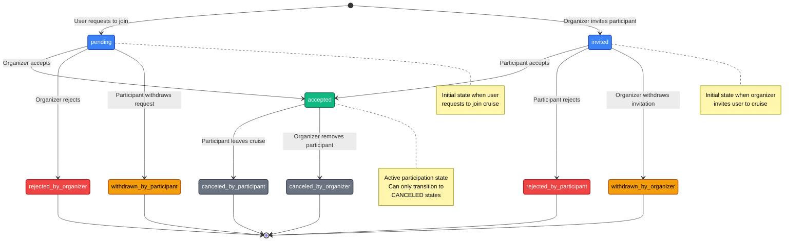

# Cruise Participant State Flow

This diagram shows the state machine for cruise participants, including all possible states and transitions between them.

## State Definitions

| State                      | Description                                                     | Category |
| -------------------------- | --------------------------------------------------------------- | -------- |
| `pending`                  | User sent a join request (waiting for organizer decision)       | Initial  |
| `invited`                  | Organizer sent an invitation (waiting for participant decision) | Initial  |
| `accepted`                 | Participant confirmed in the cruise                             | Active   |
| `rejected_by_participant`  | Participant rejected the invitation                             | Terminal |
| `rejected_by_organizer`    | Organizer rejected the join request                             | Terminal |
| `withdrawn_by_participant` | Participant withdrew their join request                         | Terminal |
| `withdrawn_by_organizer`   | Organizer withdrew their invitation                             | Terminal |
| `canceled_by_participant`  | Participant left cruise                                         | Terminal |
| `canceled_by_organizer`    | Organizer removed the participant from the cruise               | Terminal |

## State Diagram

## State Transitions

### From `pending` (User Request)

| Transition                 | Who Can Perform | Result                             |
| -------------------------- | --------------- | ---------------------------------- |
| `accepted`                 | Organizer only  | User joins the cruise              |
| `rejected_by_organizer`    | Organizer only  | Request is rejected (final)        |
| `withdrawn_by_participant` | User only       | User cancels their request (final) |

### From `invited` (Organizer Invitation)

| Transition                | Who Can Perform | Result                               |
| ------------------------- | --------------- | ------------------------------------ |
| `accepted`                | User only       | User joins the cruise                |
| `rejected_by_participant` | User only       | User declines invitation (final)     |
| `withdrawn_by_organizer`  | Organizer only  | Organizer cancels invitation (final) |

### From `accepted` (Active Participation)

| Transition                | Who Can Perform | Result                              |
| ------------------------- | --------------- | ----------------------------------- |
| `canceled_by_participant` | User only       | User leaves the cruise (final)      |
| `canceled_by_organizer`   | Organizer only  | User is removed from cruise (final) |

## Terminal States

All `rejected_*`, `withdrawn_*`, and `canceled_*` states are terminal — no further transitions are possible. Any attempt to transition from a terminal state will result in an `InvalidStateTransitionException`.

## Side Effects

| Transition                   | Notifications                        | Chat Access             |
| ---------------------------- | ------------------------------------ | ----------------------- |
| → `pending`                  | Organizer notified                   | No chat access          |
| → `invited`                  | User notified                        | No chat access          |
| → `accepted`                 | Organizer + participants notified    | Added to group chat     |
| → `rejected_by_organizer`    | Requester notified                   | —                       |
| → `rejected_by_participant`  | No notification (user's own action)  | —                       |
| → `withdrawn_by_participant` | Organizer notified                   | —                       |
| → `withdrawn_by_organizer`   | Invited user notified                | —                       |
| → `canceled_by_participant`  | Organizer + participants notified    | Removed from group chat |
| → `canceled_by_organizer`    | Removed user + participants notified | Removed from group chat |

## Related

- [Cruises API](../../cruises/index.md) — Full cruise documentation
- [Participants](../../cruises/participants.md) — Participant management
- [Invitations](../../cruises/invitations.md) — Join request and invitation flows
