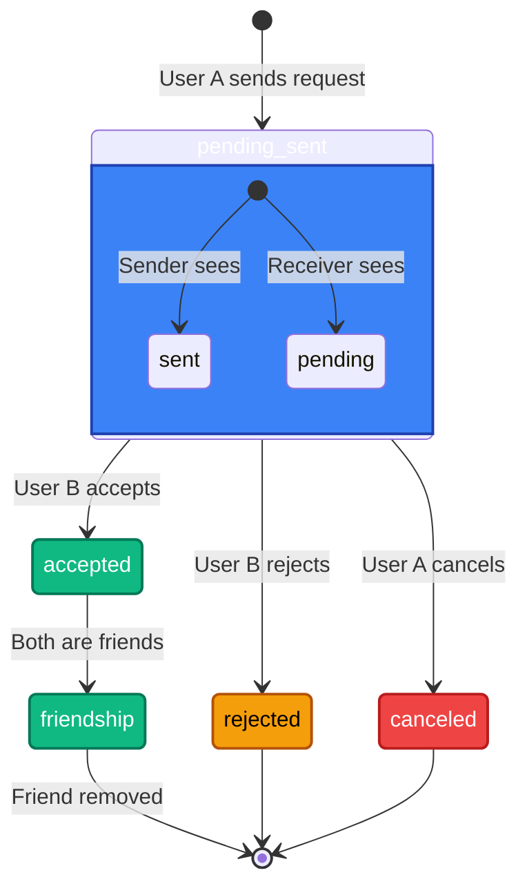
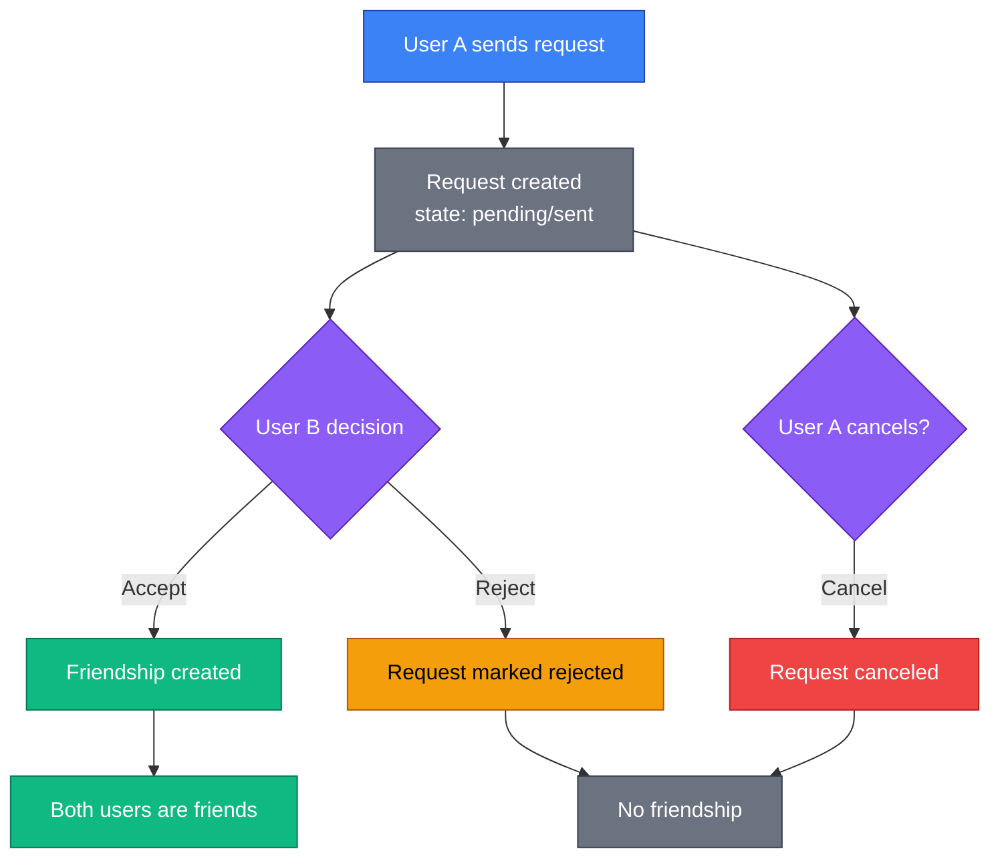
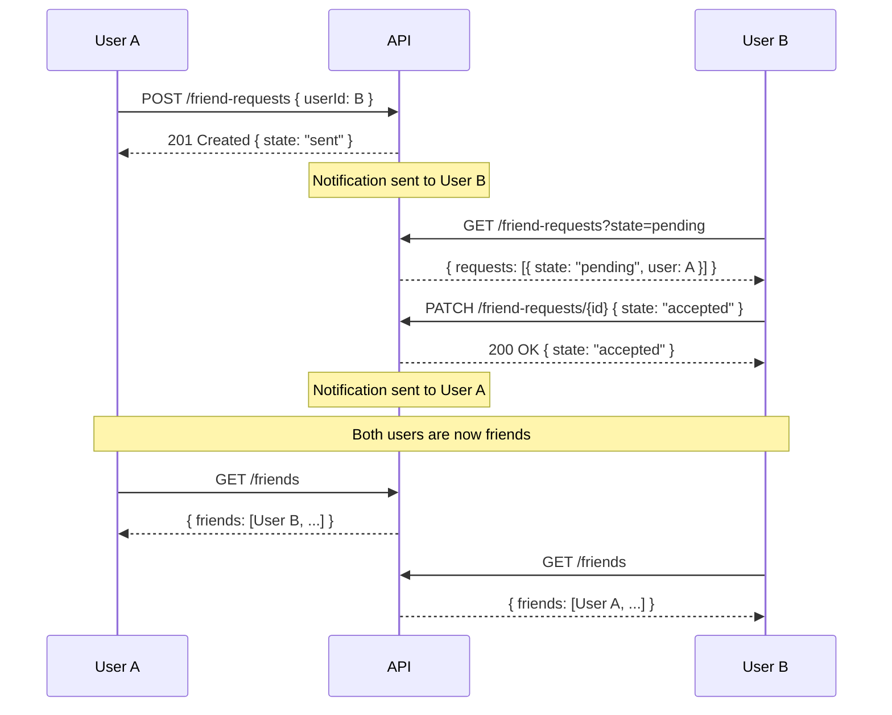
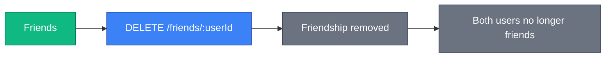

# Friend Request Flow

This document describes the state machine for friend requests in the SkipperClub platform.

## Overview

The friend request system allows users to connect with each other. The flow is straightforward:

1. User A sends a friend request to User B
2. User B accepts or rejects the request
3. If accepted, both users become friends

## Friend Request States

### From Sender's Perspective

| State  | Description                                    |
| ------ | ---------------------------------------------- |
| `sent` | Request sent, waiting for recipient's response |

### From Recipient's Perspective

| State     | Description                                 |
| --------- | ------------------------------------------- |
| `pending` | Request received, waiting for your response |

### After Action

| State      | Description                                 |
| ---------- | ------------------------------------------- |
| `accepted` | Request was accepted, users are now friends |
| `rejected` | Request was declined                        |
| `canceled` | Request was canceled by sender              |

## State Diagram

## Flow Diagram

## Sequence Diagram - Successful Request

## State Transitions

### Available Actions

| Current State    | Action | Who Can Perform | Result             |
| ---------------- | ------ | --------------- | ------------------ |
| `pending`/`sent` | Accept | Recipient only  | Friendship created |
| `pending`/`sent` | Reject | Recipient only  | Request rejected   |
| `pending`/`sent` | Cancel | Sender only     | Request canceled   |

### Authorization Rules

| Action          | Sender       | Recipient                          |
| --------------- | ------------ | ---------------------------------- |
| Cancel (DELETE) | ✅ Allowed   | ❌ Forbidden (use PATCH to reject) |
| Accept (PATCH)  | ❌ Forbidden | ✅ Allowed                         |
| Reject (PATCH)  | ❌ Forbidden | ✅ Allowed                         |

## Notifications

| Event            | Recipient | Notification Type         |
| ---------------- | --------- | ------------------------- |
| Request sent     | User B    | `FRIEND_REQUEST_SENT`     |
| Request accepted | User A    | `FRIEND_REQUEST_ACCEPTED` |
| Request rejected | User A    | `FRIEND_REQUEST_REJECTED` |
| Request canceled | —         | No notification           |

## Error Scenarios

| Error                                     | Status | Description                     |
| ----------------------------------------- | ------ | ------------------------------- |
| `/errors/target-user-not-found`           | 404    | Target user doesn't exist       |
| `/errors/friend-request-not-found`        | 404    | Request doesn't exist           |
| `/errors/friend-request-access-forbidden` | 403    | Cannot access this request      |
| `/errors/cannot-friend-yourself`          | 422    | Cannot send request to yourself |
| `/errors/users-already-friends`           | 422    | Already friends                 |
| `/errors/friend-request-already-exists`   | 422    | Request already exists          |
| `/errors/invalid-friend-request-state`    | 422    | Invalid state transition        |

## Removing Friends

After becoming friends, either user can remove the friendship:

**Note**: Removing a friend does not notify the other user.

## Related

- [Friends API](../../friends/index.md) — Full friends documentation
- [Notification Flows](./notification-flows.md) — When notifications are triggered
