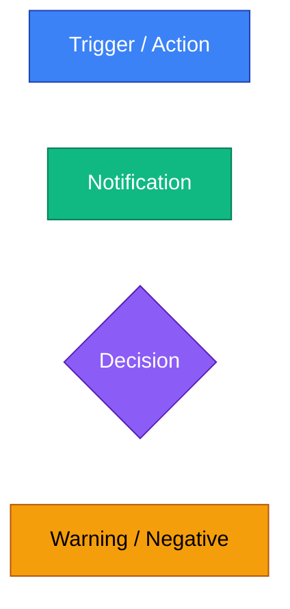
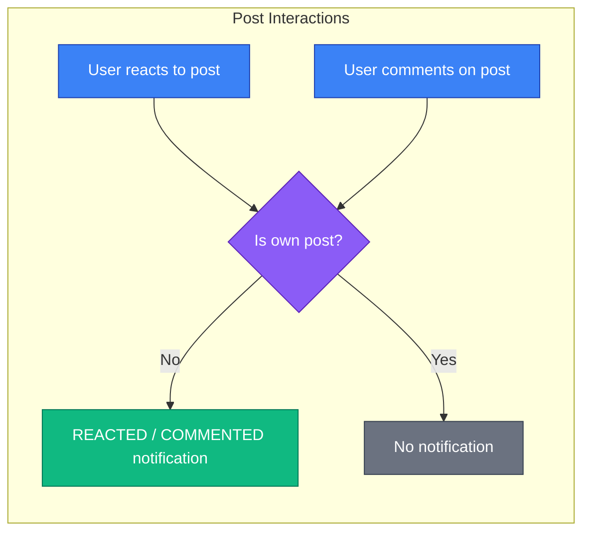
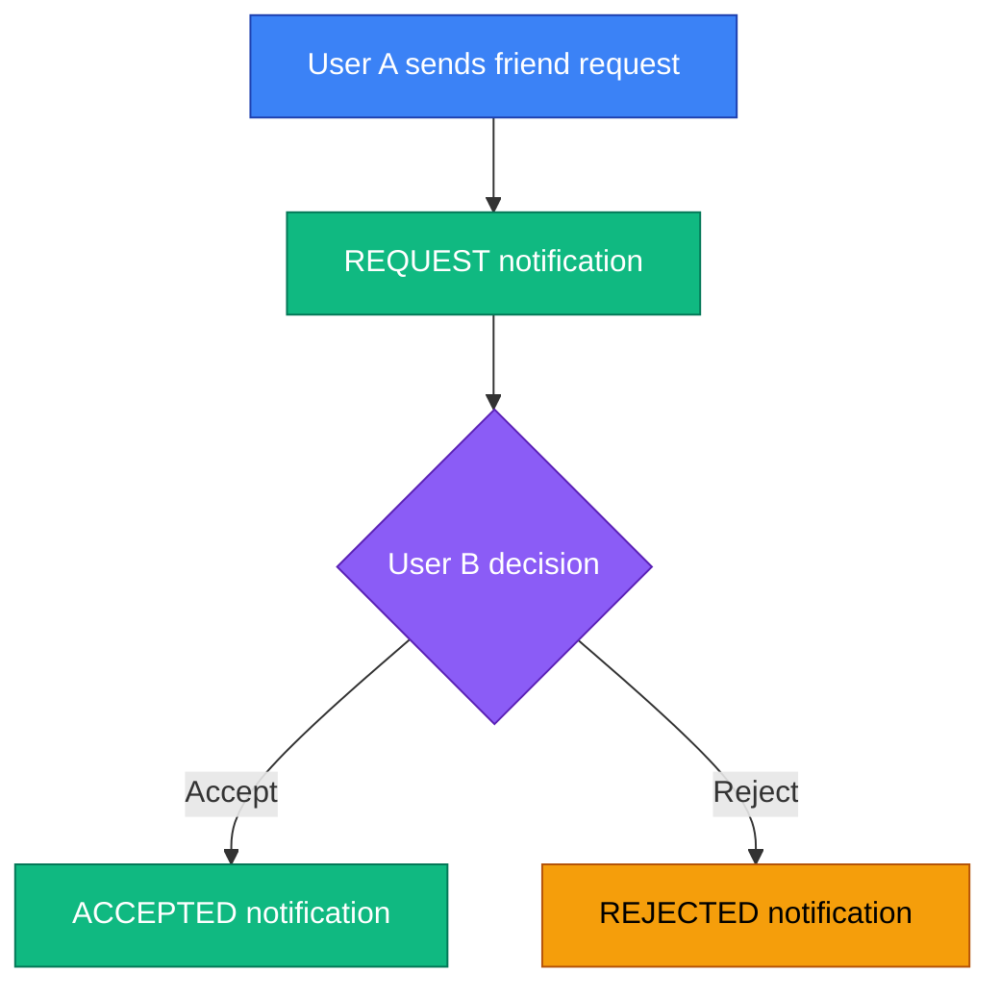
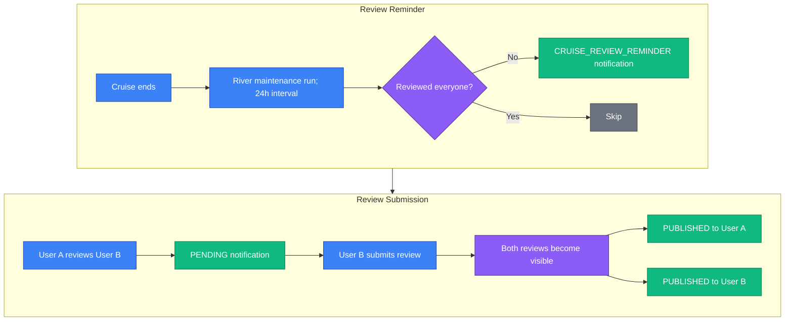

```mermaid
flowchart TB
    subgraph invitationFlow [Invitation Flow]
        A1[Organizer invites User]:::trigger --> N1[INVITATION notification]:::notify
        N1 --> A2{User decision}:::decision
        A2 -->|Accept| N2[INVITATION_ACCEPTED to organizer]:::notify
        A2 -->|Accept| N3[PARTICIPANT_JOINED to others]:::notify
    end

    subgraph joinRequestFlow [Join Request Flow]
        B1[User requests to join]:::trigger --> N4[REQUEST notification]:::notify
        N4 --> B2{Organizer decision}:::decision
        B2 -->|Accept| N5[REQUEST_ACCEPTED to user]:::notify
        B2 -->|Accept| N6[PARTICIPANT_JOINED to others]:::notify
        B2 -->|Reject| N7[REJECTED notification]:::negative
    end

    subgraph leaveFlow [Leave Flow]
        C1[User leaves voluntarily]:::trigger --> N8[LEFT notification]:::notify
        C1 --> N9[LEFT to participants]:::notify
    end

    subgraph removalFlow [Removal Flow]
        D1[Organizer removes User]:::trigger --> N10[REMOVED notification]:::negative
        D1 --> N11[LEFT to participants]:::notify
    end

    subgraph updateFlow [Update Flow]
        E1[Organizer updates cruise]:::trigger --> N12[DETAILS_CHANGED to participants]:::notify
    end

    classDef trigger fill:#3B82F6,stroke:#1E40AF,color:#FFFFFF
    classDef notify fill:#10B981,stroke:#047857,color:#FFFFFF
    classDef decision fill:#8B5CF6,stroke:#5B21B6,color:#FFFFFF
    classDef negative fill:#F59E0B,stroke:#B45309,color:#000000
```

# Notification Flows

This document describes when and how notifications are generated in the SkipperClub platform.

## Overview

The notification system automatically informs users about relevant activities. Notifications are created when specific actions occur and are delivered to the appropriate recipients.

**Key principle**: Users never receive notifications for their own actions.

### Diagram Legend

---

## Cruise Notifications

Notifications related to cruise participation and management.

### Trigger → Notification

| Trigger                            | Recipient                          | Notification                         |
| ---------------------------------- | ---------------------------------- | ------------------------------------ |
| Organizer invites user to cruise   | Invited user                       | "You've been invited to join cruise" |
| User requests to join cruise       | Cruise organizer                   | "User requested to join your cruise" |
| Organizer accepts join request     | Requesting user                    | "Your request was accepted"          |
| User accepts invitation            | Cruise organizer                   | "User accepted your invitation"      |
| User joins cruise                  | Other participants                 | "User joined the cruise"             |
| Organizer rejects join request     | Requester                          | "Your request was declined"          |
| User leaves cruise voluntarily     | Organizer + remaining participants | "User left the cruise"               |
| Organizer removes user from cruise | Removed user                       | "You've been removed from cruise"    |
| Organizer updates cruise details   | All accepted participants          | "Cruise details have been updated"   |

### Flow Diagram

---

## Post Notifications

Notifications related to social post interactions.

### Trigger → Notification

| Trigger                 | Recipient   | Notification                  |
| ----------------------- | ----------- | ----------------------------- |
| User reacts to a post   | Post author | "User reacted to your post"   |
| User comments on a post | Post author | "User commented on your post" |

**Note**: No notification is sent when a user reacts to or comments on their own post.

### Flow Diagram

---

## Friend Notifications

Notifications related to friend requests and connections.

### Trigger → Notification

| Trigger                     | Recipient        | Notification                        |
| --------------------------- | ---------------- | ----------------------------------- |
| User sends friend request   | Request receiver | "User sent you a friend request"    |
| User accepts friend request | Original sender  | "User accepted your friend request" |
| User rejects friend request | Original sender  | "User rejected your friend request" |

### Flow Diagram

---

## Review Notifications

Notifications related to the blind review system. Reviews are hidden until both parties submit their reviews.

### Trigger → Notification

| Trigger                                            | Recipient                                       | Notification                                      |
| -------------------------------------------------- | ----------------------------------------------- | ------------------------------------------------- |
| Next daily maintenance run after cruise completion | Each accepted participant still missing reviews | "Review your fellow crew members"                 |
| User A reviews User B                              | User B                                          | "Someone reviewed you - leave a review to see it" |
| Both users submit reviews                          | Both users                                      | "Your review is now published"                    |

### Blind Review Flow

---

## Notification States

All notifications have a read status:

| Status   | Description                      |
| -------- | -------------------------------- |
| `UNREAD` | New notification, not yet viewed |
| `READ`   | User has viewed the notification |

**Note**: Deleted notifications are soft-deleted using an internal timestamp and are not returned by the API.

---

## Summary

| Module | Event Types                                                                                                                          |
| ------ | ------------------------------------------------------------------------------------------------------------------------------------ |
| Cruise | 10 types (invitation, request, request accepted, invitation accepted, join, reject, leave, remove, details changed, review reminder) |
| Post   | 2 types (like, comment)                                                                                                              |
| Friend | 3 types (request, accept, reject)                                                                                                    |
| Review | 2 types (pending, published)                                                                                                         |

**Total**: 17 notification event types across 4 modules.

## Related

- [Notifications API](../../notifications/index.md) — Full notifications documentation
- [Notification Types](../enums/notification-types.md) — Notification enum reference
- [Friend Request Flow](./friend-request-flow.md) — Friend request state machine
- [Blind Review Flow](./blind-review-flow.md) — Review system flow
