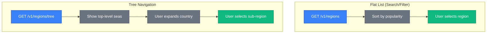
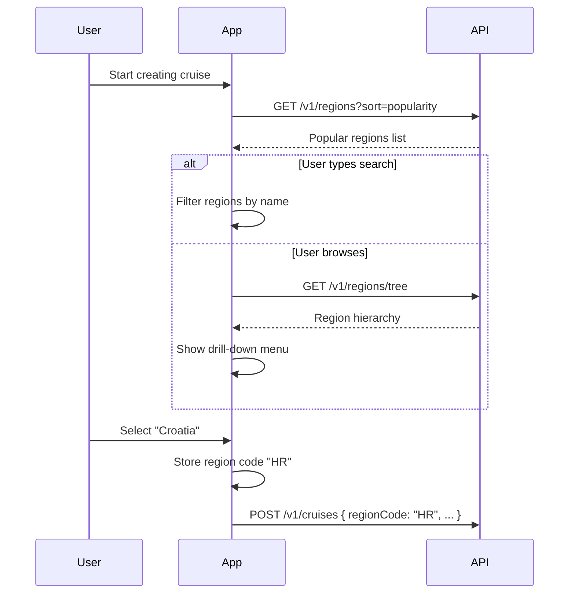
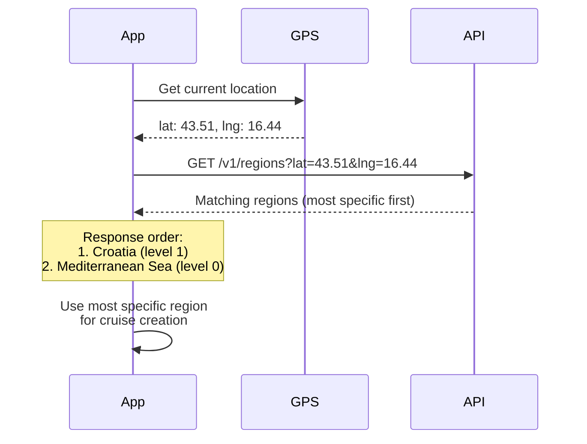

# Regions

The regions API provides sailing location data for cruise creation and discovery.

## Overview

SkipperClub organizes sailing destinations in a hierarchical structure:

- **Seas/Oceans** — Top-level regions (Mediterranean, Baltic, Caribbean, etc.)
- **Countries** — Nations within each sea (Croatia, Greece, Italy, etc.)
- **Sub-regions** — Island groups or specific areas (Sardinia, Sicily, Balearic Islands)

Key features include:

- **Two response formats** — Flat list for search/select or hierarchical tree for navigation
- **Localization** — Region names available in English and Polish
- **Popularity ranking** — Regions sorted by community usage
- **Public access** — No authentication required

## Endpoints

| Method | Endpoint           | Description                 |
| ------ | ------------------ | --------------------------- |
| GET    | `/v1/regions`      | Flat list of all regions    |
| GET    | `/v1/regions/tree` | Hierarchical tree structure |

---

## Key Concepts

### Region Hierarchy

Regions are organized in a multi-level hierarchy (up to 3 levels deep):

```
Mediterranean Sea (MED, level 0)
├── Croatia (HR, level 1)
├── Greece (GR, level 1)
├── Italy (IT, level 1)
│   ├── Sardinia (IT-SAR, level 2)
│   └── Sicily (IT-SIC, level 2)
├── Spain (ES, level 1)
│   └── Balearic Islands (ES-BAL, level 2)
├── France (FR, level 1)
├── Turkey (TR, level 1)
└── Montenegro (ME, level 1)

Baltic Sea (BAL, level 0)
├── Sweden (SE, level 1)
├── Denmark (DK, level 1)
├── Germany (DE, level 1)
├── Poland (PL, level 1)
└── Finland (FI, level 1)

Caribbean Sea (CAR, level 0)
Thailand (TH, level 0)
Seychelles (SC, level 0)
Maldives (MV, level 0)
French Polynesia (PF, level 0)
Australia (AU, level 0)
New Zealand (NZ, level 0)
Canary Islands (IC, level 0)
```

### Region Codes

Each region has a unique code using ISO 3166-1 alpha-2 format where applicable:

| Level      | Example                      | Description                       |
| ---------- | ---------------------------- | --------------------------------- |
| Sea/Ocean  | `MED`, `BAL`, `CAR`          | Short identifier for major seas   |
| Country    | `HR`, `GR`, `IT`, `PL`       | ISO 3166-1 alpha-2 country codes  |
| Sub-region | `IT-SAR`, `IT-SIC`, `ES-BAL` | Parent country code + area suffix |

### Localization

Regions support English (default) and Polish localization. Use the `Accept-Language` header to request translated names:

| Header                | Names Returned              |
| --------------------- | --------------------------- |
| `Accept-Language: en` | Croatia, Mediterranean Sea  |
| `Accept-Language: pl` | Chorwacja, Morze Śródziemne |

---

## List Regions

```http
GET /v1/regions
```

Retrieve a flat list of all regions with localized names and metadata.

### Headers

| Header            | Value      | Description                                  |
| ----------------- | ---------- | -------------------------------------------- |
| `Accept-Language` | `en`, `pl` | Language for localized names (default: `en`) |

### Query Parameters

| Parameter | Type   | Default                                 | Description                                      |
| --------- | ------ | --------------------------------------- | ------------------------------------------------ |
| `sort`    | enum   | `popularity`                            | Sort field: `popularity` or `hierarchy`          |
| `order`   | enum   | `desc` (popularity) / `asc` (hierarchy) | Sort direction                                   |
| `lat`     | number | —                                       | Latitude for coordinate filtering (-90 to 90)    |
| `lng`     | number | —                                       | Longitude for coordinate filtering (-180 to 180) |

**Coordinate filtering:** When both `lat` and `lng` are provided, the API returns only regions that contain the given point. Results are sorted by hierarchy level (most specific first).

### Example Requests

```http
GET /v1/regions HTTP/1.1
Host: api.skipperclub.app
```

```http
GET /v1/regions HTTP/1.1
Host: api.skipperclub.app
Accept-Language: pl
```

```http
GET /v1/regions?sort=hierarchy HTTP/1.1
Host: api.skipperclub.app
```

```http
GET /v1/regions?lat=43.51&lng=16.44 HTTP/1.1
Host: api.skipperclub.app
```

### Response

**200 OK**

```json
{
  "regions": [
    {
      "code": "HR",
      "slug": "croatia",
      "name": "Croatia",
      "path": "mediterranean-sea/croatia",
      "localizedName": "Croatia",
      "localizedParents": ["Mediterranean Sea"],
      "localizedPath": "mediterranean-sea/croatia",
      "parent": "MED",
      "popularity": 0.95,
      "order": 0,
      "level": 1
    },
    {
      "code": "MED",
      "slug": "mediterranean-sea",
      "name": "Mediterranean Sea",
      "path": "mediterranean-sea",
      "localizedName": "Mediterranean Sea",
      "localizedParents": [],
      "localizedPath": "mediterranean-sea",
      "parent": null,
      "popularity": 0.95,
      "order": 0,
      "level": 0
    },
    {
      "code": "IT-SAR",
      "slug": "sardinia",
      "name": "Sardinia",
      "path": "mediterranean-sea/italy/sardinia",
      "localizedName": "Sardinia",
      "localizedParents": ["Mediterranean Sea", "Italy"],
      "localizedPath": "mediterranean-sea/italy/sardinia",
      "parent": "IT",
      "popularity": 0.75,
      "order": 0,
      "level": 2
    }
  ]
}
```

### Response Fields

| Field              | Type        | Description                        |
| ------------------ | ----------- | ---------------------------------- |
| `code`             | string      | Unique region identifier           |
| `slug`             | string      | URL-friendly identifier (English)  |
| `name`             | string      | English name (always)              |
| `path`             | string      | Full path using English slugs      |
| `localizedName`    | string      | Name in requested language         |
| `localizedParents` | string[]    | Parent names in requested language |
| `localizedPath`    | string      | Full path using localized slugs    |
| `parent`           | string/null | Parent region code                 |
| `popularity`       | number      | Popularity score (0.0-1.0)         |
| `order`            | number      | Display order within parent        |
| `level`            | number      | Hierarchy depth (0 = sea)          |

### Polish Localization Example

```http
GET /v1/regions HTTP/1.1
Host: api.skipperclub.app
Accept-Language: pl
```

```json
{
  "regions": [
    {
      "code": "HR",
      "slug": "croatia",
      "name": "Croatia",
      "path": "mediterranean-sea/croatia",
      "localizedName": "Chorwacja",
      "localizedParents": ["Morze Śródziemne"],
      "localizedPath": "morze-srodziemne/chorwacja",
      "parent": "MED",
      "popularity": 0.95,
      "order": 0,
      "level": 1
    }
  ]
}
```

---

## Get Regions Tree

```http
GET /v1/regions/tree
```

Retrieve regions as a hierarchical tree structure, useful for navigation menus and drill-down interfaces.

### Headers

| Header            | Value      | Description                                  |
| ----------------- | ---------- | -------------------------------------------- |
| `Accept-Language` | `en`, `pl` | Language for localized names (default: `en`) |

### Example Requests

```http
GET /v1/regions/tree HTTP/1.1
Host: api.skipperclub.app
```

```http
GET /v1/regions/tree HTTP/1.1
Host: api.skipperclub.app
Accept-Language: pl
```

### Response

**200 OK**

```json
{
  "regions": [
    {
      "code": "MED",
      "slug": "mediterranean-sea",
      "name": "Mediterranean Sea",
      "localizedName": "Mediterranean Sea",
      "childrens": [
        {
          "code": "HR",
          "slug": "croatia",
          "name": "Croatia",
          "localizedName": "Croatia",
          "childrens": []
        },
        {
          "code": "GR",
          "slug": "greece",
          "name": "Greece",
          "localizedName": "Greece",
          "childrens": []
        },
        {
          "code": "IT",
          "slug": "italy",
          "name": "Italy",
          "localizedName": "Italy",
          "childrens": [
            {
              "code": "IT-SAR",
              "slug": "sardinia",
              "name": "Sardinia",
              "localizedName": "Sardinia",
              "childrens": []
            },
            {
              "code": "IT-SIC",
              "slug": "sicily",
              "name": "Sicily",
              "localizedName": "Sicily",
              "childrens": []
            }
          ]
        }
      ]
    },
    {
      "code": "BAL",
      "slug": "baltic-sea",
      "name": "Baltic Sea",
      "localizedName": "Baltic Sea",
      "childrens": [
        {
          "code": "PL",
          "slug": "poland",
          "name": "Poland",
          "localizedName": "Poland",
          "childrens": []
        }
      ]
    }
  ]
}
```

### Tree Node Fields

| Field           | Type   | Description                |
| --------------- | ------ | -------------------------- |
| `code`          | string | Unique region identifier   |
| `slug`          | string | URL-friendly identifier    |
| `name`          | string | English name               |
| `localizedName` | string | Name in requested language |
| `childrens`     | array  | Child regions (recursive)  |

---

## Region Selection Flow



---

## Use Case: Cruise Creation

When creating a cruise, users select a destination region:



---

## Use Case: GPS-Based Region Detection

Mobile apps can use device GPS to automatically detect the user's sailing region:



### Coordinate Filtering Response

When coordinates are provided, regions are sorted by specificity (highest `level` first):

```json
{
  "regions": [
    {
      "code": "HR",
      "name": "Croatia",
      "level": 1
    },
    {
      "code": "MED",
      "name": "Mediterranean Sea",
      "level": 0
    }
  ]
}
```

### Validation Errors

| Condition                 | HTTP Status | Error                     |
| ------------------------- | ----------- | ------------------------- |
| Only `lat` provided       | 422         | Both coordinates required |
| Only `lng` provided       | 422         | Both coordinates required |
| `lat` outside -90 to 90   | 422         | Invalid latitude          |
| `lng` outside -180 to 180 | 422         | Invalid longitude         |

---

## Best Practices

1. **Cache region data** — Regions change infrequently; cache for hours/days
2. **Use flat list for search** — Easier to filter and display autocomplete results
3. **Use tree for browsing** — Better UX for exploring unfamiliar destinations
4. **Default to popularity sort** — Shows most relevant destinations first
5. **Persist language preference** — Remember user's language choice
6. **Show region path** — Help users understand location context
7. **Use GPS for mobile** — Auto-detect region using coordinates for better UX

---

## Related

- [Cruises](../cruises/index.md) — Use regions when creating cruises
- [Overview](../overview/concepts.md) — Platform concepts and terminology
- [Region Definitions (JSON)](./regions.json) — Complete region hierarchy data
