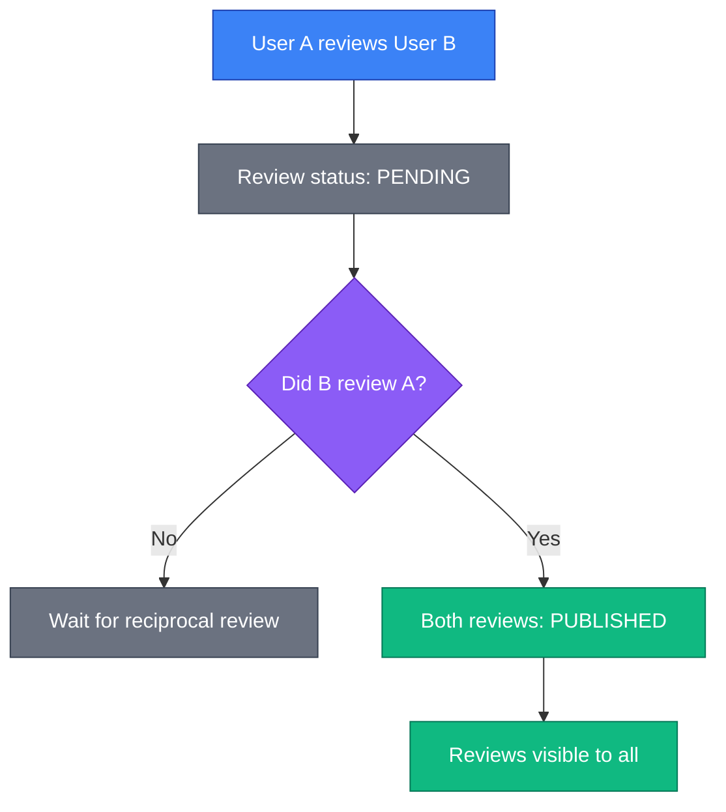
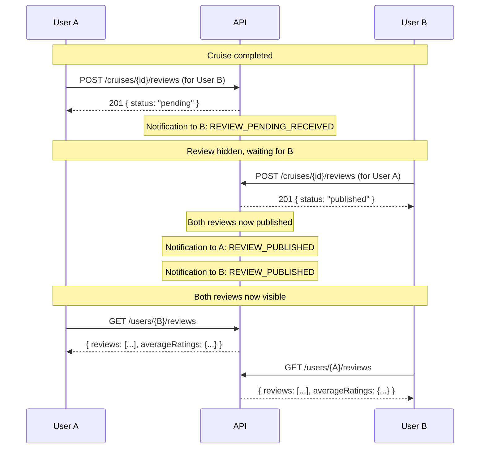
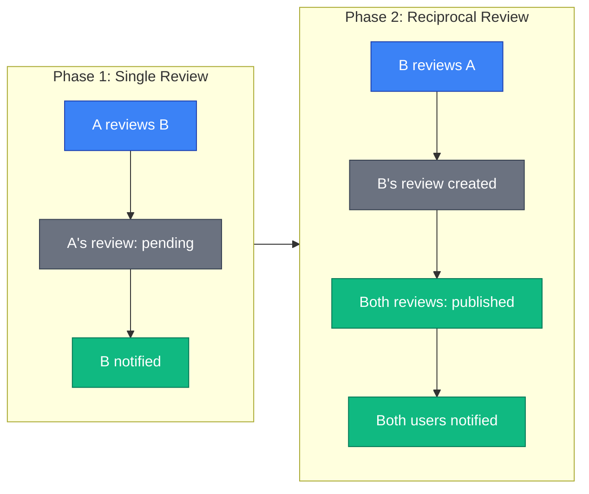

# Reviews

The reviews API enables participants to submit blind reviews after cruise completion, building trust in the sailing community.

## Overview

SkipperClub uses a **blind review system** to ensure honest and unbiased feedback between cruise participants. Reviews remain hidden until both parties have submitted their reviews for each other.

**Key principles:**

- Reviews can only be submitted after a cruise is completed
- Only accepted cruise participants can submit reviews
- Users cannot review themselves
- Reviews are **blind** — hidden until reciprocal review is submitted
- Each review has 4 rating categories (1-5 stars)

## Endpoints

| Method | Endpoint                      | Description                         |
| ------ | ----------------------------- | ----------------------------------- |
| POST   | `/cruises/{cruiseId}/reviews` | Submit a blind review               |
| GET    | `/cruises/{cruiseId}/reviews` | List published reviews for a cruise |
| GET    | `/users/{userId}/reviews`     | List published reviews for a user   |

---

## Key Concepts

### Blind Review System

Reviews are hidden until both parties have reviewed each other. This prevents:

- Retaliation reviews based on seeing negative feedback
- One-sided reviews influencing the other person's rating
- Pressure to give positive reviews



### Review Status

| Status      | Description                                     |
| ----------- | ----------------------------------------------- |
| `pending`   | Review submitted, waiting for reciprocal review |
| `published` | Both parties submitted reviews, now visible     |

### Rating Categories

Each review includes 4 rating categories, scored 1-5:

| Category        | Description                              |
| --------------- | ---------------------------------------- |
| `communication` | How well the person communicates         |
| `behavior`      | Attitude and cooperation on board        |
| `skills`        | Sailing and nautical competence          |
| `duties`        | Fulfillment of assigned responsibilities |

An **average** rating is calculated automatically from these 4 categories.

### Eligibility Requirements

To submit a review:

1. **Cruise must be completed** — The arrival date must have passed
2. **Must be an accepted participant** — Only organizer and accepted participants can review
3. **Cannot review yourself** — Self-reviews are not allowed
4. **One review per pair** — You can only review each participant once per cruise

---

## Submit Review

```http
POST /cruises/{cruiseId}/reviews
```

Submit a blind review for another cruise participant.

### Path Parameters

| Parameter  | Type | Description    |
| ---------- | ---- | -------------- |
| `cruiseId` | uuid | Cruise UUID v7 |

### Request Body

| Field            | Type    | Required | Description                                      |
| ---------------- | ------- | -------- | ------------------------------------------------ |
| `reviewedUserId` | uuid    | Yes      | User being reviewed (must be cruise participant) |
| `communication`  | integer | Yes      | Rating 1-5                                       |
| `behavior`       | integer | Yes      | Rating 1-5                                       |
| `skills`         | integer | Yes      | Rating 1-5                                       |
| `duties`         | integer | Yes      | Rating 1-5                                       |
| `comment`        | string  | Yes      | Written feedback (100-1000 characters)           |

### Example Request

```http
POST /v1/cruises/018fa2e4-8e3b-7b2e-8e3b-7b2e8e3b7b98/reviews HTTP/1.1
Host: api.skipperclub.app
Authorization: Bearer <token>
Content-Type: application/json

{
  "reviewedUserId": "018fa2e4-8e3b-7b2e-8e3b-7b2e8e3b7b02",
  "communication": 5,
  "behavior": 4,
  "skills": 5,
  "duties": 4,
  "comment": "Excellent crew member! Very professional and skilled sailor. Great communication throughout the trip. Would definitely sail together again in the future. Highly recommended!"
}
```

### Response

**201 Created**

```
Location: /v1/cruises/018fa2e4-8e3b-7b2e-8e3b-7b2e8e3b7b98/reviews/018fa2e4-8e3b-7b2e-8e3b-7b2e8e3b7b99
```

```json
{
  "id": "018fa2e4-8e3b-7b2e-8e3b-7b2e8e3b7b99",
  "cruiseId": "018fa2e4-8e3b-7b2e-8e3b-7b2e8e3b7b98",
  "reviewer": {
    "id": "018fa2e4-8e3b-7b2e-8e3b-7b2e8e3b7b00",
    "name": "Jan Kowalski",
    "avatarUrl": null
  },
  "reviewedUser": {
    "id": "018fa2e4-8e3b-7b2e-8e3b-7b2e8e3b7b02",
    "name": "Anna Nowak",
    "avatarUrl": null
  },
  "cruise": {
    "id": "018fa2e4-8e3b-7b2e-8e3b-7b2e8e3b7b98",
    "title": "Mediterranean Adventure",
    "departureDate": "2025-07-12"
  },
  "ratings": {
    "communication": 5,
    "behavior": 4,
    "skills": 5,
    "duties": 4,
    "average": 4.5
  },
  "comment": "Excellent crew member! Very professional and skilled sailor. Great communication throughout the trip. Would definitely sail together again in the future. Highly recommended!",
  "status": "pending",
  "createdAt": "2025-11-23T12:00:00Z",
  "updatedAt": "2025-11-23T12:00:00Z"
}
```

### Notifications

When a review is submitted:

- **Reviewed user** receives `REVIEW_PENDING_RECEIVED` notification
- When reciprocal review is submitted, **both users** receive `REVIEW_PUBLISHED` notification

### Errors

| Status | Type                             | Description                                                      |
| ------ | -------------------------------- | ---------------------------------------------------------------- |
| 403    | `/errors/not-cruise-participant` | Reviewer is not an accepted participant                          |
| 404    | `/errors/cruise-not-found`       | Cruise doesn't exist                                             |
| 404    | `/errors/user-not-found`         | Reviewed user doesn't exist                                      |
| 422    | `/errors/cruise-not-completed`   | Cruise has not completed yet                                     |
| 422    | `/errors/review-already-exists`  | Already reviewed this user for this cruise                       |
| 422    | `/errors/cannot-review-self`     | Cannot submit self-review                                        |
| 422    | `/errors/validation`             | Validation failed (ratings out of range, comment too short/long) |

---

## List Cruise Reviews

```http
GET /cruises/{cruiseId}/reviews
```

Retrieve all published reviews for a cruise. Only published reviews are returned (both parties must have submitted).

### Path Parameters

| Parameter  | Type | Description    |
| ---------- | ---- | -------------- |
| `cruiseId` | uuid | Cruise UUID v7 |

### Query Parameters

| Parameter | Type    | Default | Description              |
| --------- | ------- | ------- | ------------------------ |
| `limit`   | integer | 20      | Results per page (1-100) |
| `offset`  | integer | 0       | Results to skip          |

### Example Request

```http
GET /v1/cruises/018fa2e4-8e3b-7b2e-8e3b-7b2e8e3b7b98/reviews HTTP/1.1
Host: api.skipperclub.app
```

### Response

**200 OK**

```json
{
  "reviews": [
    {
      "id": "018fa2e4-8e3b-7b2e-8e3b-7b2e8e3b7b99",
      "cruiseId": "018fa2e4-8e3b-7b2e-8e3b-7b2e8e3b7b98",
      "reviewer": {
        "id": "018fa2e4-8e3b-7b2e-8e3b-7b2e8e3b7b00",
        "name": "Jan Kowalski",
        "avatarUrl": null
      },
      "reviewedUser": {
        "id": "018fa2e4-8e3b-7b2e-8e3b-7b2e8e3b7b02",
        "name": "Anna Nowak",
        "avatarUrl": null
      },
      "cruise": {
        "id": "018fa2e4-8e3b-7b2e-8e3b-7b2e8e3b7b98",
        "title": "Mediterranean Adventure",
        "departureDate": "2025-07-12"
      },
      "ratings": {
        "communication": 5,
        "behavior": 4,
        "skills": 5,
        "duties": 4,
        "average": 4.5
      },
      "comment": "Excellent crew member! Very professional and skilled sailor...",
      "status": "published",
      "createdAt": "2025-11-23T12:00:00Z",
      "updatedAt": "2025-11-23T14:00:00Z"
    },
    {
      "id": "018fa2e4-8e3b-7b2e-8e3b-7b2e8e3b7c00",
      "cruiseId": "018fa2e4-8e3b-7b2e-8e3b-7b2e8e3b7b98",
      "reviewer": {
        "id": "018fa2e4-8e3b-7b2e-8e3b-7b2e8e3b7b02",
        "name": "Anna Nowak",
        "avatarUrl": null
      },
      "reviewedUser": {
        "id": "018fa2e4-8e3b-7b2e-8e3b-7b2e8e3b7b00",
        "name": "Jan Kowalski",
        "avatarUrl": null
      },
      "cruise": {
        "id": "018fa2e4-8e3b-7b2e-8e3b-7b2e8e3b7b98",
        "title": "Mediterranean Adventure",
        "departureDate": "2025-07-12"
      },
      "ratings": {
        "communication": 4,
        "behavior": 5,
        "skills": 4,
        "duties": 5,
        "average": 4.5
      },
      "comment": "Fantastic crew member who always helped out. Great attitude...",
      "status": "published",
      "createdAt": "2025-11-23T14:00:00Z",
      "updatedAt": "2025-11-23T14:00:00Z"
    }
  ],
  "total": 2,
  "limit": 20,
  "offset": 0
}
```

### Access Control

- **Public cruises**: Anyone can view published reviews
- **Private cruises**: Only organizer and accepted participants can view reviews

### Errors

| Status | Type                              | Description                        |
| ------ | --------------------------------- | ---------------------------------- |
| 403    | `/errors/cruise-access-forbidden` | Private cruise — not a participant |
| 404    | `/errors/cruise-not-found`        | Cruise doesn't exist               |

---

## List User Reviews

```http
GET /users/{userId}/reviews
```

Retrieve all published reviews for a user. Includes aggregate ratings across all reviews.

### Path Parameters

| Parameter | Type | Description  |
| --------- | ---- | ------------ |
| `userId`  | uuid | User UUID v7 |

### Query Parameters

| Parameter | Type    | Default | Description                |
| --------- | ------- | ------- | -------------------------- |
| `limit`   | integer | 20      | Results per page (1-100)   |
| `offset`  | integer | 0       | Results to skip            |
| `order`   | string  | `desc`  | Sort order (`asc`, `desc`) |

### Example Request

```http
GET /v1/users/018fa2e4-8e3b-7b2e-8e3b-7b2e8e3b7b02/reviews HTTP/1.1
Host: api.skipperclub.app
```

### Response

**200 OK**

```json
{
  "reviews": [
    {
      "id": "018fa2e4-8e3b-7b2e-8e3b-7b2e8e3b7b99",
      "cruiseId": "018fa2e4-8e3b-7b2e-8e3b-7b2e8e3b7b98",
      "reviewer": {
        "id": "018fa2e4-8e3b-7b2e-8e3b-7b2e8e3b7b00",
        "name": "Jan Kowalski",
        "avatarUrl": null
      },
      "reviewedUser": {
        "id": "018fa2e4-8e3b-7b2e-8e3b-7b2e8e3b7b02",
        "name": "Anna Nowak",
        "avatarUrl": null
      },
      "cruise": {
        "id": "018fa2e4-8e3b-7b2e-8e3b-7b2e8e3b7b98",
        "title": "Mediterranean Adventure",
        "departureDate": "2025-07-12"
      },
      "ratings": {
        "communication": 5,
        "behavior": 4,
        "skills": 5,
        "duties": 4,
        "average": 4.5
      },
      "comment": "Excellent crew member! Very professional and skilled sailor...",
      "status": "published",
      "createdAt": "2025-11-23T12:00:00Z",
      "updatedAt": "2025-11-23T14:00:00Z"
    }
  ],
  "averageRatings": {
    "communication": 4.8,
    "behavior": 4.6,
    "skills": 4.7,
    "duties": 4.5,
    "average": 4.6
  },
  "total": 15,
  "limit": 20,
  "offset": 0
}
```

### Understanding the Response

- **`reviews`** — Individual published reviews where this user was reviewed
- **`averageRatings`** — Aggregate averages across ALL published reviews for this user
- **`total`** — Total number of published reviews

### Errors

| Status | Type                     | Description        |
| ------ | ------------------------ | ------------------ |
| 404    | `/errors/user-not-found` | User doesn't exist |

---

## Blind Review Flow

### Complete Review Sequence



### Review Status Timeline



---

## Error Handling

All errors follow RFC 7807 Problem Details format:

```json
{
  "type": "/errors/cruise-not-completed",
  "title": "Cruise Not Completed",
  "status": 422,
  "detail": "Cannot submit review for cruise that has not completed yet"
}
```

### Error Types

| Type                             | Status | Description                                |
| -------------------------------- | ------ | ------------------------------------------ |
| `/errors/cruise-not-found`       | 404    | Cruise doesn't exist                       |
| `/errors/user-not-found`         | 404    | User doesn't exist                         |
| `/errors/not-cruise-participant` | 403    | Not an accepted cruise participant         |
| `/errors/cruise-not-completed`   | 422    | Cruise has not finished yet                |
| `/errors/review-already-exists`  | 422    | Already reviewed this user for this cruise |
| `/errors/cannot-review-self`     | 422    | Cannot submit a self-review                |
| `/errors/validation`             | 422    | Validation failed                          |

### Validation Error Example

```json
{
  "type": "/errors/validation",
  "title": "Validation Failed",
  "status": 422,
  "detail": "The request contains invalid data",
  "violations": [
    {
      "propertyPath": "comment",
      "message": "comment must be longer than or equal to 100 characters"
    },
    {
      "propertyPath": "communication",
      "message": "communication must not be greater than 5"
    }
  ]
}
```

---

## Best Practices

1. **Explain the blind system** — Help users understand why they can't see reviews immediately
2. **Prompt after cruise** — Remind users to submit reviews after cruise completion
3. **Validate locally first** — Check comment length and ratings before API call
4. **Show pending status** — Indicate when user has pending reviews to submit
5. **Display aggregate ratings** — Show overall rating prominently on user profiles
6. **Handle edge cases** — Gracefully handle cruises with no published reviews yet

---

## Related

- [Cruises](../cruises/index.md) — Cruise management and participants
- [Notifications](../notifications/index.md) — Review-related notifications
- [Authentication](../getting-started/authentication.md) — JWT tokens
- [Error Handling](../getting-started/errors.md) — RFC 7807 format
