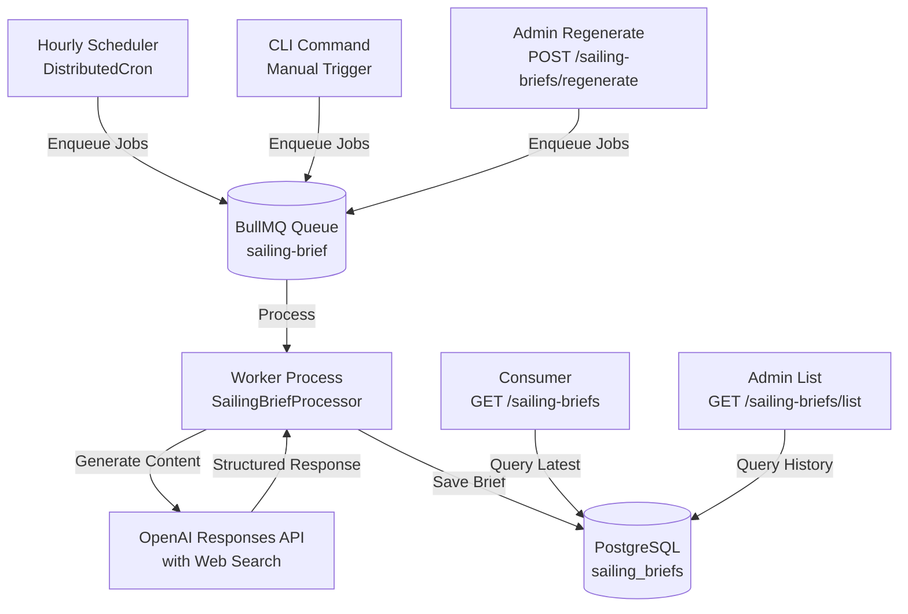

# Sailing Brief System

## Overview

The Sailing Brief feature provides AI-powered, region-based sailing information updated three times daily (morning, noon, evening). Each brief includes weather conditions, navigation tips, marina information, and local recommendations.

## Architecture

### Components

- **API Module** (`SailingBriefModule`): Handles HTTP requests and scheduling
- **Worker Module** (`SailingBriefWorkerModule`): Processes background generation jobs
- **Database**: PostgreSQL with `sailing_briefs` table for historical storage
- **Queue**: BullMQ for async job processing with retry logic
- **Scheduler**: Hourly cron with distributed lock for multi-instance safety
- **AI Integration**: OpenAI Responses API with web search for current information

### System Flow



## Time Slots

Briefs are generated three times per day in region-local time:

| Slot        | Time  | Content Focus                             | Expires At     |
| ----------- | ----- | ----------------------------------------- | -------------- |
| **Morning** | 05:00 | Weather, routes, safety tips, places      | Same day 12:00 |
| **Noon**    | 12:00 | Berth availability, marina info, warnings | Same day 16:00 |
| **Evening** | 16:00 | Dining options, tomorrow's plans, outlook | Next day 05:00 |

## Timezone Handling

- Each region has an IANA timezone (e.g., `Europe/Zagreb`, `Europe/Athens`)
- Time slot detection is timezone-aware with DST support
- Local date is computed in region timezone
- Scheduler checks each region independently for due slots

## Content Generation

### AI Integration

- **Provider**: OpenAI Responses API; model selected via `AI_SAILING_BRIEF_MODEL` preset (code default: `OPENAI_SAILING_BRIEF` → `gpt-5.2-2025-12-11`; `.env.example` sets `OPENAI_GPT_4_1_MINI`)
- **Web Search**: Enabled via `web_search_preview` tool for current information
- **Structured Output**: JSON schema enforcement for all 9 content fields
- **Timeout**: 50s for web-search request, 25s for fallback request; global generation timeout is configurable (`AI_SAILING_BRIEF_TIMEOUT_MS`, code default 90s)
- **Safety Disclaimer**: Automatically included in all briefs

### Content Fields

All briefs include 9 markdown-formatted sections:

1. **shortDescription**: 2-3 sentence overview with disclaimer
2. **fullDescription**: Detailed sailing conditions
3. **weather**: Current conditions and forecast
4. **berth**: Berth availability information
5. **route**: Recommended sailing routes
6. **tips**: Practical sailing advice
7. **marina**: Marina facilities and services
8. **food**: Dining options and recommendations
9. **place**: Local attractions and points of interest

### Languages

- **EN**: English content for international users
- **PL**: Polish content for local users
- Generated independently per language with separate AI calls

## Versioning

Each sailing brief has an immutable version number:

- **Version 1**: First generation for a `(region, language, timeSlot, localDate)` tuple
- **Version 2+**: Subsequent regenerations (admin prompt, CLI re-trigger)
- Historical versions are preserved (no deletion)
- Consumer endpoint always returns latest version

## Generation Sources

- **auto**: Scheduled generation (cron scheduler)
- **manual**: CLI-triggered (`sailing-brief:generate-now`)
- **edited**: Admin regeneration with custom prompt

## API Endpoints

### Consumer Endpoint

```http
GET /v1/sailing-briefs?regionCode=HR
Accept-Language: en,pl;q=0.9
Authorization: Bearer <jwt-token>
```

**Response**: Latest sailing brief for the region in resolved language

#### Region selection: `regionCode` or coordinates

The target region is selected in **exactly one** of two mutually exclusive ways:

| Mode        | Params       | Behavior                                                                  |
| ----------- | ------------ | ------------------------------------------------------------------------- |
| Explicit    | `regionCode` | Use the region code directly (e.g. `HR`).                                 |
| Coordinates | `lat`, `lng` | Resolve the region from a geographic point — no need to pick from a list. |

```http
GET /v1/sailing-briefs?lat=44.87&lng=13.85
Accept-Language: en
Authorization: Bearer <jwt-token>
```

When `lat`/`lng` are supplied, the endpoint runs the same point-in-polygon
lookup as `GET /regions?lat&lng` — `ST_Contains(regions.geom, ST_SetSRID(ST_Point(lng, lat), 4326))`
— filtered to regions with `sailing_brief_enabled = true`, and selects the
**most specific** match (`ORDER BY level DESC`). This lets the client resolve a
brief straight from the map viewport's center instead of presenting a region
picker. The resolved region is echoed back in the response `regionCode` field.

> **Coordinates are signed WGS84 decimal degrees.** The hemisphere is encoded by
> the sign — positive `lng` is East / negative is West, positive `lat` is North /
> negative is South. There is no separate N/S/E/W parameter; e.g. `lng=13.85`
> (Croatian Adriatic) and `lng=-13.85` (Atlantic) resolve to different places.

**Rules**:

- Provide `regionCode` **or** both `lat` and `lng` — never both, never neither.
- `lat` range `[-90, 90]`, `lng` range `[-180, 180]`; both must be sent together.

**Errors**:

- `404` `/errors/sailing-brief-not-available` - No brief generated yet for the
  provided `regionCode` (including unknown/disabled regions), or — for coordinate
  requests — no sailing-brief-enabled region contains the point, or the resolved
  region has no brief yet
- `422` `/errors/validation` - Invalid query params, neither mode supplied, both
  modes supplied, a partial `lat`/`lng` pair, or out-of-range coordinates

### Admin List Endpoint

```http
GET /v1/sailing-briefs/list?regionCode=HR&timeSlot=morning&limit=20&offset=0
Accept-Language: en
Authorization: Bearer <admin-jwt-token>
```

**Response**: Paginated list of historical briefs

**Filters**:

- `regionCode` (optional)
- `timeSlot` (optional): `morning`, `noon`, `evening`
- `generationSource` (optional): `auto`, `manual`, `edited`
- `limit` (default: 20, max: 100)
- `offset` (default: 0)

**Errors**:

- `401` - Authentication required
- `403` - Admin role required
- `422` `/errors/validation` - Invalid query params (e.g. `limit < 1`)

### Admin Regenerate Endpoint

```http
POST /v1/sailing-briefs/regenerate
Authorization: Bearer <admin-jwt-token>
Content-Type: application/json

{
  "regionCodes": ["HR", "GR"],
  "prompt": "Focus on family-friendly activities and safety"
}
```

**Response**: HTTP 202 Accepted with list of enqueued jobs

**Behavior**:

- Enqueues jobs for all languages (EN/PL)
- Computes current time slot automatically per region
- Passes previous brief content + prompt to AI
- Creates new version (immutable history)

**Errors**:

- `400` - Region validation/business validation failed (e.g. disabled region)
- `401` - Authentication required
- `403` - Admin role required
- `422` `/errors/validation` - Invalid payload (e.g. empty `regionCodes`)

## Worker Process

### Running the Worker

```bash
# Development
npm run worker:sailing-brief:dev

# Production
npm run worker:sailing-brief

# With all workers
npm run start:all:dev
```

### Worker Configuration

- **Queue Concurrency**: Controlled by `SAILING_BRIEF_QUEUE_CONCURRENCY` (default: 2)
- **Retry Logic**: 3 attempts with exponential backoff (60s base delay)
- **Dead Letter Queue**: Failed jobs moved to `sailing-brief-dlq`
- **Sentry Reporting**: Errors and DLQ entries reported to Sentry

### Job Deduplication

Jobs are deduplicated using deterministic job IDs:

```
Format: ${regionCode}-${language}-${timeSlot}-${localDate}-${source}-${triggerKey}

Examples:
- HR-en-morning-2026-02-11-auto-scheduled
- HR-en-morning-2026-02-11-manual-cli-2026-02-11-10-30
- HR-en-morning-2026-02-11-edited-adminReq-a1b2c3d4
```

## CLI Command

### Manual Generation

```bash
# Development
npm run cli:dev sailing-brief:generate-now

# Production
npm run cli sailing-brief:generate-now
```

**Behavior**:

- Scans all regions with `sailing_brief_enabled = true`
- Computes current time slot for each region
- Enqueues jobs for all languages (EN/PL)
- Creates new versions if slot already generated

## Database Schema

### sailing_briefs Table

| Column              | Type        | Description                      |
| ------------------- | ----------- | -------------------------------- |
| `id`                | UUID        | Primary key (UUID v7)            |
| `region_code`       | VARCHAR(50) | FK to regions.code               |
| `language`          | VARCHAR(2)  | `en` or `pl`                     |
| `time_slot`         | ENUM        | `morning`, `noon`, `evening`     |
| `local_date`        | DATE        | Date in region timezone          |
| `short_description` | TEXT        | Brief overview (markdown)        |
| `full_description`  | TEXT        | Detailed description (markdown)  |
| `weather`           | TEXT        | Weather info (markdown)          |
| `berth`             | TEXT        | Berth info (markdown)            |
| `route`             | TEXT        | Route recommendations (markdown) |
| `tips`              | TEXT        | Sailing tips (markdown)          |
| `marina`            | TEXT        | Marina information (markdown)    |
| `food`              | TEXT        | Dining options (markdown)        |
| `place`             | TEXT        | Places to visit (markdown)       |
| `generated_at`      | TIMESTAMPTZ | Generation timestamp             |
| `expires_at`        | TIMESTAMPTZ | Expiration timestamp             |
| `version`           | INTEGER     | Version number                   |
| `generation_source` | ENUM        | `auto`, `manual`, `edited`       |

### Indexes

- **Unique**: `(region_code, language, time_slot, local_date, version)` for versioning
- **Retrieval**: `(region_code, language, generated_at DESC)` for latest brief lookup
- **Admin**: `(region_code, language, generation_source, generated_at DESC)` for filtering
- **Expiration**: `(expires_at)` for operational queries

### regions Table Extensions

| Column                  | Type         | Description                             |
| ----------------------- | ------------ | --------------------------------------- |
| `timezone`              | VARCHAR(100) | IANA timezone (e.g., `Europe/Zagreb`)   |
| `sailing_brief_enabled` | BOOLEAN      | Enable/disable sailing brief for region |

**Constraint**: `CHECK (NOT sailing_brief_enabled OR timezone IS NOT NULL)`

## Configuration

### Environment Variables

```bash
# AI model for sailing brief generation
AI_SAILING_BRIEF_MODEL=OPENAI_GPT_4_1_MINI

# Optional: overall AI timeout for one brief generation (ms)
AI_SAILING_BRIEF_TIMEOUT_MS=1800000

# Worker queue concurrency
SAILING_BRIEF_QUEUE_CONCURRENCY=2

# OpenAI API key (required)
OPENAI_API_KEY=sk-...
```

If `AI_SAILING_BRIEF_TIMEOUT_MS` is not set, the service falls back to `90000` ms in code.

### Regional Rollout

Currently enabled for:

- **HR** (Croatia) - `Europe/Zagreb`
- **GR** (Greece) - `Europe/Athens`

To enable for new regions:

```sql
UPDATE regions
SET sailing_brief_enabled = true, timezone = 'Europe/Rome'
WHERE code = 'IT';
```

## Monitoring and Observability

### Logs

- Generation duration logged per job: `generation_duration_ms`
- Context includes: `regionCode`, `language`, `timeSlot`, `source`
- Failed jobs logged with full error details

### Sentry

- Failed AI calls reported with full context
- DLQ entries create error-level Sentry events
- Tags: `module: sailing-brief`, `operation: generate|dlq`

### Health Checks

- Monitor queue depth: `sailing-brief` queue size
- Monitor DLQ: `sailing-brief-dlq` for persistent failures
- Check latest generation timestamps per region

## Troubleshooting

### No Briefs Generated

1. Check region has `sailing_brief_enabled = true`
2. Verify region has `timezone` set
3. Check worker process is running
4. Verify scheduler is executing (check logs at top of each hour)
5. Check queue for jobs: `await sailingBriefQueue.getJobs()`

### Generation Failures

1. Check Sentry for error details
2. Review DLQ queue for failed jobs
3. Verify `OPENAI_API_KEY` is configured
4. Check AI service quotas/rate limits
5. Review logs for timeout errors (consider increasing `AI_SAILING_BRIEF_TIMEOUT_MS`)

### Duplicate Generation

- Job deduplication prevents duplicate scheduled generations
- Manual/admin regenerations can create new versions intentionally
- Check `generation_source` to distinguish between scheduled and manual

## Performance Considerations

- **Caching**: Not implemented (briefs change only 3x/day)
- **Database**: Indexes optimize latest brief retrieval
- **Queue**: Concurrency limited to prevent API rate limits
- **AI Timeout**: Overall timeout is controlled by `AI_SAILING_BRIEF_TIMEOUT_MS` (fallback in code: 90s; `.env.example` currently sets 1800000ms)

## Future Enhancements

Potential improvements not in MVP:

- **Post Integration**: Incorporate user-generated sailing reports
- **Personalization**: User-specific brief customization
- **Push Notifications**: Alert users when new brief is available
- **Sub-region Granularity**: Separate briefs for sub-regions
- **Historical Analysis**: Trends and patterns from brief history
- **Feedback Loop**: User ratings to improve AI prompts
