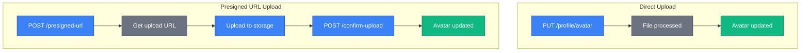
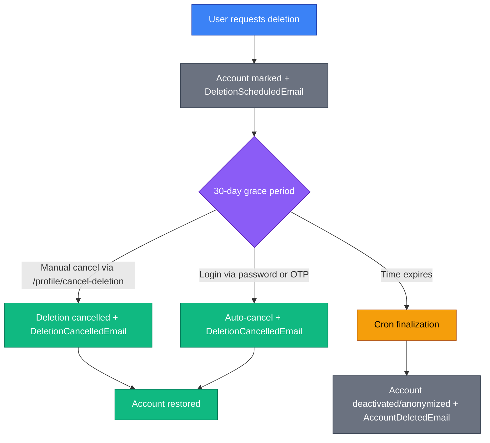
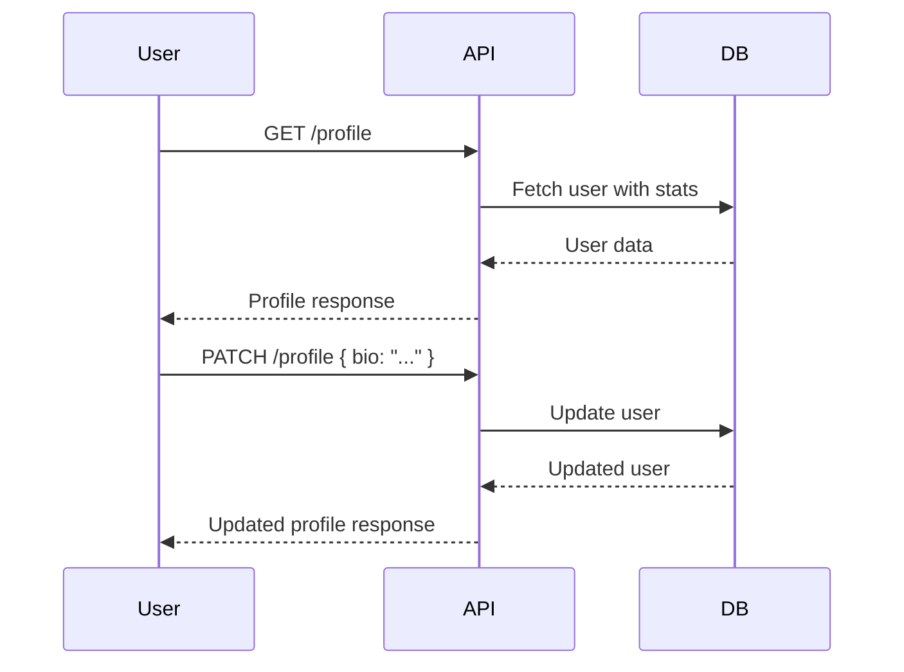
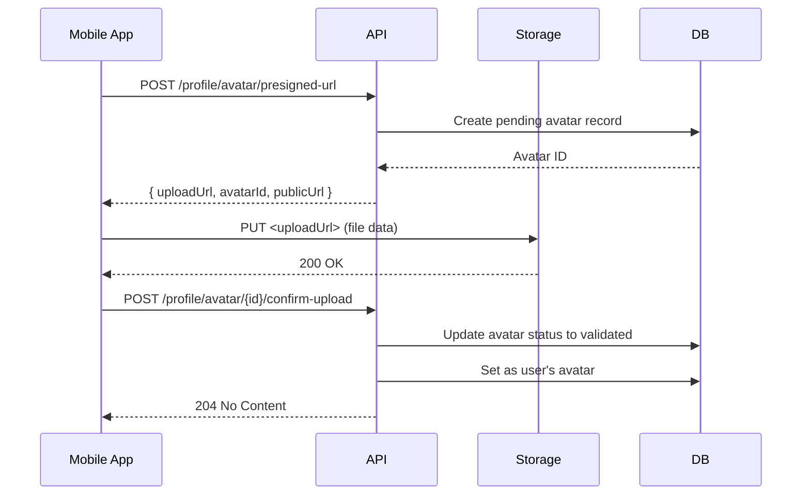

# Users

The users API enables user profile management, discovery, and account settings.

## Overview

SkipperClub's user system supports two distinct interaction patterns:

1. **Profile endpoints** (`/profile`) — Manage your own account, settings, and avatar
2. **Users endpoints** (`/users`) — Discover and view other users' profiles

Key features include:

- **Profile management** — Update personal information, bio, and social links
- **Notification delivery preferences** — Control global email and push notification channels
- **Avatar uploads** — Support for direct upload or presigned URL patterns
- **User discovery** — Search and browse community members
- **Account deletion** — Schedule deletion with 30-day grace period, auto-cancel on login, and account emails
- **Sailing credentials** — Experience level, licenses, and preferences

## Endpoints

### Profile Management (Current User)

| Method | Endpoint                              | Description                           |
| ------ | ------------------------------------- | ------------------------------------- |
| GET    | `/profile`                            | Get current user profile              |
| PUT    | `/profile`                            | Full profile update                   |
| PATCH  | `/profile`                            | Partial profile update                |
| GET    | `/profile/notification-settings`      | Get notification delivery settings    |
| PUT    | `/profile/notification-settings`      | Update notification delivery settings |
| PUT    | `/profile/avatar`                     | Upload avatar (multipart)             |
| POST   | `/profile/avatar/presigned-url`       | Generate presigned URL for avatar     |
| POST   | `/profile/avatar/{id}/confirm-upload` | Confirm avatar upload                 |
| DELETE | `/profile`                            | Schedule profile deletion             |
| POST   | `/profile/cancel-deletion`            | Cancel scheduled deletion             |

### User Discovery

| Method | Endpoint                  | Description                                                   |
| ------ | ------------------------- | ------------------------------------------------------------- |
| POST   | `/users`                  | Register new user                                             |
| GET    | `/users`                  | List/search users                                             |
| GET    | `/users/{userId}`         | Get user details                                              |
| GET    | `/users/{userId}/posts`   | ~~List user's posts~~ (Deprecated - use `GET /posts?userId=`) |
| GET    | `/users/{userId}/reviews` | List user's reviews                                           |

---

## Key Concepts

### Sailing Experience Levels

Users can set their sailing experience level:

| Level          | Description                     |
| -------------- | ------------------------------- |
| `beginner`     | New to sailing, learning basics |
| `intermediate` | Comfortable crew member         |
| `advanced`     | Experienced sailor, can skipper |
| `professional` | Licensed professional skipper   |

### User Roles

Users are assigned a role that determines their access level:

| Role    | Description                                                                |
| ------- | -------------------------------------------------------------------------- |
| `user`  | Standard user with access to all public features                           |
| `admin` | Administrative user with elevated privileges (e.g., invitation management) |

New users are assigned the `user` role by default. The role is included in the JWT token payload and available via `GET /profile`. For detailed JWT payload structure, see [Authentication Module](../authentication/index.md#jwt-payload).

### Friendship Status

When viewing another user's profile, the `currentUserFriendshipStatus` field indicates your relationship:

| Status     | Description                                     |
| ---------- | ----------------------------------------------- |
| `none`     | No relationship exists                          |
| `pending`  | There is a pending friend request between users |
| `accepted` | You are friends                                 |

### Profile vs User Detail Response

- **Profile response** — Includes sensitive data like `email` (only for your own profile)
- **User detail response** — Public profile without email, includes `currentUserFriendshipStatus`

### Notification Delivery Preferences

Users can manage global notification channels from profile settings:

- `emailNotificationsEnabled`
- `pushNotificationsEnabled`

These settings affect email and mobile push delivery only.

- In-app/WebSocket notifications remain always enabled.
- Transactional account emails remain always enabled.

For full business rules and endpoint examples, see [Notification Settings](../notifications/notification-settings.md).

---

## Notification Settings

```http
GET /profile/notification-settings
PUT /profile/notification-settings
```

Manage channel-level notification preferences for the authenticated user.

### Request Body (PUT)

| Field                       | Type    | Required | Description                        |
| --------------------------- | ------- | -------- | ---------------------------------- |
| `emailNotificationsEnabled` | boolean | Yes      | Enable/disable notification emails |
| `pushNotificationsEnabled`  | boolean | Yes      | Enable/disable push notifications  |

### Example Request

```http
PUT /v1/profile/notification-settings HTTP/1.1
Host: api.skipperclub.app
Authorization: Bearer <token>
Content-Type: application/json

{
  "emailNotificationsEnabled": true,
  "pushNotificationsEnabled": false
}
```

### Example Response

```json
{
  "emailNotificationsEnabled": true,
  "pushNotificationsEnabled": false
}
```

### Notes

- `PUT` uses full replacement semantics (both fields are required).
- If settings do not exist yet, `GET` initializes defaults with both flags set to `true`.
- Detailed behavior: [Notification Settings](../notifications/notification-settings.md).

---

## Get Profile

```http
GET /profile
```

Retrieve the current authenticated user's profile with all fields including email.

### Example Request

```http
GET /v1/profile HTTP/1.1
Host: api.skipperclub.app
Authorization: Bearer <token>
```

### Response

**200 OK**

```json
{
  "id": "018fa2e4-8e3b-7b2e-8e3b-7b2e8e3b7b00",
  "name": "Jan Kowalski",
  "email": "jan@example.com",
  "role": "user",
  "avatarUrl": "https://cdn.example.com/avatars/jan.jpg",
  "bio": "Sailing enthusiast and Baltic Sea explorer",
  "city": "Gdańsk",
  "country": "PL",
  "sailingExperience": "advanced",
  "facebookUrl": "https://facebook.com/jan.skipper",
  "instagramUsername": "@jan_skipper",
  "tiktokUsername": "@jan_skipper",
  "whatsappNumber": "+48123456789",
  "sailingLicenses": "RYA Yachtmaster Offshore",
  "yearsOfExperience": 10,
  "languagesSpoken": ["pl", "en", "de"],
  "preferredVoyageStyles": ["racing", "coastal"],
  "cruisesCount": 15,
  "friendsCount": 42,
  "postsCount": 28,
  "currentUserFriendshipStatus": "none",
  "createdAt": "2025-01-15T10:00:00Z",
  "updatedAt": "2025-11-20T14:30:00Z"
}
```

### Profile Fields

| Field                   | Type        | Description                              |
| ----------------------- | ----------- | ---------------------------------------- |
| `id`                    | uuid        | User UUID v7                             |
| `name`                  | string      | Display name (1-100 chars)               |
| `email`                 | string      | Email address (profile only)             |
| `role`                  | enum        | User role (`user` or `admin`)            |
| `avatarUrl`             | string/null | Avatar image URL                         |
| `bio`                   | string      | Short biography (max 500 chars)          |
| `city`                  | string      | City of residence                        |
| `country`               | string      | ISO 3166-1 alpha-2 country code          |
| `preferredLanguage`     | string      | User's preferred language (`en` or `pl`) |
| `sailingExperience`     | enum        | Experience level                         |
| `facebookUrl`           | string      | Facebook profile URL                     |
| `instagramUsername`     | string      | Instagram handle (with @)                |
| `tiktokUsername`        | string      | TikTok handle (with @)                   |
| `whatsappNumber`        | string      | WhatsApp number (E.164 format)           |
| `sailingLicenses`       | string      | Sailing certificates/licenses            |
| `yearsOfExperience`     | integer     | Years of sailing experience (0-100)      |
| `languagesSpoken`       | string[]    | ISO 639-1 language codes (max 10)        |
| `preferredVoyageStyles` | string[]    | Preferred cruise types                   |
| `cruisesCount`          | integer     | Number of cruises participated           |
| `friendsCount`          | integer     | Number of friends                        |
| `postsCount`            | integer     | Number of posts                          |
| `createdAt`             | datetime    | Account creation timestamp               |
| `updatedAt`             | datetime    | Last profile update timestamp            |

---

## Update Profile (Full)

```http
PUT /profile
```

Full update of the current user's profile. All fields must be provided.

### Request Body

| Field                   | Type     | Required | Description                                   |
| ----------------------- | -------- | -------- | --------------------------------------------- |
| `name`                  | string   | Yes      | Display name (1-100 chars)                    |
| `bio`                   | string   | No       | Biography (max 500 chars)                     |
| `city`                  | string   | No       | City (max 100 chars)                          |
| `country`               | string   | No       | ISO 3166-1 alpha-2 code                       |
| `sailingExperience`     | enum     | No       | Experience level                              |
| `facebookUrl`           | string   | No       | Facebook URL (must match facebook.com/fb.com) |
| `instagramUsername`     | string   | No       | Instagram handle (format: @username)          |
| `tiktokUsername`        | string   | No       | TikTok handle (format: @username)             |
| `whatsappNumber`        | string   | No       | E.164 format (+1234567890)                    |
| `sailingLicenses`       | string   | No       | Licenses (max 150 chars)                      |
| `yearsOfExperience`     | integer  | No       | Years (0-100)                                 |
| `languagesSpoken`       | string[] | No       | Language codes (max 10)                       |
| `preferredVoyageStyles` | string[] | No       | Voyage style preferences                      |

### Example Request

```http
PUT /v1/profile HTTP/1.1
Host: api.skipperclub.app
Authorization: Bearer <token>
Content-Type: application/json

{
  "name": "Jan Kowalski",
  "bio": "Sailing enthusiast exploring the Baltic Sea",
  "city": "Gdańsk",
  "country": "PL",
  "sailingExperience": "advanced",
  "instagramUsername": "@jan_skipper",
  "yearsOfExperience": 10,
  "languagesSpoken": ["pl", "en"]
}
```

### Response

**200 OK** — Returns updated profile object.

### Validation Rules

- **Country code** — Must be exactly 2 uppercase letters (ISO 3166-1 alpha-2)
- **Facebook URL** — Must start with `https://facebook.com/` or `https://fb.com/`
- **Instagram username** — Must match pattern `@[a-zA-Z0-9_.]{1,30}`
- **TikTok username** — Must match pattern `@[a-zA-Z0-9_.]{1,24}`
- **WhatsApp number** — Must be E.164 format: `+[country][number]`
- **Languages** — Each must be 2 lowercase letters (ISO 639-1)

---

## Update Profile (Partial)

```http
PATCH /profile
```

Partial update of profile. Only include fields you want to change.

### Example Request

```http
PATCH /v1/profile HTTP/1.1
Host: api.skipperclub.app
Authorization: Bearer <token>
Content-Type: application/json

{
  "bio": "Updated bio text"
}
```

### Response

**200 OK** — Returns updated profile object.

---

## Upload Avatar (Direct)

```http
PUT /profile/avatar
```

Upload an avatar image directly via multipart form data.

### Request

Content-Type: `multipart/form-data`

| Field  | Type | Required | Description                  |
| ------ | ---- | -------- | ---------------------------- |
| `file` | file | Yes      | Image file (JPEG, PNG, HEIC) |

### Example Request

```http
PUT /v1/profile/avatar HTTP/1.1
Host: api.skipperclub.app
Authorization: Bearer <token>
Content-Type: multipart/form-data; boundary=----FormBoundary

------FormBoundary
Content-Disposition: form-data; name="file"; filename="avatar.jpg"
Content-Type: image/jpeg

<binary file data>
------FormBoundary--
```

### Response

**200 OK**

```json
{
  "avatarUrl": "https://cdn.example.com/avatars/018fa2e4-8e3b-7b2e-8e3b-7b2e8e3b7b00.jpg"
}
```

### Errors

| Status | Type                         | Description             |
| ------ | ---------------------------- | ----------------------- |
| 400    | `/errors/no-avatar-provided` | No file uploaded        |
| 400    | `/errors/invalid-file-type`  | Unsupported file format |

---

## Avatar Upload (Presigned URL)

For mobile apps or large files, use the presigned URL pattern for client-side uploads directly to storage.

### Step 1: Generate Presigned URL

```http
POST /profile/avatar/presigned-url
```

### Request Body

| Field         | Type    | Required | Description                                   |
| ------------- | ------- | -------- | --------------------------------------------- |
| `fileName`    | string  | Yes      | Original filename                             |
| `fileType`    | string  | Yes      | MIME type (image/jpeg, image/png, image/heic) |
| `fileSize`    | integer | Yes      | File size in bytes                            |
| `width`       | integer | No       | Image width in pixels                         |
| `height`      | integer | No       | Image height in pixels                        |
| `camera`      | string  | No       | Camera model                                  |
| `lat`         | number  | No       | Latitude (-90 to 90)                          |
| `lon`         | number  | No       | Longitude (-180 to 180)                       |
| `orientation` | integer | No       | EXIF orientation (1-8)                        |
| `dateTaken`   | string  | No       | ISO 8601 date when photo was taken            |
| `metadata`    | object  | No       | Additional metadata                           |

### Example Request

```http
POST /v1/profile/avatar/presigned-url HTTP/1.1
Host: api.skipperclub.app
Authorization: Bearer <token>
Content-Type: application/json

{
  "fileName": "avatar.jpg",
  "fileType": "image/jpeg",
  "fileSize": 2097152,
  "width": 800,
  "height": 800
}
```

### Response

**201 Created**

```json
{
  "uploadUrl": "https://storage.example.com/avatars/018fa2e4...?signature=...",
  "avatarId": "018fa2e4-8e3b-7b2e-8e3b-7b2e8e3b7b99",
  "publicUrl": "https://cdn.example.com/avatars/018fa2e4-8e3b-7b2e-8e3b-7b2e8e3b7b99.jpg"
}
```

### Step 2: Upload to Storage

Upload the file directly to the `uploadUrl` using a PUT request:

```http
PUT <uploadUrl> HTTP/1.1
Content-Type: image/jpeg

<binary file data>
```

### Step 3: Confirm Upload

```http
POST /profile/avatar/{id}/confirm-upload
```

### Path Parameters

| Parameter | Type | Description                           |
| --------- | ---- | ------------------------------------- |
| `id`      | uuid | Avatar ID from presigned URL response |

### Example Request

```http
POST /v1/profile/avatar/018fa2e4-8e3b-7b2e-8e3b-7b2e8e3b7b99/confirm-upload HTTP/1.1
Host: api.skipperclub.app
Authorization: Bearer <token>
```

### Response

**204 No Content**

### Errors

| Status | Type                              | Description                  |
| ------ | --------------------------------- | ---------------------------- |
| 400    | `/errors/avatar-incorrect-status` | Avatar not in pending status |
| 404    | `/errors/avatar-not-found`        | Avatar ID doesn't exist      |

---

## Avatar Upload Flow



---

## Delete Profile

```http
DELETE /profile
```

Schedule account deletion. The account enters a 30-day grace period before permanent deletion.

### Example Request

```http
DELETE /v1/profile HTTP/1.1
Host: api.skipperclub.app
Authorization: Bearer <token>
```

### Response

**200 OK**

```json
{
  "deletionScheduledAt": "2025-01-15T10:00:00Z",
  "completionDate": "2025-02-15",
  "status": "scheduled"
}
```

### Response Fields

| Field                 | Type     | Description                                   |
| --------------------- | -------- | --------------------------------------------- |
| `deletionScheduledAt` | datetime | Timestamp when deletion was scheduled         |
| `completionDate`      | date     | Date when account will be permanently deleted |
| `status`              | string   | Always `scheduled`                            |

### Behavior

- Account is marked for deletion but remains accessible
- User can still log in during grace period
- Scheduling deletion sends an account email notification
- Logging in with password or OTP automatically cancels scheduled deletion and sends an account email notification
- User can also cancel deletion manually before the scheduled date via `POST /profile/cancel-deletion` (also sends an account email notification)
- After 30 days, a background cron finalizes deletion by deactivating login data and anonymizing account identifiers, then sends a final account email notification

---

## Cancel Profile Deletion

```http
POST /profile/cancel-deletion
```

Cancel a scheduled profile deletion during the grace period.

> **Note:** Scheduled deletion can also be canceled automatically by a successful login (`POST /auth/login` or `POST /auth/otp/verify`).

### Example Request

```http
POST /v1/profile/cancel-deletion HTTP/1.1
Host: api.skipperclub.app
Authorization: Bearer <token>
```

### Response

**200 OK**

```json
{
  "status": "active"
}
```

### Response Fields

| Field    | Type   | Description                                        |
| -------- | ------ | -------------------------------------------------- |
| `status` | string | Account status after cancellation, always `active` |

### Errors

| Status | Type                            | Description               |
| ------ | ------------------------------- | ------------------------- |
| 422    | `/errors/no-deletion-scheduled` | No deletion was scheduled |

---

## Profile Deletion Flow



---

## Register User

```http
POST /users
```

Create a new user account and receive authentication tokens.

### Request Body

| Field      | Type   | Required | Description            |
| ---------- | ------ | -------- | ---------------------- |
| `name`     | string | Yes      | Display name           |
| `email`    | string | Yes      | Email address          |
| `password` | string | Yes      | Password (min 8 chars) |

### Example Request

```http
POST /v1/users HTTP/1.1
Host: api.skipperclub.app
Content-Type: application/json

{
  "name": "Jan Kowalski",
  "email": "jan@example.com",
  "password": "SecurePass123!"
}
```

### Response

**201 Created**

```json
{
  "id": "018fa2e4-8e3b-7b2e-8e3b-7b2e8e3b7b99",
  "accessToken": "eyJhbGciOiJIUzI1NiIs...",
  "refreshToken": "eyJhbGciOiJIUzI1NiIs...",
  "user": {
    "id": "018fa2e4-8e3b-7b2e-8e3b-7b2e8e3b7b00",
    "name": "Jan Kowalski",
    "email": "jan@example.com",
    "avatarUrl": null
  },
  "expiresIn": 900
}
```

> **Note:** User role is included in the JWT payload (access and refresh tokens) but not in the session response body. The role is available via `GET /profile` or `GET /users/{userId}` endpoints.

### Errors

| Status | Type                           | Description                 |
| ------ | ------------------------------ | --------------------------- |
| 422    | `/errors/email-already-exists` | Email is already registered |
| 422    | `/errors/validation`           | Validation failed           |

---

## List Users

```http
GET /users
```

Search and browse community members.

### Query Parameters

| Parameter | Type    | Default | Description                |
| --------- | ------- | ------- | -------------------------- |
| `search`  | string  | —       | Search by name             |
| `limit`   | integer | 20      | Results per page (1-100)   |
| `offset`  | integer | 0       | Results to skip            |
| `sort`    | string  | `name`  | Sort field                 |
| `order`   | string  | `desc`  | Sort order (`asc`, `desc`) |

### Example Requests

```http
GET /v1/users HTTP/1.1
Host: api.skipperclub.app
Authorization: Bearer <token>
```

```http
GET /v1/users?search=jan HTTP/1.1
Host: api.skipperclub.app
Authorization: Bearer <token>
```

### Response

**200 OK**

```json
{
  "users": [
    {
      "id": "018fa2e4-8e3b-7b2e-8e3b-7b2e8e3b7b00",
      "name": "Jan Kowalski",
      "avatarUrl": "https://cdn.example.com/avatars/jan.jpg"
    },
    {
      "id": "018fa2e4-8e3b-7b2e-8e3b-7b2e8e3b7b02",
      "name": "Anna Nowak",
      "avatarUrl": null
    }
  ],
  "total": 150,
  "limit": 20,
  "offset": 0
}
```

---

## Get User

```http
GET /users/{userId}
```

Retrieve another user's public profile.

### Path Parameters

| Parameter | Type | Description  |
| --------- | ---- | ------------ |
| `userId`  | uuid | User UUID v7 |

### Example Request

```http
GET /v1/users/018fa2e4-8e3b-7b2e-8e3b-7b2e8e3b7b00 HTTP/1.1
Host: api.skipperclub.app
Authorization: Bearer <token>
```

### Response

**200 OK**

```json
{
  "id": "018fa2e4-8e3b-7b2e-8e3b-7b2e8e3b7b00",
  "name": "Jan Kowalski",
  "avatarUrl": "https://cdn.example.com/avatars/jan.jpg",
  "bio": "Sailing enthusiast",
  "city": "Gdańsk",
  "country": "PL",
  "sailingExperience": "advanced",
  "facebookUrl": "https://facebook.com/jan.skipper",
  "instagramUsername": "@jan_skipper",
  "tiktokUsername": null,
  "whatsappNumber": null,
  "cruisesCount": 15,
  "friendsCount": 42,
  "postsCount": 28,
  "currentUserFriendshipStatus": "none",
  "createdAt": "2025-01-15T10:00:00Z",
  "updatedAt": "2025-11-20T14:30:00Z"
}
```

### Note

- Response does NOT include `email` (privacy protection)
- Includes `currentUserFriendshipStatus` for relationship context

### Errors

| Status | Type                     | Description        |
| ------ | ------------------------ | ------------------ |
| 404    | `/errors/user-not-found` | User doesn't exist |

---

## Get User Posts (Deprecated)

> **⚠️ Deprecated:** This endpoint has been removed. Use `GET /posts?userId={userId}` instead to retrieve posts by a specific user.

### Migration

Replace:

```http
GET /users/{userId}/posts
```

With:

```http
GET /posts?userId={userId}
```

See [Posts Documentation](../posts/index.md) for full details on the posts endpoint.

---

## Get User Reviews

```http
GET /users/{userId}/reviews
```

Retrieve all published reviews for a specific user. Reviews are reciprocal — they only become visible once both parties have submitted their reviews.

### Path Parameters

| Parameter | Type | Description  |
| --------- | ---- | ------------ |
| `userId`  | uuid | User UUID v7 |

### Query Parameters

| Parameter | Type    | Default | Description                |
| --------- | ------- | ------- | -------------------------- |
| `limit`   | integer | 20      | Results per page (1-100)   |
| `offset`  | integer | 0       | Results to skip            |
| `order`   | string  | `desc`  | Sort order (`asc`, `desc`) |

### Example Request

```http
GET /v1/users/018fa2e4-8e3b-7b2e-8e3b-7b2e8e3b7b00/reviews HTTP/1.1
Host: api.skipperclub.app
Authorization: Bearer <token>
```

### Response

**200 OK**

```json
{
  "reviews": [
    {
      "id": "018fa2e4-8e3b-7b2e-8e3b-7b2e8e3b7b99",
      "cruiseId": "018fa2e4-8e3b-7b2e-8e3b-7b2e8e3b7b88",
      "reviewer": {
        "id": "018fa2e4-8e3b-7b2e-8e3b-7b2e8e3b7b01",
        "name": "Anna Nowak",
        "avatarUrl": "https://cdn.example.com/avatars/anna.jpg"
      },
      "reviewedUser": {
        "id": "018fa2e4-8e3b-7b2e-8e3b-7b2e8e3b7b00",
        "name": "Jan Kowalski",
        "avatarUrl": "https://cdn.example.com/avatars/jan.jpg"
      },
      "cruise": {
        "id": "018fa2e4-8e3b-7b2e-8e3b-7b2e8e3b7b88",
        "title": "Weekend Baltic Adventure",
        "departureDate": "2025-07-12"
      },
      "ratings": {
        "communication": 5,
        "behavior": 4,
        "skills": 5,
        "duties": 4,
        "average": 4.5
      },
      "comment": "Great crew member! Very helpful with navigation and always willing to take on tasks.",
      "status": "published",
      "createdAt": "2025-07-20T10:00:00Z",
      "updatedAt": "2025-07-20T10:00:00Z"
    }
  ],
  "averageRatings": {
    "communication": 4.8,
    "behavior": 4.6,
    "skills": 4.7,
    "duties": 4.5,
    "average": 4.6
  },
  "total": 15,
  "limit": 20,
  "offset": 0
}
```

### Response Fields

| Field            | Type    | Description                        |
| ---------------- | ------- | ---------------------------------- |
| `reviews`        | array   | List of published reviews          |
| `averageRatings` | object  | Average ratings across all reviews |
| `total`          | integer | Total number of published reviews  |
| `limit`          | integer | Number of results per page         |
| `offset`         | integer | Number of results skipped          |

### Errors

| Status | Type                     | Description        |
| ------ | ------------------------ | ------------------ |
| 404    | `/errors/user-not-found` | User doesn't exist |

---

## Error Handling

All errors follow RFC 7807 Problem Details format:

```json
{
  "type": "/errors/user-not-found",
  "title": "User Not Found",
  "status": 404,
  "detail": "The requested user could not be found"
}
```

### Error Types

| Type                              | Status | Description                   |
| --------------------------------- | ------ | ----------------------------- |
| `/errors/user-not-found`          | 404    | User doesn't exist            |
| `/errors/avatar-not-found`        | 404    | Avatar doesn't exist          |
| `/errors/avatar-incorrect-status` | 400    | Avatar not in expected status |
| `/errors/no-avatar-provided`      | 400    | No file uploaded              |
| `/errors/invalid-file-type`       | 400    | Unsupported file format       |
| `/errors/no-deletion-scheduled`   | 422    | No deletion scheduled         |
| `/errors/email-already-exists`    | 422    | Email already registered      |
| `/errors/validation`              | 422    | Request validation failed     |
| `/errors/authentication-required` | 401    | Missing authentication        |

---

## Sequence Diagrams

### Profile Update Flow



### Avatar Upload with Presigned URL



---

## Best Practices

1. **Use PATCH for updates** — Only send fields that changed to minimize data transfer
2. **Handle friendship status** — Show appropriate UI actions based on relationship
3. **Use presigned URLs for mobile** — More reliable for large files and poor connections
4. **Cache user profiles** — User data changes infrequently; cache with TTL
5. **Validate client-side** — Check field constraints before submitting
6. **Handle deletion gracefully** — Confirm intent and explain the 30-day grace period

---

## Related

- [Authentication](../getting-started/authentication.md) — JWT tokens and sessions
- [Notification Settings](../notifications/notification-settings.md) — Account-level notification channel preferences
- [Notifications](../notifications/index.md) — Notification center and in-app events
- [Friends](../friends/index.md) — Friend requests and relationships
- [Posts](../posts/index.md) — User's social posts
- [Media](../media/index.md) — File upload patterns
- [Error Handling](../getting-started/errors.md) — RFC 7807 format
