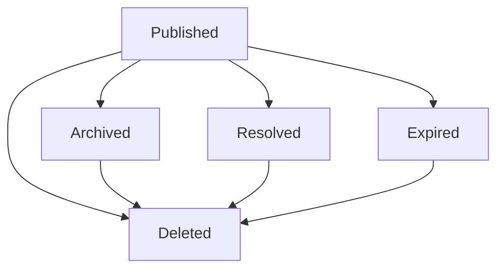

# PRD-002: Posts & Social Feed

## Purpose

Define business requirements for how users create, discover, evaluate, and govern sailing posts in SkipperClub.

This document focuses on product behavior and business rules. It intentionally avoids technical and API-level details.

## Business Objectives

- Help sailors share practical, regional knowledge and trip experiences.
- Keep feed content relevant through location, content-key filtering, scheduling, expiration, and alert validity voting.
- Strengthen trust through transparent post lifecycle, community validation, and reporting.
- Support meaningful social engagement through comments, reactions, and bookmarking.
- Improve discovery with coordinate-aware feed and map navigation.

## Scope

### In Scope

- One-flow post creation with structured content objects.
- Location context for posts through optional representative points and areas.
- Post lifecycle management (published, archived, expired, resolved, deleted).
- Feed discovery and filtering by business-relevant dimensions.
- Social interactions on posts (comments, reactions, bookmarks).
- Community trust and safety controls (validity voting and reporting).
- Role-based behavior for standard users, post authors, moderators, and administrators.

### Out of Scope

- Technical implementation details and service architecture.
- API contracts, endpoint behavior, or transport-level error handling.
- UI mockups and visual design decisions.
- Internal tooling details for moderation operations.

## Personas and Roles

### Standard User

A community member who consumes content, engages socially, and contributes trust signals.

Core business capabilities:

- Browse and filter feed content by relevance.
- React, comment, bookmark, vote on validity (where allowed), and report content.
- Create posts and manage own post visibility through lifecycle actions.

### Post Author

A standard user acting as owner of specific posts.

Core business capabilities:

- Edit own posts while they are actively published.
- Archive or delete own posts.
- Resolve own time-sensitive posts when an issue is addressed.
- View own non-public post states (archived, expired, resolved).

### Moderator

A trusted operator responsible for reviewing safety reports.

Core business capabilities:

- Review submitted reports.
- Mark reports as reviewed or dismissed according to moderation policy.

### Administrator

A governance role with platform-wide oversight.

Core business capabilities:

- All standard user capabilities.
- Oversight of moderation outcomes and content safety governance.

## Post Domain Model (Business View)

The post domain is designed to support both experience sharing and operational sailing information.

### Content Classification

There is no user-facing post type. What a post "is" follows from structured
content and attachments:

- `content.text` is required for every post.
- `content.route` adds route context.
- `content.alert` marks the post as an alert.
- attached media adds media context.

The product exposes derived `contentKeys` such as `alert`, `route`, and
`media` for filtering and rendering.

### Post Content Components

A post can include:

- Narrative context: `content.text` and extracted hashtags.
- Social context: tagged users.
- Place context: optional location name and representative coordinates.
- Affected-area context for alert posts.
- Media context: optional photo/video assets.
- Route context: route stops and optional route summary details.

### Time Relevance

- Regular posts remain relevant without automatic expiration unless the author sets an expiration.
- Imported alert posts receive source-driven validity windows and can become outdated quickly.
- Community mechanisms can resolve alert information early when it is no longer valid.

## Post Lifecycle and Visibility Rules

Posts follow a controlled lifecycle:

- `published`: visible to everyone and open to normal engagement.
- `archived`: hidden from public feed, visible only to the author.
- `expired`: automatically time-closed for time-sensitive content, visible only to the author.
- `resolved`: manually or community-resolved time-sensitive issue, visible only to the author.
- `deleted`: inaccessible to everyone.

### Lifecycle Business Policies

- All newly created posts start as `published`.
- Only `published` posts are editable.
- Authors can archive any of their published posts.
- Authors can resolve their own time-sensitive posts.
- Time-sensitive posts auto-expire after their configured duration.
- Authors can delete their own posts from any non-deleted state.

### Effective Expiration

A post can be operationally treated as expired even while still marked as published when its validity window has already passed.

Business implications:

- Non-authors no longer see such content in normal access paths.
- Authors can still view their content history.
- Social and trust interactions are blocked once effective expiration is reached.

## Location Discovery

Posts are not assigned to product regions. Feed and map relevance are driven by
coordinates, distance, viewport bounds, and optional affected-area geometry.

### Location Context and Geocoder-Assisted Input

Location input supports practical post creation and discovery:

- Location is optional for regular posts.
- Alert posts require a representative point.
- Users can provide location through assisted search flows (autocomplete, search, reverse lookup) to improve accuracy.

Business value:

- Better relevance for local sailors.
- Stronger discoverability by place name and proximity.
- More consistent place metadata in community content.

## Social Interactions

### Comments

- Users can discuss published, currently valid posts.
- Comment author and post author can remove a comment.

### Reactions

- Users can express sentiment with a curated set of 20 reactions (standard and sailing-themed).
- Users can apply multiple different reaction types to the same post.
- Feed experience highlights reaction totals by type and the current user's own reactions.

### Bookmarks

- Users can privately save posts for later.
- Bookmark lists include only currently accessible posts.

### Interaction Guardrails

Comments, reactions, bookmarks, reports, and validity voting are only available for published posts that are still currently valid.

## Trust, Safety, and Content Governance

### Validity Voting

Validity voting keeps alert information trustworthy.

- Applicable only to posts whose `content.alert` object is present.
- Vote options communicate whether information remains valid or has become invalid.
- One user can submit one immutable vote per post.
- Repeated identical input is treated as no additional change.
- Reaching the invalid-vote threshold (3 or more) automatically resolves the post.

### Reporting

Reporting enables community-led safety enforcement.

- Users can report harmful or policy-violating posts using standardized reasons:
  `spam`, `scam`, `offensive`, `misinformation`, `danger`, `other`.
- Multiple reports can be submitted on the same post and are treated as separate moderation signals.
- Self-reporting is allowed.
- Reports progress through moderation states: `pending`, `reviewed`, `dismissed`.

### Governance Intent

- Combine proactive community signals (validity voting) with reactive moderation (reporting).
- Preserve user trust through predictable, auditable content state changes.

## Business Rules and Constraints

- There is no post type field.
- `content.text` supports concise-to-detailed narrative text (business range: 1-2200 characters).
- Comment length supports short discussion format (business range: 1-500 characters).
- Report details support concise context (business maximum: 500 characters).
- A post can tag up to 20 users.
- Media is allowed on every post and required on none; maximum 10 attachments.
- Route content requires at least one stop and supports route metadata (duration and length).
- Author-set expiration is optional for regular posts; imported alert expiration follows source validity metadata.

## User Stories

### US-013: Creating Posts

As a user I want to share sailing-related content to contribute to the community and help other sailors.

Acceptance criteria:

1. I can create a post through one simple flow without choosing a post type.
2. I can add text, optional route content, optional alert content, optional media, and optional location context.
3. I can tag up to 20 other users in my post.
4. Alert posts require representative coordinates and can include an affected area.
5. I can optionally schedule publication and set expiration.
6. Route content supports route-specific planning context through stops and optional trip metadata.

### US-020: Browsing the Post Feed

As a user I want to browse posts to discover content relevant to my sailing interests.

Acceptance criteria:

1. I can view a feed of posts with pagination.
2. I can filter by contained content (`alert`, `media`, `route`, `note`), status, author, location name, hashtags, and date range.
3. I can discover posts near a selected location using proximity context.
4. I can discover alerts and other posts without switching to a separate public alerts surface.
5. Map and feed use the same public post source.
6. I can sort feed results by recency and relevance context.
7. Hashtag filtering is case-insensitive.

### US-021: Post Comments

As a user I want to add comments to posts to participate in the discussion.

Acceptance criteria:

1. I can add a comment and see it under the post.
2. The comment author can edit their own comment.
3. The comment author or the post author can delete the comment.
4. Commenting is available only on currently valid published posts.

### US-022: Post Reactions

As a user I want to react to posts with emojis to express my feelings about the content.

Acceptance criteria:

1. I can react to published posts that are currently valid.
2. 20 reaction types are available: 10 standard reactions and 10 sailing-themed reactions.
3. I can add multiple different reactions to the same post.
4. I can remove reactions I added.
5. Reaction totals by type are visible on each post.
6. I can see which reactions I personally added.

### US-050: Post Lifecycle Management

As a post author I want to manage my posts throughout their lifecycle.

Acceptance criteria:

1. I can archive my published posts to hide them from public feed while keeping them visible to me.
2. I can manually resolve my time-sensitive posts when the issue is addressed.
3. Time-sensitive posts automatically expire after their duration.
4. Non-public statuses (archived, expired, resolved) are visible only to the author.
5. I can delete my posts, making them inaccessible to everyone.
6. Status changes follow controlled lifecycle transitions.

### US-051: Bookmarking Posts

As a user I want to save posts for later reference.

Acceptance criteria:

1. I can bookmark published posts that are currently valid.
2. I can view all my bookmarked posts in a dedicated private list.
3. I can remove bookmarks when no longer needed.
4. Bookmarks are visible only to me.
5. Inaccessible posts are no longer shown in bookmark results.

### US-052: Community Validity Voting

As a user I want to help maintain the quality of time-sensitive information by voting on post validity.

Acceptance criteria:

1. I can vote on berth, weather, and navigation warning posts as valid or invalid.
2. Posts with 3 or more invalid votes are automatically resolved.
3. Each user can cast one immutable vote per post.
4. Repeating the same vote does not create additional impact.
5. Voting helps the community keep time-sensitive content accurate.

### US-053: Reporting Posts

As a user I want to report inappropriate or harmful content to maintain community standards.

Acceptance criteria:

1. I can report published, currently valid posts for spam, scam, offensive content, misinformation, danger, or other violations.
2. I can submit multiple reports on the same post, and each report is treated as a separate moderation signal.
3. Reports enter a moderation workflow with clear status progression.
4. I can see confirmation that my report was submitted.
5. Reporting helps keep the platform safe and trustworthy.

## Business Assumptions and Open Product Decisions

The following areas require explicit product decisions to keep business documentation fully consistent:

1. **Geocoder dependency fallback**  
   Define expected user experience when location assistance is temporarily unavailable, especially for alert posts that require representative coordinates.

2. **Location localization persistence**  
   Confirm how localized place names should be persisted when users create posts in different languages.

3. **Moderation SLA and escalation**  
   Define expected review timelines and escalation rules for high-risk reports.

4. **Moderator vs administrator boundaries**  
   Confirm where moderation responsibility ends and administrator intervention begins.
