```mermaid
flowchart TB
    %% Screens
    CruiseDetailOrganizer[Cruise Detail Screen <br> Organizer view]
    DeleteCruise[Delete Cruise Screen]
    MembersChat[Members Chat Screen]
    ParticipantManage[Participant Manage Screen]
    CruiseEdit[Cruise Edit Screen]
    CruiseReview[Cruise Review Screen]
    UserProfile[User Profile Screen]
    AllCruisesFiltered[All Cruises Screen <br> Filtered by hashtag]

    %% Organizer Actions on Cruise Detail
    CruiseDetailOrganizer -->|Tap Delete button| DeleteCruise
    CruiseDetailOrganizer -->|Tap Manage participants button| ParticipantManage
    CruiseDetailOrganizer -->|Tap Edit button| CruiseEdit
    CruiseDetailOrganizer -->|Tap Members Chat button| MembersChat
    CruiseDetailOrganizer -->|Tap Review button| CruiseReview
    CruiseDetailOrganizer -->|Tap organizer profile| UserProfile
    CruiseDetailOrganizer -->|Tap participant profile| UserProfile
    CruiseDetailOrganizer -->|Tap hashtag| AllCruisesFiltered

    %% Styling
    classDef screenStyle fill:#4A90E2,stroke:#2E5C8A,stroke-width:2px,color:#fff
    classDef modalStyle fill:#FF9500,stroke:#CC7700,stroke-width:2px,color:#fff
    classDef actionStyle fill:#7ED321,stroke:#5FA319,stroke-width:2px,color:#000
    classDef noteStyle fill:#F5F5F5,stroke:#999,stroke-width:1px,color:#333,stroke-dasharray: 5 5
    classDef entryStyle fill:#BD10E0,stroke:#8B0AA8,stroke-width:2px,color:#fff

    class CruiseDetailOrganizer,DeleteCruise,MembersChat,ParticipantManage,CruiseEdit,CruiseReview,UserProfile,AllCruisesFiltered screenStyle
```

# Cruise Detail Screen – Organizer View

## Overview

The Cruise Detail Screen in **Organizer** mode presents full cruise information and management tools to the user who created the cruise.  
From this screen, the organizer can review cruise details, communicate with crew members in the Members Chat, manage participants, edit cruise information, delete the cruise, explore crew profiles, and access the cruise review flow.

The behavior described here applies only to the **Organizer** role. Participant and Visitor views are documented separately.

## Organizer Capabilities

As an organizer on the Cruise Detail Screen, the user has the following interactive options:

- **Open Members Chat**
  - Tap the **Members Chat** button to navigate to the dedicated **Members Chat Screen** for this cruise.
  - The chat is a group conversation space for confirmed crew members (organizer + participants) to coordinate logistics, share updates, and discuss details of the cruise.
  - Leaving the chat (Back navigation) returns the user to the Cruise Detail Screen in Organizer mode.

- **Delete the cruise**
  - Tap the **Delete** button to navigate to the **Delete Cruise Screen**.
  - On the Delete Cruise Screen, the organizer can review key cruise information and confirm or cancel the deletion.
  - Confirming the delete action permanently removes the cruise, and the user is navigated away from the Cruise Detail Screen (typically back to `My Cruises Screen` or the previous context, depending on the app-wide navigation rules).
  - Cancelling the delete action or backing out of the Delete Cruise Screen leaves the cruise unchanged and returns the organizer to the Cruise Detail Screen with the button state remaining **Delete**.
  - Any error states (e.g., cruise cannot be deleted due to system constraints, temporary server issues) are shown as separate messages and do not delete the cruise.

- **Manage participants**
  - Tap the **Manage participants** button to navigate to the `Participant Manage Screen`.
  - On the Participant Manage Screen, the organizer can view, approve, remove, or otherwise manage participants (specific interactions are defined in a separate document).
  - Leaving the Participant Manage Screen (Back navigation or a dedicated close action) returns the user to the Cruise Detail Screen in Organizer mode.

- **Edit cruise**
  - Tap the **Edit** button to navigate to the `Cruise Edit Screen`.
  - On the Cruise Edit Screen, the organizer can modify cruise details such as title, dates, route, description, and tags (full form specification is documented separately).
  - Saving changes updates the cruise and returns the organizer according to global navigation rules (typically back to the Cruise Detail Screen or `My Cruises Screen`).
  - Cancelling or backing out of the Cruise Edit Screen discards unsaved changes and returns to the Cruise Detail Screen with the cruise details unchanged.

- **Open cruise review flow**
  - Tap the **Review** button to navigate to the `Cruise Review Screen`.
  - On the Cruise Review Screen, the organizer can provide ratings, feedback, and comments about the cruise (details defined in a separate document).
  - After submitting or cancelling the review, the user returns according to global navigation rules (e.g., back to Cruise Detail Screen or My Cruises Screen).

- **Open organizer profile**
  - Tap the organizer avatar/name to navigate to the **User Profile** screen of the cruise organizer.
  - From the User Profile, the user can view public information about the organizer and then navigate back to the Cruise Detail Screen.

- **Open participant profile**
  - Tap any visible participant avatar/name to navigate to that user's **User Profile** screen.
  - From the User Profile, the user can navigate back to the Cruise Detail Screen.

- **Open hashtag-filtered cruise list**
  - Tap any hashtag displayed on the cruise (e.g., in the title, description, or tags section).
  - Navigation leads to the **All Cruises Screen** with the selected hashtag applied as an active filter.
  - The filtered list shows only cruises matching the chosen hashtag.
  - The user can adjust filters or clear them to return to the full public cruise list.

## Navigation Flow

Textual navigation overview for the Organizer role:

- **Actions on Cruise Detail (Organizer view)**
  - Tap **Delete** → `Delete Cruise Screen` → Confirm delete → Cruise is removed → Navigates away from `Cruise Detail Screen (Organizer view)` (e.g., to `My Cruises Screen` or previous context).
  - Tap **Delete** → `Delete Cruise Screen` → Cancel/Back → Cruise not deleted → Button state remains **Delete** → Return to `Cruise Detail Screen (Organizer view)`.
  - Tap **Manage participants** → Navigate to `Participant Manage Screen` → Back/Close → Return to `Cruise Detail Screen (Organizer view)`.
  - Tap **Edit** → Navigate to `Cruise Edit Screen` → Save changes → Cruise updated → Return according to global navigation (e.g., `Cruise Detail Screen (Organizer view)` or `My Cruises Screen`).
  - Tap **Edit** → Navigate to `Cruise Edit Screen` → Cancel/Back → No changes saved → Return to `Cruise Detail Screen (Organizer view)`.
  - Tap **Members Chat** → Navigate to `Members Chat Screen` → Back → Return to `Cruise Detail Screen (Organizer view)`.
  - Tap **Review** → Navigate to `Cruise Review Screen` → (Submit/Cancel per design) → Return according to global navigation (e.g., `Cruise Detail Screen (Organizer view)` or `My Cruises Screen`).
  - Tap **Organizer profile** → Navigate to `User Profile` → Back → Return to `Cruise Detail Screen (Organizer view)`.
  - Tap **Participant profile** → Navigate to `User Profile` → Back → Return to `Cruise Detail Screen (Organizer view)`.
  - Tap **Hashtag** → Navigate to `All Cruises Screen (Filtered by hashtag)`.

```
Cruise Detail Screen (Organizer view)
├─> Tap Delete button ──> Delete Cruise Screen
├─> Tap Manage participants button ──> Participant Manage Screen
├─> Tap Edit button ──> Cruise Edit Screen
├─> Tap Members Chat button ──> Members Chat Screen
├─> Tap Review button ──> Cruise Review Screen
├─> Tap organizer profile ──> User Profile Screen
├─> Tap participant profile ──> User Profile Screen
└─> Tap hashtag ──> All Cruises Screen (Filtered by hashtag)
```




