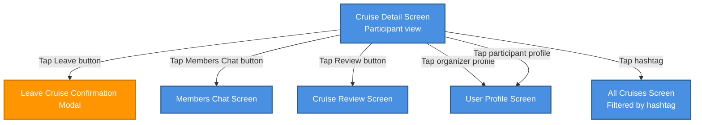

# Cruise Detail Screen – Participant View

## Overview

The Cruise Detail Screen in **Participant** mode presents full cruise information to users who are already confirmed crew members (but are not the organizer).  
From this screen, a participant can review cruise details, collaborate with other crew members in the Members Chat, manage their participation (leave the cruise), explore crew profiles, and access the cruise review flow.

The behavior described here applies only to the **Participant** role. Organizer and Visitor views are documented separately.

## Participant Capabilities

As a participant on the Cruise Detail Screen, the user has the following interactive options:

- **Open Members Chat**
  - Tap the **Members Chat** button to navigate to the dedicated **Members Chat Screen** for this cruise.
  - The chat is a group conversation space for confirmed crew members (organizer + participants) to coordinate logistics, share updates, and discuss details of the cruise.
  - Leaving the chat (Back navigation) returns the user to the Cruise Detail Screen in Participant mode.

- **Leave the cruise**
  - Tap the **Leave** button to start the leave flow.
  - After tapping, a **Leave Cruise Confirmation** modal (`Leave Cruise Confirmation Modal`) is shown.
    - Confirming the action removes the user from the cruise crew, closes the modal, and navigates away from the Cruise Detail Screen (typically back to `My Cruises Screen` or the previous context, depending on the app-wide navigation rules).
    - Dismissing or cancelling the modal leaves the user as an active participant and returns them to the Cruise Detail Screen with the button state remaining **Leave**.
  - Any error states (e.g., last required crew member cannot leave, leaving temporarily disabled) are shown as separate messages and do not remove the user from the crew.

- **Open cruise review flow**
  - Tap the **Review** button to navigate to the `Cruise Review Screen`.
  - On the Cruise Review Screen, the participant can provide ratings, feedback, and comments about the cruise (details defined in a separate document).
  - After submitting or cancelling the review, the user returns according to global navigation rules (e.g., back to Cruise Detail Screen or My Cruises Screen).

- **Open organizer profile**
  - Tap the organizer avatar/name to navigate to the **User Profile** screen of the cruise organizer.
  - From the User Profile, the user can view public information about the organizer and then navigate back to the Cruise Detail Screen.

- **Open participant profile**
  - Tap any visible participant avatar/name to navigate to that user's **User Profile** screen.
  - From the User Profile, the user can navigate back to the Cruise Detail Screen.

- **Open hashtag-filtered cruise list**
  - Tap any hashtag displayed on the cruise (e.g., in the title, description, or tags section).
  - Navigation leads to the **All Cruises Screen** with the selected hashtag applied as an active filter.
  - The filtered list shows only cruises matching the chosen hashtag.
  - The user can adjust filters or clear them to return to the full public cruise list.

## Navigation Flow

Textual navigation overview for the Participant role:

- **Actions on Cruise Detail (Participant view)**
  - Tap **Leave** → `Leave Cruise Confirmation Modal` → Confirm → User is removed from cruise crew → Navigates away from `Cruise Detail Screen (Participant view)` (e.g., to `My Cruises Screen` or previous context).
  - Tap **Leave** → `Leave Cruise Confirmation Modal` → Dismiss/Cancel → User remains participant → Button state remains **Leave** → Return to `Cruise Detail Screen (Participant view)`.
  - Tap **Members Chat** → Navigate to `Members Chat Screen` → Back → Return to `Cruise Detail Screen (Participant view)`.
  - Tap **Review** → Navigate to `Cruise Review Screen` → (Submit/Cancel per design) → Return according to global navigation (e.g., `Cruise Detail Screen (Participant view)` or `My Cruises Screen`).
  - Tap **Organizer profile** → Navigate to `User Profile` → Back → Return to `Cruise Detail Screen (Participant view)`.
  - Tap **Participant profile** → Navigate to `User Profile` → Back → Return to `Cruise Detail Screen (Participant view)`.
  - Tap **Hashtag** → Navigate to `All Cruises Screen (Filtered by hashtag)`.

```
Cruise Detail Screen (Participant view)
├─> Tap Leave ──> Leave Cruise Confirmation Modal
├─> Tap Members Chat button ──> Members Chat Screen
├─> Tap Review button ──> Cruise Review Screen
├─> Tap organizer profile ──> User Profile Screen
├─> Tap participant profile ──> User Profile Screen
└─> Tap hashtag ──> All Cruises Screen (Filtered by hashtag)
```




