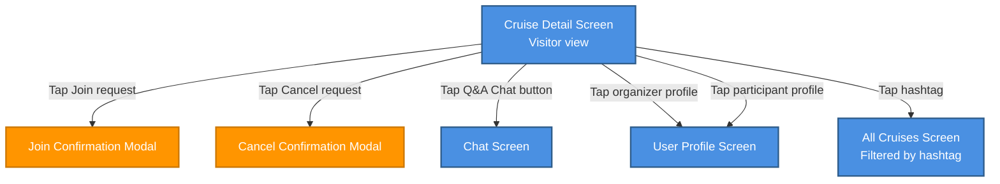

# Cruise Detail Screen – Visitor View

## Overview

The Cruise Detail Screen in **Visitor** mode presents full read-only information about a public cruise to users who are not yet part of the crew (neither organizer nor confirmed participant).  
From this screen, a visitor can discover cruise details, request to join, explore crew profiles, and navigate to related cruises via hashtags.

The behavior described here applies only to the **Visitor** role. Organizer and Participant views are documented separately.

## Visitor Capabilities

As a visitor on the Cruise Detail Screen, the user has the following interactive options:

- **Request to join the cruise**
  - Tap the **Join** button to start the join request flow.
  - After tapping, a **Join Confirmation** modal (`Join Confirmation Modal`) is shown.
    - Confirming the action sends the join request, closes the modal, and returns the user to the Cruise Detail Screen with the button state set to **Cancel** (join request active).
    - Dismissing or cancelling the modal leaves the join request inactive and the button state as **Join**.
  - When a join request is active, tapping **Cancel** starts the cancellation flow.
  - After tapping, a **Cancel Confirmation** modal (`Cancel Confirmation Modal`) is shown.
    - Confirming the action withdraws the join request, closes the modal, and returns the user to the Cruise Detail Screen with the button state set back to **Join**.
    - Dismissing or cancelling the modal keeps the join request active and the button state as **Cancel**.
  - Any error states (e.g., cruise full, join disabled) are shown as separate messages and do not change the button to the Cancel state.

- **Open Q&A Chat**
  - Tap the **Q&A Chat** button to navigate to the dedicated **Chat Screen** for this cruise.
  - The chat is focused on questions and answers about the cruise (e.g., logistics, requirements, expectations).
  - Leaving the chat (Back navigation) returns the user to the Cruise Detail Screen in Visitor mode.

- **Open organizer profile**
  - Tap the organizer avatar/name to navigate to the **User Profile** screen of the cruise organizer.
  - From the User Profile, the user can view public information about the organizer and then navigate back to the Cruise Detail Screen.

- **Open participant profile**
  - Tap any visible participant avatar/name to navigate to that user's **User Profile** screen.
  - From the User Profile, the user can navigate back to the Cruise Detail Screen.

- **Open hashtag-filtered cruise list**
  - Tap any hashtag displayed on the cruise (e.g., in the title, description, or tags section).
  - Navigation leads to the **All Cruises Screen** with the selected hashtag applied as an active filter.
  - The filtered list shows only cruises matching the chosen hashtag.
  - The user can adjust filters or clear them to return to the full public cruise list.

## Navigation Flow

Textual navigation overview for the Visitor role:

- **Actions on Cruise Detail (Visitor view)**
  - Tap **Join** → `Join Confirmation Modal` → Confirm → Request to join is created → Button state changes to **Cancel** → Return to `Cruise Detail Screen (Visitor view)`.
  - Tap **Join** → `Join Confirmation Modal` → Dismiss/Cancel → Request not created → Button state remains **Join** → Return to `Cruise Detail Screen (Visitor view)`.
  - Tap **Cancel** → `Cancel Confirmation Modal` → Confirm → Join request is withdrawn → Button state changes back to **Join** → Return to `Cruise Detail Screen (Visitor view)`.
  - Tap **Cancel** → `Cancel Confirmation Modal` → Dismiss/Cancel → Join request remains active → Button state remains **Cancel** → Return to `Cruise Detail Screen (Visitor view)`.
  - Tap **Q&A Chat** → Navigate to `Chat Screen` → Back → Return to `Cruise Detail Screen (Visitor view)`.
  - Tap **Organizer profile** → Navigate to `User Profile` → Back → Return to `Cruise Detail Screen (Visitor view)`.
  - Tap **Participant profile** → Navigate to `User Profile` → Back → Return to `Cruise Detail Screen (Visitor view)`.
  - Tap **Hashtag** → Navigate to `All Cruises Screen (Filtered by hashtag)`

```
Cruise Detail Screen (Visitor view)
├─> Tap Join request ──> Join Confirmation Modal
├─> Tap Cancel request ──> Cancel Confirmation Modal
├─> Tap Q&A Chat button ──> Chat Screen
├─> Tap organizer profile ──> User Profile Screen
├─> Tap participant profile ──> User Profile Screen
└─> Tap hashtag ──> All Cruises Screen (Filtered by hashtag)
```



