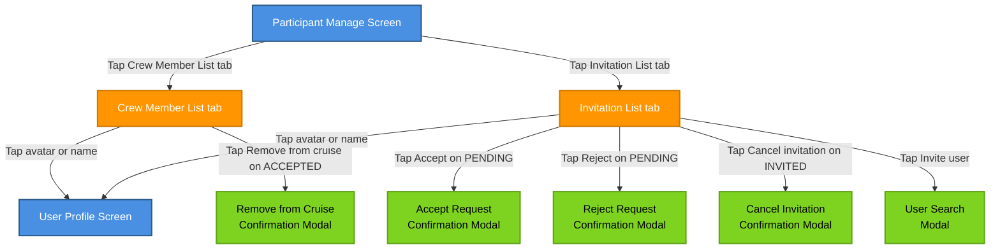

# Participant Manage Screen – Organizer View

## Overview

The **Participant Manage Screen** is an organizer-only management view reached from the **Cruise Detail Screen (Organizer view)** via the **Manage participants** action.
From this screen, the organizer can:

- View and manage **confirmed crew members** and people who left or were removed from the cruise.
- View and manage **join requests** and **invitations**.
- Perform allowed transitions between participant states, in line with the global **Cruise Participant State Flow**.

This document describes behavior only for the **Organizer** role.

## Organizer Capabilities

As an organizer on the Participant Manage Screen, the user has the following interactive options, grouped by list:

- **On Crew Member List**
  - View all current and past crew members (in states `ACCEPTED`, `CANCELED_BY_ORGANIZER`, `CANCELED_BY_PARTICIPANT`).
  - For `ACCEPTED` participants:
    - Tap **Remove from cruise** to remove a participant from the cruise (`ACCEPTED` → `CANCELED_BY_ORGANIZER`).
  - For any participant in the list:
    - Tap avatar/name to open the **User Profile Screen**.

- **On Invitation List**
  - View all users in the request/invitation flow (in states `PENDING`, `INVITED`, `REJECTED_BY_PARTICIPANT`, `REJECTED_BY_ORGANIZER`, `WITHDRAWN_BY_PARTICIPANT`, `WITHDRAWN_BY_ORGANIZER`).
  - For `PENDING` join requests:
    - Tap **Accept** to confirm the user as a crew member (`PENDING` → `ACCEPTED`, participant moves to Crew Member List).
    - Tap **Reject** to decline the join request (`PENDING` → `REJECTED_BY_ORGANIZER`).
  - For `INVITED` users:
    - Tap **Cancel invitation** to withdraw the organizer’s invitation (`INVITED` → `WITHDRAWN_BY_ORGANIZER`).
  - For any participant in the list:
    - Tap avatar/name to open the **User Profile Screen**.
  - Tap **Invite user** to open the **User Search Modal**, search/select a user, and send an invitation (creates a new `INVITED` entry on the **Invitation List**).

- **Screen-level navigation**
  - Switch between **Crew Member List** and **Invitation List** tabs/segments.
  - Use the **Back** navigation to return to the **Cruise Detail Screen (Organizer view)**.

## Screen Structure

The Participant Manage Screen is divided into two main sections:

1. **Crew Member List**
   - Shows users who are (or were) active crew members of the cruise.
   - Includes participants in the following states:
     - `ACCEPTED`
     - `CANCELED_BY_ORGANIZER`
     - `CANCELED_BY_PARTICIPANT`
2. **Invitation List**
   - Shows users in the request/invitation flow, including both active and terminal states.
   - Includes participants in the following states:
     - `PENDING`
     - `INVITED`
     - `REJECTED_BY_PARTICIPANT`
     - `REJECTED_BY_ORGANIZER`
     - `WITHDRAWN_BY_PARTICIPANT`
     - `WITHDRAWN_BY_ORGANIZER`

Each list item represents a single user and displays at least:

- User avatar and display name.
- Current participant status (badge/label).
- Contextual actions (buttons or menu) available for the current status.

Tapping a user avatar/name in any list navigates to the **User Profile Screen**, consistent with the Cruise Detail Screen behavior.

---

## Crew Member List

### Included Statuses

The **Crew Member List** contains participants whose states are related to active or past participation in the cruise:

- `ACCEPTED` – Active crew members confirmed in the cruise.
- `CANCELED_BY_ORGANIZER` – Participants removed from the cruise by the organizer (terminal state).
- `CANCELED_BY_PARTICIPANT` – Participants who left the cruise themselves (terminal state).

### Status-specific Behavior and Actions

#### ACCEPTED

- **Description**:
  - Participant is an active, confirmed member of the cruise.
  - Participant appears in:
    - Cruise crew lists (where applicable).
    - Members Chat (if implemented as “organizer + accepted participants”).
- **Visible information**:
  - User avatar, name, and role (e.g., organizer vs. crew, if highlighted).
  - Status badge: `ACCEPTED`.
- **Allowed organizer actions**:
  - **Remove from cruise**:
    - Action: e.g., **Remove from cruise** button or menu item.
    - Resulting state: `CANCELED_BY_ORGANIZER`.
    - After a successful action:
      - The participant leaves the **Crew Member List** `ACCEPTED` subgroup.
      - The participant appears with status `CANCELED_BY_ORGANIZER` (still within the **Crew Member List**, but clearly marked as removed).
  - **Open user profile**:
    - Tap avatar/name to navigate to **User Profile Screen**.

#### CANCELED_BY_ORGANIZER

- **Description**:
  - Organizer removed the participant from the cruise.
  - This is a **terminal state** in the global participant state machine.
- **Visible information**:
  - Status badge: `CANCELED_BY_ORGANIZER`.
  - Optional explanation text (e.g., “Removed by organizer”) depending on UI design.
- **Allowed organizer actions**:
  - No further state transitions are allowed from this screen.
  - The item is effectively **read-only**, apart from:
    - **Open user profile** (tap avatar/name).

#### CANCELED_BY_PARTICIPANT

- **Description**:
  - Participant actively left the cruise.
  - This is a **terminal state** in the global participant state machine.
- **Visible information**:
  - Status badge: `CANCELED_BY_PARTICIPANT`.
  - Optional explanation text (e.g., “Left the cruise”) depending on UI design.
- **Allowed organizer actions**:
  - No further state transitions are allowed from this screen.
  - The item is **read-only**, apart from:
    - **Open user profile** (tap avatar/name).

---

## Invitation List

### Included Statuses

The **Invitation List** contains participants whose states are related to invitations and join requests:

- `PENDING` – User requested to join the cruise (awaiting organizer decision).
- `INVITED` – Organizer invited the user to the cruise (awaiting participant decision).
- `REJECTED_BY_PARTICIPANT` – Participant rejected the organizer’s invitation (terminal state).
- `REJECTED_BY_ORGANIZER` – Organizer rejected the participant’s join request (terminal state).
- `WITHDRAWN_BY_PARTICIPANT` – Participant withdrew their join request (terminal state).
- `WITHDRAWN_BY_ORGANIZER` – Organizer withdrew their invitation (terminal state).

### Status-specific Behavior and Actions

#### PENDING

- **Description**:
  - User submitted a join request to the cruise.
  - The organizer must decide whether to accept or reject the request.
- **Visible information**:
  - Status badge: `PENDING`.
  - Optional request metadata (e.g., time of request, message, etc.).
- **Allowed organizer actions**:
  - **Accept request**:
    - Action: e.g., **Accept** button.
    - Resulting state: `ACCEPTED`.
    - After a successful action:
      - The participant is removed from the **Invitation List**.
      - The participant appears in the **Crew Member List** with status `ACCEPTED`.
  - **Reject request**:
    - Action: e.g., **Reject** button.
    - Resulting state: `REJECTED_BY_ORGANIZER`.
    - After a successful action:
      - The participant remains visible in the **Invitation List** with status `REJECTED_BY_ORGANIZER` (for history/audit), depending on filtering rules.
  - **Open user profile**:
    - Tap avatar/name to navigate to **User Profile Screen**.

#### INVITED

- **Description**:
  - Organizer sent an invitation to the user to join the cruise.
  - The participant must decide to accept or reject.
- **Visible information**:
  - Status badge: `INVITED`.
  - Optional metadata (e.g., when invitation was sent).
- **How participants reach this state**:
  - Participant accepts an invitation (decision taken outside this screen), or
  - Organizer uses **Invite user**, selects a user in **User Search Modal**, and sends an invitation.
- **Allowed organizer actions**:
  - **Cancel invitation**:
    - Action: e.g., **Cancel invitation** button.
    - Resulting state: `WITHDRAWN_BY_ORGANIZER`.
    - After a successful action:
      - The participant remains visible in the **Invitation List** with status `WITHDRAWN_BY_ORGANIZER` (terminal state) or can be hidden according to filtering rules.
  - **Open user profile**:
    - Tap avatar/name to navigate to **User Profile Screen**.
  - **Organizer cannot directly force ACCEPTED from INVITED** on this screen:
    - Transition to `ACCEPTED` must occur via participant decision (outside the scope of this screen’s direct actions).

#### REJECTED_BY_PARTICIPANT

- **Description**:
  - Participant rejected the organizer’s invitation.
  - This is a **terminal state**.
- **Visible information**:
  - Status badge: `REJECTED_BY_PARTICIPANT`.
- **Allowed organizer actions**:
  - No further transitions from this screen.
  - Item is **read-only**, except for opening the user profile.

#### REJECTED_BY_ORGANIZER

- **Description**:
  - Organizer rejected the user’s join request.
  - This is a **terminal state**.
- **Visible information**:
  - Status badge: `REJECTED_BY_ORGANIZER`.
- **Allowed organizer actions**:
  - No further transitions from this screen.
  - Item is **read-only**, except for opening the user profile.

#### WITHDRAWN_BY_PARTICIPANT

- **Description**:
  - Participant withdrew their join request before it was handled.
  - This is a **terminal state**.
- **Visible information**:
  - Status badge: `WITHDRAWN_BY_PARTICIPANT`.
- **Allowed organizer actions**:
  - No further transitions from this screen.
  - Item is **read-only**, except for opening the user profile.

#### WITHDRAWN_BY_ORGANIZER

- **Description**:
  - Organizer canceled an invitation previously sent to the user.
  - This is a **terminal state**.
- **Visible information**:
  - Status badge: `WITHDRAWN_BY_ORGANIZER`.
- **Allowed organizer actions**:
  - No further transitions from this screen.
  - Item is **read-only**, except for opening the user profile.

---

## Navigation Flow

Textual navigation overview for the Organizer role on the Participant Manage Screen:

- **Entry point**
  - From **Cruise Detail Screen (Organizer view)**:
    - Tap **Manage participants** → `Participant Manage Screen`.

- **Within Participant Manage Screen**
  - Switch tab to **Crew Member List** → View crew members and available actions by status.
  - Switch tab to **Invitation List** → View invitations/join requests and available actions by status.
  - Tap **Invite user** on **Invitation List** → `User Search Modal` → Search/select user → Confirm sending invitation → Return to `Participant Manage Screen` (Invitation List tab) with a new participant in `INVITED` state.

- **Actions on Crew Member List**
  - Tap **Remove from cruise** on an `ACCEPTED` participant → Status becomes `CANCELED_BY_ORGANIZER` → Participant remains visible in Crew Member List as removed.
  - Tap **Participant avatar/name** → Navigate to `User Profile Screen` → Back → Return to `Participant Manage Screen` (same tab as before).

- **Actions on Invitation List**
  - Tap **Accept** on a `PENDING` join request → Status becomes `ACCEPTED` → Participant moves to `Crew Member List`.
  - Tap **Reject** on a `PENDING` join request → Status becomes `REJECTED_BY_ORGANIZER` → Participant remains on `Invitation List` as rejected (depending on filtering rules).
  - Tap **Cancel invitation** on an `INVITED` user → Status becomes `WITHDRAWN_BY_ORGANIZER` → Participant remains on `Invitation List` as withdrawn (depending on filtering rules).
  - Tap **Invite user** → `User Search Modal` → Search/select a user and send an invitation → Selected user appears on `Invitation List` with status `INVITED`.
  - Tap **Participant avatar/name** → Navigate to `User Profile Screen` → Back → Return to `Participant Manage Screen` (same tab as before).

- **Exit**
  - Use **Back** navigation from `Participant Manage Screen` → Return to `Cruise Detail Screen (Organizer view)`.

---

## Mermaid – Organizer Actions on Participant Manage Screen

The following diagram summarizes only the **organizer-triggered** transitions that are available directly from the Participant Manage Screen.
Global participant states and transitions remain defined in the **Cruise Participant State Flow** document.

