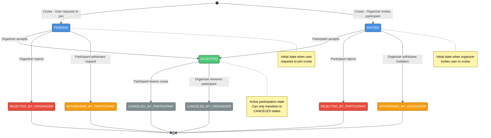

# Cruise Participant State Flow

This diagram shows the state machine for cruise participants, including all possible states and transitions between them.

## State Definitions

- **PENDING** - User sent a join request (waiting for organizer decision)
- **INVITED** - Organizer sent an invitation (waiting for participant decision)
- **ACCEPTED** - Participant confirmed in the cruise
- **REJECTED_BY_PARTICIPANT** - Participant rejected the invitation
- **REJECTED_BY_ORGANIZER** - Organizer rejected the join request
- **WITHDRAWN_BY_PARTICIPANT** - Participant withdrew their join request
- **WITHDRAWN_BY_ORGANIZER** - Organizer withdrew their invitation
- **CANCELED_BY_PARTICIPANT** - Participant left cruise
- **CANCELED_BY_ORGANIZER** - Organizer removed the participant from the cruise

## State Diagram

## Flow Summary

### From PENDING (User Request)
1. **Organizer accepts** → ACCEPTED
2. **Organizer rejects** → REJECTED_BY_ORGANIZER (final)
3. **Participant withdraws** → WITHDRAWN_BY_PARTICIPANT (final)

### From INVITED (Organizer Invitation)
1. **Participant accepts** → ACCEPTED
2. **Participant rejects** → REJECTED_BY_PARTICIPANT (final)
3. **Organizer withdraws** → WITHDRAWN_BY_ORGANIZER (final)

### From ACCEPTED (Active Participation)
1. **Participant leaves cruise** → CANCELED_BY_PARTICIPANT (final)
2. **Organizer removes participant** → CANCELED_BY_ORGANIZER (final)

### Final States
All REJECTED, WITHDRAWN, and CANCELED states are terminal - no further transitions are possible.

