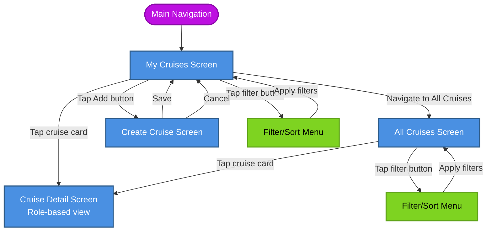

# Cruise Flow – General Overview

## Overview

The cruise management system allows users to create, discover, join, and participate in sailing cruises. Users interact with cruises in different roles:
- **Organizer** – The cruise creator with full management capabilities
- **Participant** – A confirmed cruise crew member
- **Visitor** – A user viewing cruises (not confirmed cruise crew member)

## Screens Overview

### My Cruises Screen

Central hub for all cruises where the user has any involvement (organizer, participant, pending).  
From this screen the user can:
- **Open cruise details** – Tap a cruise card to navigate to `Cruise Detail Screen`
- **Start creating a cruise** – Tap the Add button to open `Create Cruise Screen`
- **Adjust filters/sorting** – Tap the filter button to open `Filter/Sort Menu` for My Cruises
- **Go to public offering** – Navigate to `All Cruises Screen` with public cruises

The detailed layout and data shown on this screen are described in a separate document.

### All Cruises Screen

Discovery screen with public sailing cruises available to all users.  
From this screen the user can:
- **Open cruise details** – Tap a cruise card to navigate to `Cruise Detail Screen` (visitor view by default)
- **Adjust filters/sorting** – Tap the filter button to open `Filter/Sort Menu` for All Cruises

The exact filtering options, sorting modes and card layout are described in a separate document.

### Create Cruise Screen

Screen used to define and publish a new cruise. It is opened from `My Cruises Screen` via the Add button.  
From this screen the user can:
- **Save** a new cruise and return to `My Cruises Screen`
- **Cancel** creation and return to `My Cruises Screen` without saving

All specific form fields, validation rules and messages are documented separately.

## Cruise Detail Screen

Displays complete cruise information with role-based actions and views. The interface adapts based on user's relationship to the cruise.

See separate documentation for role-specific behavior:
- [Organizer Cruise Detail Screen](cruise-detail-screen-organizer.md)
- [Participant Cruise Detail Screen](cruise-detail-screen-participant.md)
- [Visitor Cruise Detail Screen](cruise-detail-screen-visitor.md)

## Navigation Flow

```
Main Navigation
└─> My Cruises Screen
    ├─> Tap card ──> Cruise Detail Screen (role-based)
    ├─> Tap FAB ──> Create Cruise Screen
    │   ├─> Save ──> My Cruises Screen
    │   └─> Cancel ──> My Cruises Screen
    ├─> Tap filter ──> Filter/Sort Menu ──> My Cruises Screen
    └─> Navigate to All Cruises ──> All Cruises Screen
        ├─> Tap card ──> Cruise Detail Screen (visitor view)
        └─> Tap filter ──> Filter/Sort Menu ──> Public Cruises Screen
```

